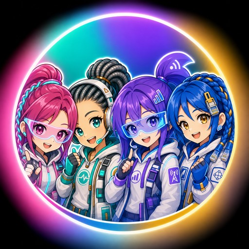
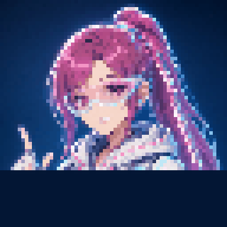
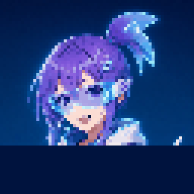
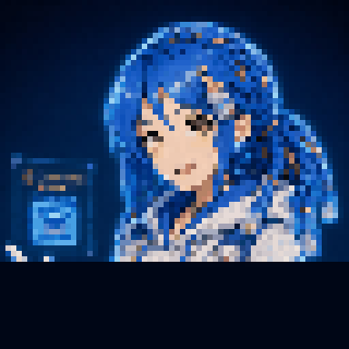

# Light Show



A puzzle game about real Outside Plant (OSP) fiber-optic engineering, built
in Rust with [Bevy](https://bevyengine.org/), for Android (Google Play +
F-Droid), with a squad of anime-styled AI companions — one per access
technology — who react to every splice you make.

Route light from the OLT (Point A) to the customer's ONT (Point B). Hit the
target receive-power window. Survive outages. All the loss figures are
real: fusion vs. mechanical splice loss, UPC vs. APC connectors, PON
splitter ratios, wavelength-dependent fiber attenuation.

## Quick start

```sh
cargo run -p light-show
```

See [`docs/BUILD.md`](docs/BUILD.md) for Android build instructions
(Google Play `.aab` and F-Droid-reproducible `cargo-apk` paths) and
[`docs/GAME_DESIGN.md`](docs/GAME_DESIGN.md) for the full design doc,
including the link-budget model and level progression.

## Meet the companions

Pick a companion from the menu before you start splicing — each one is tied
to a real access technology, has her own dialogue bank, and reacts to your
splices, outages, and level results in her own voice.

| | | | |
|---|---|---|---|
| <br>**Séraphine** — Fiber | <br>**Ondine** — Coax | <br>**Linka** — Mobile | <br>**Lattice** — Ethernet |

Full character briefs, palettes, and mood-sheet specs live in
[`docs/ART_STYLE.md`](docs/ART_STYLE.md).

## Project layout

```
crates/osp_sim/       Engine-agnostic fiber-optic link-budget simulation core
game/                  Bevy application: states, UI, level loading, companions
game/assets/levels/    Level definitions (JSON)
game/assets/dialogue/  Per-companion dialogue banks (JSON, localizable)
game/assets/sprites/   In-engine sprite sheets, incl. companion mood sheets
assets/art/companions/ Source portraits, animated profile GIFs, app icon art
docs/                  Design, art direction, build, and F-Droid docs
fastlane/              Shared Play Store / F-Droid store listing metadata
tools/                 Art generation scripts (placeholder + companion art)
```

## Status

Early scaffold: core simulation (`osp_sim`) is fully implemented and
tested; the Bevy front-end has working state machine, level loading, win
condition checking, a live dB ledger UI, a companion-select menu, and all
four companions' dialogue/animation systems, backed by real AI-generated
portrait art and 64x64 in-engine sprite sheets. Full outage-repair UI is
the next milestone — see open issues.

## License

GPL-3.0-or-later. See [`LICENSE`](LICENSE) and
[`docs/CREDITS.md`](docs/CREDITS.md) for asset attribution.

## Store compliance

No ads, no in-app purchases, no tracking, no network permission requested —
the same build ships unmodified to both Google Play and F-Droid. See
[`docs/FDROID.md`](docs/FDROID.md) for the anti-features checklist.
