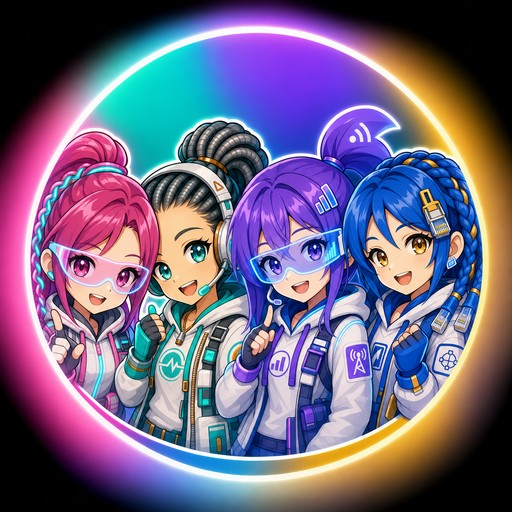
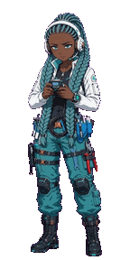
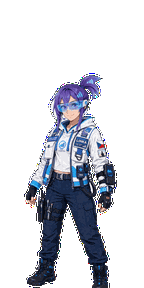
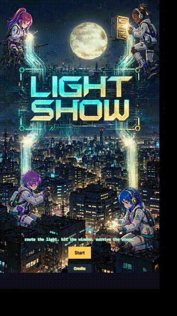
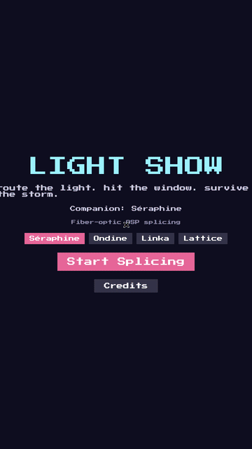

# Light Show



A puzzle game about real Outside Plant (OSP) fiber-optic engineering, built
in Rust with [Bevy](https://bevyengine.org/), for Android (Google Play +
F-Droid), with a squad of anime-styled AI companions — one per access
technology — who react to every splice you make.

Route light from the OLT (Point A) to the customer's ONT (Point B). Hit the
target receive-power window. Survive outages. All the loss figures are
real: fusion vs. mechanical splice loss, UPC vs. APC connectors, PON
splitter ratios, wavelength-dependent fiber attenuation.

## Quick start

```sh
cargo run -p light-show
```

See [`docs/BUILD.md`](docs/BUILD.md) for Android build instructions
(Google Play `.aab` and F-Droid-reproducible `cargo-apk` paths) and
[`docs/GAME_DESIGN.md`](docs/GAME_DESIGN.md) for the full design doc,
including the link-budget model and level progression.

## Meet the companions

Pick a companion from the menu before you start splicing — each one is tied
to a real access technology, has her own dialogue bank, and reacts to your
splices, outages, and level results in her own voice.

| | | | |
|---|---|---|---|
| <br>**Séraphine** — Fiber | <br>**Ondine** — Coax | <br>**Linka** — Mobile | <br>**Lattice** — Ethernet |

Full character briefs, palettes, and mood-sheet specs live in
[`docs/ART_STYLE.md`](docs/ART_STYLE.md).

## Gameplay

Real captures from the desktop build (scripted input driving the actual
game under Xvfb — no mockups). MP4 versions alongside each GIF.



**World 1 – First Light.** Drag from the splice enclosure to the ONT to
place the default fusion splice, then tap a component pill to switch to
the mechanical splice. The ledger at the bottom recomputes the live
link budget on every change: loss, received power, and where it lands
against the GPON receive window.



**World 4 – Storm Season.** The aerial route goes up first; 20 seconds
in, the scripted storm outage cuts it and the repair banner starts its
countdown. Dragging from the protection-route splice to the ONT brings
the backup path live.

Two honest caveats. First, the outage clip was captured with a
temporary build that starts at level 2 — level select doesn't exist yet,
and level 2 is only reachable through the results screen. Second, as
shipped, neither bundled level's link budget can actually land inside
the receive window (level 1's best case is Rx 0.36 dBm against a −8 dBm
window ceiling), so these clips show real play up to the win check, not
a victory. The level numbers need a balance pass before the win path is
reachable.

## Project layout

```
crates/osp_sim/       Engine-agnostic fiber-optic link-budget simulation core
game/                  Bevy application: states, UI, level loading, companions
game/assets/levels/    Level definitions (JSON)
game/assets/dialogue/  Per-companion dialogue banks (JSON, localizable)
game/assets/sprites/   In-engine sprite sheets, incl. companion mood sheets
game/assets/audio/     Chiptune music loops + win/fail jingles (.ogg)
assets/art/companions/ Source portraits, animated profile GIFs, app icon art
art/aseprite/          Aseprite-ready sprite sources + headless import script
art/unreal/            Content-only Unreal preview project (Paper2D) for the same art
docs/                  Design, art direction, asset pipeline, build, and F-Droid docs
fastlane/              Shared Play Store / F-Droid store listing metadata
tools/                 Art + music generation scripts (placeholder art, companion art, chiptune)
```

## Status

Feature-complete gameplay loop: core simulation (`osp_sim`) is fully
implemented and tested; the Bevy front-end has a working state machine
(menu → playing → outage-repair → results), level loading, win/fail
condition checking with a live dB ledger UI, a companion-select menu,
an outage-repair loop (fault injection, live reroute under a countdown,
in-window vs. timed-out resolution), a results screen with win/fail
banners and companion dialogue, all four companions' dialogue/animation
systems (backed by real AI-generated portrait art and 64x64 in-engine
sprite sheets with per-mood accent tinting), on-board component icon
sprites for every placeable part, and a full Megaman-esque chiptune
soundtrack (menu/playing/outage loops, win/fail jingles) wired to every
state. See [`docs/ASSET_PIPELINE.md`](docs/ASSET_PIPELINE.md) for how
all art/audio is generated and how to take it further in Aseprite or
Unreal. Remaining before store submission is entirely account/asset
logistics rather than code: a signing keystore, real device
screenshots, and the Play Console/`fdroiddata` listing steps — see
[`docs/BUILD.md`](docs/BUILD.md) and [`docs/FDROID.md`](docs/FDROID.md).

## License

GPL-3.0-or-later. See [`LICENSE`](LICENSE) and
[`docs/CREDITS.md`](docs/CREDITS.md) for asset attribution.


## Music

Twelve licensed tracks ship with the game, grouped below by the music-manager
tier that plays them (`game/src/audio.rs`). Click a group to expand it, then a
track title for its details and listen link.

GitHub strips `<audio>` tags from rendered markdown, so an in-README
play/pause button is not possible — the ▶ link is the mechanism: it opens
GitHub's file viewer for the track, which renders its own audio player with
play/pause and scrubbing.

<details>
<summary>Menu (1 track)</summary>

<details>
<summary>🎵 "We're all under the stars" — Eric Skiff</summary>

▶ [Listen](https://github.com/qompassai/light-show/blob/main/game/assets/music/menu/eric-skiff-16-were-all-under-the-stars.mp3)

Music: Eric Skiff - We're all under the stars - Resistor Anthems -
Available at http://EricSkiff.com/music · CC BY 4.0 · Plays on: main menu.
</details>

</details>

<details>
<summary>Tutorial, levels 0–1 (1 track)</summary>

<details>
<summary>🎵 "Intensive puzzle resolution" — Komiku</summary>

▶ [Listen](https://github.com/qompassai/light-show/blob/main/game/assets/music/tutorial/komiku-intensive-puzzle-resolution.mp3)

Komiku (Free Music Archive, https://freemusicarchive.org) · CC0 1.0
Universal · Plays on: tutorial levels.
</details>

</details>

<details>
<summary>Early, level 2 (2 tracks)</summary>

<details>
<summary>🎵 "Searching" — Eric Skiff</summary>

▶ [Listen](https://github.com/qompassai/light-show/blob/main/game/assets/music/early/eric-skiff-06-searching.mp3)

Music: Eric Skiff - Searching - Resistor Anthems - Available at
http://EricSkiff.com/music · CC BY 4.0 · Plays on: early levels.
</details>

<details>
<summary>🎵 "Ascending" — Eric Skiff</summary>

▶ [Listen](https://github.com/qompassai/light-show/blob/main/game/assets/music/early/eric-skiff-08-ascending.mp3)

Music: Eric Skiff - Ascending - Resistor Anthems - Available at
http://EricSkiff.com/music · CC BY 4.0 · Plays on: early levels.
</details>

</details>

<details>
<summary>Mid, level 3 (2 tracks)</summary>

<details>
<summary>🎵 "Chibi Ninja" — Eric Skiff</summary>

▶ [Listen](https://github.com/qompassai/light-show/blob/main/game/assets/music/mid/eric-skiff-03-chibi-ninja.mp3)

Music: Eric Skiff - Chibi Ninja - Resistor Anthems - Available at
http://EricSkiff.com/music · CC BY 4.0 · Plays on: mid levels.
</details>

<details>
<summary>🎵 "Underclocked (underunderclocked mix)" — Eric Skiff</summary>

▶ [Listen](https://github.com/qompassai/light-show/blob/main/game/assets/music/mid/eric-skiff-02-underclocked.mp3)

Music: Eric Skiff - Underclocked (underunderclocked mix) - Resistor Anthems -
Available at http://EricSkiff.com/music · CC BY 4.0 · Plays on: mid levels.
</details>

</details>

<details>
<summary>Hard, level 4+ (2 tracks)</summary>

<details>
<summary>🎵 "Exhilarate" — Kevin MacLeod</summary>

▶ [Listen](https://github.com/qompassai/light-show/blob/main/game/assets/music/hard/kevin-macleod-exhilarate.mp3)

Kevin MacLeod (https://incompetech.com/music/royalty-free/) · CC BY 4.0 ·
Plays on: hard levels.
</details>

<details>
<summary>🎵 "Action2 - Army Approaching" — Juhani Junkala / SubspaceAudio</summary>

▶ [Listen](https://github.com/qompassai/light-show/blob/main/game/assets/music/hard/subspaceaudio-action2-army-approaching.ogg)

Juhani Junkala / SubspaceAudio, JRPG Pack 5: Action
(https://opengameart.org/content/jrpg-pack-5-action) · CC0 · Plays on: hard
levels.
</details>

</details>

<details>
<summary>Boss (2 tracks)</summary>

<details>
<summary>🎵 "Basic Metal 5" — TeknoAXE</summary>

▶ [Listen](https://github.com/qompassai/light-show/blob/main/game/assets/music/boss/teknoaxe-basic-metal-5.mp3)

Basic Metal 5 by TeknoAXE | http://teknoaxe.com — Royalty Free Music by
https://www.free-stock-music.com · CC BY 4.0 · Plays on: boss levels.
</details>

<details>
<summary>🎵 "Action3 - Preparing For Battle" — Juhani Junkala / SubspaceAudio</summary>

▶ [Listen](https://github.com/qompassai/light-show/blob/main/game/assets/music/boss/subspaceaudio-action3-preparing-for-battle.ogg)

Juhani Junkala / SubspaceAudio, JRPG Pack 5: Action
(https://opengameart.org/content/jrpg-pack-5-action) · CC0 · Plays on: boss
levels.
</details>

</details>

<details>
<summary>Victory (1 track)</summary>

<details>
<summary>🎵 "We're the Resistors" — Eric Skiff</summary>

▶ [Listen](https://github.com/qompassai/light-show/blob/main/game/assets/music/victory/eric-skiff-07-were-the-resistors.mp3)

Music: Eric Skiff - We're the Resistors - Resistor Anthems - Available at
http://EricSkiff.com/music · CC BY 4.0 · Plays on: victory screen.
</details>

</details>

<details>
<summary>Mystery (1 track)</summary>

<details>
<summary>🎵 "In a Heartbeat" — Kevin MacLeod</summary>

▶ [Listen](https://github.com/qompassai/light-show/blob/main/game/assets/music/mystery/kevin-macleod-in-a-heartbeat.mp3)

Kevin MacLeod (https://incompetech.com/music/royalty-free/) · CC BY 3.0 ·
Plays on: mystery events.
</details>

</details>

Full attribution lives in [`game/assets/music/ATTRIBUTION.txt`](https://github.com/qompassai/light-show/blob/main/game/assets/music/ATTRIBUTION.txt)
(also shown in-game on the credits screen) and
[`game/assets/music/CREDITS.md`](https://github.com/qompassai/light-show/blob/main/game/assets/music/CREDITS.md).
## Store compliance

No ads, no in-app purchases, no tracking, no network permission requested —
the same build ships unmodified to both Google Play and F-Droid. See
[`docs/FDROID.md`](docs/FDROID.md) for the anti-features checklist.
