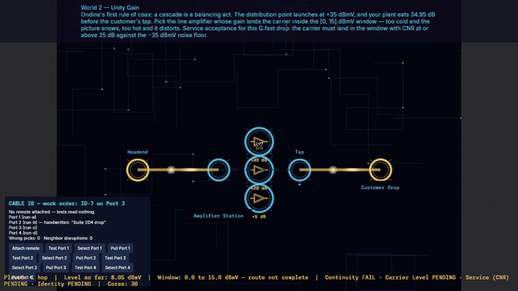

# G.fast over Coax Plant — Ondine

Ondine's track teaches the copper distribution plant that carries G.fast service: a headend launch, coax spans, line amplifiers, taps, and the customer's drop. The physics lesson is balance. Each span and tap removes level; each amplifier adds it back — and service is accepted on two independent measures, the carrier level at the drop and the carrier-to-noise ratio (CNR) above the plant's noise floor. A level can be perfectly in-window and still fail service if ingress noise has buried the carrier. Later levels layer on the Astra field-craft mechanics — cable identification, known-good spare substitution, compression termination workmanship, intermittent-fault isolation, and a final Ethernet handoff — because getting the levels right is only half of a real G.fast turn-up.

How winning works in this game (all tracks): the live win check in `game/src/states/playing.rs` is a conjunction — the board evaluation for the level's medium must pass **and** every console or Astra gate the level carries (API sequence, alarm triage, identification, jumper swap, workbench, static config, survey, handoff) must pass. Levels with a scripted outage skip the plain win check entirely and can only be won through the outage-resolution path, which applies the same conjunction against the post-outage plant. Each level section below names every gate that applies to it.

Scoring on this track: coax span loss is 0.055 dB/m; amplifier gain adds directly; tap loss subtracts directly. The quiet-plant noise floor in every level's data is −35 dBmV with a 25 dB minimum CNR, and ingress hazards raise the effective floor 1 dB per 10 s (capped at 12 dB) while unresolved. All levels in this file are written in G.fast terms per the current design ruling: the coax plant is the distribution medium, G.fast is the service it carries.

Navigation: [Levels index](README.md) · [Characters](../characters/README.md)

<strong>Gameplay &amp; controls — c1l1 Unity Gain in the real game</strong>

Real capture from the current desktop build (the repo's `--footage` harness driving the actual game under Xvfb — no mockups; the same capture method as the README's gameplay section). The +5 dB amplifier pill is placed on the 1→2 run, the route lights end to end, and the ledger along the bottom flips from `Continuity FAIL · Carrier Level PENDING · Service (CNR) PENDING` to `IN WINDOW · CNR OK · Continuity PASS · Carrier Level PASS · Service (CNR) PASS`. The one state still pending when the clip ends is Identity — the Cable ID console at lower left is this level's second gate, worked with its own buttons.

*Full clip: [gfast-c1l1-gameplay.mp4](../media/gfast-c1l1-gameplay.mp4) (27 s, 1280×720).*

### Controls: phone vs desktop

There is one control scheme, not two. The game reads a single pointer: on desktop it is the mouse cursor, on Android it is the first active touch, and both feed the same press / drag / release handling (`game/src/board.rs`: `track_pointer`, `handle_pointer_input`). A press is a left-mouse-button press or a touch-down; a release is the button-up or the touch-up. Every gesture below is therefore identical on phone and desktop — only the pointing device differs. Ondine's in-game tutorial on this level teaches the same gestures in her own words: "tap an open run, pick what fills it … Swap freely while you learn."

| Action | Phone (touch) | Desktop (mouse) |
|---|---|---|
| Connect a run with its default component | Drag from one node to the other | Drag from one node to the other |
| Place a *specific* component (e.g. the +5 dB amp instead of +20 or +35) | Tap that component's pill beside the run — it places immediately | Click the pill |
| Change a component already placed | Tap a different pill for the same run — it swaps in place and the ledger recomputes on the spot | Click a different pill |
| Work a console (the Cable ID panel here; API / triage consoles on other tracks) | Tap the on-screen buttons (Attach remote, Test, Select, Pull…) | Click the same buttons |
| Camera | No pan, zoom, or pinch — the board is fixed and reframes itself to the window | Same — no pan or zoom |
| Pause | None — there is no pause state; a level runs until it passes or fails into the results screen | None — no pause key either |

There is no separate cycle or confirm step anywhere in board play: a pill tap places that variant immediately, and dragging node→node across a run that already has a component leaves the existing choice in place — the pill tap is the way to change it.

What *does* differ by platform is presentation, not input:

- **Window shape.** Android starts portrait (720×1280) and then takes the device's real surface; desktop starts landscape (1280×720) and the window can be resized freely. Every screen re-fits to the actual window and the board camera reframes with it (`game/src/responsive.rs`, `board::board_framing`) — the clip above is the desktop landscape framing of the same board a phone shows in portrait.
- **Touch targets.** Hit areas are sized for fingers on both platforms: a node's hit-test radius is 50 px against a 26 px visual ring radius, in the code's own words so the target "stays finger-friendly on phone screens" (`NODE_HIT_RADIUS` in `game/src/board.rs`).

---

<strong>c1l1 — Unity Gain</strong>

- **Level ID:** `c1l1` · **World (data):** 2
- **Objective:** Ondine's first rule of coax: a cascade is a balancing act. The distribution point launches at +35 dBmV, and your plant eats 34.95 dB before the customer's tap. Pick the line amplifier whose gain lands the carrier inside the [0, 15] dBmV window — too cold and the picture snows, too hot and it distorts. Service acceptance for this G.fast drop: the carrier must land in the window with CNR at or above 25 dB against the −35 dBmV noise floor.
- **Mechanic / evaluator:** G.fast-over-coax cascade evaluation (`evaluate_coax` in osp_sim): received level = launch (35 dBmV) − coax span loss (0.055 dB/m) − tap loss + amplifier gain along the path, judged on two independent states — Carrier Level (the window) and Service CNR (carrier against the noise floor, -35 dBmV quiet-plant floor, raised by ingress or by a defective jumper while one is in place). Verification states: Continuity, Carrier Level, Service (CNR), plus any Astra mechanic states the level carries.
- **Pass thresholds / scoring:** Level inside **[0, 15] dBmV** **and** CNR ≥ **25 dB**. Either state failing fails the level; in-window with low CNR is reported as exactly that.
- **Player choices:** edge 1→2: amplifier +5 dB → Rx ≈ 5.05 dBmV (in window); amplifier +20 dB → Rx ≈ 20.05 dBmV (out of window); amplifier +35 dB → Rx ≈ 35.05 dBmV (out of window).
- **Notes:** Astra gate: the level also carries a cable-identification block (identification console, `states/identification.rs`). Four candidate homeruns; the work order's run is Port 3 / mapper ID-7. The trap is run-b, which carries a handwritten 'Suite 204 drop' label but reads ID-5. The Identity state must pass before the level can be won — signal alone is not enough. Optional objective (5 Cores): zero neighbor disruptions.
- **Teaches:** Unity-gain cascade design in a G.fast distribution plant: amplifier gain is chosen to exactly replace span and tap loss so the drop lands at the design level — gain is prescribed, not maximized.

<strong>c1l2 — Ingress at Night</strong>

- **Level ID:** `c1l2` · **World (data):** 2
- **Objective:** Night shift. The plant was balanced at dusk, but ingress noise is seeping in through a cracked shield — the noise floor is rising under your signal about a decibel every ten seconds. It starts in window on the 3 dB amp. Watch the ledger: when the floor climbs past your signal, swap in more gain before the timer runs out. Service acceptance for this G.fast drop: the carrier must land in the window with CNR at or above 25 dB against the −35 dBmV noise floor.
- **Mechanic / evaluator:** G.fast-over-coax cascade evaluation (`evaluate_coax` in osp_sim): received level = launch (35 dBmV) − coax span loss (0.055 dB/m) − tap loss + amplifier gain along the path, judged on two independent states — Carrier Level (the window) and Service CNR (carrier against the noise floor, -35 dBmV quiet-plant floor, raised by ingress or by a defective jumper while one is in place). Verification states: Continuity, Carrier Level, Service (CNR), plus any Astra mechanic states the level carries.
- **Pass thresholds / scoring:** Level inside **[0, 15] dBmV** **and** CNR ≥ **25 dB**. Either state failing fails the level; in-window with low CNR is reported as exactly that.
- **Player choices:** edge 1→2: amplifier +3 dB → Rx ≈ 8.00 dBmV (in window); amplifier +12 dB → Rx ≈ 17.00 dBmV (out of window); amplifier +21 dB → Rx ≈ 26.00 dBmV (out of window).
- **Outage:** **IngressNoise** fires 15 s into the level on edge 1→2; complaint timer 110 s. Degrading hazard: the noise floor (equivalently, the SNR requirement) climbs 1 dB per 10 s, capped at 12 dB, until resolved — rebalancing, not waiting, is the repair.
- **Teaches:** Ingress diagnosis: noise entering through shielding defects raises the noise floor, so carrier-to-noise ratio (CNR) — not raw level — is what fails first. Rebalancing gain buys time; the lasting fix is the shield.

<strong>c1l3 — Longer Run</strong>

- **Level ID:** `c1l3` · **World (data):** 2
- **Objective:** 800 meters of RG-6 between the distribution point and the tap — that's 44 dB of cable loss before the 8 dB tap even enters the picture. The distribution point is pushing +50 dBmV. Size the line amp so the customer lands in the [5, 12] window. Service acceptance for this G.fast drop: the carrier must land in the window with CNR at or above 25 dB against the −35 dBmV noise floor.
- **Mechanic / evaluator:** G.fast-over-coax cascade evaluation (`evaluate_coax` in osp_sim): received level = launch (50 dBmV) − coax span loss (0.055 dB/m) − tap loss + amplifier gain along the path, judged on two independent states — Carrier Level (the window) and Service CNR (carrier against the noise floor, -35 dBmV quiet-plant floor, raised by ingress or by a defective jumper while one is in place). Verification states: Continuity, Carrier Level, Service (CNR), plus any Astra mechanic states the level carries.
- **Pass thresholds / scoring:** Level inside **[5, 12] dBmV** **and** CNR ≥ **25 dB**. Either state failing fails the level; in-window with low CNR is reported as exactly that.
- **Player choices:** edge 1→2: amplifier +5 dB → Rx ≈ 3.00 dBmV (out of window); amplifier +10 dB → Rx ≈ 8.00 dBmV (in window); amplifier +15 dB → Rx ≈ 13.00 dBmV (out of window).
- **Notes:** Astra gate: a connector workbench (RG-6 compression termination, 2 ends, 10 ordered steps per end, `states/workbench.rs`). The instruction card is the only authority for dimensions (6 mm dielectric / 6 mm conductor). A wrong pick at a critical step (strip, braid, seat, compress, window inspection, meter test) leaves a live defect adding 3.0 dB of workmanship loss until that end is rebuilt; other wrong picks cost a wasted connector. The bench sequence must be complete with no live defect to win.
- **Teaches:** Coax attenuation budgeting: RG-6-class plant loses 0.055 dB/m in the sim (≈44 dB over 800 m), so span length, tap value, and amplifier gain are one equation.

<strong>c1l4 — Tap Dance</strong>

- **Level ID:** `c1l4` · **World (data):** 2
- **Objective:** The cascade is already balanced — 20 dB of line amp against 400 meters of plant. All that's left is the tap, and the tap IS the budget: 4 dB leaves the picture hot enough to distort, 12 dB leaves it snowing. Pick the tap that lands in [8, 12]. Service acceptance for this G.fast drop: the carrier must land in the window with CNR at or above 25 dB against the −35 dBmV noise floor.
- **Mechanic / evaluator:** G.fast-over-coax cascade evaluation (`evaluate_coax` in osp_sim): received level = launch (20 dBmV) − coax span loss (0.055 dB/m) − tap loss + amplifier gain along the path, judged on two independent states — Carrier Level (the window) and Service CNR (carrier against the noise floor, -35 dBmV quiet-plant floor, raised by ingress or by a defective jumper while one is in place). Verification states: Continuity, Carrier Level, Service (CNR), plus any Astra mechanic states the level carries.
- **Pass thresholds / scoring:** Level inside **[8, 12] dBmV** **and** CNR ≥ **25 dB**. Either state failing fails the level; in-window with low CNR is reported as exactly that.
- **Player choices:** edge 2→3: tap −4 dB → Rx ≈ 14.00 dBmV (out of window); tap −8 dB → Rx ≈ 10.00 dBmV (in window); tap −12 dB → Rx ≈ 6.00 dBmV (out of window).
- **Teaches:** Tap-value selection: the tap is the final level-setting element at the drop. Choosing tap loss is choosing the customer's receive level.

<strong>c1l5 — Ingress Returns</strong>

- **Level ID:** `c1l5` · **World (data):** 2
- **Objective:** Different night, same cracked shield. 500 meters of plant, 10 dB tap, distribution point at +38. The 5 dB amp starts you in window — but the noise floor is climbing a decibel every ten seconds. Watch the ledger and swap in more gain before it buries you. Service acceptance for this G.fast drop: the carrier must land in the window with CNR at or above 25 dB against the −35 dBmV noise floor.
- **Mechanic / evaluator:** G.fast-over-coax cascade evaluation (`evaluate_coax` in osp_sim): received level = launch (38 dBmV) − coax span loss (0.055 dB/m) − tap loss + amplifier gain along the path, judged on two independent states — Carrier Level (the window) and Service CNR (carrier against the noise floor, -35 dBmV quiet-plant floor, raised by ingress or by a defective jumper while one is in place). Verification states: Continuity, Carrier Level, Service (CNR), plus any Astra mechanic states the level carries.
- **Pass thresholds / scoring:** Level inside **[5, 12] dBmV** **and** CNR ≥ **25 dB**. Either state failing fails the level; in-window with low CNR is reported as exactly that.
- **Player choices:** edge 1→2: amplifier +5 dB → Rx ≈ 5.50 dBmV (in window); amplifier +15 dB → Rx ≈ 15.50 dBmV (out of window); amplifier +25 dB → Rx ≈ 25.50 dBmV (out of window).
- **Outage:** **IngressNoise** fires 15 s into the level on edge 1→2; complaint timer 110 s. Degrading hazard: the noise floor (equivalently, the SNR requirement) climbs 1 dB per 10 s, capped at 12 dB, until resolved — rebalancing, not waiting, is the repair.
- **Notes:** Astra gate — the track's substitution lesson, enforced: the fixed 1→2 edge carries a defective jumper adding a **36 dBmV** penalty to the noise floor (`defective_edge`, `states/jumper.rs`). With the defect in place the Service (CNR) state can never pass, at any gain — gain raises carrier and penalty together. The only path is swapping in the bench-tested spare (J-5); the win gate requires the swap. Documented honestly: more amplifier is not merely suboptimal here, it is mathematically excluded.
- **Teaches:** Substitution troubleshooting: when no gain setting can restore CNR, the fault is in the plant, not the settings. Swapping a suspect jumper for a known-good spare isolates it — change one variable at a time.

<strong>c1l6 — Backup Plan</strong>

- **Level ID:** `c1l6` · **World (data):** 2
- **Objective:** The drop on the primary run keeps blinking out — G.fast sync gone for a heartbeat, back before anyone can catch it, and always when the street cabinet gets knocked. A blink is a connection moving, not a signal problem. Work it like a tech: disturb the cabinet and reproduce the drop, inspect the primary run connections, tighten the loose one to the card, then disturb the cabinet again and make it hold. Once the knock comes you are on the outage clock. The backup pair still works if you would rather reroute — but a reroute fixes nothing, and the Diagnosis badge knows the difference. Service acceptance for this G.fast drop: the carrier must land in the window with CNR at or above 25 dB against the −35 dBmV noise floor.
- **Mechanic / evaluator:** G.fast-over-coax cascade evaluation (`evaluate_coax` in osp_sim): received level = launch (25 dBmV) − coax span loss (0.055 dB/m) − tap loss + amplifier gain along the path, judged on two independent states — Carrier Level (the window) and Service CNR (carrier against the noise floor, -35 dBmV quiet-plant floor, raised by ingress or by a defective jumper while one is in place). Verification states: Continuity, Carrier Level, Service (CNR), plus any Astra mechanic states the level carries.
- **Pass thresholds / scoring:** Level inside **[8, 13] dBmV** **and** CNR ≥ **25 dB**. Either state failing fails the level; in-window with low CNR is reported as exactly that.
- **Player choices:** edge 1→3: amplifier +8 dB → Rx ≈ 8.50 dBmV (in window); amplifier +12 dB → Rx ≈ 12.50 dBmV (in window) | edge 2→3: amplifier +2 dB → Rx ≈ 13.50 dBmV (out of window); amplifier +1 dB → Rx ≈ 12.50 dBmV (in window).
- **Outage:** **AmplifierFailure** fires 10 s into the level on edge 1→3; complaint timer 90 s. It is a full cut: the edge carries nothing until the player reroutes around it.
- **Notes:** Astra composition: the intermittent block supersedes the identification gate on this level. Three connections on the primary run; exactly one is loose (the primary-run jumper). Method: disturb → reproduce → inspect → tighten to the card reference (seat fully, a quarter turn past finger-tight, firm tug) → disturb again and hold. Building the backup edge (2→3) also clears the level but forfeits the Diagnosis badge; the optional objective (8 Cores) pays only for repair-not-reroute. The identification data is still present (service run Port 2 / ID-4; the 'Primary — do not touch' handwritten label sits on a different run) but is not the win gate here.
- **Teaches:** Intermittent-fault method: reproduce the fault (disturb the cabinet), isolate by inspection, repair to the card reference, then re-verify under the same disturbance. A reroute that avoids the fault is not a repair.

<strong>c1l7 — Hot Headend</strong>

- **Level ID:** `c1l7` · **World (data):** 2
- **Objective:** The distribution point is screaming at +45 dBmV and the customer is only 100 meters away — every amplifier in your kit would overdrive the drop into distortion. Sometimes the answer isn't more gain, it's more cable. Use a long coax run as a pad. Service acceptance for this G.fast drop: the carrier must land in the window with CNR at or above 25 dB against the −35 dBmV noise floor.
- **Mechanic / evaluator:** G.fast-over-coax cascade evaluation (`evaluate_coax` in osp_sim): received level = launch (45 dBmV) − coax span loss (0.055 dB/m) − tap loss + amplifier gain along the path, judged on two independent states — Carrier Level (the window) and Service CNR (carrier against the noise floor, -35 dBmV quiet-plant floor, raised by ingress or by a defective jumper while one is in place). Verification states: Continuity, Carrier Level, Service (CNR), plus any Astra mechanic states the level carries.
- **Pass thresholds / scoring:** Level inside **[0, 15] dBmV** **and** CNR ≥ **25 dB**. Either state failing fails the level; in-window with low CNR is reported as exactly that.
- **Player choices:** edge 1→2: coax span 500 m → Rx ≈ 4.00 dBmV (in window); coax span 800 m → Rx ≈ -12.50 dBmV (out of window); amplifier +10 dB → Rx ≈ 41.50 dBmV (out of window).
- **Teaches:** Padding an over-hot drop: when every amplifier overdrives the receiver, attenuation is the tool — a longer coax run is a legitimate, calculable pad.

<strong>c1l8 — The Long Cascade</strong>

- **Level ID:** `c1l8` · **World (data):** 2
- **Objective:** 1.2 kilometers of plant — 66 dB of cable loss, the longest cascade you've balanced. The distribution point is maxed at +60 dBmV. You need serious gain, but 20 dB overshoots the [0, 5] window. Thread it. Service acceptance for this G.fast drop: the carrier must land in the window with CNR at or above 25 dB against the −35 dBmV noise floor.
- **Mechanic / evaluator:** G.fast-over-coax cascade evaluation (`evaluate_coax` in osp_sim): received level = launch (60 dBmV) − coax span loss (0.055 dB/m) − tap loss + amplifier gain along the path, judged on two independent states — Carrier Level (the window) and Service CNR (carrier against the noise floor, -35 dBmV quiet-plant floor, raised by ingress or by a defective jumper while one is in place). Verification states: Continuity, Carrier Level, Service (CNR), plus any Astra mechanic states the level carries.
- **Pass thresholds / scoring:** Level inside **[0, 5] dBmV** **and** CNR ≥ **25 dB**. Either state failing fails the level; in-window with low CNR is reported as exactly that.
- **Player choices:** edge 1→2: amplifier +10 dB → Rx ≈ -4.00 dBmV (out of window); amplifier +15 dB → Rx ≈ 1.00 dBmV (in window); amplifier +20 dB → Rx ≈ 6.00 dBmV (out of window).
- **Teaches:** Long-cascade arithmetic: 1.2 km of plant is ≈66 dB of loss; cascade design is exact gain staging against a narrow design window, not 'turn it up'.

<strong>c1l9 — Precision Run</strong>

- **Level ID:** `c1l9` · **World (data):** 6
- **Objective:** Expert cascade. A full kilometer of plant plus a 10 dB tap, distribution point at +58. The [3, 9] window gives you no slack — 17 dB overshoots, 22 dB is absurd. Calculate the exact gain or go home. Service acceptance for this G.fast drop: the carrier must land in the window with CNR at or above 25 dB against the −35 dBmV noise floor.
- **Mechanic / evaluator:** G.fast-over-coax cascade evaluation (`evaluate_coax` in osp_sim): received level = launch (58 dBmV) − coax span loss (0.055 dB/m) − tap loss + amplifier gain along the path, judged on two independent states — Carrier Level (the window) and Service CNR (carrier against the noise floor, -35 dBmV quiet-plant floor, raised by ingress or by a defective jumper while one is in place). Verification states: Continuity, Carrier Level, Service (CNR), plus any Astra mechanic states the level carries.
- **Pass thresholds / scoring:** Level inside **[3, 9] dBmV** **and** CNR ≥ **25 dB**. Either state failing fails the level; in-window with low CNR is reported as exactly that.
- **Player choices:** edge 1→2: amplifier +12 dB → Rx ≈ 5.00 dBmV (in window); amplifier +17 dB → Rx ≈ 10.00 dBmV (out of window); amplifier +22 dB → Rx ≈ 15.00 dBmV (out of window).
- **Notes:** Astra gate: the same RG-6 workbench at precision tolerance — workmanship loss for a live defect is 4.0 dB on this span, which the [3, 9] dBmV window cannot absorb. Bench first, then balance.
- **Teaches:** Precision gain staging plus termination workmanship: on a span budgeted tightly, a defective compression termination's added loss is the difference between pass and fail.

<strong>c1l10 — Ingress Storm</strong>

- **Level ID:** `c1l10` · **World (data):** 6
- **Objective:** Final exam. 700 meters of plant, 10 dB tap, distribution point at +48 — and the shield is gone. The 10 dB amp starts you in the [4, 12] window, but ingress climbs a decibel every ten seconds. You will rebalance twice before the clock runs out. Watch the ledger like your job depends on it. Service acceptance for this G.fast drop: the carrier must land in the window with CNR at or above 25 dB against the −35 dBmV noise floor.
- **Mechanic / evaluator:** G.fast-over-coax cascade evaluation (`evaluate_coax` in osp_sim): received level = launch (48 dBmV) − coax span loss (0.055 dB/m) − tap loss + amplifier gain along the path, judged on two independent states — Carrier Level (the window) and Service CNR (carrier against the noise floor, -35 dBmV quiet-plant floor, raised by ingress or by a defective jumper while one is in place). Verification states: Continuity, Carrier Level, Service (CNR), plus any Astra mechanic states the level carries.
- **Pass thresholds / scoring:** Level inside **[4, 12] dBmV** **and** CNR ≥ **25 dB**. Either state failing fails the level; in-window with low CNR is reported as exactly that.
- **Player choices:** edge 1→2: amplifier +10 dB → Rx ≈ 9.50 dBmV (in window); amplifier +15 dB → Rx ≈ 14.50 dBmV (out of window); amplifier +20 dB → Rx ≈ 19.50 dBmV (out of window).
- **Outage:** **IngressNoise** fires 10 s into the level on edge 1→2; complaint timer 110 s. Degrading hazard: the noise floor (equivalently, the SNR requirement) climbs 1 dB per 10 s, capped at 12 dB, until resolved — rebalancing, not waiting, is the repair.
- **Notes:** Astra capstone, three gates deep: identification (service run Port 4 / ID-9; the handwritten 'Storm backup' label is on run-a, a trap), the RG-6 workbench (defect loss 3.0 dB; optional objective: zero wasted connectors, 8 Cores), and — after the G.fast states pass — a required Ethernet handoff verification (`handoff_required`). All three must pass alongside the rebalanced cascade.
- **Teaches:** Capstone cascade work under active ingress: repeated rebalancing, verified cable identification, bench-perfect terminations, and confirming the Ethernet handoff after the G.fast side passes.

