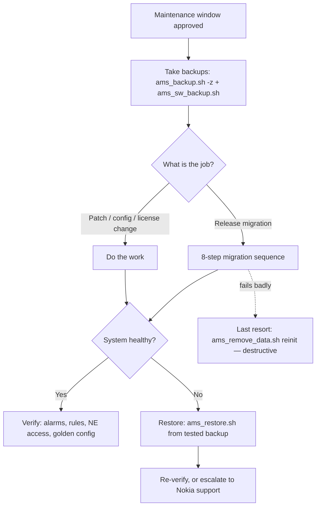

# Backup, Restore & Migration — Nokia 5520 AMS 9.8.3

**Overview:** This is the safety net: how to snapshot the AMS server's data and software, put it back when something breaks, and carry it to a new release — including the one command that wipes everything and must never be typed casually.

## Overview — what it is and why it matters

**Plain language first.** The AMS server is the brain that manages thousands of access-network boxes (OLTs, ONTs, ISAM gear). That brain has two things worth saving: its **memory** (the database: every subscriber, NE, alarm, and config) and its **body** (the installed software itself). Backup/restore is exactly what it sounds like — make a copy before you do anything risky, put it back if the risky thing goes wrong. Migration is the bigger cousin: moving that memory from an older AMS release into a newer one when you upgrade.

**Why a field tech cares:** you are the person standing in the data center during a maintenance window. No tested backup = no rollback plan = you don't start the work. Every patch, license change, config change, and migration in this guide assumes you already have a good backup. If a manager asks "can we undo this?", the answer lives in `/backup`.

**When to reach for this on a job site:** before ANY software change (patch, plug-in, activation), before touching licenses, before a migration to a new release, when a restore is ordered after a failure, and on a schedule — every night, automatically — so a normal Tuesday failure doesn't become a data-loss incident.

**Now the real depth.** There are three separate safety copies, and confusing them is a classic mistake:

1. **Data backup** (`ams_backup.sh`, run as `amssys`) — the database and AMS data. This is the one you'll use most. Options: `-z` compresses (use it, backups are big), `-c` excludes "common data", `-f` forces the backup from the **active** cluster data server. Prefer the **standby** data server for cluster backups — the active one is busy serving the network.
2. **Software backup** (`ams_sw_backup.sh`, run as `root`) — the AMS software itself: configuration, package metadata, repository, and the software binary. The script appends `<hostname>.bin` to whatever path you give it.
3. **Scheduled backup** (`ams_schedule_backup`) — turns backups into a cron job so they happen without you. It creates the cron entry and a `runamsbackup.<id>.cfg` file. If the OS time zone ever changes, restart `crond` afterward or your schedule silently shifts.

Restores have their own tools: `ams_restore.sh` puts AMS data back (with `-n` to **exclude licenses** — you need this when restoring onto different hardware, because licenses are tied to the host ID), and `ams_nerestore.sh` restores NE-backup data (with `-b` to limit the restore to just the NE-backup database). Migration uses `ams_copy_datafiles` to carry persistency from an old release or backup into the target release. And at the far end of the spectrum sits `ams_remove_data.sh` — the corrupted-database recovery tool that purges the database, shared data, and local data so AMS can start empty. It is **destructive** and never routine.

Remote destinations use URL forms: `ftp://<user>:<password>@<host>/<path>/<file>`, `sftp://<user>:<password>@<host>/<path>/<file>`, or `sftp://<host>/<path>/<file>` (no credentials in the URL — preferred, works with SSH keys). **Security note from the Linux flavor:** never put production passwords in the URL on a shared command line — they land in shell history. Use the no-credential form with keys, or an approved secret source.

Conventions used below: `<value>` is required and site-specific (replace before running); `[value]` is optional. Run AMS scripts as `amssys` unless an entry says `root` or `privileged`. The `amssys` PATH already includes the AMS script directories, so you don't need a path or `./` prefix.

## Diagram — where this fits in a field workflow



## CLI workflows (primary)

### A. Pre-flight / setup checks

Before your first backup on any server, confirm who you are, where the backup will land, and that AMS is healthy:

```bash
whoami                      # expect: amssys
ams_server status           # all services should be up before a baseline backup
df -h /backup               # destination must exist and have free space
ls -lh /backup | tail -5    # see what previous backups look like
```

If `/backup` doesn't exist or is nearly full, stop and fix that first — a backup that dies halfway from a full disk is worse than no backup, because it looks like you have one.

### B. Daily use — on-demand data backup

The standard backup. Compressed, because uncompressed AMS data archives are enormous:

```bash
ams_backup.sh -z /backup/ams-data.tar.gz
```

Variants you'll use on site:

```bash
ams_backup.sh /backup/ams-data.tar        # uncompressed (only if the next step needs it raw)
ams_backup.sh -c /backup/ams-data.tar     # exclude common data (smaller, faster)
ams_backup.sh -f /backup/ams-data.tar     # force from the ACTIVE data server
                                          # (default prefers standby — only use -f when told to)
```

**Success looks like:** the log completes cleanly and the archive has a plausible size (compare with `ls -lh` against yesterday's — a 2 KB "backup" is a failed backup).

Send it off the box, away from the thing that might die:

```bash
ams_backup.sh -z 'sftp://<backup-host>/<path>/ams-data.tar.gz'
```

Prefer the no-credential SFTP form above (SSH keys) over the `sftp://<user>:<password>@...` form — passwords in URLs end up in shell history.

### C. Daily use — scheduled backups

Set it once, sleep at night:

```bash
ams_schedule_backup -int   # interactive: answers questions, builds the schedule
ams_schedule_backup        # applies/activates the schedule
```

This creates a cron job plus a `runamsbackup.<id>.cfg` file. Verify it's actually scheduled:

```bash
crontab -l | grep -i backup
ls runamsbackup.*.cfg
```

If the OS time zone is ever changed, restart the cron daemon or the schedule silently runs at the wrong time:

```bash
sudo systemctl restart crond
```

### D. Daily use — software backup (root)

This one needs `root`, not `amssys` — it snapshots the installed software, config, package metadata, repository, and binary. The script appends `<hostname>.bin` to your path automatically:

```bash
sudo ams_sw_backup.sh /backup/ams-software
# produces e.g. /backup/ams-software.<hostname>.bin
```

Do this before any release activation or component change. Data backup saves the brain; software backup saves the body.

### E. Troubleshooting — restore after a failure

**Impact: HIGH RISK, data-changing, service-affecting. Maintenance window required.**

Scenario: a patch went sideways / the database is inconsistent / the site procedure says "roll back". Restore replaces current data with the backup:

```bash
# 1. Validate the archive first — a corrupt backup restores corrupt data
ls -lh /backup/ams-data.tar
tar tf /backup/ams-data.tar | head -5

# 2. If it is .gz, uncompress FIRST (ams_restore.sh will not do it for you)
gunzip /backup/ams-data.tar.gz

# 3. Restore
ams_restore.sh /backup/ams-data.tar
```

Restoring onto **different hardware** (new server, host ID changed)? The old licenses won't match the new host ID — exclude them, then install licenses generated for the current host:

```bash
ams_restore.sh -n /backup/ams-data.tar
# then: install licenses for the CURRENT host ID (see installation-software.md)
```

NE data lives in its own backup database — restore it separately:

```bash
ams_nerestore.sh /backup/ne-backup.tar     # full NE restore
ams_nerestore.sh -b /backup/ne-backup.tar  # only the NE-backup database
```

### F. Troubleshooting — corrupted database reinitialization

> **DESTRUCTIVE.** This purges the database, shared data, and local data. It is corrupted-database recovery, not routine cleanup. Approved recovery with a tested backup only.

Scenario: Nokia support has confirmed the database is unrecoverable and authorized a reinit. You already have a tested backup (you do — see sections B–D):

```bash
ams_server stop
ams_remove_data.sh
ams_server start
```

After AMS comes back up empty, restore from the tested backup (`ams_restore.sh`), then re-verify alarms, rules, and NE access. If you typed this without a backup and without written authorization, stop reading and call your lead.

### G. Migration — release upgrade data carry

> **HIGH RISK.** `--overwrite` deletes the target release's persistency before copying. There is no undo.

Migration moves persistency from an older release (or a backup) into the new 9.8.3 target. Follow the 8-step sequence in order — the copy command is step 6, not step 1:

```console
# 1. Verify source health and that you have privileged operator access
ams_server status
ams_cluster status            # if clustered

# 2. Save license keys; stage the 9.8.3 software (see installation-software.md)

# 3. Install required NE plug-ins and enhanced applications BEFORE migrating persistency

# 4. Back up and transfer source data (out-of-place migration)
ams_backup.sh -z /backup/pre-migration.tar.gz

# 5. Stop relevant services
ams_server stop               # simplex; use ams_cluster stop for clusters

# 6. Run the copy command
ams_copy_datafiles --force
ams_copy_datafiles --force --from-release <previous-release>
ams_copy_datafiles --force --from-backup /absolute/path/backup.tar

# 7. Start in scenario-specific order; monitor status
ams_server start
ams_server status all -l 10 -p 60

# 8. Install licenses/client; validate alarms, rules, NE access
```

The `--overwrite` forms exist for exceptional recovery only — they wipe the active release's persistency first:

```bash
ams_copy_datafiles --force --overwrite --from-backup /absolute/path/backup.tar
```

### H. Automation — nightly backup wrapper with rotation

Copy-pasteable, site values at the top. Keeps 7 daily + 4 weekly archives, ships a copy off-box, and refuses to run if AMS is down:

```bash
#!/bin/bash
# nightly-ams-backup.sh — run from amssys crontab. Replace <...> values before use.
set -u
BACKUP_DIR="/backup"
RETENTION_DAILY=7
REMOTE='sftp://<backup-host>/<path>/'   # no-credential form; SSH keys must be set up
STAMP="$(date +%Y%m%d)"

ams_server status >/dev/null 2>&1 || { echo "AMS not healthy — backup aborted"; exit 1; }
mkdir -p "$BACKUP_DIR"

ams_backup.sh -z "$BACKUP_DIR/ams-data-$STAMP.tar.gz" || exit 1
ls -lh "$BACKUP_DIR/ams-data-$STAMP.tar.gz"

# ship a copy off the box
ams_backup.sh -z "${REMOTE}ams-data-$STAMP.tar.gz"

# rotation: keep newest $RETENTION_DAILY daily archives
ls -1t "$BACKUP_DIR"/ams-data-*.tar.gz | tail -n +$((RETENTION_DAILY + 1)) | xargs -r rm -f
echo "backup $STAMP done"
```

Install it:

```bash
chmod +x nightly-ams-backup.sh
crontab -l | grep -q nightly-ams-backup || (crontab -l 2>/dev/null; echo "0 2 * * * /home/amssys/nightly-ams-backup.sh >>/var/log/ams-nightly-backup.log 2>&1") | crontab -
```

## GUI section (secondary)

The AMS web GUI client exposes backup scheduling and restore initiation through its administration/maintenance views — useful when you're on a jump host with only a browser, or when a procedure requires the GUI's confirmation dialogs. Where the GUI falls short vs CLI:

- The GUI does **not** expose migration persistency copy (`ams_copy_datafiles`), the `--overwrite` recovery forms, or database reinitialization — those are CLI-only.
- Off-box SFTP destinations, compression flags, and standby-vs-active server choice are CLI flags; the GUI typically offers a subset.
- Scripting, cron scheduling verification, and archive validation (`tar tf`, size checks) have no GUI equivalent.
- For audit trails ("exactly what command ran, with what flags"), CLI is what the Administrator Guide documents and what support will ask for.

Rule of thumb: GUI to *start* something simple when it's the only tool at hand; CLI for everything you must be able to prove, repeat, or roll back.

## Platform script blocks

> **Reality check:** AMS server software runs on RHEL — you do **not** install AMS on a phone or laptop. On every platform below except Linux-on-the-server, the honest pattern is: your device is an SSH terminal + file-transfer + API client (`curl`) reaching the AMS server. That is stated explicitly per platform; anything that genuinely can't run is marked N/A with the closest alternative.

### Linux bash (on the AMS server itself)

Native commands as documented — log in as `amssys`, `sudo` only where stated:

```bash
whoami  # amssys
# Full pre-patch safety set: data + software backups, then verify
ams_backup.sh -z /backup/ams-data-$(date +%Y%m%d).tar.gz
sudo ams_sw_backup.sh /backup/ams-software
ls -lh /backup/
# Schedule nightly backups (interactive once, then applied)
ams_schedule_backup -int
ams_schedule_backup
crontab -l | grep -i backup
```

### Nix-on-Droid (Android — SSH terminal only)

AMS does **not** install on Android. Install an SSH client via nix, then drive the server. Android gotchas: no systemd (nothing to manage daemons — you aren't running any), no `termux-setup-storage` equivalent needed since you stay in the nix sandbox `$HOME`, keep the session in the foreground (Android kills background processes aggressively; there is no `termux-wake-lock` here — Nix-on-Droid has no termux-api):

```console
nix-env -iA nixpkgs.openssh
ssh amssys@<ams-host>
# now at the AMS server prompt — run any Linux-bash block above
ams_backup.sh -z /backup/ams-data.tar.gz
exit
# pull the archive to the phone for off-box safekeeping
scp amssys@<ams-host>:/backup/ams-data.tar.gz ~/ams-backups/
```

### PowerShell (Windows — SSH to the server)

Win32 OpenSSH is built into Windows 10/11. AMS commands run on the remote Linux host; PowerShell is used for the SSH session and file transfer:

> **Status:** syntax-verified with PowerShell 7 on Arch (pwsh) — not executed against live systems.
```powershell
ssh amssys@<ams-host>
# You are now at the remote Linux prompt.
ams_backup.sh -z /backup/ams-data.tar.gz
exit
# Pull the backup to the laptop (native scp, no extra tools)
scp amssys@<ams-host>:/backup/ams-data.tar.gz C:\Backups\ams-data.tar.gz
# Push a backup file up to the server before a restore
scp C:\Backups\ams-data.tar.gz amssys@<ams-host>:/backup/
```

### Termux (Android — SSH terminal only)

AMS does **not** install on Android. Use Termux as the SSH terminal. Android gotchas: no systemd, run `termux-setup-storage` once if you want archives in shared storage, use `termux-wake-lock` during long `scp` transfers so Android doesn't suspend the session, and acquire it before starting:

```console
pkg install openssh
termux-setup-storage   # one-time: grants access to shared storage
termux-wake-lock       # keep CPU awake during long transfers
ssh amssys@<ams-host>
# now at the AMS server prompt — run any Linux-bash block above
ams_backup.sh -z /backup/ams-data.tar.gz
exit
scp amssys@<ams-host>:/backup/ams-data.tar.gz ~/storage/downloads/
termux-wake-unlock
```

### Windows cmd (cmd.exe — SSH to the server)

Win32 OpenSSH ships with Windows 10/11, so `ssh`/`scp` work directly in cmd.exe. For older hosts, PuTTY's `plink.exe`/`pscp.exe` are the fallback:

> **Status:** UNVERIFIED — no Windows cmd available for testing.
```cmd
ssh amssys@<ams-host>
REM You are now at the remote Linux prompt — type the Linux commands, then exit
ams_backup.sh -z /backup/ams-data.tar.gz
exit
REM Back in cmd: pull the archive down
scp amssys@<ams-host>:/backup/ams-data.tar.gz C:\Backups\ams-data.tar.gz
```

### WSL/Arch (Arch Linux under WSL — SSH to the server)

Arch pattern: install OpenSSH via pacman, then SSH to the AMS server. Mounts under `/mnt/c` bridge to Windows files if you need to stage archives there:

```console
sudo pacman -S --needed openssh
ssh amssys@<ams-host>
# now at the AMS server prompt — run any Linux-bash block above
ams_backup.sh -z /backup/ams-data.tar.gz
exit
# pull the archive into WSL (or /mnt/c/... for Windows-side storage)
scp amssys@<ams-host>:/backup/ams-data.tar.gz ~/ams-backups/
```

## Impact warnings — read before typing

| Level | Commands | What it means for you |
|---|---|---|
| **DESTRUCTIVE** | `ams_remove_data.sh`; `ams_copy_datafiles --force --overwrite ...` | Irreversibly deletes data/persistency. Corrupted-DB recovery or exceptional recovery only, with a tested backup and written authorization. |
| **HIGH RISK, data-changing, service-affecting** | `ams_restore.sh`, `ams_nerestore.sh`, `ams_copy_datafiles --force ...` | Replaces live data. Approved maintenance window, validated archive, rollback media on hand. |
| **Service-affecting** | `ams_server stop` (as part of restore/migrate) | AMS stops serving the network while down. Coordinate the window. |
| **I/O intensive** | `ams_backup.sh`, `ams_sw_backup.sh` | Heavy disk/CPU load. Prefer the standby data server on clusters; avoid peak hours. |
| **Credential-sensitive** | `ftp://<user>:<password>@...` / `sftp://<user>:<password>@...` URL forms | Passwords in URLs land in shell history. Prefer the no-credential `sftp://<host>/<path>/<file>` form with SSH keys. |

## Quick reference — commands A–Z

| Command | Account | Purpose |
|---|---|---|
| `ams_backup.sh [options] <URL>` | `amssys` | Back up AMS data (`-z` compress, `-c` exclude common data, `-f` force active server) |
| `ams_copy_datafiles ...` | privileged | Migration persistency copy (`--force`, `--from-release`, `--from-backup`, `--overwrite`) |
| `ams_nebackup.sh ...` | `amssys` | Back up NE data |
| `ams_nerestore.sh ...` | `amssys` | Restore NE data (`-b` = NE-backup DB only) |
| `ams_remove_data.sh` | `amssys` | **Destructive:** purge DB/shared/local data (corrupted-DB recovery only) |
| `ams_restore.sh ...` | `amssys` | Restore AMS data (`-n` excludes licenses — new hardware) |
| `ams_schedule_backup` | `amssys` | Create/apply cron backup schedule (`-int` interactive) |
| `ams_sw_backup.sh ...` | `root` | Back up AMS software (appends `<hostname>.bin`) |

Source: Nokia 5520 AMS 9.8.3 Administrator Guide [cite:2], Installation and Migration Guide [cite:3], Server Configuration Technical Guidelines [cite:4]. Replace every `<placeholder>`; validate in a lab and against the controlling Nokia documentation before production use.
