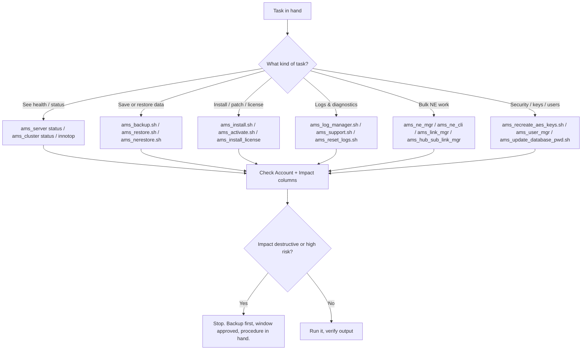

# Command Index — Nokia 5520 AMS 9.8.3

**Overview:** The A–Z phone book of every AMS command: what it does, which Linux account is allowed to run it, and how much damage it can do — so you find the right tool instead of guessing.

## Overview — what it is and why it matters

**Plain language first.** Nobody memorizes sixty commands. What a good field tech memorizes is *how to find* the right command in under a minute — and, more importantly, how to read the two columns that keep you out of trouble: **Account** (who you're allowed to be when you run it) and **Impact** (what happens if you're wrong). This guide is that lookup table, organized A–Z the way the manuals organize it.

**Why a field tech cares:** on a job site you're handed tasks like "rotate the DB password", "collect logs for support", or "take this node out of supervision". Each maps to exactly one script. Typing the wrong sibling script (`ams_remove_data.sh` when you meant `ams_reset_logs.sh` — yes, they're that close alphabetically) is how incidents happen. The index exists so you verify the name *before* your fingers do.

**When to reach for this on a job site:** any time a procedure names a script you haven't run before; when you're deciding whether a task needs `amssys`, `root`, or a privileged operator account; when you need to answer "is this service-affecting?" before a maintenance window.

**Now the real depth.** Three rules govern every entry:

1. **Account rule.** Run AMS scripts as `amssys` unless the entry says otherwise. `root` and `privileged` entries need elevation (`sudo` or a privileged operator login) — and on every non-Linux platform in this guide, the account is the *remote* Linux account: you `ssh <account>@<ams-host>` first, then run the command.
2. **PATH rule.** The `amssys` PATH already includes most AMS script directories, so a path or `./` prefix is generally unnecessary — type the script name bare.
3. **Impact rule.** Treat the Impact column as a pre-flight checklist: **Read-only** (safe to explore), **Configuration** (changes behavior — window it), **Service-affecting** (the network feels it), **High risk / Destructive** (irreversible without a backup — stop and re-read the procedure).

Script spelling follows the supplied 9.8.3 manuals exactly, including underscores. The Administrator Guide appendix documents each script's full options, output, and logs — this index is the map, the appendix is the territory.

## Diagram — how to pick the right command on site



## CLI workflows (primary)

### A. Setup — learn to read an entry before you need one

Every row answers four questions. Practice on a safe one:

```bash
# Pick a read-only command and inspect it BEFORE running:
#   ams_check_ssl.sh — account amssys, impact read-only
whoami            # confirm: amssys
command -v ams_check_ssl.sh   # confirm it resolves via PATH (no ./ needed)
ams_check_ssl.sh  # read-only: safe to explore
```

Do the same dry-run for any unfamiliar script: account matches? impact understood? placeholders (`<...>`) identified? Only then run it for real.

### B. Daily use — the commands you'll type most

These are the read-only and low-impact staples. Safe to run during the day without a window:

```console
ams_server status                 # server lifecycle/health
ams_server status all -l 10 -p 60 # polling loop: 10 samples, 60s apart (startup/migration watch)
ams_server version                # installed release
ams_cluster status                # cluster view (clustered deployments)
ams_cluster status --detailed
ams_cluster status sw             # software set across the cluster
getLicenseCounter                 # license counters (privileged account)
ams_show_ne_balancing.sh          # where NEs sit across servers (read-only)
ams_retrieve_ip_by_nename.sh <ne-name>  # NE name -> IP (read-only)
```

### C. Troubleshooting — "something changed and now it's broken"

Scenario: a maintenance task finished, and the NOC reports odd behavior. Work the index by *impact*, lowest first:

```bash
# 1. Observe (read-only — always safe)
ams_server status
ams_cluster status --detailed
ams_check_ssl.sh

# 2. Collect evidence for support (writes files, not data)
ams_log_manager.sh --collect --category all --target all --destination file:///tmp/ams-logs.tar
ams_support.sh --domain app --command jstack --target all --destination /tmp/jstack.tar
# note: jstack/jmap can briefly stall a heavily loaded JVM — warn the NOC first

# 3. Check what actually changed (configuration)
ams_server version
ams_server version verify /path/GoldenEMSSwConfig

# 4. NEVER reach for these while troubleshooting unless the procedure explicitly orders it:
#    ams_remove_data.sh   (DESTRUCTIVE — purges everything)
#    ams_restore.sh       (HIGH RISK — replaces live data)
#    ams_recreate_aes_keys.sh (HIGH RISK — rewrites encrypted passwords)
```

### D. Automation — a guard-rail wrapper for scripted runs

When you automate AMS commands (cron, runbooks), make the script refuse dangerous commands unless explicitly armed. Copy-pasteable pattern:

```bash
#!/bin/bash
# ams-guard.sh — wrapper: blocks destructive commands unless AMS_ALLOW_DANGEROUS=1
set -u
cmd="$1"; shift || true
case "$cmd" in
  ams_remove_data.sh|ams_uninstall|*--overwrite*)
    if [ "${AMS_ALLOW_DANGEROUS:-0}" != "1" ]; then
      echo "BLOCKED: '$cmd' is destructive. Set AMS_ALLOW_DANGEROUS=1 to proceed." >&2
      exit 77
    fi
    ;;
esac
# account check: warn if running a privileged command as the wrong user
case "$cmd" in
  ams_sw_backup.sh|ams_activate.sh|ams_updatefirewall)
    [ "$(id -un)" = "root" ] || { echo "Run '$cmd' as root (sudo)." >&2; exit 1; } ;;
esac
exec "$cmd" "$@"
```

Use it in cron jobs and runbooks: `ams-guard.sh ams_backup.sh -z /backup/x.tar.gz`. Destructive commands fail closed unless someone deliberately arms them.

## GUI section (secondary)

The AMS web GUI client covers day-to-day supervision — alarms, NE views, some bulk operations, and log/status views — which is convenient from a jump host with only a browser. Where it falls short vs this CLI index:

- The index's privileged/destructive scripts (`ams_remove_data.sh`, `ams_copy_datafiles --overwrite`, AES key rotation, DB defragment execute) are CLI-only by design; the GUI doesn't offer a button for wiping the database.
- Bulk NE/user/link managers exist in both, but the CLI forms take CSV/command files — repeatable and diffable; the GUI forms are click-through and harder to audit.
- Anything you must script, schedule, or prove byte-for-byte ("which exact flags ran?") belongs in the CLI. The GUI is for looking; the CLI is for doing.

If a site procedure mandates the GUI for a step, follow the procedure — then verify the result with the matching CLI status command.

## Platform script blocks

> **Reality check:** every command below executes on the RHEL AMS server. On non-Linux platforms the pattern is `ssh <account>@<ams-host>` — the **Account** column tells you which remote user to SSH as. Nothing here installs on a phone or laptop.

### Linux bash (on the AMS server itself)

Native — the Account column maps directly to `sudo` where needed:

```bash
whoami  # amssys for most work
# amssys commands run bare (PATH includes AMS script dirs)
ams_server status
ams_check_ssl.sh
# root/privileged commands elevate explicitly
sudo ams_sw_backup.sh /backup/ams-software
sudo /opt/ams/software/<release>/bin/ams_activate.sh
```

### Nix-on-Droid (Android — SSH terminal only)

Install OpenSSH via nix, then SSH as the account the index row requires. No systemd, no daemons — the phone is a terminal:

```bash
nix-env -iA nixpkgs.openssh
# account comes from the index table, e.g. amssys:
ssh amssys@<ams-host> 'ams_server status; ams_cluster status'
# a privileged row needs the privileged account or sudo on the far end:
ssh amssys@<ams-host> 'sudo ams_sw_backup.sh /backup/ams-software'
```

### PowerShell (Windows — SSH to the server)

Win32 OpenSSH; quote the remote command so PowerShell doesn't eat it:

> **Status:** syntax-verified with PowerShell 7 on Arch (pwsh) — not executed against live systems.
```powershell
# read-only daily driver, single shot, no interactive session needed
ssh amssys@<ams-host> 'ams_server status'
# privileged/root row: elevate on the remote side
ssh amssys@<ams-host> 'sudo ams_sw_backup.sh /backup/ams-software'
# interactive session for a longer troubleshooting run
ssh amssys@<ams-host>
```

### Termux (Android — SSH terminal only)

`pkg install openssh`, then SSH as the indexed account. Use `termux-wake-lock` for long polling loops so Android doesn't suspend the session mid-watch:

```bash
pkg install openssh
termux-wake-lock
ssh amssys@<ams-host> 'ams_server status all -l 10 -p 60'
termux-wake-unlock
```

### Windows cmd (cmd.exe — SSH to the server)

Win32 OpenSSH works in cmd.exe; use double quotes around the remote command (cmd has no single-quote grouping):

> **Status:** UNVERIFIED — no Windows cmd available for testing.
```cmd
ssh amssys@<ams-host> "ams_server status"
ssh amssys@<ams-host> "sudo ams_sw_backup.sh /backup/ams-software"
```

### WSL/Arch (Arch Linux under WSL — SSH to the server)

Install OpenSSH via pacman, then drive the server exactly like native Linux:

```bash
sudo pacman -S --needed openssh
ssh amssys@<ams-host> 'ams_server status; ams_server version'
```

## Impact warnings — the legend, read before typing

| Level | Meaning | Examples from this index |
|---|---|---|
| **Destructive** | Irreversible data loss without a restore | `ams_remove_data.sh`, `ams_uninstall`, `ams_reset_logs.sh` (destroys log evidence) |
| **High risk** | Rewrites live data or security material | `ams_restore.sh`, `ams_copy_datafiles`, `ams_recreate_aes_keys.sh`, `ams_import.sh` |
| **Service-affecting** | The managed network feels it | `ams_change_ip_subnet_server`, `ams_enable_ssl.sh` / `ams_disable_ssl.sh`, `ams_geo_configure.sh`, `ams_simplex_to_cluster.sh`, `ams_switch_active_dataserver`, `ams_db_defragment.sh` execute |
| **Auto-restarts** | Restarts services as a side effect | `ams_update_database_pwd.sh` |
| **Provisioning / data-changing** | Changes NEs, users, links | `ams_ne_mgr`, `ams_ne_cli`, `ams_link_mgr`, `ams_nerestore.sh`, `ams_user_mgr` |
| **Read-only** | Safe to explore | `ams_check_ssl.sh`, `ams_show_ne_balancing.sh`, `retrieve_nes.sh`, `getLicenseCounter`, `innotop` |

## Full index — commands A–Z

### A–C

| Command | Account | Use | Impact |
|---|---|---|---|
| `ams_activate.sh` | `root` | Activate installed AMS release | Configuration |
| `ams_apps_stats_converter` | `amssys` | Convert application statistics | Read/convert |
| `ams_audit_agent_alarm <ID>` | `amssys` | Reset agent alarm counter | Targeted change |
| `ams_backup.sh [options] <URL>` | `amssys` | Back up AMS data | I/O intensive |
| `ams_change_ip_subnet_server` | `amssys`/`root` | Change client, cluster, NE networks | **Service-affecting** |
| `ams_check_ssl.sh` | `amssys` | Check JBoss and SSL state | Read-only |
| `ams_cleanup_sip_data_and_files.sh [-d]` | `amssys` | Remove orphaned SIP data/files | Data cleanup |
| `ams_cluster <option>` | `amssys` | Cluster lifecycle, status, switching | Varies |
| `ams_configure_ssh_timeouts.sh ...` | privileged | Configure SSH timeout | Security config |
| `ams_copy_datafiles ...` | privileged | Copy migration persistency | **High risk** |
| `ams_createfirstuser.sh ...` | privileged | Create initial administrator | Security |

### D–M

| Command | Account | Use | Impact |
|---|---|---|---|
| `ams_db_defragment.sh ...` | `root` | Analyze/defragment DB tables | Execute is **service-affecting** |
| `ams_disable_ssl.sh` | `amssys` | Disable TLS | **Service-affecting** |
| `ams_enable_ssl.sh ...` | `amssys` | Enable TLS | **Service-affecting** |
| `ams_export ...` | `amssys` | Export data | Writes/overwrites file |
| `ams_exttl1gw_integration.sh ...` | `amssys` | External TL1 Gateway integration | Varies |
| `ams_geo_configure.sh` | `amssys` | Configure geo redundancy | **Service-affecting** |
| `ams_group_dep` | `amssys` | Group dependency operation | Configuration |
| `ams_hub_sub_link_mgr ...` | `amssys` | Bulk hub/subtended links | Provisioning |
| `ams_import.sh ...` | `amssys` | Import data | **Data-changing** |
| `ams_install.sh ...` | `amssys` | Manage solution components | Varies |
| `ams_install_license` | privileged | Install licenses | Configuration |
| `ams_link_mgr ...` | `amssys` | Bulk links | Provisioning |
| `ams_log_manager.sh ...` | `amssys` | Configure/collect/reset logs | Varies |
| `ams_mediagw_mgr ...` | `amssys` | Bulk media gateways | Provisioning |

### N–R

| Command | Account | Use | Impact |
|---|---|---|---|
| `ams_nbi_encryption_key` | privileged | Regenerate NBI key | Security |
| `ams_ne_cli ...` | `amssys` | Run command files against NEs | Potential service impact |
| `ams_ne_mgr ...` | `amssys` | Create/modify NEs from CSV | Provisioning |
| `ams_nebackup.sh ...` | `amssys` | Back up NE data | NE operation |
| `ams_nerestore.sh ...` | `amssys` | Restore NE data | **NE-changing** |
| `ams_recreate_aes_keys.sh ...` | `amssys` | Rotate password AES keys | **High risk** |
| `ams_remove_data.sh` | `amssys` | Purge/reinitialize DB/data | **Destructive** |
| `ams_renew_isam_ssh_info` | privileged | Refresh cached ISAM SSH keys | Connectivity |
| `ams_reset_logs.sh` | `amssys` | Clear AMS logs | Destructive to logs |
| `ams_restore.sh ...` | `amssys` | Restore AMS data | **High risk** |
| `ams_retrieve_ip_by_nename.sh ...` | `amssys` | Resolve NE name to IP | Read-only |
| `ams_retrieve_pap_ne_from_db.sh ...` | `amssys` | Export NE/PAP mapping | Read-only |

### S–Z

| Command | Account | Use | Impact |
|---|---|---|---|
| `ams_schedule_backup ...` | `amssys` | Schedule backups | Scheduling |
| `ams_server ...` | `amssys` | Server lifecycle/status/version | Varies |
| `ams_set_sftp_port.sh ...` | privileged | Change SFTP port | Restart required |
| `ams_set_snmp_trap_port` | privileged | Set trap port | Connectivity |
| `ams_show_g6_linked_ne.sh ...` | `amssys` | Show G6-linked NEs | Read-only |
| `ams_show_ne_balancing.sh ...` | `amssys` | Show NE placement | Read-only |
| `ams_simplex_to_cluster.sh` | `amssys` | Convert topology | **Service-affecting** |
| `ams_splitter_mgr ...` | `amssys` | Bulk splitter objects | Provisioning |
| `ams_stop_supervision` | `amssys` | Stop supervision | Visibility impact |
| `ams_support.sh ...` | `amssys` | Diagnostics/security actions | Varies |
| `ams_sw_backup.sh ...` | `root` | Back up AMS software | I/O intensive |
| `ams_switch_active_dataserver ...` | `amssys` | Switch active DB | **Service-affecting** |
| `ams_switch_authentication_local` | `amssys` | Fall back to local auth | Security |
| `ams_tracing` | `amssys` | Configure tracing | Logging overhead |
| `ams_uninstall` | privileged | Uninstall AMS | **Destructive** |
| `ams_update_database_pwd.sh` | privileged | Rotate DB passwords | **Auto-restarts** |
| `ams_update_limit.conf.sh` | non-root | Raise process/file limits | OS config |
| `ams_updatefirewall ...` | `root` | Show/apply firewall rules | Connectivity |
| `ams_user_mgr ...` | `amssys` | Bulk-manage users | Security |
| `convert_to_shorter_line.pl ...` | `amssys` | Wrap long log lines | Read/convert |
| `createUsernamePassword` | `amssys` | Create encrypted credential file | Sensitive |
| `getAgentlist.sh ...` | AMS user | Retrieve agent data | Read-only |
| `getLicenseCounter` | privileged | Read license counters | Read-only |
| `innotop` | `amssys` | InnoDB monitor | Read-only |
| `JMSExpiryConfigurator.sh ...` | privileged | Configure JMS expiry | Configuration |
| `retrieve_nes.sh ...` | AMS user | Export supervised NE list | Read-only |

The Administrator Guide appendix documents these scripts' full options, output, and logs [cite:2]. On non-Linux platforms the Account column is the remote Linux account: `ssh <account>@<ams-host>`.

Source: Nokia 5520 AMS 9.8.3 Administrator Guide [cite:2]. Replace every `<placeholder>`; validate in a lab and against the controlling Nokia documentation before production use.
