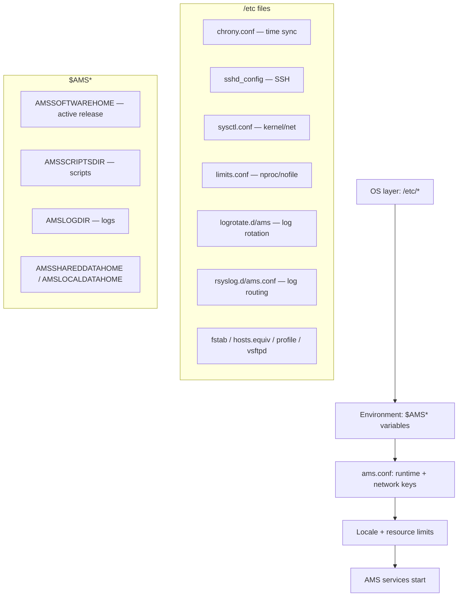

# Configuration Catalog — Nokia 5520 AMS 9.8.3

**Overview:** The map of where every AMS setting lives — the config files, the environment variables, and the `ams.conf` keys — plus which tool you're actually supposed to touch them with (hint: usually not a text editor).

## Overview — what it is and why it matters

**Plain language first.** An AMS server is configured in layers, like an onion. The outermost layer is the operating system (`/etc/...` files: time sync, mounts, SSH, firewall, log rotation). Inside that is a set of **environment variables** (`$AMSSOFTWAREHOME`, `$AMSLOGDIR`, …) that tell every AMS script where the software, logs, and data actually live. At the core is **`ams.conf`**, the master settings file: which IP addresses AMS binds to, which networks are client/NE/cluster traffic, timeouts, trace levels.

**Why a field tech cares:** half of "the server is misbehaving" tickets are really "someone changed a setting on one node and not the other", or "a value is pointing at the wrong interface". Knowing *which file owns which setting* turns a four-hour hunt into a ten-minute `grep`. And knowing which settings have a **dedicated script** (use it) versus which you edit by hand (carefully) keeps you from breaking the thing you're fixing.

**When to reach for this on a job site:** a fresh install or migration (verify every path and bind IP), a cluster where nodes disagree, after any network change (new subnet, NAT in front of AMS), when log rotation or resource limits misbehave, and when support asks "send us your ams.conf".

**Now the real depth.** The catalog has five groups:

1. **Files** — OS-level and AMS-level config files. Most live under `/etc/` (RHEL conventions) or `$AMSSOFTWAREHOME/conf/`. Two platform hook scripts (`activeSiteDown.sh`, `stanbySiteDown.sh`) and a pre-switchover decision hook (`switchover_hook`) live in platform/script directories — these run automatically on geo-redundancy events, so know they exist even if you never edit them.
2. **Environment variables** — the `$AMS*` family. These are how scripts find everything. If a script complains it can't find logs or data, `echo` these first.
3. **`ams.conf` parameters** — the runtime/network keys. The big ones are the `*BINDIP`/`*NETWORK` pairs: they pin client traffic, NE traffic, cluster traffic, and geo-sync traffic to specific interfaces. Get one wrong and AMS binds to the wrong NIC — or fails to start.
4. **Locale** — the `LC_*`/`LANG` block. Application and data servers must match; mismatched locales corrupt sorting, message parsing, and number formats.
5. **Resource limits** — `nproc`/`nofile` raised via `ams_update_limit.conf.sh` (run as **non-root**, per the guide — the script handles the privilege dance itself).

Golden rule, stated in the source: **use the dedicated script instead of direct editing when one exists** (e.g. `ams_update_limit.conf.sh` for limits). Hand-editing what a script manages is how nodes drift apart.

## Diagram — the configuration layers



Change flows top-down: fix the OS file, check the env var still resolves, confirm `ams.conf` agrees, restart the affected scope.

## CLI workflows (primary)

### A. Setup — find the right file, inspect the environment

First day on a server: learn where everything lives before touching anything. All read-only:

```bash
# Where do the $AMS* variables point on THIS server?
printf "%s\n" "$AMSSOFTWAREHOME" "$AMSSCRIPTSDIR" "$AMSLOGDIR" \
  "$AMSSHAREDDATAHOME" "$AMSLOCALDATAHOME" "$AMSLOCALDATADIR" \
  "$AMSEXTERNALLOCALDATAHOME" "$AMSDEBUGDIR" "$PLATFORMSCRIPTSDIR"

# Which files own which setting? (catalog lookup — do this before editing)
ls -l "$AMSSOFTWAREHOME/conf/ams.conf" "$AMSSOFTWAREHOME/conf/amsgeomonitor.conf"
ls -l /etc/logrotate.d/ams /etc/rsyslog.d/ams.conf
```

### B. Daily use — review (don't edit) the network keys

The `*BINDIP` keys pin traffic types to interfaces. Review them read-only after any network change:

```ini
# from $AMSSOFTWAREHOME/conf/ams.conf — read, compare against the site plan
AMSCLIENTBINDIP=<client-facing-list>
AMSCLIENTCONNECTIP=<translated-public-ip>
AMSCLUSTERBINDIP=<cluster-interface-or-address>
AMSGEOLOCALBINDIP=<geo-sync-interface-or-address>
AMSNEBINDIP=<ne-facing-list>
```

```bash
# pull the live values without opening an editor
grep -E '^(AMSCLIENTBINDIP|AMSCLIENTCONNECTIP|AMSCLUSTERBINDIP|AMSGEOLOCALBINDIP|AMSNEBINDIP)=' \
  "$AMSSOFTWAREHOME/conf/ams.conf"
ip -brief addr   # confirm those IPs actually exist on this box
```

If a BINDIP names an address the server doesn't have, AMS won't bind — that's your "service won't start after the network team changed something" check.

### C. Daily use — locale and resource limits

```bash
# locale must match across app and data servers
locale
cat /etc/sysconfig/i18n
```

```bash
# resource limits: use the supplied script, NOT hand edits (run as non-root)
ams_update_limit.conf.sh
# it adds the equivalents of:
#   amssys soft nproc 650000 / hard nproc 650000
#   amssys soft nofile 650000 / hard nofile 650000
ulimit -a   # verify after re-login
```

### D. Troubleshooting — cluster nodes disagree on configuration

Scenario: node A behaves differently from node B after a change. Config drift is suspect #1:

```bash
# 1. Snapshot the suspect files on both nodes, diff them
ssh amssys@<node-b> "cat \$AMSSOFTWAREHOME/conf/ams.conf" > /tmp/ams.conf.node-b
diff /tmp/ams.conf.node-b "$AMSSOFTWAREHOME/conf/ams.conf"

# 2. Same for locale and limits
ssh amssys@<node-b> 'locale; cat /etc/sysconfig/i18n' > /tmp/locale.node-b
diff /tmp/locale.node-b <(locale; cat /etc/sysconfig/i18n)

# 3. If drift is found: re-apply via the dedicated script / documented procedure,
#    do NOT hand-edit one file to match the other and hope — find what made them differ
```

Also check the golden software configuration — drift isn't always in `ams.conf`:

```bash
ams_server version verify /path/GoldenEMSSwConfig
# reports: missing, unexpected, wrong-version, aligned components
```

### E. Automation — nightly config snapshot for drift detection

Copy-pasteable. Snapshots the files that matter, checksums them, and alerts (non-zero exit) when anything moved since yesterday:

```bash
#!/bin/bash
# ams-config-snapshot.sh — run as amssys from cron. Replace <...> before use.
set -u
SNAPDIR="/var/opt/ams-config-snaps"
mkdir -p "$SNAPDIR"
TS="$(date +%Y%m%d)"
FILES=(
  "$AMSSOFTWAREHOME/conf/ams.conf"
  "$AMSSOFTWAREHOME/conf/amsgeomonitor.conf"
  /etc/logrotate.d/ams
  /etc/rsyslog.d/ams.conf
  /etc/security/limits.conf
)
{
  echo "# snapshot $TS on $(hostname)"
  locale; echo "---"
  for f in "${FILES[@]}"; do
    [ -r "$f" ] && sha256sum "$f" || echo "MISSING $f"
  done
} > "$SNAPDIR/snap-$TS.txt"
# compare with yesterday; alert on any difference
YEST="$SNAPDIR/snap-$(date -d yesterday +%Y%m%d).txt"
if [ -f "$YEST" ] && ! diff -q "$YEST" "$SNAPDIR/snap-$TS.txt" >/dev/null; then
  echo "CONFIG DRIFT detected on $(hostname) — diff $YEST $SNAPDIR/snap-$TS.txt"
  exit 2
fi
echo "config snapshot $TS clean"
```

## GUI section (secondary)

The AMS web GUI client exposes some operational settings (trace levels, log configuration, user management) through its administration views — handy for a quick toggle from a jump host. Where it falls short vs CLI:

- `ams.conf` network keys, OS-level files (`/etc/*`), locale, and resource limits have **no GUI equivalent** — they're files on the server, full stop.
- Bulk/environment inspection (`printf` the `$AMS*` family, `diff` across nodes) is CLI-only.
- The GUI won't tell you *which file owns a setting*; this catalog does. When the GUI shows a value you don't trust, the CLI path above is how you verify what the server is actually reading.

## Platform script blocks

> **Reality check:** config files live on the RHEL AMS server. Every platform below reaches them over SSH; nothing here is installed or edited locally on a phone/laptop. Windows has no `/etc` — view the files through the SSH session, don't look for local equivalents.

### Linux bash (on the AMS server itself)

Native — read, grep, and diff directly:

```bash
printf "%s\n" "$AMSSOFTWAREHOME" "$AMSSCRIPTSDIR" "$AMSLOGDIR" "$AMSSHAREDDATAHOME" "$AMSLOCALDATAHOME"
grep -E '^(AMSCLIENTBINDIP|AMSCLUSTERBINDIP|AMSNEBINDIP)=' "$AMSSOFTWAREHOME/conf/ams.conf"
locale; cat /etc/sysconfig/i18n
ams_update_limit.conf.sh   # non-root, per the guide
```

### Nix-on-Droid (Android — SSH terminal only)

SSH in and run the Linux commands remotely. Config lives on the server; the phone only displays it:

```bash
nix-env -iA nixpkgs.openssh
ssh amssys@<ams-host> 'printf "%s\n" "$AMSSOFTWAREHOME" "$AMSSCRIPTSDIR" "$AMSLOGDIR"; locale'
# diff ams.conf between two cluster nodes, from the phone:
ssh amssys@<node-a> 'cat $AMSSOFTWAREHOME/conf/ams.conf' > /tmp/a.conf
ssh amssys@<node-b> 'cat $AMSSOFTWAREHOME/conf/ams.conf' > /tmp/b.conf
diff /tmp/a.conf /tmp/b.conf
```

### PowerShell (Windows — SSH to the server)

Remote inspection one-liners; pull files down with `scp` for local diffing:

> **Status:** syntax-verified with PowerShell 7 on Arch (pwsh) — not executed against live systems.
```powershell
ssh amssys@<ams-host> 'grep -E "^(AMSCLIENTBINDIP|AMSCLUSTERBINDIP|AMSNEBINDIP)=" "$AMSSOFTWAREHOME/conf/ams.conf"'
scp amssys@<ams-host>:'$AMSSOFTWAREHOME/conf/ams.conf' .\ams.conf.remote
# now diff against a known-good copy with any Windows diff tool
```

### Termux (Android — SSH terminal only)

Same SSH-terminal pattern; `diff` is available in Termux for on-phone comparison:

```bash
pkg install openssh
ssh amssys@<ams-host> 'cat $AMSSOFTWAREHOME/conf/ams.conf' > ~/ams.conf.remote
# compare with a known-good snapshot kept on the phone
diff ~/ams.conf.golden ~/ams.conf.remote
```

### Windows cmd (cmd.exe — SSH to the server)

Quote remote commands with double quotes; fetch files with `scp` for inspection in a Windows editor:

> **Status:** UNVERIFIED — no Windows cmd available for testing.
```cmd
ssh amssys@<ams-host> "locale; cat /etc/sysconfig/i18n"
scp amssys@<ams-host>:/etc/logrotate.d/ams C:\Temp\ams-logrotate.remote
```

### WSL/Arch (Arch Linux under WSL — SSH to the server)

Full Linux tooling locally for diffing; the files themselves stay remote:

```bash
sudo pacman -S --needed openssh diffutils
ssh amssys@<ams-host> 'cat $AMSSOFTWAREHOME/conf/ams.conf' | diff - /path/to/ams.conf.golden
```

## Impact warnings — read before typing

| Level | What | Why it matters |
|---|---|---|
| **Connectivity-sensitive** | Any `*BINDIP` / `*NETWORK` / `*NIC` key in `ams.conf` | Wrong interface = AMS binds nowhere or to the wrong network. Service-affecting; use `ams_change_ip_subnet_server`, verify with `ip addr`, maintenance window. |
| **OS configuration** | `ams_update_limit.conf.sh`, `/etc/security/limits.conf`, `/etc/sysctl.conf`, `/etc/ssh/sshd_config` | Affects every process on the box. Run the supplied script (non-root) instead of hand-editing; changes may need re-login or reboot to take effect. |
| **Parsing/behavior risk** | Locale (`LC_*`, `LANG`) | Mismatched locales across app/data servers corrupt sorting and message parsing. Keep them identical; changing locale is not casual. |
| **Silent-but-critical** | `/etc/chrony.conf` (time sync), `/etc/fstab` (mounts), `/etc/hosts.equiv` (must stay empty, mode `0400`) | Time drift breaks clustering and certificate validation; a bad fstab entry can prevent boot. |
| **Safe to read** | `printf` of `$AMS*` vars, `grep`/`cat` of configs, `locale`, snapshot script | Read-only inspection never hurt anyone — do it freely and often. |

## Quick reference — catalog A–Z

### Files

| Path | Purpose |
|---|---|
| `$AMSSOFTWAREHOME/conf/ams.conf` | Core runtime/network configuration |
| `$AMSSOFTWAREHOME/conf/amsgeomonitor.conf` | Geo monitoring |
| `$AMSSOFTWAREHOME/lib/dataserver/bin/switchover_hook` | Pre-switchover decision hook |
| `$PLATFORMSCRIPTSDIR/activeSiteDown.sh` | Active-site-down hook |
| `$PLATFORMSCRIPTSDIR/stanbySiteDown.sh` | Standby-site-down hook |
| `/etc/chrony.conf` | Time synchronization |
| `/etc/fstab` | Persistent mounts |
| `/etc/hosts.equiv` | Host equivalence; empty, mode `0400` |
| `/etc/logrotate.d/ams` | Log rotation |
| `/etc/profile` | `TMOUT`, `UMASK` |
| `/etc/rsyslog.d/ams.conf` | iptables log routing |
| `/etc/security/limits.conf` | `nproc`, `nofile` |
| `/etc/ssh/sshd_config` | SSH service settings |
| `/etc/sysctl.conf` | Kernel/network hardening |
| `/etc/sysconfig/i18n` | Locale on applicable RHEL |
| `/etc/vsftpd/vsftpd.conf` | FTP chroot |

### Environment variables

| Variable | Use |
|---|---|
| `AMSDEBUGDIR` | Debug/trace directory |
| `AMSEXTERNALLOCALDATAHOME` | Release-external local data |
| `AMSLOCALDATADIR` | Local data root; default `/var/opt` |
| `AMSLOCALDATAHOME` | Release-local data home |
| `AMSLOGDIR` | Log directory |
| `AMSSCRIPTSDIR` | Script directory |
| `AMSSHAREDDATAHOME` | Shared data home |
| `AMSSOFTWAREHOME` | Active release software home |
| `NAGID` | Installation base group-ID override |
| `NAUID` | Installation base user-ID override |
| `PLATFORMSCRIPTSDIR` | Platform hook directory |

### `ams.conf` parameters

```ini
AMSBLOCKIP=<value>
AMSCLIENTBINDIP=<value>
AMSCLIENTCONNECTIP=<value>
AMSCLIENTNETWORK=<value>
AMSCLIENTNETWORKNIC=<value>
AMSNEBINDIP=<value>
AMSNENETWORK=<value>
AMSNENETWORKNIC=<value>
AMSOSSERVICEMETHOD=<value>
AMSPROCESSMONITORTRACELEVEL=<value>
AMSREPLICATIONTRACELEVEL=<value>
AMSSCRIPTSTRACELEVEL=<value>
```

Additional referenced parameters:

```ini
AMSAPPSERVERENABLED=<true|false>
AMSARBITERENABLED=<true|false>
AMSCLUSTERBINDIP=<value>
AMSCLUSTERNETWORK=<IPv4-subnet>
AMSDATASERVERENABLED=<true|false>
AMSDATASERVERS=<host-list>
AMSGEOLOCALBINDIP=<value>
AMSMULTICAST2IP=<multicast-IP>
AMSMULTICASTIP=<multicast-IP>
AMSPREFERREDSERVER=<true|false>
AMSSSHCLIENTTIMEOUT=<seconds>
AMSSSHSERVERTIMEOUT=<seconds>
AMSUSERDICTIONARY=<Nokia|ALU>
```

Use the dedicated script instead of direct editing when available.

### Locale (keep identical across app/data servers)

```ini
CMASK=022
LC_COLLATE=en_US.ISO8859-1
LC_CTYPE=en_US.ISO8859-1
LC_MESSAGES=C
LC_MONETARY=en_US.ISO8859-1
LC_NUMERIC=en_US.ISO8859-1
LC_TIME=en_US.ISO8859-1
LANG=C
```

Source: Nokia 5520 AMS 9.8.3 Administrator Guide [cite:2], Installation and Migration Guide [cite:3]. Replace every `<placeholder>`; validate in a lab and against the controlling Nokia documentation before production use.
