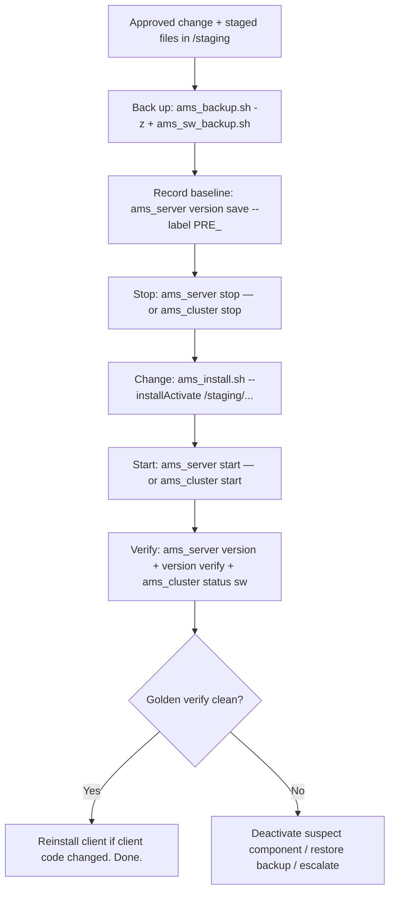

# Installation & Software Management — Nokia 5520 AMS 9.8.3

**Overview:** How AMS software gets installed, activated, patched, and licensed — and the stop-change-start rhythm that keeps every change safe, verifiable, and reversible.

## Overview — what it is and why it matters

**Plain language first.** Think of AMS software like an engine with swappable parts. **Installation** puts a new release on the disk. **Activation** (`ams_activate.sh`, as `root`) flips the switch that makes that release the live one and prepares its plug-in environment. **Components** — NE plug-ins, patches, emergency fixes — are managed with `ams_install.sh`: install them, activate them, or deactivate them. And **licenses** are the host-locked permission slips; without the right one for the right host ID, features stay dark.

**Why a field tech cares:** you will be the hands on every patch night. The rhythm never changes: **back up → stop → change → start → verify**. Skip a step and you get the classic 2 a.m. call: "the patch is on but nothing works and we can't tell what changed." This guide is that rhythm, with the exact commands.

**When to reach for this on a job site:** installing a new AMS release, activating it, applying a patch or emergency fix, adding an NE plug-in for new hardware, deactivating a bad component, checking or installing licenses, and any time you need to prove "the software on this box is exactly the approved set" (that's the golden configuration).

**Now the real depth.** Four concepts to keep straight:

1. **Install ≠ activate.** `ams_install.sh --install` stages a component; `--activate` makes it live; `--installActivate` does both in one shot. Activation of a *release* is the separate `ams_activate.sh` (root, full path `/opt/ams/software/<release>/bin/ams_activate.sh`).
2. **Deactivation scope matters.** Bare `ams_install.sh --deactivate` with no component subset deactivates **all** active plug-ins, patches, and emergency fixes — core AMS stays up, everything else goes dark. That's occasionally what you want (bad patch night) and usually not. Name your subset when you can.
3. **Stop before you change.** Back up and stop AMS (simplex: `ams_server stop`; cluster: `ams_cluster stop`) before component work, and install the **same component set on every applicable cluster server** — a cluster with mismatched components is a split-brain waiting to happen.
4. **Golden configuration** is your proof: `ams_server version save` records the known-good software set (labels are alphanumeric, max 25 chars); `ams_server version verify` later reports what's **missing, unexpected, wrong-version, or aligned**. Run it before and after every change.

Licenses are host-ID-bound: `ams_install_license` installs them (privileged), `getLicenseCounter` reads the counters (read-only). On different hardware, restore data with `ams_restore.sh -n` (excludes the old host's licenses), then install licenses generated for the **current** host ID.

## Diagram — the safe change rhythm



## CLI workflows (primary)

### A. Setup — activate an installed release

The release is already on disk (staged by whoever ran the installer); activation makes it operationally selectable. **Root only:**

```bash
sudo /opt/ams/software/<release>/bin/ams_activate.sh
# <release> = the release directory name, e.g. the 9.8.3 build string — replace before running
ams_server version   # confirm the active release is the one you just activated
```

### B. Daily use — component management

Install/activate/deactivate plug-ins, patches, emergency fixes. All as `amssys`:

```console
ams_install.sh                                          # interactive / status view
ams_install.sh --installActivate <directory-or-bin-files>  # stage + activate in one shot
ams_install.sh --install <directory-or-bin-files>          # stage only
ams_install.sh --activate <directory-or-bin-files>         # activate staged
ams_install.sh --deactivate                                # DANGER: deactivates ALL non-core components
```

The safe lifecycle wrapper — stop, change, start — for a simplex server:

```bash
ams_server stop
ams_install.sh --installActivate /staging/ams-components
ams_server start
ams_server version
```

And for a cluster — stop the cluster, install the **same set on every applicable server**, start the cluster:

```bash
ams_cluster stop
ams_install.sh --installActivate /staging/ams-components   # on each server
ams_cluster start
ams_cluster status sw    # software set consistent across the cluster?
```

### C. Daily use — golden configuration (your proof of "what's installed")

```bash
ams_server version                                        # what is running now
ams_server version save                                   # snapshot to default location
ams_server version save --label <Label> /path/GoldenEMSSwConfig
# <Label>: alphanumeric, max 25 characters, e.g. PREPATCH20260930
ams_server version verify /path/GoldenEMSSwConfig
# reports: missing / unexpected / wrong-version / aligned components
ams_cluster status sw                                     # cross-server software comparison
```

Make `version save` part of every pre-change checklist and `version verify` part of every post-change checklist. When the NOC asks "did the patch actually apply everywhere?", this is the answer.

### D. Daily use — licenses

```bash
sudo ams_install_license   # install host-specific entitlements (privileged)
getLicenseCounter           # read license counters (read-only)
```

New hardware / host ID changed? Restore data excluding the old licenses, then install the new ones:

```bash
ams_restore.sh -n /backup/ams-data.tar   # -n: skip licenses from the old host
sudo ams_install_license                 # install licenses generated for THIS host ID
getLicenseCounter                        # confirm counters look right
```

### E. Troubleshooting — patch applied but golden verify is dirty

Scenario: `ams_server version verify` reports `wrong-version` or `unexpected` components after a patch window.

```bash
# 1. See exactly what is wrong
ams_server version verify /path/GoldenEMSSwConfig

# 2. Common causes, in order:
#    a) component installed on this node but not its cluster mates
ams_cluster status sw
#    b) client code changed but the GUI client was not reinstalled
#       -> reinstall the client (site procedure), then re-verify
#    c) a bad component needs to come back out
ams_server stop
ams_install.sh --deactivate        # removes the offending component(s); unscoped = all non-core
ams_server start
ams_server version verify /path/GoldenEMSSwConfig

# 3. If still dirty and the window is burning: restore the pre-change backup
#    (this is why section B of the backup guide exists)
```

### F. Troubleshooting — activation didn't take

Scenario: `ams_activate.sh` ran, but `ams_server version` still shows the old release.

```bash
# 1. Confirm you ran it as root with the exact release path — a typo'd
#    <release> directory silently does nothing useful
ls -d /opt/ams/software/<release>/bin/ams_activate.sh
sudo /opt/ams/software/<release>/bin/ams_activate.sh

# 2. Confirm the plug-in environment prepared cleanly; check for errors
#    in the activation output before starting services
ams_server version
```

### G. Automation — pre-patch checklist script

Copy-pasteable. Refuses to proceed unless backups exist, the golden baseline is saved, and the staging directory is populated:

```bash
#!/bin/bash
# ams-pre-patch-check.sh — run as amssys before any component change. Replace <...> before use.
set -u
STAGING="/staging/ams-components"
GOLDEN="/path/GoldenEMSSwConfig"
LABEL="PRE$(date +%Y%m%d%H%M)"   # alphanumeric, <= 25 chars

[ -d "$STAGING" ] || { echo "FAIL: staging dir $STAGING missing"; exit 1; }
[ -n "$(ls -A "$STAGING")" ] || { echo "FAIL: staging dir empty"; exit 1; }
ls -t /backup/ams-data-*.tar.gz >/dev/null 2>&1 || { echo "FAIL: no data backup found"; exit 1; }
ls /backup/ams-software.*.bin >/dev/null 2>&1 || { echo "FAIL: no software backup found"; exit 1; }

ams_server status >/dev/null 2>&1 || { echo "FAIL: AMS not healthy pre-change"; exit 1; }
ams_server version save --label "$LABEL" "$GOLDEN" || exit 1

echo "PASS: backups present, baseline saved as $LABEL, staging populated."
echo "Next: ams_server stop && ams_install.sh --installActivate $STAGING && ams_server start"
```

## GUI section (secondary)

The AMS GUI client itself is installed software — the patch workflow explicitly notes **"reinstall the client if client code changed"**, so after a server-side patch, don't trust a stale GUI: reinstall it from the new release's client package first, then use it. The GUI is useful for visually confirming post-patch state (alarms clearing, NEs reachable).

Where it falls short vs CLI:

- Release activation, component install/deactivate, and golden-configuration save/verify are CLI operations; the GUI has no equivalent.
- License installation is CLI (`ams_install_license`); the GUI may *display* counters but doesn't install entitlements.
- A GUI can't be scripted into a patch runbook and can't produce the byte-exact "what ran" record that `version verify` gives you. For anything auditors or support will ask about, CLI is the source of truth.

## Platform script blocks

> **Reality check:** installation and activation happen on the RHEL AMS server as `amssys`/`root`. Every other platform is an SSH remote control for that server. Staging directories (`/staging`) and backup paths are server-side paths.

### Linux bash (on the AMS server itself)

Native — the full rhythm, as documented:

```bash
# as amssys: pre-change safety
ams_backup.sh -z /backup/ams-data-$(date +%Y%m%d).tar.gz
sudo ams_sw_backup.sh /backup/ams-software
ams_server version save --label PRE$(date +%Y%m%d) /path/GoldenEMSSwConfig
# change window
ams_server stop
ams_install.sh --installActivate /staging/ams-components
ams_server start
# verify
ams_server version
ams_server version verify /path/GoldenEMSSwConfig
```

### Nix-on-Droid (Android — SSH terminal only)

AMS does **not** install on Android. Drive the server over SSH; keep the session foreground (no termux-api/wake-lock here — Android may kill backgrounded sessions, so run the stop/change/start sequence interactively):

```console
nix-env -iA nixpkgs.openssh
ssh amssys@<ams-host>
# at the server prompt, run the Linux-bash rhythm above interactively
ams_server stop
ams_install.sh --installActivate /staging/ams-components
ams_server start
ams_server version verify /path/GoldenEMSSwConfig
exit
```

### PowerShell (Windows — SSH to the server)

One-liners for status checks; interactive session for the change window (don't script `stop`/`start` across flaky links — be present):

> **Status:** syntax-verified with PowerShell 7 on Arch (pwsh) — not executed against live systems.
```powershell
ssh amssys@<ams-host> 'ams_server version; ams_server version verify /path/GoldenEMSSwConfig'
# stage files first, then open an interactive session for the change:
scp .\patch-bundle.bin amssys@<ams-host>:/staging/
ssh amssys@<ams-host>
```

### Termux (Android — SSH terminal only)

SSH terminal; `termux-wake-lock` during the change window so a suspended phone doesn't leave AMS stopped:

```console
pkg install openssh
termux-wake-lock
ssh amssys@<ams-host>
# interactive change window at the server prompt (Linux-bash rhythm above)
exit
termux-wake-unlock
```

### Windows cmd (cmd.exe — SSH to the server)

Win32 OpenSSH in cmd; double-quote remote commands:

> **Status:** UNVERIFIED — no Windows cmd available for testing.
```cmd
ssh amssys@<ams-host> "ams_server version"
scp patch-bundle.bin amssys@<ams-host>:/staging/
ssh amssys@<ams-host>
REM interactive change window at the server prompt
```

### WSL/Arch (Arch Linux under WSL — SSH to the server)

Same SSH pattern; convenient for staging bundles from the Windows side via `/mnt/c`:

```bash
sudo pacman -S --needed openssh
scp /mnt/c/Staging/patch-bundle.bin amssys@<ams-host>:/staging/
ssh amssys@<ams-host> 'ams_server version verify /path/GoldenEMSSwConfig'
```

## Impact warnings — read before typing

| Level | Commands | What it means for you |
|---|---|---|
| **Service-affecting** | `ams_server stop` / `ams_cluster stop`, `ams_install.sh --installActivate`, `ams_install.sh --deactivate` | AMS stops serving the network during the change. Approved maintenance window; NOC notified. |
| **Configuration (broad blast radius)** | Bare `ams_install.sh --deactivate` (no subset) | Deactivates **all** active plug-ins, patches, and emergency fixes at once — core AMS stays, everything else goes dark. Name a subset unless you mean it. |
| **Release-selection change** | `ams_activate.sh` (root) | Flips which release is live. Verify with `ams_server version` before starting services. |
| **Cluster consistency risk** | Component install on clusters | Install the **same component set on every applicable server**; verify with `ams_cluster status sw`. Mismatched nodes = split behavior. |
| **License/host binding** | `ams_install_license`, `ams_restore.sh -n` | Licenses are host-ID-bound. Wrong-host licenses = dark features. On new hardware: restore `-n`, then install current-host licenses. |
| **Read-only / safe** | `ams_server version`, `version verify`, `ams_cluster status sw`, `getLicenseCounter` | Safe anytime — run these freely, especially before and after changes. |

## Quick reference — commands A–Z

| Command | Account | Purpose |
|---|---|---|
| `ams_activate.sh` | `root` | Activate installed release (`/opt/ams/software/<release>/bin/ams_activate.sh`) |
| `ams_cluster start` / `ams_cluster stop` | `amssys` | Cluster lifecycle around component changes |
| `ams_install.sh` | `amssys` | Manage components (no args: interactive/status) |
| `ams_install.sh --activate` | `amssys` | Activate staged components |
| `ams_install.sh --deactivate` | `amssys` | Deactivate components (unscoped = all non-core) |
| `ams_install.sh --install` | `amssys` | Install (stage) components |
| `ams_install.sh --installActivate` | `amssys` | Install + activate in one shot |
| `ams_install_license` | privileged | Install host-specific licenses |
| `ams_restore.sh -n` | `amssys` | Restore data excluding licenses (new hardware) |
| `ams_server start` / `ams_server stop` | `amssys` | Server lifecycle around component changes |
| `ams_server version` | `amssys` | Show installed/active release |
| `ams_server version save` | `amssys` | Save golden software configuration (`--label` ≤ 25 alnum chars) |
| `ams_server version verify` | `amssys` | Verify against golden (missing/unexpected/wrong-version/aligned) |
| `getLicenseCounter` | privileged | Read license counters (read-only) |

Source: Nokia 5520 AMS 9.8.3 Administrator Guide [cite:2], Installation and Migration Guide [cite:3], Server Configuration Technical Guidelines [cite:4]. Replace every `<placeholder>`; validate in a lab and against the controlling Nokia documentation before production use.
