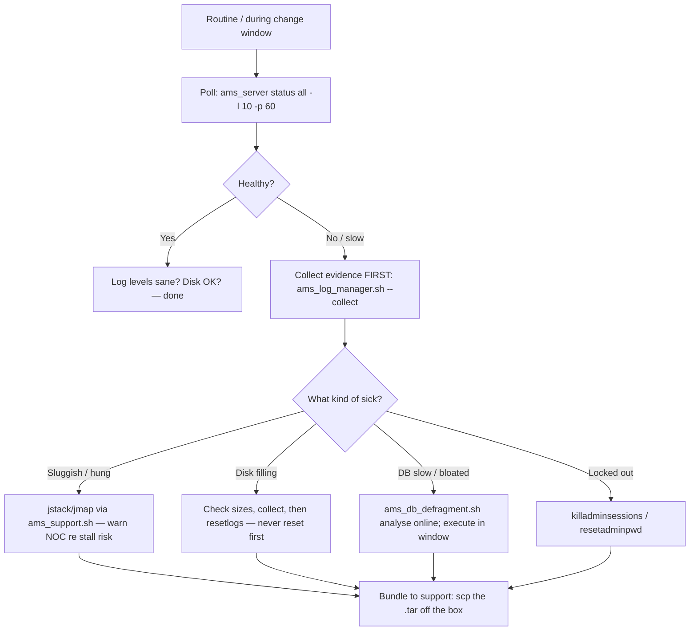

# Logs, Monitoring & Support — Nokia 5520 AMS 9.8.3

**Overview:** How to watch AMS health in real time, gather the evidence Nokia support will ask for, and manage log volume — without deleting the very evidence you need to diagnose the problem.

## Overview — what it is and why it matters

**Plain language first.** Every AMS server constantly writes down what it's doing — that's the **logs**. **Monitoring** is you reading those signs of life: is the server up, is the cluster in sync, is the database healthy? **Support** is what happens when you can't fix it alone: Nokia's engineers will ask for a bundle of logs and diagnostics, and this guide's tools (`ams_log_manager.sh`, `ams_support.sh`) build exactly that bundle.

**Why a field tech cares:** you are the first responder. When the NOC calls at 3 a.m. saying "AMS looks sick", the difference between a 20-minute diagnosis and a 6-hour outage is knowing which status command to run first, how to capture a log bundle *before* anyone restarts anything, and how to take a JVM thread dump without making things worse. Also: logs eat disks. A server that stops because `/var` filled with logs is an embarrassment you can prevent.

**When to reach for this on a job site:** during every startup, migration, and switchover (poll status in a loop); when disk alarms fire (log volume); when the GUI feels sluggish or stuck (JVM diagnostics); when you're locked out of the admin account; before calling Nokia support (collect the bundle first — they'll ask); and routinely, to keep log levels sane.

**Now the real depth.** The toolkit breaks into five groups:

1. **Status monitoring** — `ams_server status` (add `all -l 10 -p 60` for a 10-sample, 60-second polling loop), `ams_cluster status` (`--detailed` for the full picture), and `innotop` (a live InnoDB/MySQL monitor — think `top` but for the database engine). Use the loops during startup, migration, replication recovery, and switchovers: single snapshots lie, trends don't.
2. **Database fragmentation** — `ams_db_defragment.sh` (run as `root`, via `$AMSSCRIPTSDIR`). `analyse` is safe to run online — it only reports waste. `execute` is the real rebuild: AMS must be **stopped on the active data server**, and it triggers a **full synchronization** afterward. Analyse first, schedule execute for a window.
3. **Log management** — `ams_log_manager.sh`: `--collect` bundles log/debug/OS evidence to a destination (`file:///tmp/ams-logs.tar`); `--resetlogs` **clears** logs (destroys evidence — collect first); `--setlevel '<category>,<level>'` changes verbosity (categories include `log`, `debug`, `os`, `all`; targets can be IPs, site names, or `all`). `ams_reset_logs.sh` is the blunt instrument — clears AMS logs outright.
4. **Support diagnostics** — `ams_support.sh --domain app --command jstack|jmap` captures JVM thread/memory dumps. Warning from the source: on a heavily loaded server these can **temporarily stall the JVM** — warn the NOC, don't run them casually at peak. The `security` domain has `killadminsessions` (terminate stuck admin sessions) and `resetadminpwd` (recover a lost admin password) — security-sensitive, as you'd expect.
5. **Log plumbing** — `/etc/rsyslog.d/ams.conf` routes firewall/connection messages to `/var/log/iptables.log`; `/etc/logrotate.d/ams` rotates it (7 daily, compressed; the server guide also documents a 1024 MB size-based alternative). Restart `rsyslog` after editing its config.

One more utility: `convert_to_shorter_line.pl -f <file> -l 80` wraps over-long log lines to 80 columns for readability. It preserves the source file and writes a new one — safe to run on copies.

## Diagram — the monitoring and evidence loop



## CLI workflows (primary)

### A. Setup — log plumbing (rsyslog + logrotate)

This is one-time setup, normally done at install. If firewall/connection logs aren't landing where they should, check this plumbing:

`/etc/rsyslog.d/ams.conf`:

```rsyslog
:msg,contains,"IPTables-Dropped" -/var/log/iptables.log
:msg,contains,"Connection established" -/var/log/iptables.log
& stop
```

`/etc/logrotate.d/ams`:

```conf
/var/log/iptables.log {
    rotate 7
    daily
    missingok
    dateext
    delaycompress
    compress
}
```

Apply and verify (root):

```bash
sudo systemctl restart rsyslog
sudo logrotate -d /etc/logrotate.d/ams 2>&1 | head -20   # debug-run: shows what WOULD happen
ls -lh /var/log/iptables.log*
```

(The Server Configuration Technical Guidelines also document a 1024 MB size-based rotation alternative — consult it if daily rotation can't keep up.)

Set a sane baseline verbosity and record it (you'll want the original value when you turn debugging back down):

```bash
ams_log_manager.sh --setlevel '<category>,<level>' --target all
# e.g. categories: log, debug, os, all — replace <category>,<level> per site procedure
```

### B. Daily use — watch status like a hawk during changes

Single snapshots during startup, migration, replication recovery, and switchovers will mislead you. Poll:

```bash
ams_server status
ams_server status all -l 10 -p 60   # 10 samples, 60 s apart — the truth over time
ams_cluster status
ams_cluster status --detailed
ams_cluster status -l 10 -p 60
innotop                              # live InnoDB monitor (amssys)
```

Read the trend, not the sample: services flapping between samples, replication lag growing, InnoDB threads piling up — those are the early warnings.

### C. Daily use — collect a support bundle

Before you call Nokia support — or before you restart anything to "see if it helps" (don't) — capture the evidence:

```bash
ams_log_manager.sh --collect --category all --target all --destination file:///tmp/ams-logs.tar
ls -lh /tmp/ams-logs.tar
```

Targets can narrow the blast radius: an IP, a site name, or `all`. Categories: `log`, `debug`, `os`, `all`. Then get it off the box (support can't read a tarball on a server they can't reach):

```bash
scp /tmp/ams-logs.tar <your-workstation>:/cases/<case-id>/
```

### D. Troubleshooting — disk filling with logs

Scenario: disk alarm on `/var`, AMS still running. **Never reset logs before collecting** — the evidence of *why* they grew is in the logs you're about to delete.

```bash
# 1. Find what's actually big (logs? or something else?)
du -sh "$AMSLOGDIR"/* | sort -rh | head -10
df -h /var

# 2. Collect evidence of the current state FIRST
ams_log_manager.sh --collect --category all --target all --destination file:///tmp/ams-logs-prefill.tar

# 3. Only then clear, and record what the level was
ams_log_manager.sh --resetlogs --category log --target all
# nuclear option (clears AMS logs outright): ams_reset_logs.sh

# 4. Fix the cause: was verbosity cranked up and never turned down?
ams_log_manager.sh --setlevel '<category>,<original-level>' --target all
# check logrotate is actually rotating: ls -lh /var/log/iptables.log*
```

### E. Troubleshooting — sluggish or hung server (JVM diagnostics)

Scenario: GUI unresponsive, operations timing out, but the process is alive. Capture thread and memory state:

```bash
# WARN the NOC first: on a heavily loaded server these can briefly stall the JVM
ams_support.sh --domain app --command jstack --target all --destination /tmp/jstack.tar
ams_support.sh --domain app --command jmap --target <site-or-IP> --destination /tmp/jmap.tar
ls -lh /tmp/jstack.tar /tmp/jmap.tar
```

Take `jstack` (threads — "what is everyone stuck on") before `jmap` (heap — bigger, heavier). Ship both to support with the log bundle from section C.

### F. Troubleshooting — database slowness / bloat (defragmentation)

Scenario: DB operations degrading over months. Analyse online first — it's read-only:

```bash
$AMSSCRIPTSDIR/ams_db_defragment.sh all analyse
$AMSSCRIPTSDIR/ams_db_defragment.sh -t <table> analyse   # single-table drill-down
```

If analyse shows real waste, the rebuild needs a window: **AMS stopped on the active data server**, and it triggers **full synchronization** afterward (plan for the replication traffic):

```bash
ams_server stop
$AMSSCRIPTSDIR/ams_db_defragment.sh all execute
ams_server start
ams_server status all -l 10 -p 60   # watch replication recovery complete
```

### G. Troubleshooting — locked out of the admin account

Scenario: admin sessions wedged, or the admin password is lost and the site procedure authorizes recovery:

```bash
ams_support.sh --domain security --command killadminsessions   # terminate stuck admin sessions
ams_support.sh --domain security --command resetadminpwd       # reset admin password
```

Security-sensitive by nature — these are audited actions. Follow the site's identity procedure (who authorized, ticket number) and record it.

### H. Log readability — wrap long lines

`processmonitor.log` lines can run thousands of characters. This wraps them for human reading; the source file is preserved and a new file is created:

```bash
convert_to_shorter_line.pl -f /path/processmonitor.log -l 80
ls -lh /path/processmonitor.log*   # original + wrapped copy
```

### I. Automation — nightly evidence + disk guard

Copy-pasteable. Collects a nightly bundle, ships it off-box, and pages (non-zero exit) if log disk usage crosses 80%:

```bash
#!/bin/bash
# ams-log-guard.sh — run as amssys from cron. Replace <...> before use.
set -u
STAMP="$(date +%Y%m%d)"
DEST="file:///tmp/ams-logs-$STAMP.tar"
REMOTE='<your-workstation>:/cases/nightly/'

ams_log_manager.sh --collect --category all --target all --destination "$DEST" || exit 1
scp "/tmp/ams-logs-$STAMP.tar" "$REMOTE" || echo "WARN: off-box ship failed"

# disk guard: alert if the log filesystem is over 80% full
USE=$(df -P "$AMSLOGDIR" | awk 'NR==2 {print $5}' | tr -d '%')
if [ "$USE" -ge 80 ]; then
  echo "ALERT: log disk at ${USE}% on $(hostname) — investigate before it fills"
  exit 2
fi
echo "log guard $STAMP ok (disk ${USE}%)"
```

## GUI section (secondary)

The AMS web GUI client has log/status views that are convenient for a quick glance from a jump host — tailing recent events without an SSH session. Where it falls short vs CLI:

- The GUI shows *recent* logs; `--collect` bundles **log + debug + OS evidence** across targets (IPs, sites, `all`) into one shippable tarball — that's what support actually wants, and it's CLI-only.
- Log levels, resets, JVM dumps, and admin recovery have no GUI equivalent (by design — these are privileged/dangerous).
- `innotop`'s live InnoDB view and the `-l/-p` polling loops are terminal tools; the GUI's status pages are snapshots.
- Rule: GUI to *notice* something; CLI to *capture, diagnose, and prove* it.

## Platform script blocks

> **Reality check:** monitoring and log tools run on the RHEL AMS server. Other platforms are SSH remotes for running them and `scp` remotes for pulling bundles down. Log *plumbing* (`/etc/rsyslog.d`, `logrotate`, `systemctl`) is server-side root work — marked N/A where a platform can't do it, with the SSH alternative.

### Linux bash (on the AMS server itself)

Native — status loops, collection, and plumbing as documented:

```bash
# as amssys: watch during any change
ams_server status all -l 10 -p 60
ams_cluster status --detailed
# collect a support bundle
ams_log_manager.sh --collect --category all --target all --destination file:///tmp/ams-logs.tar
ls -lh /tmp/ams-logs.tar
# as root: plumbing changes
sudo systemctl restart rsyslog
```

### Nix-on-Droid (Android — SSH terminal only)

Phone = SSH terminal + bundle downloader. No systemd/rsyslog/logrotate on Android — that plumbing is server-side only (N/A locally; do it over SSH as root on the server):

```bash
nix-env -iA nixpkgs.openssh
# polling loop over SSH (keep session foreground — Android kills backgrounded apps)
ssh amssys@<ams-host> 'ams_server status all -l 10 -p 60'
# trigger a bundle on the server, then pull it to the phone
ssh amssys@<ams-host> 'ams_log_manager.sh --collect --category all --target all --destination file:///tmp/ams-logs.tar'
scp amssys@<ams-host>:/tmp/ams-logs.tar ~/ams-logs.tar
```

### PowerShell (Windows — SSH to the server)

Single-shot status checks plus `scp` to pull bundles for upload to a support case:

> **Status:** syntax-verified with PowerShell 7 on Arch (pwsh) — not executed against live systems.
```powershell
ssh amssys@<ams-host> 'ams_server status; ams_cluster status --detailed'
ssh amssys@<ams-host> 'ams_log_manager.sh --collect --category all --target all --destination file:///tmp/ams-logs.tar'
scp amssys@<ams-host>:/tmp/ams-logs.tar C:\Cases\<case-id>\ams-logs.tar
```

### Termux (Android — SSH terminal only)

Same SSH pattern; `termux-wake-lock` keeps long polling loops alive when the screen sleeps:

```bash
pkg install openssh
termux-wake-lock
ssh amssys@<ams-host> 'ams_cluster status -l 10 -p 60'
termux-wake-unlock
# pull the bundle into shared storage for upload
scp amssys@<ams-host>:/tmp/ams-logs.tar ~/storage/downloads/ams-logs.tar
```

### Windows cmd (cmd.exe — SSH to the server)

Win32 OpenSSH one-liners; double-quote the remote command:

> **Status:** UNVERIFIED — no Windows cmd available for testing.
```cmd
ssh amssys@<ams-host> "ams_server status"
ssh amssys@<ams-host> "ams_log_manager.sh --collect --category all --target all --destination file:///tmp/ams-logs.tar"
scp amssys@<ams-host>:/tmp/ams-logs.tar C:\Cases\ams-logs.tar
```

### WSL/Arch (Arch Linux under WSL — SSH to the server)

Full local tooling; run the guard script's logic against the server over SSH:

```bash
sudo pacman -S --needed openssh
ssh amssys@<ams-host> 'ams_server status all -l 10 -p 60'
scp amssys@<ams-host>:/tmp/ams-logs.tar ~/cases/ams-logs.tar
```

## Impact warnings — read before typing

| Level | Commands | What it means for you |
|---|---|---|
| **Destructive to evidence** | `ams_log_manager.sh --resetlogs`, `ams_reset_logs.sh` | Permanently clears logs. Collect the bundle FIRST, record the original level, then reset. A reset before collection destroys the diagnosis. |
| **Service-affecting** | `ams_db_defragment.sh ... execute` | Requires AMS **stopped on the active data server**; triggers **full synchronization** afterward (replication traffic + time). Maintenance window, NOC warned. `analyse` is the safe online counterpart — always run it first. |
| **Can stall a loaded JVM** | `ams_support.sh --domain app --command jstack` / `jmap` | Brief stalls on heavily loaded servers. Warn the NOC, avoid peak hours, take `jstack` before the heavier `jmap`. |
| **Security-sensitive** | `ams_support.sh --domain security --command killadminsessions` / `resetadminpwd` | Terminates sessions / resets the admin password. Audited actions — authorization + ticket number + record it. |
| **Logging overhead** | `ams_log_manager.sh --setlevel` (raising verbosity), `ams_tracing` | Verbose logging costs CPU and disk. Record the original level; turn it back down when done. |
| **Sensitive data** | `--collect` bundles | Evidence can contain operational data. Handle per site policy when shipping off-box. |
| **Read-only / safe** | `ams_server status`, `ams_cluster status`, `innotop`, `... analyse`, `getLicenseCounter` | Safe anytime — the first tools you reach for. |

## Quick reference — commands A–Z

| Command | Account | Purpose |
|---|---|---|
| `ams_cluster status [--detailed] [-l 10 -p 60]` | `amssys` | Cluster health, detailed view, polling loop |
| `ams_db_defragment.sh` | `root` | DB analyse (online) / execute (AMS stopped, full sync after) |
| `ams_log_manager.sh --collect` | `amssys` | Bundle log/debug/OS evidence (`--category`, `--target`, `--destination file:///...`) |
| `ams_log_manager.sh --resetlogs` | `amssys` | Clear selected logs (**destroys evidence** — collect first) |
| `ams_log_manager.sh --setlevel` | `amssys` | Change log verbosity (`'<category>,<level>'`, `--target`) |
| `ams_reset_logs.sh` | `amssys` | Clear AMS logs outright (blunt instrument) |
| `ams_server status [all -l 10 -p 60]` | `amssys` | Server health + polling loop |
| `ams_support.sh --domain app` | `amssys` | JVM diagnostics: `jstack` (threads), `jmap` (heap) |
| `ams_support.sh --domain security` | `amssys` | `killadminsessions`, `resetadminpwd` (audited) |
| `ams_tracing` | `amssys` | Configure tracing (logging overhead) |
| `convert_to_shorter_line.pl` | `amssys` | Wrap long log lines (source preserved) |
| `innotop` | `amssys` | Live InnoDB monitor |

Source: Nokia 5520 AMS 9.8.3 Administrator Guide [cite:2], Server Configuration Technical Guidelines [cite:4]. Replace every `<placeholder>`; validate in a lab and against the controlling Nokia documentation before production use.
