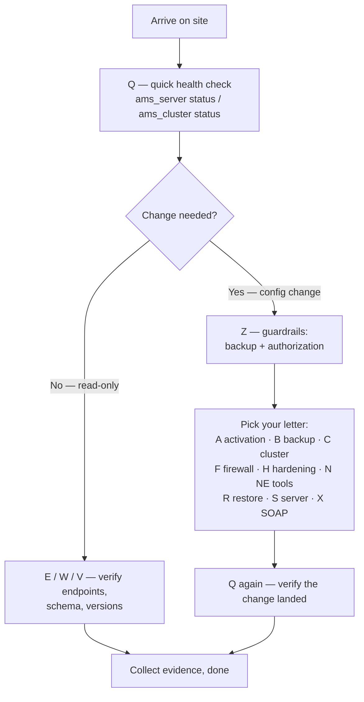

# Nokia 5520 AMS 9.8.3 — A–Z Master Reference (Field Teaching Guide)

**Overview:** The whole AMS server in one alphabetized cheat sheet — if you can find your task's letter, you can find the command.

## Overview: what it is, why it matters, when to use it

**What it is.** Nokia 5520 AMS 9.8.3 is the *Access Management System*: the server platform a carrier uses to manage its access network — the OLTs and ONTs (ISAM family) that deliver fiber/copper broadband to subscribers. This guide is the A–Z index of everything an operator does on that server: activating software, backing up data, running the server cluster, managing network elements (NEs), calling the SOAP northbound interface, hardening the OS, and the guardrails that keep you from wiping the database by accident.

**Why a field tech cares.** On a job site you will be asked things like "is the cluster healthy?", "take a backup before we patch", "add 200 ONTs", or "the NBI client can't connect". You do not have time to re-read a PDF. This reference answers "which command does that?" in seconds. Almost everything runs as the `amssys` user on the AMS Linux server over SSH; a few OS-level tasks need `root`/`sudo`.

**When to reach for it.** Use letter **Q** first on arrival (quick health check). Use **Z** before any change (backup guardrails). Then jump to the letter for your task: **B** for backups, **C** for the cluster, **N** for NE tools, **S** for server control, **X** for SOAP calls. The pattern is always: read-only check first, tested backup before changes, approved maintenance window for anything service-affecting.

Technical depth: this merges the root, Linux, and Windows flavors of `00-a-z-master-reference.md`. Script spelling follows the supplied 9.8.3 manuals, including underscores. `<value>` means a required, site-specific value you must replace; `[value]` is optional. The `amssys` `PATH` already includes most AMS script directories, so no path or `./` prefix is normally needed. Conventions: run AMS scripts as `amssys` unless the entry says `root`/`sudo`.

## Diagram: how a field job flows through the reference



## CLI workflows (primary teaching path)

### Install / setup

Before AMS is installed, the RHEL host needs the supported package set and services (see the OS hardening guide). The install entry point:

```bash
ams_install.sh --installActivate /staging/components
```

`--installActivate` both installs and activates a release in one pass; `--install` and `--activate` split the steps if you want to stage first and activate inside a window. Activate an already-installed release explicitly:

```bash
sudo /opt/ams/software/"<release>"/bin/ams_activate.sh
```

After any install/activate, prove the server is healthy (Q) and record the version (V) before handing the site back.

### Daily use: the quick-health evidence set

This is the read-only set you run on arrival, before maintenance, and after any change. It is the single most-used workflow in this whole reference:

```bash
ams_server status
ams_cluster status --detailed
ams_show_ne_balancing.sh --netypereleasecount
getLicenseCounter
innotop
```

What each tells you: `ams_server status` = are the AMS processes up; `ams_cluster status --detailed` = cluster role (active/standby), member health; `ams_show_ne_balancing.sh --netypereleasecount` = how NEs are distributed across application servers; `getLicenseCounter` = license consumption vs entitlement; `innotop` = live MySQL/InnoDB view (useful when the DB feels slow).

### Troubleshooting scenario: NBI client reports "cannot reach AMS"

A classic on-site call. Work it in layers, cheapest check first:

1. Is the server up? `ams_server status` — if not, start it (`ams_server start`).
2. Is TLS sane? `ams_check_ssl.sh` — certificate expiry/mismatch is the most common silent killer.
3. Is the Axis service answering? (E) `curl --cacert /path/ams-ca.pem https://<host>:8443/ams/services/UserManagementMgr` — a functional service returns its service message; a TLS error points at the keystore, a connection refusal points at the server or firewall.
4. Is it the firewall? `sudo ams_updatefirewall` review — was a rule change applied recently? See the network/firewall guide.
5. Still failing? Collect evidence for support: `ams_log_manager.sh --collect --category all --target all --destination file:///tmp/ams-logs.tar`.

### Automation snippet: pre-maintenance evidence bundle

Run the read-only set, stamp it, and save it — this is your "before" picture. Replace `<site-tag>` before running.

```bash
#!/usr/bin/env bash
# pre-maintenance evidence bundle (read-only; safe to run any time)
set -u
SITE="<site-tag>"                                  # <-- replace before running
OUT="/tmp/ams-evidence-${SITE}-$(date +%Y%m%d-%H%M%S).txt"
{
  echo "=== site: ${SITE}  host: $(hostname)  at: $(date -u) ==="
  echo "--- ams_server status ---";            ams_server status
  echo "--- ams_cluster status --detailed ---"; ams_cluster status --detailed
  echo "--- ams_server version ---";           ams_server version
  echo "--- NE balancing ---";                 ams_show_ne_balancing.sh --netypereleasecount
  echo "--- license counters ---";             getLicenseCounter
} > "${OUT}" 2>&1
echo "Evidence saved to ${OUT}"
```

## The A–Z reference (alphabetical)

### A — Activation and AES

**Plain English:** activate a release, or rotate the encryption keys that protect stored passwords.

```bash
sudo /opt/ams/software/"<release>"/bin/ams_activate.sh
sudo -iu amssys ams_server stop
sudo -iu amssys ams_recreate_aes_keys.sh
sudo -iu amssys ams_server start
```

Inspect or supply a key explicitly:

```bash
ams_recreate_aes_keys.sh -d "<existing-key>"
ams_recreate_aes_keys.sh -u "<replacement-key>"
```

**Impact: HIGH RISK** — the rotation script rewrites encrypted passwords in the database and AMS configuration files. Use an approved secret source for key material, never paste production keys into shell history.

### B — Backup

**Plain English:** create the rollback copies you need before any change.

```bash
ams_backup.sh /backup/ams-data.tar
ams_backup.sh -z /backup/ams-data.tar.gz
ams_backup.sh -c /backup/ams-data.tar
ams_backup.sh -f /backup/ams-data.tar
sudo ams_sw_backup.sh /backup/ams-software
```

Supported remote destination forms:

```text
ftp://<user>:<password>@<host>/<path>/<file>
sftp://<user>:<password>@<host>/<path>/<file>
sftp://<host>/<path>/<file>
```

Data backup (`ams_backup.sh`) and software backup (`sudo ams_sw_backup.sh`) are different artifacts — for a real rollback you usually want both.

### C — Cluster

**Plain English:** inspect and control the server team (active/standby).

```bash
ams_cluster status
ams_cluster status --detailed
ams_cluster status sw
ams_cluster start
ams_cluster stop
ams_cluster restart
ams_cluster switch active
ams_cluster switch standby
ams_cluster evacuate_ne "<cluster-IP>"
ams_cluster unevacuate_ne "<cluster-IP>" "<weight>"
ams_cluster deletehost "<old-cluster-IP>"
```

`switch active`/`switch standby` and `evacuate_ne` move management load — treat as service-affecting and window them.

### D — Database

**Plain English:** analyze fragmentation, or rotate the database credentials.

```bash
$AMSSCRIPTSDIR/ams_db_defragment.sh all analyse
$AMSSCRIPTSDIR/ams_db_defragment.sh -t "<table>" analyse
ams_server stop
$AMSSCRIPTSDIR/ams_db_defragment.sh all execute
ams_server start
ams_update_database_pwd.sh
```

`analyse` is read-only; `execute` defragments for real and **requires AMS stopped on the active data server** — schedule it.

### E — Endpoint verification

**Plain English:** check the NBI HTTPS services answer with a trusted certificate.

```bash
curl --cacert /path/ams-ca.pem https://"<host>":8443/ams/services/UserManagementMgr
curl --cacert /path/ams-ca.pem https://"<host>":8443/ams/services/ManagedElementMgr
curl --cacert /path/ams-ca.pem https://"<host>":8443/ams/schema/doc/html/index.html
```

Read-only. A functional Axis service returns its service message.

### F — Firewall and FTP

**Plain English:** apply the approved port rules; keep FTP locked down.

```bash
sudo ams_updatefirewall
sudo ams_updatefirewall "<option>"
sudo systemctl restart vsftpd
```

`/etc/vsftpd/vsftpd.conf`:

```conf
chroot_local_user=YES
allow_writeable_chroot=NO
```

**Impact: HIGH RISK** — a wrong firewall mapping can cut off users, NEs, or cluster traffic. Review mappings first and keep out-of-band access.

### G — Geographic redundancy

**Plain English:** configure the two sites, or switch which one is active.

```bash
ams_geo_configure.sh
ams_cluster start -force active
ams_cluster start -force standby
ams_cluster switch active
ams_cluster switch standby
ams_server resetgeo
```

`$AMSSOFTWAREHOME/conf/amsgeomonitor.conf`:

```ini
PINGPONGPROTECTIONTIMEOUT=<minutes>
```

Site switches are service-affecting by definition — maintenance window, both sites' operators on the bridge.

### H — Hardening

**Plain English:** apply the approved RHEL security settings.

```bash
sudo sysctl -p
sudo chmod 400 /etc/hosts.equiv
sudo systemctl enable --now chronyd crond sshd
```

Core `/etc/sysctl.conf` controls:

```ini
kernel.core_uses_pid = 1
kernel.sysrq = 0
net.ipv4.ip_forward = 0
net.ipv6.conf.all.forwarding = 0
net.ipv4.tcp_syncookies = 1
```

Review each value against site policy and the OS hardening guide before applying — some settings are network-impacting.

### I — Installation and import

**Plain English:** install components, or import a data export.

```bash
ams_install.sh
ams_install.sh --installActivate /staging/components
ams_install.sh --install /staging/components
ams_install.sh --activate /staging/components
ams_install.sh --deactivate
ams_import.sh -filename /path/export.tar -overwrite
```

`ams_import.sh -overwrite` replaces current data — treat like a restore (see Z).

### J — JMS

**Plain English:** configure expiry for the JMS notification messages that are part of the NBI.

```bash
JMSExpiryConfigurator.sh "<option>"
```

The script's own help/output on the installed release defines the accepted expiry option values; the source gives no fixed value list, so read `--help` on the server rather than guessing.

### K — Keystore

**Plain English:** enable TLS with the site's PKCS12 keystore.

```bash
ams_server stop
ams_enable_ssl.sh /secure/ams-keystore.p12 '<keystore-password>'
ams_server start
ams_check_ssl.sh
```

Use a site-owned PKCS12 keystore in production (not a self-signed placeholder). Requires a server restart — window it.

### L — Licenses, links, and logs

**Plain English:** manage entitlements, topology links, and diagnostic evidence.

```bash
ams_install_license
getLicenseCounter
ams_link_mgr [options] "<input_file>"
ams_hub_sub_link_mgr [options] "<input_file>"
ams_log_manager.sh --collect --category all --target all --destination file:///tmp/ams-logs.tar
ams_reset_logs.sh
```

`ams_reset_logs.sh` clears logs — only run it after you have collected what support needs.

### M — Migration and media gateways

**Plain English:** copy AMS persistency (data files) between releases or from backup; bulk-manage media gateways.

```bash
ams_copy_datafiles --force
ams_copy_datafiles --force --from-release "<previous-release>"
ams_copy_datafiles --force --from-backup /absolute/path/backup.tar
ams_mediagw_mgr [options] "<input_file>"
```

**Impact: DESTRUCTIVE** — the `--overwrite` variants delete current persistency before copying and are reserved for exceptional recovery. Validated rollback artifact first.

### N — NAT, NBI, and NE tools

**Plain English:** NAT bindings for clients/NEs, NBI encryption, and the bulk NE toolset.

`$AMSSOFTWAREHOME/conf/ams.conf`:

```ini
AMSCLIENTCONNECTIP=<translated-public-IP>
AMSCLIENTBINDIP=<client-interface-or-address-list>
AMSNEBINDIP=<NE-interface-or-address-list>
```

Commands:

```bash
ams_nbi_encryption_key
ams_ne_mgr [options] "<input_file>"
ams_ne_cli "<NE-list>" "<command-file>" "<output-file>" "<timeout>"
ams_nebackup.sh [options] "<backupfile>"
ams_nerestore.sh [options] "<backupfile>"
```

See the dedicated NE bulk operations and network/firewall guides for the full workflows.

### O — OS limits

**Plain English:** raise the process/file limits the `amssys` account is allowed.

```bash
ams_update_limit.conf.sh
```

Resulting `/etc/security/limits.conf` entries:

```conf
amssys soft nproc 650000
amssys hard nproc 650000
amssys soft nofile 650000
amssys hard nofile 650000
```

Takes effect on next login of the account; harmless to apply, but verify with `ulimit -a` as `amssys` afterward.

### P — PAP and passwords

**Plain English:** export the PAP-to-NE mapping, or create credentials.

```bash
ams_retrieve_pap_ne_from_db.sh -o /tmp/ne-pap.txt
createUsernamePassword
ams_createfirstuser.sh "<username>" '<global-address-filter>'
```

`createUsernamePassword` generates the encrypted credential file other bulk managers consume — run it interactively so the password never lands in history.

### Q — Query and quick health check

**Plain English:** the fast read-only status picture (see "Daily use" above).

```bash
ams_server status
ams_cluster status --detailed
ams_show_ne_balancing.sh --netypereleasecount
getLicenseCounter
innotop
```

Safe any time. This is your pre-maintenance evidence set.

### R — Restore and recovery

**Plain English:** restore backups, or recover admin access when locked out.

```bash
ams_restore.sh /backup/ams-data.tar
ams_restore.sh -n /backup/ams-data.tar
ams_nerestore.sh -b /backup/ne-backup.tar
ams_support.sh --domain security --command killadminsessions
ams_support.sh --domain security --command resetadminpwd
```

Destructive database reinitialization (last resort only):

```bash
ams_server stop
ams_remove_data.sh
ams_server start
```

**Impact: DESTRUCTIVE** — `ams_remove_data.sh` wipes the database. Never run without a validated rollback artifact and explicit maintenance authorization.

### S — Server, SFTP, SNMP, SSL, and support

**Plain English:** start/stop the server, manage its interfaces, and collect deep diagnostics.

```bash
ams_server start
ams_server stop
ams_server restart
ams_server status
ams_set_sftp_port.sh --check
ams_set_sftp_port.sh 2222
ams_set_snmp_trap_port
ams_check_ssl.sh
ams_support.sh --domain app --command jstack --target all --destination /tmp/jstack.tar
```

`ams_server stop`/`restart` are service-affecting; `jstack` collection is diagnostic (read-only-ish) and safe during incidents.

### T — Time, TLS, and tracing

**Plain English:** keep clocks aligned, manage TLS, and look at tracing.

```bash
systemctl enable --now chronyd
ams_server stop
ams_enable_ssl.sh
ams_server start
ams_tracing
```

`/etc/chrony.conf` client example:

```conf
server <site-ntp-host> iburst
driftfile /var/lib/chrony/drift
logdir /var/log/chrony
```

Clock skew breaks certificates and geo replication — time sync is not optional.

### U — Uninstall and users

**Plain English:** remove a release, or bulk-manage user accounts.

```bash
/opt/ams/software/"<release>"/bin/ams_uninstall -f
ams_user_mgr [options] "<input_file>"
```

**Impact: DESTRUCTIVE** — uninstall removes the release. Back up data and software first and triple-check the release path.

### V — Version verification

**Plain English:** prove what is installed, and compare it against the golden reference.

```bash
ams_server version
ams_server version save
ams_server version save --label GOLDEN983 /secure/GoldenEMSSwConfig
ams_server version verify /secure/GoldenEMSSwConfig
ams_cluster status sw
```

Read-only. Save the golden config once after a known-good install; `verify` catches drift.

### W — WSDL and web services

**Plain English:** read the live schema/WSDL so your SOAP calls match this exact server.

```bash
curl --cacert /path/ams-ca.pem https://"<host>":8443/ams/schema/doc/html/index.html
curl --cacert /path/ams-ca.pem https://"<host>":8443/ams/services/EquipmentProvisioningMgr
curl --cacert /path/ams-ca.pem https://"<host>":8443/ams/services/TopologicalLinkControlMgr
```

Read-only. Always generate/validate SOAP envelopes from *this* server's activated schema — never from a different release's docs.

### X — XML SOAP submission

**Plain English:** post a prepared SOAP envelope to an AMS web service.

```bash
curl --fail-with-body   --cacert /path/ams-ca.pem   --user '<nbi-user>:<password>'   --header 'Content-Type: text/xml; charset=utf-8'   --data-binary @request.xml   'https://"<host>":8443/ams/services/<ServiceName>'
```

Use an approved secret source instead of a literal production password (prompt, vault, or env var — never shell history). See the NBI SOAP guide for a full envelope example.

### Y — Yum and required packages

**Plain English:** install the RHEL prerequisites before AMS goes on.

```bash
yum install chrony
systemctl enable --now chronyd
```

Install the full package set specified for the exact supported OS release before AMS installation; the complete list lives in the Server Configuration Technical Guidelines, not in this reference — do not improvise the list.

### Z — Zero/destructive guardrails

**Plain English:** the mandatory pause before anything that erases or overwrites.

Before any destructive command:

```bash
ams_cluster status --detailed
ams_server version
ams_backup.sh -z /backup/prechange-ams.tar.gz
```

Do not run `ams_remove_data.sh`, `ams_copy_datafiles --overwrite`, uninstall, or restore without a validated rollback artifact and maintenance authorization. When in doubt, re-read Z.

## GUI section (secondary)

The source bundle is CLI-oriented: it documents no GUI screens or click-paths for any of these topics. What the GUI path looks like in practice: the AMS GUI client connects over the northbound/client network (the `AMSCLIENTBINDIP` side) and covers day-to-day element management views. Where it falls short versus CLI: every server-OS-level task in this reference — activation, firewall (`ams_updatefirewall`), kernel hardening, DB defragmentation, bulk file-driven provisioning, TLS keystore install, and all scripted evidence collection — has no GUI equivalent in the source material and must be done over SSH as `amssys`/`root`. If you prefer the GUI for element browsing, use it for visibility, but keep the CLI as the control path.

## Platform script blocks (alphabetical)

> Reality check: the AMS server software runs on RHEL. You do **not** install AMS on a phone, laptop, or WSL instance. On every platform below except "Linux bash" (which assumes you are SSH'd into the AMS server itself), the honest pattern is: your device is an **SSH terminal + file-transfer + HTTPS API client** that reaches the real AMS server. `<ams-host>` and any `<...>` placeholder must be replaced before running.

### Linux bash

Assumes you are signed in to the AMS server as `amssys`. Quick-health set plus evidence save:

```bash
#!/usr/bin/env bash
# Run ON the AMS server as amssys. Replace <site-tag> before running.
set -u
SITE="<site-tag>"
OUT="/tmp/ams-health-${SITE}-$(date +%Y%m%d-%H%M%S).txt"
{
  echo "=== ${SITE} $(hostname) $(date -u) ==="
  ams_server status
  ams_cluster status --detailed
  ams_show_ne_balancing.sh --netypereleasecount
  getLicenseCounter
  ams_server version
} > "${OUT}" 2>&1
echo "saved: ${OUT}"
```

### Nix-on-Droid

AMS does not install on Android. Install an SSH client and drive the server remotely:

```bash
# one-time setup in Nix-on-Droid
nix-env -iA nixpkgs.openssh
# then, per session:
ssh amssys@"<ams-host>"
# at the remote amssys prompt, run the Linux-bash block above
exit
```

Android gotchas: no systemd (nothing to `systemctl` on the phone — those commands run on the server after SSH); grant storage permission if you `scp` evidence files to the phone; run `termux-wake-lock` (same concept applies: keep the session alive) or Android may suspend the SSH session; background execution is limited, so run long jobs on the server inside `nohup`/`tmux` and disconnect.

### PowerShell

Win32 OpenSSH is built into Windows 10/11. Remote commands run on the AMS Linux host:

> **Status:** syntax-verified with PowerShell 7 on Arch (pwsh) — not executed against live systems.
```powershell
# interactive session
ssh amssys@<ams-host>
# paste the Linux-bash quick-health block at the remote prompt, then:
exit
# pull the evidence file back to Windows
scp amssys@<ams-host>:/tmp/ams-health-<site-tag>-*.txt $env:USERPROFILE\Downloads\
```

Logic mirrors the verified Linux bash block (same remote commands; only the transport differs). Mark: syntax not machine-checked here — logic reviewed against the bash version.

### Termux

AMS does not install on Android — phone as SSH terminal:

```bash
# one-time setup
pkg install -y openssh
# keep the session alive while you work
termux-wake-lock
ssh amssys@"<ams-host>"
# run the Linux-bash quick-health block at the remote prompt
exit
scp amssys@"<ams-host>":/tmp/ams-health-"<site-tag>"-*.txt ~/storage/downloads/
```

Android gotchas: run `termux-setup-storage` once before writing to shared storage; no systemd on-device; Android may kill backgrounded `ssh` — for long server-side jobs, start them under `nohup` on the server and log out.

### Windows cmd

cmd.exe with Win32 OpenSSH:

> **Status:** UNVERIFIED — no Windows cmd available for testing.
```cmd
ssh amssys@<ams-host> "ams_server status; ams_cluster status --detailed; getLicenseCounter"
scp amssys@<ams-host>:/tmp/ams-health-<site-tag>-*.txt %USERPROFILE%\Downloads\
```

Remote command is a single quoted string; the `;`-separated list runs at the remote bash prompt exactly like the Linux block. Mark: cmd syntax not machine-checked here — remote-side logic mirrors the verified bash block.

### WSL/Arch

Arch Linux under WSL — install OpenSSH from the Arch repos, then SSH to the server:

```bash
sudo pacman -S --needed openssh
ssh amssys@"<ams-host>"
# run the Linux-bash quick-health block at the remote prompt
exit
scp amssys@"<ams-host>":/tmp/ams-health-"<site-tag>"-*.txt ~/
```

## Impact warnings (from the source — read before you type)

- **HIGH RISK — AES rotation:** `ams_recreate_aes_keys.sh` rewrites encrypted passwords in the database and AMS config files. A bad rotation locks out services.
- **HIGH RISK — firewall:** `ams_updatefirewall` mistakes can cut off users, NEs, or cluster traffic. Review mappings first; keep out-of-band access.
- **HIGH RISK — site switch:** `ams_cluster switch active/standby` and geo operations are service-affecting by design.
- **DESTRUCTIVE — database wipe:** `ams_remove_data.sh` reinitializes the database. Validated rollback artifact + explicit authorization, or do not run.
- **DESTRUCTIVE — overwrite migration:** `ams_copy_datafiles --overwrite` deletes current persistency first; exceptional recovery only.
- **DESTRUCTIVE — uninstall:** `/opt/ams/software/<release>/bin/ams_uninstall -f` removes the release. Back up data + software first.
- **SERVICE-AFFECTING — server/cluster stop/restart:** `ams_server stop`, `ams_cluster stop`, DB `execute` defrag, TLS keystore install all need a maintenance window.
- **REDUCED VISIBILITY — stop supervision:** `ams_stop_supervision` blinds AMS to the selected NEs until re-enabled.

General rule from the source: replace every `<placeholder>`, confirm host/site/role/account, take a tested backup before changes, and validate commands in a lab and against the controlling Nokia documentation before production use.
