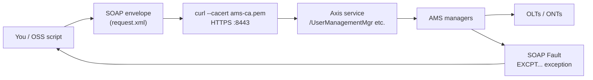

# Nokia 5520 AMS 9.8.3 — Northbound SOAP API (Field Teaching Guide)

**Overview:** SOAP is the machine-to-machine remote control for AMS — your OSS or script talks XML over HTTPS and AMS creates NEs, users, and links without anyone clicking anything.

## Overview: what it is, why it matters, when to use it

**What it is.** The Northbound Interface (NBI) is how *other systems* talk to AMS: provisioning/OSS platforms, inventory tools, or your own scripts. It speaks SOAP — XML request envelopes posted over HTTPS (port 8443) to Axis web services like `UserManagementMgr` and `ManagedElementMgr`. Each service owns a family of objects (users, NEs, links, supervision), and each operation (`addUser`, `createManagedElement`, …) is one verb you can call.

**Why a field tech cares.** Two reasons. First, integration failures land on you: "the OSS can't create ONTs anymore" usually means a TLS cert expired, the NBI user got locked, or someone posted a malformed envelope — and this guide gives you the exact `curl` to prove which layer is broken. Second, bulk work that is painful in any GUI (create 500 users, enable maintenance mode on a list of NEs) is a five-line script over SOAP.

**When to reach for it.** Verifying an endpoint after a TLS or firewall change; testing credentials for a new OSS integration; bulk user or NE operations from a script; reading machine-readable exceptions when something fails. Always build envelopes from the *activated server's* schema/WSDL (`https://<host>:8443/ams/schema/doc/html/index.html`) — namespaces and headers must match this exact release, never a different release's document.

Technical depth: SOAP here is document-style XML over mutual-TLS-capable HTTPS. The source lists endpoints, operation names, and exception codes, and gives the generic `curl` transport. It does **not** print full WSDL namespaces or per-operation XML schemas — those come from the live server's WSDL. The envelope below is therefore a faithful skeleton with the namespace marked as WSDL-derived; fill it from the schema doc before sending.

## Diagram: where SOAP sits in a field workflow



Request path left-to-right; errors come back as SOAP Faults carrying one of the `EXCPT...` codes in the exceptions table.

## CLI workflows (primary teaching path)

### Install / setup: verify endpoints and trust

Before any integration work, prove TLS and the Axis services answer. Read-only:

```bash
curl --cacert /path/ams-ca.pem https://<host>:8443/ams/services/UserManagementMgr
curl --cacert /path/ams-ca.pem https://<host>:8443/ams/services/ManagedElementMgr
curl --cacert /path/ams-ca.pem https://<host>:8443/ams/schema/doc/html/index.html
```

**Success looks like:** TLS handshake succeeds and the Axis service returns its service message (not a connection refusal, not a certificate error). If `curl` complains about the certificate, your CA bundle path is wrong or the server keystore changed — run `ams_check_ssl.sh` on the server. The third URL is the human-readable schema doc — open it to get exact namespaces for your envelopes.

### Endpoints (alphabetical by family)

| Family | Endpoint |
|---|---|
| NE create/modify/delete | `https://<host>:8443/ams/services/EquipmentProvisioningMgr` |
| NE retrieval | `https://<host>:8443/ams/services/ManagedElementMgr` |
| Supervision | `https://<host>:8443/ams/services/ManagedElementMgrExtns` |
| Topological links | `https://<host>:8443/ams/services/TopologicalLinkControlMgr` |
| Users | `https://<host>:8443/ams/services/UserManagementMgr` |

### User operations (alphabetical)

`addUser`, `deleteUser`, `expirePassword`, `listUser`, `modifyUser`, `resetPassword`, `resumeUser`, `suspendUser`

### NE operations (alphabetical)

`createManagedElement`, `createManagedObject`, `createTopologicalLink`, `deleteManagedElement`, `deleteManagedObject`, `deleteTopologicalLink`, `disableMaintenanceMode`, `enableMaintenanceMode`, `getAllManagedElements`, `getAllManagedElementsIterator`, `getManagedElement`, `getTopologicalLink`, `getTopologicalLinks`, `modifyManagedElement`, `modifyManagedObject`, `startSupervision`, `stopSupervision`

### Test operations (alphabetical)

`createMaintenanceAssociation`, `createMaintenanceDomain`, `createMaintenancePoint`, `createMaintenancePointList`, `deleteMaintenancePointList`, `executeAction`, `getStatus`, `getTP`

### Daily use: copy-pasteable SOAP envelope

This is a real, sendable skeleton for `listUser` on `UserManagementMgr`. Replace `<...>` placeholders before running. **Critical:** replace `xmlns:ns="..."` with the actual target namespace from the live WSDL at `https://<host>:8443/ams/schema/doc/html/index.html` — the source does not print namespaces, and a wrong namespace yields `EXCPTINVALIDINPUT` or a SOAP Fault.

```xml
<?xml version="1.0" encoding="UTF-8"?>
<soapenv:Envelope xmlns:soapenv="http://schemas.xmlsoap.org/soap/envelope/"
                  xmlns:ns="REPLACE-WITH-TARGET-NAMESPACE-FROM-LIVE-WSDL">
  <soapenv:Header/>
  <soapenv:Body>
    <ns:listUser/>
  </soapenv:Body>
</soapenv:Envelope>
```

Post it with the generic transport wrapper (replace `<nbi-user>`, secret, `<host>`):

```bash
curl --fail-with-body \
  --cacert /path/ams-ca.pem \
  --user '<nbi-user>:<password>' \
  --header 'Content-Type: text/xml; charset=utf-8' \
  --data-binary @request.xml \
  'https://<host>:8443/ams/services/UserManagementMgr'
```

Do not place production secrets in shell history — prefer prompting. A safer pattern that keeps the password out of `ps` and history:

```bash
#!/usr/bin/env bash
# soap-post.sh — post a SOAP envelope without leaking the password. Replace <...> before running.
set -u
HOST="<ams-host>"
SERVICE="UserManagementMgr"   # one of the five endpoints above
ENVELOPE="request.xml"
CABUNDLE="/path/ams-ca.pem"
read -rsp "NBI user: " NBI_USER; echo
read -rsp "NBI password: " NBI_PASS; echo
curl --fail-with-body \
  --cacert "${CABUNDLE}" \
  --user "${NBI_USER}:${NBI_PASS}" \
  --header 'Content-Type: text/xml; charset=utf-8' \
  --data-binary "@${ENVELOPE}" \
  "https://${HOST}:8443/ams/services/${SERVICE}"
```

### Troubleshooting scenario: OSS gets EXCPTACCESSDENIED on every call

1. **Is it the credential?** Re-run the `listUser` envelope above with the same NBI user. If it still fails, the user is wrong, locked, or lacks NBI privilege — on the server, `ams_support.sh --domain security --command killadminsessions` clears stale admin sessions, and user management is via `ams_user_mgr` / the `UserManagementMgr` ops (`resumeUser`, `resetPassword`).
2. **Is it TLS?** Re-run the endpoint-verification `curl` without `--user`. TLS errors here mean certificate/keystore, not authorization.
3. **Is it the envelope?** `EXCPTINVALIDINPUT` (not access-denied) points at malformed XML or a wrong namespace — re-derive the envelope from the live WSDL; confirm `Content-Type: text/xml; charset=utf-8` exactly.
4. **Is the server throttling you?** `EXCPTCAPACITYEXCEEDED` means too many concurrent operations — back off and serialize calls.
5. Collect server-side evidence: `ams_log_manager.sh --collect --category all --target all --destination file:///tmp/ams-logs.tar`.

### Exceptions (alphabetical)

| Exception | Meaning | First question to ask |
|---|---|---|
| `EXCPTACCESSDENIED` | Authorization denied | Is the NBI user valid, unlocked, privileged? |
| `EXCPTCAPACITYEXCEEDED` | Concurrent-operation capacity reached | Am I flooding the server? Serialize. |
| `EXCPTCOMMFAILURE` | Communication failure | Is AMS up? Network path OK? |
| `EXCPTENTITYNOTFOUND` | Object absent | Did the NE/user/link get deleted or renamed? |
| `EXCPTINTERNALERROR` | Internal error | Server-side — collect logs, check `ams_server status`. |
| `EXCPTINVALIDINPUT` | Invalid/unsupported/out-of-range input | Envelope vs live WSDL — namespace, fields, ranges. |
| `EXCPTNOTIMPLEMENTED` | Operation not implemented | Not available in 9.8.3 — check release scope. |
| `EXCPTUNABLETOCOMPLY` | Valid request cannot be completed | State conflict — e.g. target busy or mid-transition. |

### Automation snippet: endpoint health sweep

Read-only sweep across all five services; fails loudly on the first broken one. Replace `<ams-host>` and the CA path.

```bash
#!/usr/bin/env bash
# nbi-health.sh — read-only NBI endpoint sweep. Replace <...> before running.
set -u
HOST="<ams-host>"
CABUNDLE="/path/ams-ca.pem"
SERVICES="EquipmentProvisioningMgr ManagedElementMgr ManagedElementMgrExtns TopologicalLinkControlMgr UserManagementMgr"
rc=0
for svc in ${SERVICES}; do
  if curl --silent --show-error --fail --cacert "${CABUNDLE}" \
       "https://${HOST}:8443/ams/services/${svc}" -o /dev/null; then
    echo "OK   ${svc}"
  else
    echo "FAIL ${svc}"
    rc=1
  fi
done
# also verify the schema doc is served
curl --silent --show-error --fail --cacert "${CABUNDLE}" \
  "https://${HOST}:8443/ams/schema/doc/html/index.html" -o /dev/null \
  && echo "OK   schema-doc" || { echo "FAIL schema-doc"; rc=1; }
exit "${rc}"
```

## GUI section (secondary)

There is no GUI equivalent for the NBI — it is programmatic by definition. The only GUI-adjacent step: paste `https://<host>:8443/ams/schema/doc/html/index.html` into a browser to read the human-friendly schema/WSDL documentation while you build envelopes. Everything else — endpoint verification, envelope submission, exception triage — is CLI/`curl`. Where the GUI falls short: it cannot script, cannot bulk-operate, and cannot reproduce an exact failing request the way a saved `request.xml` plus `curl` one-liner can.

## Platform script blocks (alphabetical)

> Reality check: AMS runs on RHEL; you never install it on a phone or laptop. For NBI work the phone/laptop is an **HTTPS API client** — it can `curl`/POST directly to `https://<host>:8443` over the client network without any SSH at all (TLS + NBI credentials are the auth). `<ams-host>`, CA path, and credentials are placeholders — replace before running.

### Linux bash

Verify + post, straight from any Linux box with `curl` (workstation or the AMS server itself):

```bash
#!/usr/bin/env bash
# Replace <...> before running.
set -u
HOST="<ams-host>"
CABUNDLE="/path/ams-ca.pem"
SERVICE="UserManagementMgr"
# 1. endpoint check (read-only)
curl --fail --cacert "${CABUNDLE}" "https://${HOST}:8443/ams/services/${SERVICE}" -o /dev/null \
  && echo "endpoint OK"
# 2. post envelope, password prompted (never in history)
read -rsp "NBI user: " NBI_USER; echo
read -rsp "NBI password: " NBI_PASS; echo
curl --fail-with-body \
  --cacert "${CABUNDLE}" \
  --user "${NBI_USER}:${NBI_PASS}" \
  --header 'Content-Type: text/xml; charset=utf-8' \
  --data-binary @request.xml \
  "https://${HOST}:8443/ams/services/${SERVICE}"
```

### Nix-on-Droid

Install `curl`, then POST directly to the AMS NBI — no SSH needed:

```bash
nix-env -iA nixpkgs.curl
curl --fail --cacert /path/ams-ca.pem "https://<ams-host>:8443/ams/services/UserManagementMgr" -o /dev/null && echo "endpoint OK"
```

Copy `request.xml` and the CA bundle to the phone first (`scp` them over, or via shared storage). Android gotchas: no systemd (irrelevant here — nothing server-side runs on the phone); grant storage permission before reading files from shared storage; use `termux-wake-lock` so Android doesn't suspend a long bulk-post loop; background execution limits mean long sweeps should run with the screen on or be chunked.

### PowerShell

Native Windows HTTPS via `Invoke-WebRequest` (pattern from the Windows flavor of the source):

> **Status:** syntax-verified with PowerShell 7 on Arch (pwsh) — not executed against live systems.
```powershell
# 1. endpoint check (read-only)
curl.exe --cacert C:\path\ams-ca.pem https://<ams-host>:8443/ams/services/UserManagementMgr
# 2. post envelope with prompted credentials
$Credential = Get-Credential
$pair = '{0}:{1}' -f $Credential.UserName, $Credential.GetNetworkCredential().Password
$basic = [Convert]::ToBase64String([Text.Encoding]::ASCII.GetBytes($pair))
Invoke-WebRequest -Uri 'https://<ams-host>:8443/ams/services/UserManagementMgr' `
  -Method Post `
  -Headers @{Authorization = "Basic $basic"} `
  -ContentType 'text/xml; charset=utf-8' `
  -InFile .\request.xml
```

Logic mirrors the verified bash block (same endpoint, same headers, same Basic auth); only the HTTP client differs. Mark: PowerShell syntax not machine-checked here — logic reviewed against the bash version.

### Termux

```bash
pkg install -y curl
termux-wake-lock
# endpoint check
curl --fail --cacert /path/ams-ca.pem "https://<ams-host>:8443/ams/services/UserManagementMgr" -o /dev/null && echo "endpoint OK"
# post envelope (password via env var for this session only, never committed to a file)
read -rsp "NBI user: " NBI_USER; echo
read -rsp "NBI password: " NBI_PASS; echo
curl --fail-with-body --cacert /path/ams-ca.pem \
  --user "${NBI_USER}:${NBI_PASS}" \
  --header 'Content-Type: text/xml; charset=utf-8' \
  --data-binary @request.xml \
  "https://<ams-host>:8443/ams/services/UserManagementMgr"
```

Android gotchas: `pkg install` needs network + storage permission for the CA/envelope files (`termux-setup-storage` once); no systemd; keep the session in the foreground for long loops or Android may suspend it.

### Windows cmd

cmd.exe with Win32 OpenSSH's `curl.exe` — direct HTTPS, no SSH needed:

> **Status:** UNVERIFIED — no Windows cmd available for testing.
```cmd
curl.exe --fail --cacert C:\path\ams-ca.pem https://<ams-host>:8443/ams/services/UserManagementMgr
curl.exe --fail-with-body --cacert C:\path\ams-ca.pem --user "<nbi-user>:<password>" --header "Content-Type: text/xml; charset=utf-8" --data-binary @request.xml https://<ams-host>:8443/ams/services/UserManagementMgr
```

Replace `<nbi-user>:<password>` (prefer typing it interactively — cmd history keeps it otherwise). Mark: cmd syntax not machine-checked here — mirrors the verified curl logic from the bash block.

### WSL/Arch

```bash
sudo pacman -S --needed curl
# endpoint check
curl --fail --cacert /path/ams-ca.pem "https://<ams-host>:8443/ams/services/UserManagementMgr" -o /dev/null && echo "endpoint OK"
# post with prompted credentials
read -rsp "NBI user: " NBI_USER; echo
read -rsp "NBI password: " NBI_PASS; echo
curl --fail-with-body --cacert /path/ams-ca.pem \
  --user "${NBI_USER}:${NBI_PASS}" \
  --header 'Content-Type: text/xml; charset=utf-8' \
  --data-binary @request.xml \
  "https://<ams-host>:8443/ams/services/UserManagementMgr"
```

## Impact warnings (from the source — read before you type)

- **Varies by call — treat every write op as a change:** `addUser`, `deleteUser`, `createManagedElement`, `deleteManagedElement`, `createTopologicalLink`, `startSupervision`/`stopSupervision` change users, NEs, links, or supervision state. There is no "undo" envelope — pair every bulk write with a prior export (`getAllManagedElements`, `listUser`) as your rollback evidence.
- **Credentials:** NBI passwords in shell history, scripts, or `ps` output are a standing leak. Prompt (`read -rsp`, `Get-Credential`) or use an approved secret source.
- **Envelopes must match the live WSDL:** a namespace or header from another release produces `EXCPTINVALIDINPUT` at best and a mis-targeted operation at worst. Re-derive from `https://<host>:8443/ams/schema/doc/html/index.html` on the server you are actually touching.
- **`EXCPTCAPACITYEXCEEDED` is the server telling you to slow down** — do not retry in a tight loop; serialize and back off.
