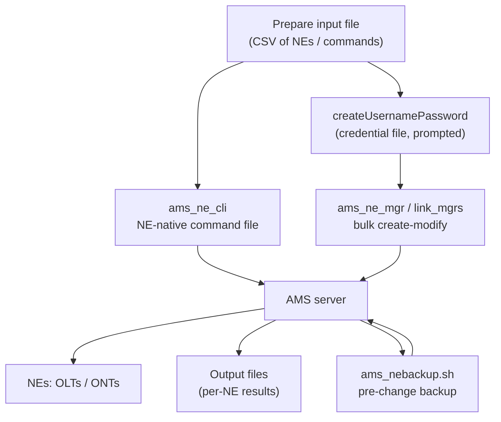

# Nokia 5520 AMS 9.8.3 — NE Bulk Operations (Field Teaching Guide)

**Overview:** Doing the same thing to hundreds of network elements at once — create them, talk to them, back them up — from files instead of one-by-one clicking.

## Overview: what it is, why it matters, when to use it

**What it is.** An NE (network element) is one managed box in the access network — an OLT, an ONT, an ISAM shelf. A carrier has thousands. "Bulk operations" is AMS's file-driven machinery for acting on many NEs at once: `ams_ne_mgr` creates/modifies NE records from an input file, `ams_ne_cli` pushes NE-native CLI commands to a list of NEs and collects the output, `ams_nebackup.sh`/`ams_nerestore.sh` save and restore AMS-held NE backup data, and the `*_link_mgr`/`ams_mediagw_mgr`/`ams_splitter_mgr` tools bulk-manage topology objects (links, media gateways, splitters). Lookup tools (`ams_retrieve_ip_by_nename.sh`, `ams_show_ne_balancing.sh`, `retrieve_nes.sh`) tell you where NEs live and how load is spread.

**Why a field tech cares.** "Provision 300 new ONTs by Friday" and "run this diagnostic on every OLT in the region" are bulk jobs. Doing them one at a time is how mistakes happen; files are reviewable, repeatable, and auditable. The gotcha the source stresses: an **IP-address change cannot be combined with other attribute changes in one `ams_ne_mgr` request** — split it into two passes or it fails.

**When to reach for it.** New-site turn-up (bulk create), mass config pushes (NE CLI transport), pre-maintenance NE backups, fault isolation (run the same show command everywhere and diff the outputs), and topology imports (links, splitters, gateways).

Technical depth: these tools run on the AMS server as `amssys`. Credential files for the managers are generated with `createUsernamePassword` (run it interactively — passwords in process listings/history are a finding). Managers require NBI edit privileges and accept properties/encrypted-credential/keystore/NBI-host/action options — see each tool's `--help` on the installed release, which is authoritative for your exact input-file format.

## Diagram: the bulk workflow



Golden rule: **back up first** (`ams_nebackup.sh`), change second, verify third (`retrieve_nes.sh`, `ams_show_ne_balancing.sh`).

## CLI workflows (primary teaching path)

### Install / setup: credential file + first bulk create

The managers need an encrypted credential file. Generate it once (interactive — the password is prompted, never typed on the command line):

```bash
createUsernamePassword
```

Then bulk-create or modify NEs from a prepared input file. Validate the file first (columns, NE names, addresses), and remember: **IP-address modification cannot share a request with other attribute changes** — do the IP pass separately.

```bash
ams_ne_mgr [options] "<input_file>"
```

`[options]` covers properties file, encrypted credential, keystore, NBI host, and the action — run `ams_ne_mgr --help` (or with no args) on the server for the exact flags on your release.

### Daily use: lookup, placement, and exports

Find an NE's address, export the PAP mapping, and see how NEs balance across application servers:

```bash
ams_retrieve_ip_by_nename.sh "<NEname>"
ams_retrieve_pap_ne_from_db.sh -o /tmp/ne-pap.txt
ams_show_g6_linked_ne.sh --all
ams_show_g6_linked_ne.sh "<G6-1>","<G6-2>"
ams_show_ne_balancing.sh --help
ams_show_ne_balancing.sh -a "<application-server-IP>"
ams_show_ne_balancing.sh -n "<NE-name>"
ams_show_ne_balancing.sh -i "<NE-IP>"
ams_show_ne_balancing.sh --netypereleasecount
```

Export every supervised NE (IPv4 and IPv6) to CSV — your inventory baseline:

```bash
retrieve_nes.sh -f /tmp/nes.csv -u "<username>" -p
```

Prefer the prompting form (`-p` with no password on the line) so the password never appears in process listings. Agent inventory, same rule:

```bash
getAgentlist.sh -u "<username>" -p
```

### NE CLI transport: run one command file on many NEs

The command file holds **NE-native CLI** (the OLT/ONT's own command language, not AMS commands) — validate every line against that NE family/release's command reference, because these commands can be service-affecting:

```bash
ams_ne_cli "<NE-list-or-address>" "<input-command-file>" "<output-file>" "<timeout>"
ams_ne_cli -protocol
ams_ne_cli -buffer
```

`-protocol` / `-buffer` tune the transport; check `--help` for your release's accepted values.

### NE backup / restore

```bash
ams_nebackup.sh [options] "<backupfile>"
ams_nerestore.sh [options] "<backupfile>"
ams_nerestore.sh -b "<backupfile>"
```

`-b` restores only the NE-backup database. Restore changes data — window it, and only restore a backup you have verified exists and is complete.

### Topology managers (alphabetical)

```bash
ams_hub_sub_link_mgr [options] "<input_file>"
ams_link_mgr [options] "<input_file>"
ams_mediagw_mgr [options] "<input_file>"
ams_splitter_mgr [options] [input_file]
```

Default splitter input when no file is given:

```text
$AMSLOCALDATAHOME/ossconf/amssplittermgr.csv
```

All require NBI edit privileges. Validate input files; a bad topology import is a provisioning change that is painful to unwind.

### Supervision

```bash
ams_stop_supervision
```

Stopping supervision reduces management visibility — confirm the exact targets and the maintenance window first, and plan when supervision resumes.

### Troubleshooting scenario: mass config push went wrong on some NEs

1. **Scope it:** `ams_show_ne_balancing.sh -n <NE-name>` per affected NE — are they all on one application server (points at AMS side) or scattered (points at the NE command or NE state)?
2. **Read the output file:** `ams_ne_cli` writes per-NE results to `<output-file>` — diff a good NE's output against a bad one before re-running anything.
3. **Re-run narrowly:** build a new NE list with only the failed NEs and re-run `ams_ne_cli` with a longer `<timeout>`; transient timeouts are the most common partial-failure cause.
4. **Roll back if needed:** `ams_nerestore.sh` from the pre-change backup you took (you did take one — see the automation snippet).
5. **Evidence:** `ams_log_manager.sh --collect --category all --target all --destination file:///tmp/ams-logs.tar`.

### Automation snippet: backup → push → verify, one script

Replace `<...>` placeholders before running. This is the safe shape for every bulk change:

```bash
#!/usr/bin/env bash
# bulk-ne-change.sh — backup, push NE CLI file, verify. Replace <...> before running.
set -u
NE_LIST="<ne-list-file>"        # file with target NE names/addresses, one per line
CMD_FILE="<command-file>"      # NE-native CLI commands, validated against NE reference
BACKUP="/backup/ne-prechange-$(date +%Y%m%d-%H%M%S).tar"
OUT="/tmp/ne_cli_out_$(date +%Y%m%d-%H%M%S).txt"
TIMEOUT=120

echo "== 1/3 backup =="
ams_nebackup.sh "${BACKUP}" || { echo "BACKUP FAILED — aborting"; exit 1; }

echo "== 2/3 push =="
ams_ne_cli "${NE_LIST}" "${CMD_FILE}" "${OUT}" "${TIMEOUT}"
echo "per-NE output in ${OUT}"

echo "== 3/3 verify =="
retrieve_nes.sh -f /tmp/nes-after.csv -u "<username>" -p
ams_show_ne_balancing.sh --netypereleasecount
echo "done — diff /tmp/nes-after.csv against your pre-change export"
```

The `|| exit 1` after the backup is deliberate: if the safety net fails, the change must not run.

## GUI section (secondary)

The source bundle documents these operations as CLI/file-driven tools only — it describes no GUI bulk-import screens or click-paths. In practice an AMS GUI client is for browsing individual elements, not for thousand-row operations. Where the GUI falls short versus CLI: no reviewable input file, no per-NE output file to diff, no scriptable backup-before-change, and no repeatability for the next site. For bulk work the CLI path is the only one the source supports; use the GUI, if at all, to spot-check a handful of NEs after the bulk run.

## Platform script blocks (alphabetical)

> Reality check: AMS runs on RHEL — the bulk tools execute **on the AMS server only**. On every other platform your device is an **SSH terminal + file-transfer client**: you `scp` input files up, run the tools over `ssh`, and `scp` outputs back. Nothing here installs on a phone or laptop. Replace `<...>` placeholders before running.

### Linux bash

Runs on the AMS server as `amssys`. Full loop: export inventory, back up, and stage a CLI push:

```bash
#!/usr/bin/env bash
# Run ON the AMS server as amssys. Replace <...> before running.
set -u
retrieve_nes.sh -f /tmp/nes-before.csv -u "<username>" -p
ams_nebackup.sh /backup/ne-prechange-$(date +%Y%m%d-%H%M%S).tar
# after reviewing CMD_FILE against the NE command reference:
# ams_ne_cli <ne-list-file> <command-file> /tmp/ne_cli_out.txt 120
ams_show_ne_balancing.sh --netypereleasecount
```

### Nix-on-Droid

Phone as SSH terminal + file transfer. Install the client, push your input files, run remotely, pull results:

```bash
nix-env -iA nixpkgs.openssh
# stage files on the server
scp ./ne-list.txt ./commands.txt amssys@"<ams-host>":/tmp/
# run the bulk tools at the remote prompt
ssh amssys@"<ams-host>"
# amssys@ams> ams_nebackup.sh /backup/ne-prechange.tar
# amssys@ams> ams_ne_cli /tmp/ne-list.txt /tmp/commands.txt /tmp/ne_cli_out.txt 120
# amssys@ams> exit
# pull results back
scp amssys@"<ams-host>":/tmp/ne_cli_out.txt ./ne_cli_out.txt
scp amssys@"<ams-host>":/tmp/nes.csv ./nes.csv
```

Android gotchas: no systemd on-device (all server commands run after `ssh`); grant storage permission before `scp` writes to shared storage; `termux-wake-lock` keeps long transfers alive; background execution limits — for multi-hour pushes, launch under `nohup` on the server and disconnect.

### PowerShell

Win32 OpenSSH: copy files up, run remotely, copy results back (the `scp`-back pattern comes from the Windows flavor of the source):

> **Status:** syntax-verified with PowerShell 7 on Arch (pwsh) — not executed against live systems.
```powershell
scp .\ne-list.txt .\commands.txt amssys@<ams-host>:/tmp/
ssh amssys@<ams-host>
# at the remote prompt:
# ams_nebackup.sh /backup/ne-prechange.tar
# ams_ne_cli /tmp/ne-list.txt /tmp/commands.txt /tmp/ne_cli_out.txt 120
# retrieve_nes.sh -f /tmp/nes.csv -u <username> -p
# exit
scp amssys@<ams-host>:/tmp/ne_cli_out.txt .\ne_cli_out.txt
scp amssys@<ams-host>:/tmp/nes.csv .\nes.csv
```

Logic mirrors the verified Linux bash block; only the file-transfer leg is local. Mark: PowerShell syntax not machine-checked here — remote-side logic reviewed against the bash version.

### Termux

```bash
pkg install -y openssh
termux-wake-lock
termux-setup-storage   # once, for shared-storage access
scp ./ne-list.txt ./commands.txt amssys@"<ams-host>":/tmp/
ssh amssys@"<ams-host>"
# run the bulk tools at the remote amssys prompt (see Linux bash block), then exit
scp amssys@"<ams-host>":/tmp/ne_cli_out.txt ~/storage/downloads/ne_cli_out.txt
```

Android gotchas: `pkg install` needs network; no systemd; Android may suspend backgrounded `ssh` — start long server-side jobs under `nohup` and log out rather than holding the session open.

### Windows cmd

> **Status:** UNVERIFIED — no Windows cmd available for testing.
```cmd
scp .\ne-list.txt .\commands.txt amssys@<ams-host>:/tmp/
ssh amssys@<ams-host> "ams_nebackup.sh /backup/ne-prechange.tar && ams_ne_cli /tmp/ne-list.txt /tmp/commands.txt /tmp/ne_cli_out.txt 120"
scp amssys@<ams-host>:/tmp/ne_cli_out.txt %USERPROFILE%\Downloads\ne_cli_out.txt
```

The remote side is one quoted `&&` chain: the push only runs if the backup succeeded. Mark: cmd syntax not machine-checked here — remote-side logic mirrors the verified bash automation snippet.

### WSL/Arch

```bash
sudo pacman -S --needed openssh
scp ./ne-list.txt ./commands.txt amssys@"<ams-host>":/tmp/
ssh amssys@"<ams-host>"
# run the Linux-bash block at the remote prompt, then exit
scp amssys@"<ams-host>":/tmp/ne_cli_out.txt ~/
scp amssys@"<ams-host>":/tmp/nes.csv ~/
```

## Impact warnings (from the source — read before you type)

- **Provisioning change:** `ams_ne_mgr`, the `*_link_mgr` tools, `ams_mediagw_mgr`, `ams_splitter_mgr` rewrite managed data from your input file. A bad file is a mass mis-provision — validate columns, names, and addresses before running.
- **Potentially service-affecting:** `ams_ne_cli` executes NE-native commands verbatim on every target. Validate each line against the specific NE family/release command reference and review the target list twice.
- **IP-change rule:** IP-address modification cannot be combined with other attribute changes in one `ams_ne_mgr` request — split into separate passes.
- **Restore changes data:** `ams_nerestore.sh` overwrites from backup; use `-b` only when you mean "NE-backup database only".
- **Reduced visibility:** `ams_stop_supervision` blinds AMS to the selected NEs — confirm targets and window.
- **Credential hygiene:** generate credential files with `createUsernamePassword` interactively; never put passwords on command lines, in scripts, or in process listings.
