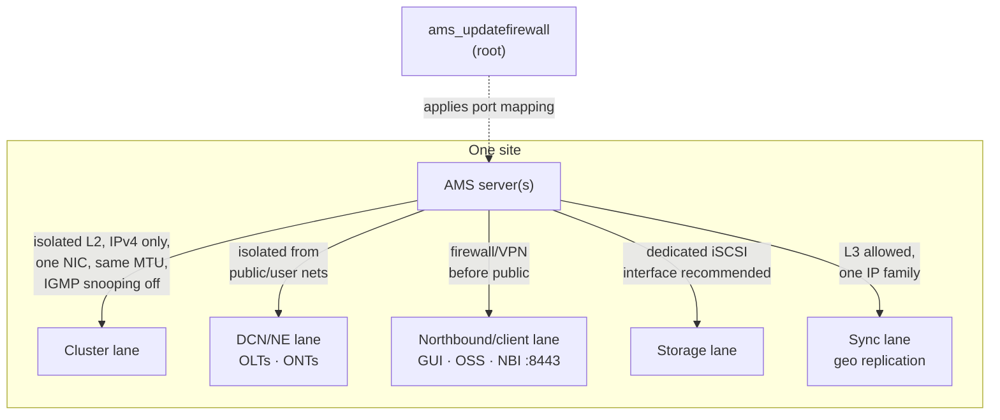

# Nokia 5520 AMS 9.8.3 — Network, Firewall, and NAT (Field Teaching Guide)

**Overview:** The plumbing diagram and the locked doors — which network each kind of AMS traffic must use, how the firewall rules get applied, and how AMS behaves behind NAT.

## Overview: what it is, why it matters, when to use it

**What it is.** An AMS server has up to five network "lanes", each with a job: the **cluster** lane (server-to-server heartbeat inside one site), the **DCN/NE** lane (AMS talking to the OLTs/ONTs it manages), the **northbound/client** lane (your GUI and the OSS/NBI clients), **storage** (iSCSI), and **synchronization** (geo replication between sites). This guide covers the rules for each lane, the firewall tool (`ams_updatefirewall`) that opens exactly the ports AMS needs, NAT behavior for clients behind address translation, and the SFTP/SNMP/FTP knobs.

**Why a field tech cares.** Most "AMS is unreachable" tickets are network tickets: someone plugged a second NIC into the cluster subnet (forbidden), the firewall INPUT policy is wrong, an SFTP port change wasn't followed by a firewall refresh, or the client is behind NAT and AMS doesn't know its translated address. The firewall section is the highest-risk part of this guide — a wrong rule can isolate the server from its NEs, its users, or its cluster mate.

**When to reach for it.** Pre-install network validation (policies must be ACCEPT before install), applying firewall changes, moving a server to a new IP/subnet, changing the SFTP or SNMP trap port, troubleshooting "can't reach" in any direction, and any NAT/client-connectivity design review.

Technical depth: AMS binds services to specific interfaces via `AMS*BINDIP` keys in `$AMSSOFTWAREHOME/conf/ams.conf`; clients behind NAT are told to AMS via `AMSCLIENTCONNECTIP`. **Port translation is unsupported in documented designs** — NAT may translate addresses, but ports must be forwarded unchanged. The cluster network is IPv4-only, isolated Layer 2, one NIC per server, no virtual interfaces for cluster connectivity.

## Diagram: the five lanes and the firewall gate



## CLI workflows (primary teaching path)

### Install / setup: pre-install network validation

Before AMS is installed, firewall default policies must be:

- `INPUT` → `ACCEPT`
- `OUTPUT` → `ACCEPT`
- `FORWARD` → may be `DROP`

Verify as root (read-only check):

```bash
sudo iptables -L -n | head -20
```

Then apply the AMS-approved port mapping (review what it will do first — this is the high-risk step):

```bash
sudo ams_updatefirewall
sudo ams_updatefirewall "<option>"
```

Use `root` to apply, and review the mappings before committing. Keep out-of-band (console/ILO) access open while you do this — if the rule set is wrong, SSH is how you get back in.

### Daily use: interface bindings and NAT

`ams.conf` bind categories — which local interfaces each traffic family uses:

```ini
AMSCLIENTBINDIP=<client-facing-list>
AMSCLUSTERBINDIP=<cluster-interface-or-address>
AMSGEOLOCALBINDIP=<geo-sync-interface-or-address>
AMSNEBINDIP=<NE-facing-list>
```

If clients reach AMS through NAT, tell AMS the translated public address (address translation is fine; **port translation is not supported** — forward required ports unchanged):

```ini
AMSCLIENTCONNECTIP=<translated-public-IP>
```

```bash
ams_server restart
```

A restart is required after the change — window it.

### Network reconfiguration: change server IP or subnet

**Impact: HIGH and SERVICE-AFFECTING.** Have console access, approved addresses/routes/DNS, and a rollback plan before starting:

```bash
ams_cluster stop
sudo ams_change_ip_subnet_server
ams_server start
ams_cluster deletehost "<old-cluster-IP>"
```

The last step removes the stale host record so the cluster stops expecting the old address. Geo sites use `ams_geo_configure.sh` for their side.

### SFTP port change

```bash
ams_set_sftp_port.sh --check
ams_set_sftp_port.sh 2222
ams_server restart
sudo ams_updatefirewall
```

Valid range 1–65535. Note the order: check, set, restart, **then refresh the firewall** — skipping the last step is the classic way to lock yourself out of SFTP.

### SNMP trap port

```bash
sudo ams_set_snmp_trap_port
```

Coordinate with the NE side (trap destinations configured on the NEs) and the firewall rules — a trap port nobody can reach is silent monitoring.

### FTP chroot lockdown

`/etc/vsftpd/vsftpd.conf`:

```conf
chroot_local_user=YES
allow_writeable_chroot=NO
```

Restart vsftpd after modification:

```bash
sudo systemctl restart vsftpd
```

FTP is only needed for specified NE families/features — if your site doesn't need it, it stays off (see the OS hardening guide's "required services").

### Troubleshooting scenario: NEs stop reporting after a firewall change

1. **What changed?** `sudo ams_updatefirewall <option>` with a review option first — compare the applied mapping against the pre-change state.
2. **Is it the NE lane?** From the AMS server, check basic IP reachability to a sample NE on the DCN/NE interface, and confirm `AMSNEBINDIP` in `ams.conf` still points at the right interface.
3. **Is it the cluster lane?** `ams_cluster status --detailed` — if the mate is unreachable, suspect the isolated-L2 rules (second NIC on the cluster subnet, MTU mismatch, IGMP snooping re-enabled by a switch change).
4. **Is it NAT?** If clients are affected but NEs are fine, check `AMSCLIENTCONNECTIP` — a changed public IP without updating this key breaks client callbacks.
5. **Roll back the firewall** to the last known-good mapping via `sudo ams_updatefirewall`, then re-apply deliberately.

### Automation snippet: safe firewall refresh with pre-checks

Replace `<...>` before running. Read-only checks first; the apply step is intentionally separate so a human confirms it.

```bash
#!/usr/bin/env bash
# fw-refresh.sh — verify preconditions, then refresh AMS firewall. Replace <...> before running.
set -u
echo "== pre-checks (read-only) =="
sudo iptables -L INPUT -n --line-numbers | head -30
echo "--- ams.conf bindings ---"
grep -E '^AMS(CLIENT|CLUSTER|GEOLOCAL|NE)(CONNECT|BIND)IP=' "$AMSSOFTWAREHOME/conf/ams.conf"
echo "--- cluster health ---"
ams_cluster status --detailed | head -20
echo
echo "Pre-checks done. If all looks correct, run as root: ams_updatefirewall"
echo "Keep out-of-band console access open during the apply."
```

## GUI section (secondary)

The source bundle documents no GUI screens for firewall, NAT, or network reconfiguration — these are server-side, root-level operations by design. A GUI client (on the northbound/client lane) can show you element status, but it cannot apply firewall mappings, rebind interfaces, or change the server IP. Where the GUI falls short: it has no view into `ams_updatefirewall` mappings and no safe path for network-identity changes. For this topic the CLI over SSH (plus console access for the risky steps) is the only path the source supports.

## Platform script blocks (alphabetical)

> Reality check: firewall and network-identity changes execute **on the AMS server as root/amssys only**. From any remote platform (phone, laptop, WSL), the honest and safe pattern is **read-only audit from afar; changes from a proper terminal with out-of-band console access available**. Never apply `ams_updatefirewall` from a phone on a flaky mobile link. Replace `<...>` placeholders before running.

### Linux bash

On the AMS server. Review-first firewall workflow:

```bash
#!/usr/bin/env bash
# Run ON the AMS server. Review output BEFORE applying anything.
set -u
echo "== current INPUT policy =="
sudo iptables -L INPUT -n | head -10
echo "== proposed AMS mapping (review) =="
sudo ams_updatefirewall "<option>"
echo "== verify SFTP port =="
ams_set_sftp_port.sh --check
echo "== cluster still healthy? =="
ams_cluster status --detailed | head -15
```

### Nix-on-Droid

Read-only audit from the phone; do not apply firewall changes from here:

```bash
nix-env -iA nixpkgs.openssh
ssh amssys@"<ams-host>" "ams_cluster status --detailed | head -15; ams_set_sftp_port.sh --check"
```

Android gotchas: no systemd on-device; `termux-wake-lock` to keep the audit session alive; storage permission needed if you save audit output to shared storage. If the audit shows a problem, fix it from a workstation with console access — not from the phone.

### PowerShell

Remote read-only audit over Win32 OpenSSH:

> **Status:** syntax-verified with PowerShell 7 on Arch (pwsh) — not executed against live systems.
```powershell
ssh amssys@<ams-host> "ams_cluster status --detailed | head -15; ams_set_sftp_port.sh --check; grep -E '^AMS(CLIENT|CLUSTER|GEOLOCAL|NE)(CONNECT|BIND)IP=' `$AMSSOFTWAREHOME/conf/ams.conf"
```

Note the backtick-escaped `$AMSSOFTWAREHOME` so PowerShell passes it through literally for the remote shell to expand. Mark: PowerShell quoting not machine-checked here — remote-side commands mirror the verified bash block.

### Termux

```bash
pkg install -y openssh
termux-wake-lock
ssh amssys@"<ams-host>" "ams_cluster status --detailed | head -15; ams_set_sftp_port.sh --check"
```

Audit-only from the phone. Android gotchas: grant storage permission before saving output (`termux-setup-storage` once); no systemd; backgrounded `ssh` may be suspended — keep the audit in the foreground, it's short.

### Windows cmd

> **Status:** UNVERIFIED — no Windows cmd available for testing.
```cmd
ssh amssys@<ams-host> "ams_cluster status --detailed | head -15; ams_set_sftp_port.sh --check"
```

Read-only audit. For any actual firewall or IP change, use an interactive `ssh` session from a machine with out-of-band console access to the server. Mark: cmd syntax not machine-checked here — remote-side logic mirrors the verified bash block.

### WSL/Arch

```bash
sudo pacman -S --needed openssh
# read-only audit
ssh amssys@"<ams-host>" "ams_cluster status --detailed | head -15; ams_set_sftp_port.sh --check"
# interactive session for real changes (with console access available)
ssh amssys@"<ams-host>"
```

## Impact warnings (from the source — read before you type)

- **HIGH RISK — firewall:** `ams_updatefirewall` mistakes can cut off users, NEs, or cluster traffic. Review mappings first; keep out-of-band access; never apply from an unreliable link.
- **HIGH / SERVICE-AFFECTING — IP/subnet change:** `ams_change_ip_subnet_server` plus cluster stop/start takes the site's management down. Console access, approved addressing, and rollback plan are prerequisites.
- **Connectivity change — SFTP/SNMP ports:** changing the SFTP port without refreshing the firewall, or setting an SNMP trap port the NEs don't point at, silently breaks file transfer and trap reception.
- **Design constraint — NAT:** address translation is supported via `AMSCLIENTCONNECTIP`; **port translation is unsupported** — forward required ports unchanged.
- **Design constraint — cluster lane:** IPv4 only, isolated Layer 2, same MTU, IGMP snooping off, exactly one NIC on the cluster subnet, no virtual interfaces. Violations cause subtle cluster flapping.
- **Design constraint — pre-install policy:** INPUT/OUTPUT must be ACCEPT (FORWARD may be DROP) before installation, or the installer cannot wire its services.
