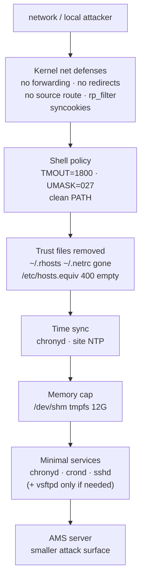

# Nokia 5520 AMS 9.8.3 — RHEL OS Hardening (Field Teaching Guide)

**Overview:** Locking down the Linux underneath AMS — idle logouts, kernel network defenses, no ancient trust files, correct time, capped memory, and only the services AMS needs. An open port is an invitation, and the internet RSVPs to everything.

## Overview: what it is, why it matters, when to use it

**What it is.** AMS runs on RHEL, and a carrier server must be hardened: shrink what an attacker can touch. That means six things in this guide: (1) shell timeouts and safe default file permissions, (2) kernel settings that turn off packet forwarding, redirects, and source routing while blunting SYN floods, (3) deleting legacy trust files (`.rhosts`, `.netrc`, `hosts.equiv`) that let hosts trust each other without passwords, (4) reliable time sync (chrony) because certificates, logs, and geo replication all break when clocks drift, (5) capping `/dev/shm` so shared memory can't eat all RAM, and (6) enabling only the required services (`chronyd`, `crond`, `sshd`) — FTP only if your NE families need it.

**Why a field tech cares.** Hardening is usually a pre-install or audit task, but mis-hardening causes the weirdest outages: `net.ipv4.ip_forward=0` is correct on an AMS server, yet the same setting on a box doing routing breaks everything; a `TMOUT` that's too aggressive logs you out mid-change; a wrong `/dev/shm` cap starves AMS or causes swapping. The source's standing rule: **apply these only after checking local policy and AMS support requirements** — never paste blindly.

**When to reach for it.** New server build/pre-install, security audit remediation, after any "the server was re-imaged" event, and when troubleshooting time-related weirdness (certificate "not yet valid", geo replication lag, log timestamps that don't line up).

Technical depth: settings go in `/etc/sysctl.conf` and take effect with `sysctl -p`. They are host-global, so on a cluster apply identically to every member. `TMOUT`/`UMASK` live in `/etc/profile` (align `UMASK` in `/etc/csh.cshrc` too); never put `.` or empty elements in the system `PATH`. Commands needing `root` are marked; everything else assumes your sudo-capable session.

## Diagram: the hardening layers



## CLI workflows (primary teaching path)

### Install / setup: full hardening pass with backups

Do this on a fresh RHEL build before AMS install, inside a window (some steps log you out or touch networking). **Back up every file you touch first.**

```bash
#!/usr/bin/env bash
# hardening-pass.sh — run as root on the AMS RHEL server. Replace <...> before running.
set -u
BK="/root/hardening-backup-$(date +%Y%m%d-%H%M%S)"
mkdir -p "${BK}"
cp -a /etc/profile /etc/csh.cshrc /etc/sysctl.conf /etc/chrony.conf /etc/fstab /etc/vsftpd/vsftpd.conf "${BK}/" 2>/dev/null
echo "backups in ${BK}"

# 1. shell timeout + umask (idle shells log out after 30 min; new files private by default)
grep -q '^TMOUT=' /etc/profile  || echo 'TMOUT=1800' >> /etc/profile
grep -q '^UMASK=' /etc/profile  || echo 'UMASK=027' >> /etc/profile
# align csh too; never add '.' or empty elements to system PATH (verify by inspection)

# 2. kernel hardening — append the approved set, then apply
cat >> /etc/sysctl.conf <<'SYSCTL'
kernel.core_uses_pid = 1
kernel.sysrq = 0
net.ipv4.ip_forward = 0
net.ipv6.conf.all.forwarding = 0
net.ipv6.conf.all.accept_ra = 0
net.ipv6.conf.default.accept_ra = 0
net.ipv4.conf.all.send_redirects = 0
net.ipv4.conf.default.send_redirects = 0
net.ipv4.conf.all.accept_redirects = 0
net.ipv4.conf.default.accept_redirects = 0
net.ipv4.conf.all.secure_redirects = 0
net.ipv4.conf.default.secure_redirects = 0
net.ipv6.conf.all.accept_redirects = 0
net.ipv6.conf.default.accept_redirects = 0
net.ipv4.conf.all.rp_filter = 1
net.ipv4.conf.default.rp_filter = 1
net.ipv4.conf.all.accept_source_route = 0
net.ipv4.conf.default.accept_source_route = 0
net.ipv6.conf.all.accept_source_route = 0
net.ipv6.conf.default.accept_source_route = 0
net.ipv4.tcp_max_syn_backlog = 4096
net.ipv4.tcp_syncookies = 1
net.ipv4.tcp_synack_retries = 2
SYSCTL
sysctl -p

# 3. remove legacy trust files; lock the empty system trust file
rm -f ~/.rhosts ~/.netrc
touch /etc/hosts.equiv
chmod 400 /etc/hosts.equiv

# 4. time sync
yum install -y chrony
systemctl enable --now chronyd
systemctl enable --now crond
systemctl enable --now sshd
echo "edit /etc/chrony.conf for the site NTP server, then: systemctl restart chronyd"
```

What the sysctl set does, in plain terms: `ip_forward=0` / `forwarding=0` — this box is not a router, so it must not forward packets between interfaces; `accept_redirects=0` / `send_redirects=0` — ignore and don't send ICMP redirects (a classic hijack vector); `accept_source_route=0` — drop packets that dictate their own route; `rp_filter=1` — drop packets arriving on the "wrong" interface (spoofing defense); `tcp_syncookies=1` + `tcp_max_syn_backlog` + `tcp_synack_retries=2` — blunt SYN-flood denial of service; `kernel.sysrq=0` — disable magic SysRq key; `accept_ra=0` — ignore IPv6 router advertisements.

### Daily use: chrony client and server configs

Client (most AMS servers point at the site NTP host):

```conf
server <site-ntp-host> iburst
driftfile /var/lib/chrony/drift
logdir /var/log/chrony
log measurements statistics tracking
```

If this server *is* the site time source for others:

```conf
manual
local stratum 8
driftfile /var/lib/chrony/drift
allow 192.168.0.0/16
```

After editing: `sudo systemctl restart chronyd`, then verify with `chronyc tracking` and `chronyc sources` — look for a `*` (selected source) and a small system offset.

### tmpfs cap on /dev/shm

```bash
sudo mount -t tmpfs -o size=12G tmpfs /dev/shm
```

Persistent entry in `/etc/fstab`:

```fstab
tmpfs /dev/shm tmpfs nodev,nosuid,size=12G 0 0
```

Size the cap so AMS retains enough RAM without swapping — too small starves shared-memory users, too large lets `/dev/shm` eat the box. `nodev,nosuid` are the hardening-relevant mount flags.

### Required services

```bash
sudo systemctl enable --now chronyd
sudo systemctl enable --now crond
sudo systemctl enable --now sshd
```

Network services stay role-dependent; FTP (`vsftpd`) is needed only for specified NE families/features — if your site doesn't use it, leave it disabled and the chroot config is moot.

### Troubleshooting scenario: certificates suddenly "not yet valid" / geo replication lagging

1. **Check the clock first:** `chronyc tracking` — if the offset is minutes or the source shows `?`, time sync is broken. Certificates validate against wall-clock time; geo replication compares timestamps.
2. **Is chronyd running and enabled?** `systemctl is-active chronyd; systemctl is-enabled chronyd`. If someone hardened the box and forgot chrony, this is your culprit.
3. **Can it reach the NTP host?** `chronyc sources -v` — firewall rules (see the network guide) may be blocking UDP/123 to `<site-ntp-host>`.
4. **Config drift:** diff `/etc/chrony.conf` against the site standard; a re-image often resets it.
5. After fixing: `sudo systemctl restart chronyd`, wait a minute, re-check `chronyc tracking`, then re-verify with `ams_check_ssl.sh` and `ams_cluster status --detailed`.

### Automation snippet: hardening audit (read-only)

Run this on every cluster member and diff the outputs — drift between members is a finding:

```bash
#!/usr/bin/env bash
# hardening-audit.sh — read-only. Run as root on each AMS server; diff across members.
set -u
echo "== shell ==";            grep -E '^(TMOUT|UMASK)=' /etc/profile
echo "== sysctl ==";           sysctl -a 2>/dev/null | grep -E '^(kernel.sysrq|net.ipv4.ip_forward|net.ipv4.tcp_syncookies|net.ipv4.conf.all.rp_filter|net.ipv4.conf.all.accept_source_route) ='
echo "== trust files ==";      ls -la ~/.rhosts ~/.netrc 2>&1; ls -la /etc/hosts.equiv
echo "== services ==";         systemctl is-enabled chronyd crond sshd
echo "== chrony ==";           chronyc tracking 2>/dev/null | grep -E '^(Reference|Stratum|System time)'
echo "== shm ==";              df -h /dev/shm | tail -1; grep '/dev/shm' /etc/fstab
```

## GUI section (secondary)

There is no GUI for OS hardening — these are `/etc` files, kernel parameters, and systemd units on the RHEL server. A GUI client cannot edit `sysctl.conf`, set file modes, or manage services. Where the GUI falls short: everything in this guide. The CLI over SSH as root (or sudo) is the only path, and the audit script above is how you prove to an auditor that the settings are actually in effect.

## Platform script blocks (alphabetical)

> Reality check: hardening applies to the **RHEL AMS server only**. From any other platform your device is an **SSH terminal** used to run the commands on the server (as root/sudo) — you never "harden" the phone or laptop with these settings, and `yum`/`systemctl`/`sysctl` do not exist on Android or Windows. The safe remote pattern is: **audit from afar, change from a proper terminal**. Replace `<...>` placeholders before running.

### Linux bash

On the AMS RHEL server as root. Audit first (read-only), change second:

```bash
#!/usr/bin/env bash
# Run ON the AMS server as root.
set -u
echo "== audit (read-only) =="
grep -E '^(TMOUT|UMASK)=' /etc/profile
sysctl -a 2>/dev/null | grep -E 'net.ipv4.ip_forward ='
ls -la /etc/hosts.equiv
systemctl is-enabled chronyd crond sshd
chronyc tracking 2>/dev/null | grep -E '^System time'
# to apply: run the hardening-pass.sh workflow from the CLI section above
```

### Nix-on-Droid

Audit-only from the phone — hardening changes need a real terminal session:

```bash
nix-env -iA nixpkgs.openssh
ssh root@<ams-host> "grep -E '^(TMOUT|UMASK)=' /etc/profile; sysctl -a 2>/dev/null | grep -E 'net.ipv4.ip_forward ='; systemctl is-enabled chronyd crond sshd"
```

Android gotchas: no `yum`/`systemctl`/`sysctl` on-device — every such command runs on the server after `ssh`; no systemd on the phone; `termux-wake-lock` keeps the session alive; grant storage permission if you save audit output. Do not attempt to apply kernel or service changes from the phone.

### PowerShell

Remote audit over Win32 OpenSSH (root or a sudo-capable account):

> **Status:** syntax-verified with PowerShell 7 on Arch (pwsh) — not executed against live systems.
```powershell
ssh root@<ams-host> "grep -E '^(TMOUT|UMASK)=' /etc/profile; sysctl -a 2>/dev/null | grep -E 'net.ipv4.ip_forward ='; systemctl is-enabled chronyd crond sshd; ls -la /etc/hosts.equiv"
```

Apply changes only from an interactive session where you can answer prompts and recover from a dropped connection. Mark: PowerShell syntax not machine-checked here — remote-side logic mirrors the verified bash block.

### Termux

```bash
pkg install -y openssh
termux-wake-lock
ssh root@<ams-host> "grep -E '^(TMOUT|UMASK)=' /etc/profile; sysctl -a 2>/dev/null | grep -E 'net.ipv4.ip_forward ='; systemctl is-enabled chronyd crond sshd"
```

Audit-only. Android gotchas: `pkg`-installed tools are phone-local only — `sysctl`/`systemctl`/`yum` exist solely on the server side of the `ssh`; no systemd on-device; keep audits in the foreground; `termux-setup-storage` once if you save output to shared storage.

### Windows cmd

> **Status:** UNVERIFIED — no Windows cmd available for testing.
```cmd
ssh root@<ams-host> "grep -E '^(TMOUT|UMASK)=' /etc/profile; sysctl -a 2>/dev/null | grep -E 'net.ipv4.ip_forward ='; systemctl is-enabled chronyd crond sshd"
```

Read-only audit from cmd.exe. Run the actual hardening pass from an interactive SSH session on a reliable network — a dropped connection mid-`sysctl` is recoverable, but mid-`TMOUT` you may find yourself logged out. Mark: cmd syntax not machine-checked here — remote-side logic mirrors the verified bash block.

### WSL/Arch

```bash
sudo pacman -S --needed openssh
# read-only audit of the RHEL server (note: Arch-local pacman/yum/sysctl are irrelevant here)
ssh root@"<ams-host>" "grep -E '^(TMOUT|UMASK)=' /etc/profile; sysctl -a 2>/dev/null | grep -E 'net.ipv4.ip_forward ='; systemctl is-enabled chronyd crond sshd"
# interactive session for applying changes
ssh root@"<ams-host>"
```

Reminder: the Arch/WSL side uses `pacman`; the AMS server side uses `yum` — don't mix them up. All hardening commands run on the RHEL server after `ssh`.

## Impact warnings (from the source — read before you type)

- **Apply only after checking local policy and AMS support requirements.** These are extracted settings, not a blessed script — site policy and Nokia support boundaries win.
- **Network-impacting:** `sysctl -p` with the forwarding/redirect/filter set changes host packet behavior immediately. On a cluster, apply identically to every member; a member with different `rp_filter`/forwarding settings causes asymmetric, hard-to-diagnose behavior.
- **Session-terminating:** `TMOUT=1800` logs out shells idle for 30 minutes — including yours, mid-incident, if you stop typing. Set it, then test it, before you depend on a long session.
- **Permission-changing:** `UMASK=027` makes new files group-readable-but-not-world-readable and inaccessible to others — verify AMS processes running as different users/groups can still read what they need.
- **Legacy-automation-breaking:** deleting `~/.rhosts`/`~/.netrc` and locking `/etc/hosts.equiv` to mode 400 empty can break old trust-based scripts — inventory them first.
- **Memory-sizing:** a wrong `/dev/shm` cap starves AMS shared-memory users or invites swapping. Size from supported guidance and real memory measurements, not guesses.
- **Time-source changes affect service:** switching chrony sources moves the clock; certificates, logs, and geo replication all depend on it. Change inside a window and verify with `chronyc tracking` afterward.
