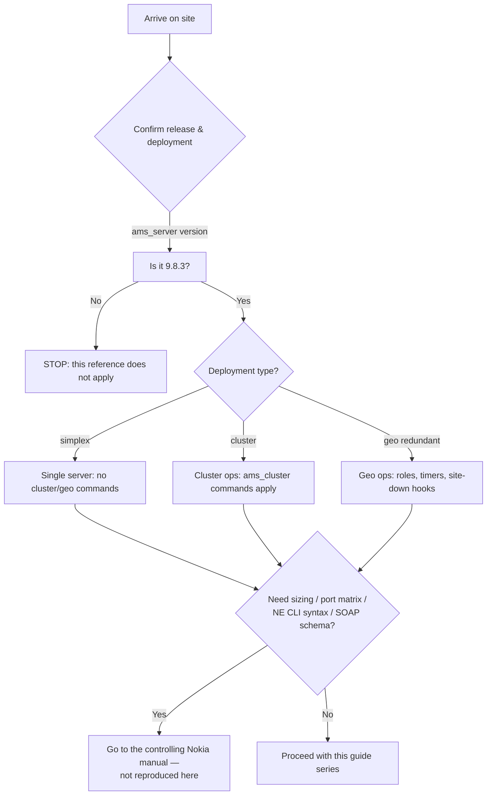

# Release Scope & Glossary — Nokia 5520 AMS 9.8.3

**Overview:** This guide tells you which AMS setups these instructions cover, what they deliberately leave out, and what all the acronyms mean.

> **Safety:** Replace every `<placeholder>` before running anything. Confirm the host, site, role, and account. Nokia documentation and site procedures remain authoritative.

---

## Overview

**What it is.** Before you touch an AMS box, you need two facts nailed down: (1) this material targets **Nokia 5520 AMS Release 9.8.3** in **simplex, cluster, and geographically redundant** deployments, and (2) the supplied manuals stay the controlling authority for anything exact — prerequisites, supported plug-in combinations, sizing, port matrices, and known defects.

**Why you care.** On a job site, the most expensive mistake isn't a wrong command — it's running the *right* command on the *wrong* release or the wrong deployment type. A geo-redundant pair has timers, site-down hooks, and dual-active traps that a simplex box simply doesn't. This guide is your "am I even in the right universe?" check before you do anything else.

**When to reach for it.**
- You arrive on site and need to confirm the AMS release and deployment type before starting work.
- A command behaves unexpectedly — first verify you're on 9.8.3 (not some other release) and that the feature applies to simplex vs. cluster vs. geo.
- You need an acronym decoded while reading other guides in this series.
- Someone asks you for production sizing or a full port matrix — this guide tells you exactly where that information lives (the Nokia manuals, not here).

**The technical depth.** The reference set was reorganized from the supplied 9.8.3 manuals: User Guide [cite:1], Administrator Guide [cite:2], Installation and Migration Guide [cite:3], Server Configuration Technical Guidelines [cite:4], Glossary [cite:5], Northbound Interface Guide [cite:6], and Release Notice [cite:7]. Conventions used everywhere: `<value>` is required and site-specific, `[value]` is optional. AMS commands run as `amssys` unless an entry says `root`; the `amssys` `PATH` already includes most AMS script directories, so no path prefix or `./` is needed. Script spelling follows the supplied 9.8.3 PDFs exactly, including underscores.

---

## Diagram: where this guide sits in your workflow



---

## CLI workflows

### Setup: confirm you are on 9.8.3

There is nothing to install — this is reference material. The one setup step is proving the scope applies to the box in front of you:

```bash
ams_server version
```

What success looks like: the reported release is `9.8.3`. If it isn't, stop — these guides are scoped to 9.8.3 and command spelling/behavior may differ on other releases.

To identify the deployment type:

```bash
ams_cluster status --detailed   # cluster present and members listed -> cluster deployment
ams_cluster status sw           # software agreement across nodes
```

What success looks like: a simplex server will show a single node (or the cluster commands will report no cluster configured); a cluster shows all member nodes in stable roles; a geo pair shows active/standby site roles. Match what you see against the scope above before proceeding.

### Daily use: glossary lookup

The glossary lives in this file (see below). If you keep these guides on the server or your workstation, a quick text search finds any term — e.g., searching for `GR` tells you it means *Geographic redundancy* and that it is a geo-pair concept, not a cluster concept.

### Troubleshooting: a command doesn't behave as documented

1. Re-check the release: `ams_server version` — features and even command spelling change between releases.
2. Re-check the deployment type: geo commands (`ams_cluster switch`, `ams_geo_configure.sh`, `ams_server resetgeo`) are meaningless on simplex; cluster commands are meaningless on a simplex box.
3. NE-native command syntax is family/release-specific — the AMS-side tool `ams_ne_cli` only *transports* NE CLI; it does not define the syntax. If an NE command fails, the NE's own documentation is the authority, not this series.
4. SOAP faults: namespaces and complete envelopes come from the **activated schema documentation** (`/ams/schema/doc/html/index.html` on the server). Do not hand-craft SOAP from memory.

### Automation: scope gate script

Run this as `amssys` before any batch work to abort automatically if the release is wrong. Replace nothing — it only reads state:

```bash
#!/bin/bash
# ams-scope-check.sh — abort batch work unless the server is AMS 9.8.3.
# Run as: amssys. Read-only.
set -u
VERSION_OUT="$(ams_server version 2>&1)"
echo "$VERSION_OUT"
if ! printf '%s\n' "$VERSION_OUT" | grep -q '9\.8\.3'; then
    echo "FAIL: expected AMS 9.8.3. These guides do not apply here. Aborting." >&2
    exit 1
fi
echo "OK: release 9.8.3 confirmed."
ams_cluster status sw
echo "OK: scope gate passed."
```

---

## GUI section (secondary)

If you prefer the GUI: day-to-day NE management is documented in the User Guide and has a graphical client. **But the GUI is the wrong tool for everything in this guide.** Release-scope questions — exact production sizing, the full port/bandwidth matrix, supported plug-in combinations, known defects — are answered by the Nokia manuals (Release Notice, Server Configuration Technical Guidelines, Installation and Migration Guide), not by any screen in the GUI. Where the GUI falls short vs. CLI: the CLI gives you a verifiable, scriptable answer to "what release is this?" (`ams_server version`) and "what deployment is this?" (`ams_cluster status --detailed`) in one line, suitable for pasting into a job ticket; the GUI gives you no batchable equivalent. For scope and boundary questions, the manuals + CLI win outright.

---

## Platform script blocks

### Linux bash

Native commands, run on the AMS server as `amssys`:

```bash
ams_server version
ams_cluster status --detailed
```

A full check with a release gate (copy-pasteable; read-only):

```bash
#!/bin/bash
set -u
ams_server version | grep -q '9\.8\.3' \
    && echo "Scope OK: AMS 9.8.3" \
    || { echo "Scope mismatch: not 9.8.3" >&2; exit 1; }
ams_cluster status --detailed
ams_cluster status sw
```

### Nix-on-Droid

**N/A — AMS server software runs on RHEL; you cannot install or run AMS on Android.** The honest pattern is the phone as an SSH terminal to reach the AMS server. Install an SSH client (via `nix-env -iA nixpkgs.openssh` or home-manager), then run the scope check remotely:

```bash
nix-env -iA nixpkgs.openssh
ssh amssys@<ams-host> 'ams_server version'
```

Android gotchas: no systemd; storage permissions may block file transfers (grant storage access to the app); Android can kill background sessions, so keep long sessions in the foreground and use `termux-wake-lock` where available on Termux-based setups; a phone is a terminal here, never the AMS server.

### PowerShell

Win32 OpenSSH reaches the server; the actual commands run on RHEL. Logic mirrors the verified Linux bash block above:

> **Status:** syntax-verified with PowerShell 7 on Arch (pwsh) — not executed against live systems.
```powershell
ssh amssys@<ams-host> 'ams_server version'
ssh amssys@<ams-host> 'ams_cluster status --detailed'
```

For scope-adjacent HTTPS checks from the workstation (proves the NBI schema docs exist, not the release):

> **Status:** syntax-verified with PowerShell 7 on Arch (pwsh) — not executed against live systems.
```powershell
curl.exe --cacert C:\path\ams-ca.pem https://<host>:8443/ams/schema/doc/html/index.html
```

### Termux

**N/A — AMS does not install on Android.** Use the phone as an SSH terminal:

```bash
pkg install -y openssh
ssh amssys@<ams-host> 'ams_server version; ams_cluster status --detailed'
```

Android gotchas: no systemd; grant storage permission before `scp` transfers; Android background-execution limits can drop idle SSH sessions — keep the session in the foreground or acquire `termux-wake-lock` (from the `termux-api` package) for longer work.

### Windows cmd

Win32 OpenSSH reaches the server; the actual commands run on RHEL. Logic mirrors the verified Linux bash block above:

> **Status:** UNVERIFIED — no Windows cmd available for testing.
```cmd
ssh amssys@<ams-host> "ams_server version"
ssh amssys@<ams-host> "ams_cluster status --detailed"
```

### WSL/Arch

Arch Linux in WSL is an SSH console to the AMS server — install OpenSSH with pacman, then the commands run remotely on RHEL:

```bash
sudo pacman -S --needed openssh
ssh amssys@<ams-host> 'ams_server version'
ssh amssys@<ams-host> 'ams_cluster status --detailed'
```

---

## Impact warnings

This guide's own operations are **read-only / low impact** — `ams_server version` and `ams_cluster status` change nothing. The impact to preserve from the source is a different kind: **scope mistakes cause downstream damage.**

- **Do not guess production sizing or port/bandwidth matrices.** They are not reproduced in this series; sizing a cluster from memory can produce an underbuilt deployment that fails under load. Source: the controlling Nokia manuals.
- **NE-native CLI syntax is family/release-specific.** Sending a command valid on one NE family to another can misconfigure hardware. `ams_ne_cli` transports the command; it does not validate it.
- **SOAP envelopes must come from the activated schema.** Hand-crafted envelopes against the wrong schema version fail at best and corrupt data at worst.
- **Site addresses, credentials, certificates, object names, and paths are placeholders** throughout this series — every `<placeholder>` must be replaced with site values before execution.

---

## Glossary (A–Z)

| Term | Meaning |
|---|---|
| AD | Combined application/data server |
| AMS | Access Management System |
| CFM | Connectivity Fault Management |
| CLI | Command-line interface |
| DCN | Data communication network |
| EMS | Element management system |
| FDN | Fully distinguished name |
| GR | Geographic redundancy |
| JMS | Java Message Service |
| LVM | Logical Volume Manager |
| ME | Managed element |
| MTOSI | Multi-Technology Operations System Interface |
| NAT | Network address translation |
| NBI | Northbound interface |
| NE | Network element |
| OSS | Operations support system |
| PAP | Partition Access Profile |
| RHEL | Red Hat Enterprise Linux |
| SNMP | Simple Network Management Protocol |
| SFTP | SSH File Transfer Protocol |
| SOAP | XML messaging protocol |
| TLS | Transport Layer Security |
| WSDL | Web Services Description Language |
