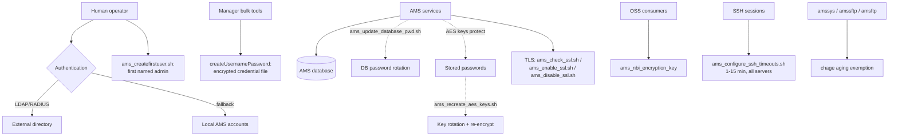

# Security, Identity & TLS — Nokia 5520 AMS 9.8.3

**Overview:** This guide is the "locks and keys" chapter — who can log in, how passwords and secrets are protected, and how traffic between AMS components gets encrypted.

> **Safety:** Replace every `<placeholder>`. Confirm the host, site, role, and account. Read the risk note, take a tested backup before changes, and use an approved maintenance window for service-affecting work. Nokia documentation and site procedures remain authoritative.

---

## Overview

**What it is.** AMS holds the keys to your access network — every OLT and ONT is managed through it — so identity and encryption are job-critical, not paperwork. This guide covers the full security surface: AMS user accounts (local vs. LDAP/RADIUS), the first administrator account, encrypted credential files for the bulk manager tools, database password rotation, TLS/SSL for encrypted management traffic, AES keys that protect stored passwords, NBI encryption keys shared with OSS consumers, SSH session timeouts, and keeping the service accounts (`amssys`, `amssftp`, `amsftp`) from being locked out by password-aging policy.

**Why you care.** You will be on site when logins break (LDAP down, admin locked out, certificate expired) and when security policy demands rotations (database passwords, AES keys, TLS certificates). These are the operations where a mistake either locks everyone out or silently leaves secrets exposed — both are career-limiting, and both are covered here with their exact impact levels.

**When to reach for it.**
- LDAP/RADIUS is down and nobody can log in → authentication fallback.
- A new deployment needs its first named administrator → `ams_createfirstuser.sh`.
- Bulk tools need credentials without plaintext in CSV files → `createUsernamePassword`.
- Security policy requires rotating database passwords or AES keys → the rotation procedures.
- Production needs real certificates instead of the Nokia lab certificates → TLS enablement.
- SSH sessions linger forever on a shared console → SSH timeout configuration.
- `amssys` (or the FTP/SFTP accounts) got locked by password aging → the `chage` procedure.

**The technical depth.** AMS authenticates users locally or against external LDAP/RADIUS; `ams_switch_authentication_local` is the documented emergency fallback when external auth fails. Credentials for the user/NE/link/hub-subtended-link manager tools are handled by `createUsernamePassword`, which interactively builds an encrypted credential file so CSV inputs never carry plaintext secrets. Stored passwords are protected by AES keys (`ams_recreate_aes_keys.sh` rotates them and re-encrypts stored values); database credentials are rotated with `ams_update_database_pwd.sh`, which stops AMS, updates credentials/configuration, and automatically restarts the cluster — do not manually restart afterward. TLS is checked with `ams_check_ssl.sh` and enabled with `ams_enable_ssl.sh` (optionally pointing at a site-owned PKCS12 keystore); Nokia-provided certificates are lab/trial only — production uses site certificates. `ams_nbi_encryption_key` manages the key shared with northbound OSS consumers (coordinate changes with them). `ams_configure_ssh_timeouts.sh` sets SSH inactivity timeouts (1–15 minutes) and must be applied identically on every cluster/geo server. Service accounts `amssys`, `amssftp`, `amsftp` must be exempted from password aging/lockout via `chage`.

---

## Diagram: the AMS security layers



---

## CLI workflows

Commands run as `amssys` unless noted `root`/`sudo`. Tasks are listed alphabetically.

### AES key rotation — 🔴 HIGH, affects stored secrets

When: security policy requires replacing the key that encrypts stored passwords (or a key is suspected compromised).

```bash
ams_server stop
ams_recreate_aes_keys.sh
ams_recreate_aes_keys.sh -d "<existing-key>"
ams_recreate_aes_keys.sh -u "<replacement-key>"
ams_server start
```

Before you run it: stop application servers and back up the affected data/files first. What success looks like: keys recreated, stored passwords re-encrypted, services start cleanly. **Back out:** the source defines no in-place reversal — restore from the tested backup taken beforehand, or complete the rotation and coordinate with Nokia support. This is high impact: get it wrong and AMS cannot decrypt stored passwords.

### Authentication fallback — 🟡 Security change

When: LDAP/RADIUS failure prevents anyone from logging in.

```bash
ams_switch_authentication_local
```

Before you run it: confirm external authentication is genuinely unavailable (not just your own account). What success looks like: local AMS accounts can log in again. **Back out:** restore the intended external authentication after remediation (per the Administrator Guide/site procedure — the source does not name a mirror command, so document which external config was active before you switched).

### Create the first administrator — 🟡 Security-sensitive (one-time setup)

When: initial deployment, before any named human can administer AMS.

```bash
ams_createfirstuser.sh <username> '<global-address-filter>'
ams_createfirstuser.sh --help
```

Before you run it: avoid generic operational usernames such as `admin`, `helpdesk`, `support` — use a named human account. What success looks like: the named administrator can log in with the given global address filter. **Back out:** delete or rename the account per site procedure if created in error (source does not specify a removal command).

### Encrypted credential file — 🟢 Sensitive input, low service impact

When: the user/NE/link/hub-subtended-link manager bulk tools need credentials but CSV input must not carry plaintext secrets.

```bash
createUsernamePassword
```

This is interactive — it prompts for the credentials and writes the encrypted file. What success looks like: bulk tools accept the encrypted credential file and no plaintext secret remains in CSV input. **Back out:** delete the generated credential file and re-run.

### NBI encryption key — 🟡 Coordinate with OSS

When: the encryption key shared with northbound OSS consumers must change.

```bash
ams_nbi_encryption_key
```

Before you run it: coordinate with every OSS consumer of the NBI — they must adopt the new key or their integration breaks. What success looks like: OSS consumers confirm successful encrypted exchanges with the new key. **Back out:** restore the previous key and re-coordinate (coordinate the rollback the same way as the change).

### Rotate database passwords — 🔴 HIGH, script restarts service automatically

When: security policy requires database credential rotation.

```bash
ams_update_database_pwd.sh
```

Before you run it: run as `amssys` or `root`; the password cannot exceed 32 characters and cannot contain spaces. The script **stops AMS, updates credentials/configuration, and automatically starts the cluster** — do not manually restart afterward (a manual restart on top of the scripted one can cause startup conflicts). What success looks like: the script completes, the cluster is up, and services authenticate against the database with the new password. **Back out:** not reversible in place — restore from a tested backup.

### SSH timeout configuration — 🟡 Security configuration

When: compliance requires idle SSH sessions to be cut off, or timeouts differ across servers.

```bash
ams_configure_ssh_timeouts.sh check
ams_configure_ssh_timeouts.sh enable 10
ams_configure_ssh_timeouts.sh disable
```

The allowed timeout is 1–15 minutes. Apply the same setting to **every** cluster/geo server — inconsistent timeouts are a finding in audits. What success looks like: `check` reports the intended timeout on each server. **Back out:** `ams_configure_ssh_timeouts.sh disable` (or re-enable with the previous value).

### TLS check / enable / disable — 🔴 Service-affecting on change

When: verifying encrypted management traffic is on; moving production from Nokia lab certificates to site certificates; disabling TLS only when explicitly required.

Check only (read-only):

```bash
ams_check_ssl.sh
```

Enable with a site-owned PKCS12 keystore:

```bash
ams_server stop
ams_enable_ssl.sh /secure/ams-keystore.p12 '<password>'
ams_server start
```

Enable with the default (Nokia-provided — lab/trial only, not production):

```bash
ams_server stop
ams_enable_ssl.sh
ams_server start
```

Disable — only when explicitly required:

```bash
ams_server stop
ams_disable_ssl.sh
ams_server start
```

Before you run it: use a site-owned production PKCS12 certificate and have a tested rollback. What success looks like: `ams_check_ssl.sh` confirms TLS active and clients connect over HTTPS without certificate errors. **Back out:** re-run the enable/disable sequence with the previous configuration.

### Service-account aging exemption — 🟡 Security policy exception, requires approval

When: `amssys`, `amssftp`, or `amsftp` risk being disabled by password aging/lockout policy (which would stop AMS or break file transfer).

```bash
sudo chage -I -1 -m 0 -M 99999 -E -1 amssys
sudo chage -I -1 -m 0 -M 99999 -E -1 amssftp
sudo chage -I -1 -m 0 -M 99999 -E -1 amsftp
```

This needs `root`/`sudo`. It is a security policy exception — get approval before applying. What success looks like: `chage -l amssys` (etc.) shows the accounts exempt from aging. **Back out:** re-apply the site's standard aging policy with `chage` per the security team's values.

### Troubleshooting: nobody can log in (LDAP down)

1. Confirm it is the directory, not one account: try a second known-good account.
2. Fall back to local authentication: `ams_switch_authentication_local`.
3. Remediate LDAP/RADIUS with the network team.
4. Restore the intended external authentication (documented above as the back-out step) and verify a directory-backed login works before closing the ticket.

### Troubleshooting: TLS certificate expired

1. Check state: `ams_check_ssl.sh`.
2. Obtain the renewed site PKCS12 keystore.
3. In a maintenance window: `ams_server stop` → `ams_enable_ssl.sh /secure/ams-keystore.p12 '<password>'` → `ams_server start`.
4. Verify from a workstation with `curl --cacert` against the NBI endpoints (see the Verify NBI playbook in `use-cases.md`).

### Automation: security-posture audit snippet

Read-only checks you can run on every server and diff across the cluster. Run as `amssys` (the `chage` read needs `sudo`):

```bash
#!/bin/bash
# ams-security-audit.sh — read-only security posture snapshot. Run as amssys.
set -u
echo "== TLS status =="
ams_check_ssl.sh
echo "== SSH timeout =="
ams_configure_ssh_timeouts.sh check
echo "== Service-account aging =="
for acct in amssys amssftp amsftp; do
    echo "-- $acct --"
    sudo chage -l "$acct" | grep -E 'Password expires|Account expires|Maximum number'
done
echo "== done =="
```

Compare the output across all cluster/geo servers — TLS state and SSH timeouts must agree everywhere.

---

## GUI section (secondary)

If you prefer the GUI: routine user administration (creating users, viewing sessions) is documented in the User Guide's graphical client. **But every operation in this guide is CLI-first and several have no GUI equivalent.** Password rotation, AES key rotation, TLS enable/disable, SSH timeout configuration, and service-account aging exemptions are all `amssys` shell procedures per the Administrator Guide — the GUI does not expose them, and the GUI cannot show you whether the script restarted the cluster correctly or whether SSH timeouts match across nodes. Where the GUI falls short vs. CLI: no batch verification across servers, no scriptable audit trail, and no way to apply a setting identically to every cluster/geo node. For security operations, use the CLI and keep the output in your change record.

---

## Platform script blocks

### Linux bash

Native commands on the AMS server as `amssys` (root/`sudo` where noted). The security-posture audit script above is verified with `bash -n`. A minimal read-only triage:

```bash
ams_check_ssl.sh
ams_configure_ssh_timeouts.sh check
```

### Nix-on-Droid

**N/A — AMS server software runs on RHEL; you cannot install or run AMS on Android.** The honest pattern is the phone as an SSH terminal to reach the AMS server:

```bash
nix-env -iA nixpkgs.openssh
ssh amssys@<ams-host> 'ams_check_ssl.sh'
ssh amssys@<ams-host> 'ams_configure_ssh_timeouts.sh check'
```

Never run key rotation, password rotation, or TLS changes from a phone: they are service-affecting and need a stable session and an approved maintenance window. Android gotchas: no systemd; storage permissions gate `scp` of keystores/certificates (grant storage access); background-execution limits can drop a session mid-change — never run a rotation over a phone SSH session you cannot keep in the foreground.

### PowerShell

Win32 OpenSSH reaches the server; security commands run on RHEL as `amssys`. Logic mirrors the verified Linux bash block above:

> **Status:** syntax-verified with PowerShell 7 on Arch (pwsh) — not executed against live systems.
```powershell
ssh amssys@<ams-host> 'ams_check_ssl.sh'
ssh amssys@<ams-host> 'ams_configure_ssh_timeouts.sh check'
```

For service-affecting changes (TLS enable, key/password rotation), wrap in a recorded session and keep the window open for the whole change:

> **Status:** syntax-verified with PowerShell 7 on Arch (pwsh) — not executed against live systems.
```powershell
ssh amssys@<ams-host>
# You are now at the remote Linux prompt; run the change, then:
exit
```

### Termux

**N/A — AMS does not install on Android.** Use the phone as an SSH terminal for read-only triage only:

```bash
pkg install -y openssh
ssh amssys@<ams-host> 'ams_check_ssl.sh'
ssh amssys@<ams-host> 'ams_configure_ssh_timeouts.sh check'
```

Android gotchas: no systemd; grant storage permission before transferring certificate files; use `termux-wake-lock` (from `termux-api`) to keep long sessions alive. Do not perform rotations or TLS changes from the phone.

### Windows cmd

Win32 OpenSSH reaches the server; the actual commands run on RHEL. Logic mirrors the verified Linux bash block above:

> **Status:** UNVERIFIED — no Windows cmd available for testing.
```cmd
ssh amssys@<ams-host> "ams_check_ssl.sh"
ssh amssys@<ams-host> "ams_configure_ssh_timeouts.sh check"
```

### WSL/Arch

Arch Linux in WSL is an SSH console to the AMS server — install OpenSSH with pacman, then run the commands remotely on RHEL:

```bash
sudo pacman -S --needed openssh
ssh amssys@<ams-host> 'ams_check_ssl.sh'
ssh amssys@<ams-host> 'ams_configure_ssh_timeouts.sh check'
```

---

## Impact warnings

| Operation | Impact level (per source) | Why it matters |
|---|---|---|
| `ams_update_database_pwd.sh` | 🔴 **High** — stops AMS, auto-restarts cluster | Manual restart afterward causes startup conflicts; wrong password locks AMS out of its own database |
| `ams_recreate_aes_keys.sh` | 🔴 **High** — re-encrypts stored passwords | Failed rotation = AMS cannot decrypt stored secrets; stop app servers + back up first |
| `ams_enable_ssl.sh` / `ams_disable_ssl.sh` | 🔴 **Service-affecting** | Requires `ams_server stop/start`; wrong keystore = no encrypted management access |
| `ams_switch_authentication_local` | 🟡 **Security change** | Temporarily weakens the auth model; must be reverted after remediation |
| `ams_createfirstuser.sh` | 🟡 **Security-sensitive** | First admin defines initial access; generic names (`admin`, `helpdesk`, `support`) are banned |
| `ams_nbi_encryption_key` | 🟡 **Integration-breaking if uncoordinated** | OSS consumers must adopt the new key or NBI integration breaks |
| `ams_configure_ssh_timeouts.sh` | 🟡 **Security configuration** | Must match on every cluster/geo server (1–15 min allowed) |
| `chage` aging exemptions | 🟡 **Security policy exception** | Requires approval; without it, `amssys`/`amssftp`/`amsftp` can be locked by aging policy and stop the system |
| `createUsernamePassword`, `ams_check_ssl.sh` | 🟢 **Read-only / sensitive input** | No service impact, but the credential file itself is sensitive — protect it |

---

## Quick reference (alphabetical)

| Task | Command | Run as |
|---|---|---|
| AES key rotation | `ams_recreate_aes_keys.sh [-d <existing-key>] [-u <replacement-key>]` (with `ams_server stop/start` around it) | amssys |
| Auth fallback | `ams_switch_authentication_local` | amssys |
| Encrypted credential file | `createUsernamePassword` | amssys |
| First administrator | `ams_createfirstuser.sh <username> '<global-address-filter>'` | amssys |
| NBI encryption key | `ams_nbi_encryption_key` | amssys |
| Rotate DB password | `ams_update_database_pwd.sh` | amssys or root |
| Service-account aging | `chage -I -1 -m 0 -M 99999 -E -1 <amssys\|amssftp\|amsftp>` | root/sudo |
| SSH timeout | `ams_configure_ssh_timeouts.sh check\|enable <1-15>\|disable` | amssys |
| TLS check | `ams_check_ssl.sh` | amssys |
| TLS enable | `ams_enable_ssl.sh [/secure/ams-keystore.p12 '<password>']` (with `ams_server stop/start` around it) | amssys |
| TLS disable | `ams_disable_ssl.sh` (with `ams_server stop/start` around it) | amssys |
