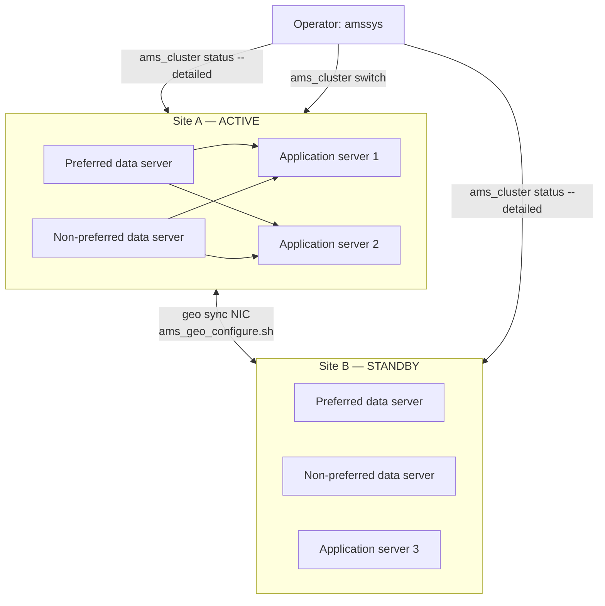

# Server, Cluster & Geographic Redundancy — Nokia 5520 AMS 9.8.3

**Overview:** This guide is the "keeping AMS alive" chapter — starting and stopping servers, running them as a cluster so one failure doesn't kill management, and running two sites so a whole datacenter failure doesn't either.

> **Safety:** Replace every `<placeholder>`. Confirm the host, site, role, and account. Read the risk note, take a tested backup before changes, and use an approved maintenance window for service-affecting work. Nokia documentation and site procedures remain authoritative.

---

## Overview

**What it is.** AMS runs on one server (simplex), on several servers acting as one (cluster), or on two clusters in different locations (geographic redundancy, GR). The cluster keeps management alive when a single server dies; geo keeps it alive when an entire site dies. This guide covers the lifecycle commands: checking cluster health, starting/stopping/restarting servers and whole clusters, forcing or switching geo roles (which site is *active* serving traffic, which is *standby* waiting), evacuating an application server before maintenance (moving its NEs to the others), configuring geo redundancy, and the correct startup order.

**Why you care.** This is the highest-blast-radius chapter in the series. `ams_cluster stop` puts servers in maintenance mode and stops management of the access network. Forced geo switches can create **dual-active** service — two sites both thinking they're in charge — which corrupts data. Every procedure here needs an approved maintenance window, a tested backup, and a rollback plan.

**When to reach for it.**
- Daily health check: is every cluster node up, in the right role, with software in agreement? → `ams_cluster status` variants.
- Planned maintenance on a server: move its NEs away first → evacuate, then `ams_server stop maintenance`.
- Site failover test or real site failure: verify roles from **both** sites before forcing anything → geo role control.
- After any change: start things in the right order (data servers before app servers; active site before standby).

**The technical depth.** `ams_cluster` controls the cluster as a unit: `status` (with `--detailed`, `sw` for software agreement, `-l 10 -p 60` for looped polling), `start`, `stop`, `restart`. `stop`/`restart` place cluster servers in maintenance mode and are service-affecting. `ams_server` controls one server: `start`, `stop`, `stop maintenance`, `restart`, `status`, `version`; where supported, service targets include `appserver`, `dataserver`, `arbiter`, and `all`. Forced restart bypasses filesystem synchronization checks — exceptional recovery only. Geo roles are controlled with `ams_cluster start -force active|standby` and `ams_cluster switch active|standby` (with `-force` variants); `-force` bypasses role checks, so verify the remote site first — misused force is how you get dual-active. `ams_geo_configure.sh` is the interactive geo setup (roles, remote site, remote preferred/non-preferred data servers, synchronization NIC, automatic switchover); all geo communication addresses must be IPv4 or all IPv6 — no mixing. The geo monitor timer lives in `$AMSSOFTWAREHOME/conf/amsgeomonitor.conf` as `PINGPONGPROTECTIONTIMEOUT=<minutes>` (documented default 30); `ams_server resetgeo` overrides the current timer, only after remediation. Site-down hooks live at `$PLATFORMSCRIPTSDIR/activeSiteDown.sh` and `$PLATFORMSCRIPTSDIR/stanbySiteDown.sh` (the second filename is spelled `stanbySiteDown.sh` in the guide — copy it exactly). Startup order: fresh cluster — start each server individually the first time; normal cluster — preferred data server, non-preferred data server, then application servers; geo — start and verify active before standby; migration — follow the scenario-specific order because first application-server startup can trigger migration.

---

## Diagram: cluster and geo roles



Startup order (one site): preferred data server → non-preferred data server → application servers. Geo: verify active site fully up before starting standby.

---

## CLI workflows

Commands run as `amssys` unless noted `root`/`sudo`. Tasks are listed alphabetically.

### Check cluster health — 🟢 Read-only

Daily use — run this first, every time:

```bash
ams_cluster status
ams_cluster status --detailed
ams_cluster status sw
ams_cluster status -l 10 -p 60
```

What success looks like: every expected node appears in the correct stable role, and `status sw` shows software agreement across nodes. `-l 10 -p 60` polls in a loop (10 iterations, 60-second period) for watching a state settle. If any node is missing or roles look wrong, stop and investigate before any change — never start/stop against a cluster whose health you haven't read.

### Configure geo redundancy — 🔴 HIGH and service-affecting (setup)

When: building or re-building the active/standby site pair.

```bash
ams_geo_configure.sh
```

This is interactive: it asks for active/standby role, remote site, remote preferred/non-preferred data servers, synchronization NIC, and automatic switchover. Before you run it: have an approved topology on paper and make all geo communication addresses one IP family (all IPv4 or all IPv6 — mixing is not allowed). Timer tuning lives in `$AMSSOFTWAREHOME/conf/amsgeomonitor.conf`:

```ini
PINGPONGPROTECTIONTIMEOUT=<minutes>
```

Documented default is 30 minutes. Override the current timer only after remediation:

```bash
ams_server resetgeo
```

What success looks like: both sites agree on roles — exactly one active, one standby — and geo sync is flowing. **Back out:** the source defines no automated rollback for geo configuration; restore from the tested pre-change backup and re-run the configuration with the previous values.

### Control geographic roles — 🔴 HIGH, dual-active risk

When: planned site switchover, failover test, or real site failure.

```bash
ams_cluster start -force active
ams_cluster start -force standby
ams_cluster switch active
ams_cluster switch standby
ams_cluster switch -force active
ams_cluster switch -force standby
```

Before you run it: **verify the remote site and the current role from both sites.** `-force` bypasses role checks — used without verification it can create dual-active service (both sites active), which is a data-corruption scenario. What success looks like: exactly one site is active and the other is standby, confirmed from both sites' `ams_cluster status --detailed`. **Back out:** switch roles back with the non-forced variant and verify from both sites; if dual-active occurred, stop and engage Nokia support — do not guess.

### Control one server — 🟡 Stop/restart can be service-affecting

When: working on a single AMS server instead of the whole cluster.

```bash
ams_server start
ams_server stop
ams_server stop maintenance
ams_server restart
ams_server status
ams_server status all -l 10 -p 60
ams_server version
```

Where supported, service targets include `appserver`, `dataserver`, `arbiter`, and `all`. `stop maintenance` is the graceful form for planned work. Forced restart bypasses filesystem synchronization checks — exceptional recovery only, never routine. What success looks like: `ams_server status` shows the intended services up. **Back out:** `ams_server start` (or restart) and verify with `status`.

### Evacuate an application server — 🟡 Changes NE placement and capacity

When: a host needs maintenance and its NEs must be served by the remaining application servers.

```bash
ams_cluster status --detailed
ams_cluster evacuate_ne "<cluster-ip>"
ams_show_ne_balancing.sh -a "<cluster-ip>"
ams_server stop maintenance
```

Evacuation sets the application's NE-management weight to zero; `ams_show_ne_balancing.sh -a <cluster-ip>` shows the resulting placement. Before you run it: record the current placement and confirm the remaining servers have capacity for the moved NEs. Return the host to service:

```bash
ams_server start
ams_cluster unevacuate_ne "<cluster-ip>" "<weight>"
ams_cluster status --detailed
```

Note: unevacuation invokes rebalance but **does not guarantee the same NEs return** to this host — placement may differ from before. Deleting a host from the cluster entirely is `ams_cluster deletehost <cluster-ip-address>` (host-removal, plan accordingly). What success looks like: all NEs managed, cluster healthy, new placement recorded. **Back out:** `unevacuate_ne` with the recorded weight; if NEs landed elsewhere, that is expected behavior per the source, not an error.

### Start, stop, or restart the cluster — 🔴 Service-affecting

When: cluster-wide maintenance or recovery.

```bash
ams_cluster start
ams_cluster stop
ams_cluster restart
```

`stop` and `restart` place cluster servers in maintenance mode — management of the access network stops. Before you run it: confirm roles, have a tested backup, maintenance approval, and a rollback plan. What success looks like: `ams_cluster status --detailed` shows all nodes up in stable roles after `start`. **Back out:** `ams_cluster start` (for a stop) and verify; for a bad restart, restore from backup.

### Startup order — 🟢 Read-only guidance, critical to follow

The order matters — dependencies before dependents:

1. Fresh cluster: start each server individually the first time.
2. Normal cluster: preferred data server → non-preferred data server → application servers.
3. Geo: start and verify the active site before standby.
4. Migration: follow the scenario-specific order, because first application-server startup can trigger migration.

### Troubleshooting: suspected dual-active after a forced switch

1. Do **not** run more forced commands. Check both sites independently: `ams_cluster status --detailed` on a server at site A and on a server at site B.
2. If both claim active: this is the dual-active condition the source warns about. Stop and engage Nokia support with both status outputs — do not try to "fix" it with another `-force`.
3. After remediation, and only then: `ams_server resetgeo` to clear the geo timer, then verify exactly one active / one standby from both sites.

### Troubleshooting: geo timer (ping-pong protection) expired or stuck

1. Read the configured value: `PINGPONGPROTECTIONTIMEOUT` in `$AMSSOFTWAREHOME/conf/amsgeomonitor.conf` (documented default 30 minutes).
2. Remediate the underlying cause first (network, site health).
3. Only after remediation: `ams_server resetgeo`.

### Automation: maintenance-evacuation wrapper

Run as `amssys`. Replace `<cluster-ip>` before running. This performs the pre-maintenance half; the return half is manual so a human confirms maintenance is done:

```bash
#!/bin/bash
# ams-evacuate-for-maintenance.sh — move NEs off a host before maintenance.
# Run as: amssys. Replace <cluster-ip> before running.
set -u
HOST_IP="<cluster-ip>"
echo "== Cluster health before evacuation =="
ams_cluster status --detailed
echo "== Evacuating $HOST_IP =="
ams_cluster evacuate_ne "$HOST_IP"
ams_show_ne_balancing.sh -a "$HOST_IP"
echo "== Safe to run: ams_server stop maintenance =="
echo "== After maintenance, return with: =="
echo "   ams_server start"
echo "   ams_cluster unevacuate_ne $HOST_IP <weight>"
echo "   ams_cluster status --detailed"
```

---

## GUI section (secondary)

If you prefer the GUI: day-to-day NE management screens are documented in the User Guide. **But cluster and geo operations are CLI-first — the GUI is not the tool for them.** Cluster lifecycle (`ams_cluster start/stop/restart`), geo role switches, evacuation, geo configuration, and the startup order are all `amssys` shell procedures per the Administrator and Installation guides; the GUI exposes no equivalent for forcing a geo role or resetting the geo timer, and it cannot show you software agreement across nodes (`ams_cluster status sw`) in a form you can paste into a change record. Where the GUI falls short vs. CLI: no cross-node verification, no scriptable health polling (`-l/-p`), no auditable record of exactly which role command ran when. For anything that can take down management of the access network, use the CLI.

---

## Platform script blocks

### Linux bash

Native commands on the AMS server as `amssys`. Read-only health check (copy-pasteable):

```bash
ams_cluster status --detailed
ams_cluster status sw
```

Cluster-wide change pattern with a pre-check gate (replace `<cluster-ip>`; the evacuation itself is shown in the automation snippet above):

```bash
#!/bin/bash
set -u
ams_cluster status --detailed
read -r -p "Cluster healthy? Type YES to proceed with evacuation of <cluster-ip>: " OK
[ "$OK" = "YES" ] || { echo "Aborted."; exit 1; }
ams_cluster evacuate_ne "<cluster-ip>"
ams_show_ne_balancing.sh -a "<cluster-ip>"
```

### Nix-on-Droid

**N/A — AMS server software runs on RHEL; you cannot install or run AMS (or its cluster) on Android.** The honest pattern is the phone as an SSH terminal for **read-only** checks:

```bash
nix-env -iA nixpkgs.openssh
ssh amssys@<ams-host> 'ams_cluster status --detailed'
```

Never run cluster stop/restart, geo switches, or evacuation from a phone: they are service-affecting, need an approved maintenance window, and need a stable session. Android gotchas: no systemd; background-execution limits can drop a session mid-change; keep sessions in the foreground.

### PowerShell

Win32 OpenSSH reaches the server; cluster/geo commands run on RHEL as `amssys`. Logic mirrors the verified Linux bash block above:

> **Status:** syntax-verified with PowerShell 7 on Arch (pwsh) — not executed against live systems.
```powershell
ssh amssys@<ams-host> 'ams_cluster status --detailed'
ssh amssys@<ams-host> 'ams_cluster status sw'
```

For a change window, open an interactive session and run the Linux commands there (recorded):

> **Status:** syntax-verified with PowerShell 7 on Arch (pwsh) — not executed against live systems.
```powershell
ssh amssys@<ams-host>
# You are now at the remote Linux prompt; run the change, then:
exit
```

For geo work, verify roles from **both** sites before any switch — open two sessions, one per site:

> **Status:** syntax-verified with PowerShell 7 on Arch (pwsh) — not executed against live systems.
```powershell
ssh amssys@<site-a-host> 'ams_cluster status --detailed'
ssh amssys@<site-b-host> 'ams_cluster status --detailed'
```

### Termux

**N/A — AMS does not install on Android.** Use the phone as an SSH terminal for read-only health checks only:

```bash
pkg install -y openssh
ssh amssys@<ams-host> 'ams_cluster status --detailed'
ssh amssys@<ams-host> 'ams_cluster status sw'
```

Android gotchas: no systemd; grant storage permission before any `scp`; use `termux-wake-lock` (from `termux-api`) to keep a session alive. Do not run cluster/geo changes from the phone.

### Windows cmd

Win32 OpenSSH reaches the server; the actual commands run on RHEL. Logic mirrors the verified Linux bash block above:

> **Status:** UNVERIFIED — no Windows cmd available for testing.
```cmd
ssh amssys@<ams-host> "ams_cluster status --detailed"
ssh amssys@<ams-host> "ams_cluster status sw"
```

### WSL/Arch

Arch Linux in WSL is an SSH console to the AMS server — install OpenSSH with pacman, then run the commands remotely on RHEL:

```bash
sudo pacman -S --needed openssh
ssh amssys@<ams-host> 'ams_cluster status --detailed'
ssh amssys@<site-a-host> 'ams_cluster status --detailed'
ssh amssys@<site-b-host> 'ams_cluster status --detailed'
```

---

## Impact warnings

| Operation | Impact level (per source) | Why it matters |
|---|---|---|
| `ams_cluster switch -force ...` / `start -force ...` | 🔴 **HIGH — dual-active risk** | Bypasses role checks; two active sites = data corruption. Verify the remote site from both sites first |
| `ams_cluster stop` / `restart` | 🔴 **Service-affecting** | Places cluster servers in maintenance mode; management of the access network stops |
| `ams_geo_configure.sh` | 🔴 **HIGH and service-affecting** | Rebuilds site roles and sync; needs approved topology and one IP family |
| `ams_server` forced restart | 🔴 **Exceptional recovery only** | Bypasses filesystem sync checks; can corrupt data if misused |
| `ams_cluster evacuate_ne` / `unevacuate_ne` | 🟡 **Capacity and placement impact** | NEs move; unevacuation rebalances but does not guarantee the same NEs return |
| `ams_cluster deletehost` | 🟡 **Host removal** | Removes a server from the cluster — plan capacity accordingly |
| `ams_server stop` / `restart` (single) | 🟡 **Can be service-affecting** | Depends on which services the server hosts |
| `ams_server resetgeo` | 🟡 **Timer override** | Only after remediation; clearing the timer early can mask a real problem |
| `ams_cluster status` variants, startup order | 🟢 **Read-only** | Safe to run any time |

---

## Quick reference (alphabetical)

| Task | Command | Run as |
|---|---|---|
| Check cluster health | `ams_cluster status [--detailed] [sw] [-l 10 -p 60]` | amssys |
| Check one server | `ams_server status [all -l 10 -p 60]`, `ams_server version` | amssys |
| Configure geo | `ams_geo_configure.sh` | amssys |
| Control one server | `ams_server start\|stop\|stop maintenance\|restart` | amssys |
| Delete cluster host | `ams_cluster deletehost <cluster_ip_address>` | amssys |
| Evacuate host | `ams_cluster evacuate_ne <cluster_ip_address>` | amssys |
| Geo timer config | `PINGPONGPROTECTIONTIMEOUT=<minutes>` in `$AMSSOFTWAREHOME/conf/amsgeomonitor.conf` | amssys |
| Reset geo timer | `ams_server resetgeo` | amssys |
| Show NE balancing | `ams_show_ne_balancing.sh -a <cluster-ip>` | amssys |
| Site-down hooks | `$PLATFORMSCRIPTSDIR/activeSiteDown.sh`, `$PLATFORMSCRIPTSDIR/stanbySiteDown.sh` (note spelling) | amssys |
| Start/stop/restart cluster | `ams_cluster start\|stop\|restart` | amssys |
| Switch geo role | `ams_cluster switch active\|standby [-force]` | amssys |
| Unevacuate host | `ams_cluster unevacuate_ne <cluster_ip_address> <weight>` | amssys |
