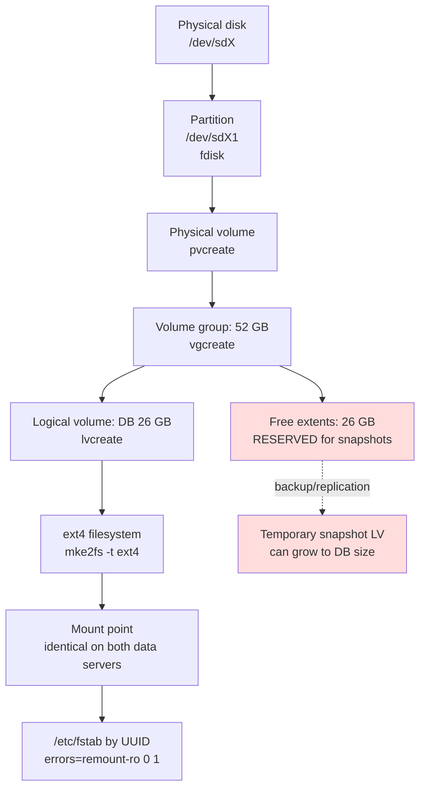

# Storage & LVM — Nokia 5520 AMS 9.8.3

**Overview:** This guide is the "disk plumbing" chapter — how AMS's database gets its own dedicated disk space using Linux LVM, and the one rule (keep snapshot room free) that protects your backups.

> **Safety:** Replace every `<placeholder>`. Confirm the host, site, role, and account. Read the risk note, take a tested backup before changes, and use an approved maintenance window for service-affecting work. Nokia documentation and site procedures remain authoritative.

---

## Overview

**What it is.** AMS keeps its database on Linux disk volumes managed by LVM (Logical Volume Manager) — a layer that lets you carve flexible "logical volumes" out of physical disks. This guide covers the five storage rules, the full new-disk workflow (partition → physical volume → volume group → logical volume → filesystem → mount), making mounts persistent across reboots via `/etc/fstab`, and the capacity rule that matters most: **never fill the volume group completely — backup and replication need free space for a temporary snapshot that can grow to the size of the database volume.**

**Why you care.** Two failure modes live here, and both are ugly. Pick the wrong disk in `fdisk` and you destroy data that isn't yours to destroy. Fill the volume group to 100% and the next backup or replication snapshot has nowhere to go — your safety net breaks exactly when you need it. The documented example is a 52 GB volume group with 26 GB for the database and 26 GB left free for snapshots. That 50/50 split is the shape to remember.

**When to reach for it.**
- Commissioning: a new disk needs to become AMS database storage → the new-disk workflow.
- Daily/weekly: is there still snapshot room? → `vgs` / `lvs` / `pvs` / `df -hT`.
- Someone proposes extending the database LV "because there's free space" → the warning section (don't, until the VG is full).
- A mount vanished after reboot → the persistent-mount (fstab) section.

**The technical depth.** LVM stack, bottom to top: physical disk partition → **PV** (physical volume, `pvcreate`) → **VG** (volume group, `vgcreate`) → **LV** (logical volume, `lvcreate`) → filesystem (`mke2fs -t ext4`) → mount point. The rules: (1) dedicated LV for the AMS database; (2) free VG extents at least as large as the database LV; (3) identical database mount points on both data servers; (4) LVM is required for cluster installations on RHEL; (5) no unrelated data on the database volume. Persistent mounts go in `/etc/fstab` keyed by filesystem **UUID** (device names like `/dev/sdX` can reorder; UUIDs don't), with `errors=remount-ro 0 1`; validate with `mount -a` before rebooting. The warning: do not extend the database LV until the VG is full, because backup/replication needs room for a temporary snapshot LV that may grow to DB-volume size.

---

## Diagram: the LVM stack and the snapshot-space rule



---

## CLI workflows

Storage commands need `root`/`sudo`. AMS commands run as `amssys`. Tasks are listed alphabetically.

### Capacity check — 🟢 Read-only (daily/weekly use)

```bash
vgs
lvs
pvs
df -hT "<mountdir>"
findmnt "<mountdir>"
```

What success looks like: the VG shows free extents at least as large as the database LV; the DB mount is under comfortable utilization; `findmnt` confirms the expected device is mounted at the expected path. **The rule:** free VG extents ≥ database LV size, always. If free space is shrinking toward the DB LV size, raise it before the next backup window — do not "fix" it by extending the DB LV (see the warning below).

### Make the mount persistent — 🟡 A bad fstab entry can interrupt boot

After creating and mounting the volume, make it survive reboots. Back up `/etc/fstab` first and keep console access (a typo here can stop the boot).

```bash
sudo blkid "/dev/<vgname>/<lvname>"
```

Add this line to `/etc/fstab` (replace values with the real UUID, mount dir, and type):

```fstab
UUID=<logical-volume-uuid> <mountdir> ext4 errors=remount-ro 0 1
```

Then validate **before** rebooting:

```bash
sudo mount -a
findmnt "<mountdir>"
df -hT "<mountdir>"
vgs
lvs
pvs
```

What success looks like: `mount -a` returns cleanly (no errors), `findmnt` shows the volume mounted at `<mountdir>`, and `df -hT` shows the expected size and `ext4` type. **Back out:** restore `/etc/fstab` from the backup you took and re-run `mount -a`.

### New-disk workflow — 🔴 Destructive if the wrong disk is selected

When: a new physical disk must become AMS storage. **Before you run it:** match the disk's serial/WWN to the approved disk — do not trust `/dev/sdX` alone, because device names can reorder. Verify with `fdisk -l` that the disk is the intended (empty) one.

```bash
sudo fdisk -l "/dev/<disk>"
sudo fdisk "/dev/<disk>"
sudo pvcreate "/dev/<partition>"
sudo vgcreate "<vgname>" "/dev/<partition>"
sudo lvcreate -L "<size>" -n "<lvname>" "<vgname>"
sudo mke2fs -t ext4 "/dev/<vgname>/<lvname>"
sudo mkdir -p "<mountdir>"
sudo mount "/dev/<vgname>/<lvname>" "<mountdir>"
sudo blkid "/dev/<vgname>/<lvname>"
```

Then make it persistent (previous section). What success looks like: `lvs` shows the new LV, `df -hT <mountdir>` shows the ext4 filesystem at the expected size, and the mount survives `mount -a`. **Back out:** unmount, remove the fstab entry, then `lvremove`, `vgremove`, `pvremove` in reverse order — only if the disk held nothing else and you are certain it is the right disk.

### Preserve snapshot space — 🟡 Consuming free extents can break backup/replication

The standing check (same commands as capacity check — they are the control):

```bash
vgs
lvs
pvs
```

The documented shape: 52 GB VG → 26 GB database LV + 26 GB free for snapshots. **Do not extend the database LV until the VG is full.** Backup/replication creates a temporary snapshot LV that may grow to DB-volume size; if the free extents are gone, the snapshot fails and the backup fails with it.

### Troubleshooting: mount missing after reboot

1. Check what actually mounted: `findmnt <mountdir>` and `df -hT <mountdir>`.
2. Check fstab for typos: compare the `UUID=` value against `sudo blkid /dev/<vgname>/<lvname>`.
3. Test without rebooting: `sudo mount -a` — fix any error it reports.
4. If the UUID in fstab doesn't match `blkid` output, the filesystem was recreated or you're looking at the wrong volume — stop and verify device identity before changing anything.

### Troubleshooting: VG nearly full, backup failing

1. Confirm: `vgs` (free extents), `lvs` (snapshot LV size if one is stuck).
2. A stuck/orphaned snapshot LV from a failed backup can hold space — investigate before deleting anything; confirm with the backup logs which snapshot belongs to which job.
3. Do **not** extend the database LV to "use" the free space — that free space is the snapshot reserve.
4. Long-term fix per the source's sizing logic: add a disk and extend the VG (`vgextend`), keeping the free-extents ≥ DB-LV rule.

### Automation: storage health check snippet

Run as root or via `sudo`. Replace `<mountdir>` with the database mount point before running:

```bash
#!/bin/bash
# ams-storage-check.sh — capacity and snapshot-space check. Read-only.
# Replace <mountdir> before running.
set -u
MNT="<mountdir>"
echo "== Volume groups (watch VFree) =="
vgs
echo "== Logical volumes =="
lvs
echo "== DB mount usage =="
df -hT "$MNT"
echo "== Rule: VFree must stay >= database LV size (snapshot reserve) =="
```

---

## GUI section (secondary)

If you prefer the GUI: there is no GUI path for any of this. LVM provisioning, fstab editing, and capacity checks are Linux system administration done in the shell as `root`/`sudo` — the AMS graphical client (User Guide) manages network elements, not server disks. Where the GUI falls short vs. CLI: it cannot create a physical volume, cannot validate an fstab entry, and cannot show you VG free extents. For storage work, the CLI is the only option; keep the command output in your change record.

---

## Platform script blocks

### Linux bash

Native commands on the AMS server (`sudo` for storage ops). Read-only capacity check (copy-pasteable):

```bash
vgs
lvs
pvs
df -hT "<mountdir>"
findmnt "<mountdir>"
```

Full new-disk workflow with an identity gate (replace all `<...>` before running; aborts unless you confirm the disk serial):

```bash
#!/bin/bash
# ams-new-disk.sh — provision a disk for AMS. DESTRUCTIVE if wrong disk.
set -u
DISK="<disk>"          # e.g. sdb — VERIFY serial/WWN first
PART="<partition>"     # e.g. /dev/sdb1
VG="<vgname>"
LV="<lvname>"
SIZE="<size>"          # e.g. 26G
MNT="<mountdir>"
echo "About to partition /dev/$DISK. Confirm serial/WWN matches the approved disk."
sudo fdisk -l "/dev/$DISK"
read -r -p "Type the disk device again to confirm (e.g. sdb): " CONFIRM
[ "$CONFIRM" = "$DISK" ] || { echo "Aborted: confirmation mismatch."; exit 1; }
sudo fdisk "/dev/$DISK"
sudo pvcreate "$PART"
sudo vgcreate "$VG" "$PART"
sudo lvcreate -L "$SIZE" -n "$LV" "$VG"
sudo mke2fs -t ext4 "/dev/$VG/$LV"
sudo mkdir -p "$MNT"
sudo mount "/dev/$VG/$LV" "$MNT"
sudo blkid "/dev/$VG/$LV"
echo "Add the UUID above to /etc/fstab (back it up first), then run: sudo mount -a"
```

### Nix-on-Droid

**N/A — AMS server storage runs on RHEL; LVM/`fdisk` on an Android phone's storage is unrelated to AMS and must not be attempted.** The honest pattern is the phone as an SSH terminal for **read-only** capacity checks against the real server:

```bash
nix-env -iA nixpkgs.openssh
ssh amssys@<ams-host> 'vgs; lvs; df -hT <mountdir>'
```

Android gotchas: no systemd; never run partitioning or LVM commands against phone storage expecting AMS results — the phone is a terminal here, not the AMS server.

### PowerShell

Win32 OpenSSH reaches the server; storage commands run on RHEL (`sudo`). Logic mirrors the verified Linux bash block above:

> **Status:** syntax-verified with PowerShell 7 on Arch (pwsh) — not executed against live systems.
```powershell
ssh amssys@<ams-host> 'vgs; lvs; pvs'
ssh amssys@<ams-host> 'df -hT <mountdir>; findmnt <mountdir>'
```

Destructive work (partitioning, LV changes) belongs in an interactive, recorded session — never fire-and-forget over one-shot SSH:

> **Status:** syntax-verified with PowerShell 7 on Arch (pwsh) — not executed against live systems.
```powershell
ssh amssys@<ams-host>
# You are now at the remote Linux prompt (sudo for storage ops); run the change, then:
exit
```

### Termux

**N/A — AMS storage lives on the RHEL server's LVM; nothing on the phone's storage is AMS storage.** Use the phone as an SSH terminal for read-only checks:

```bash
pkg install -y openssh
ssh amssys@<ams-host> 'vgs; lvs; df -hT <mountdir>'
```

Android gotchas: no systemd; do not run `fdisk`/`pvcreate`/`lvcreate` on the phone — phone block devices are not the AMS server's disks.

### Windows cmd

Win32 OpenSSH reaches the server; the actual commands run on RHEL. Logic mirrors the verified Linux bash block above:

> **Status:** UNVERIFIED — no Windows cmd available for testing.
```cmd
ssh amssys@<ams-host> "vgs & lvs & pvs"
ssh amssys@<ams-host> "df -hT <mountdir>"
```

Note: cmd.exe chains remote commands with `&` inside the quoted string (the remote shell still parses the rest).

### WSL/Arch

Arch Linux in WSL is an SSH console to the AMS server — install OpenSSH with pacman, then run the commands remotely on RHEL:

```bash
sudo pacman -S --needed openssh
ssh amssys@<ams-host> 'vgs; lvs; pvs; df -hT <mountdir>; findmnt <mountdir>'
```

---

## Impact warnings

| Operation | Impact level (per source) | Why it matters |
|---|---|---|
| `fdisk` / `pvcreate` on the wrong disk | 🔴 **Destructive** | Writes a new partition table / LVM metadata — existing data on that disk is destroyed. Match serial/WWN, never trust `/dev/sdX` alone |
| Extending the database LV while free extents remain | 🟡 **Breaks backup/replication** | Snapshot LV needs free space up to DB size; consuming it kills the safety net |
| Bad `/etc/fstab` entry | 🟡 **Can interrupt boot** | Back up fstab, validate with `mount -a`, keep console access |
| Unrelated data on the DB volume | 🟡 **Policy violation** | Contention and capacity surprises on the database volume |
| Non-identical DB mount points on the two data servers | 🟡 **Cluster inconsistency** | Failover breaks if paths differ between data servers |
| `vgs` / `lvs` / `pvs` / `df -hT` / `findmnt` / `blkid` | 🟢 **Read-only** | Safe any time |

**The one rule to carry on site:** free VG extents ≥ database LV size, always — that free space is the snapshot reserve, not spare capacity.

---

## Quick reference (alphabetical)

| Task | Command | Run as |
|---|---|---|
| Capacity check | `vgs`, `lvs`, `pvs`, `df -hT <mountdir>`, `findmnt <mountdir>` | root/sudo for some |
| Filesystem UUID | `blkid /dev/<vgname>/<lvname>` | sudo |
| List disks | `fdisk -l /dev/<disk>` | sudo |
| Make filesystem | `mke2fs -t ext4 /dev/<vgname>/<lvname>` | sudo |
| Mount | `mount /dev/<vgname>/<lvname> <mountdir>` | sudo |
| New logical volume | `lvcreate -L <size> -n <lvname> <vgname>` | sudo |
| New physical volume | `pvcreate /dev/<partition>` | sudo |
| New volume group | `vgcreate <vgname> /dev/<partition>` | sudo |
| Partition disk | `fdisk /dev/<disk>` | sudo |
| Persistent mount | `UUID=<uuid> <mountdir> ext4 errors=remount-ro 0 1` in `/etc/fstab`, then `mount -a` | sudo |
