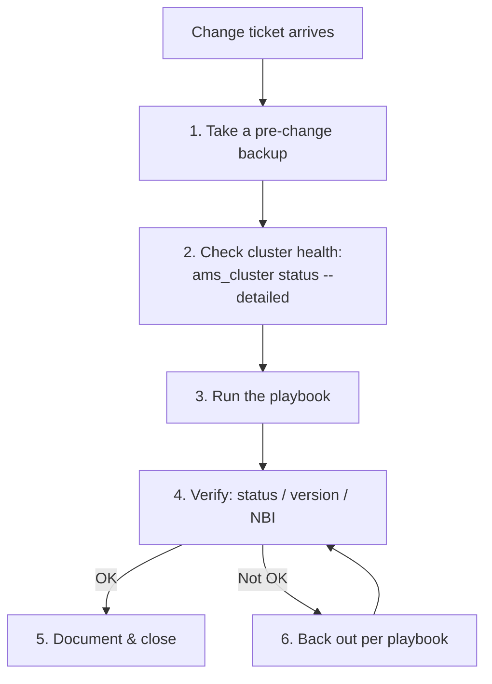

# Operational Playbooks — Nokia 5520 AMS 9.8.3

**Overview:** Sixteen alphabetized, CLI-first playbooks for the real jobs you'll do on an AMS system — each one says when to use it, the exact commands, what success looks like, and how to back out.

> **Safety:** Replace every `<placeholder>` before running. Confirm the host, site, role, and account. Read the risk note, take a tested backup before changes, and use an approved maintenance window for service-affecting work. Nokia documentation and site procedures remain authoritative.

---

## Overview

**What it is.** This is the field manual: sixteen operational playbooks in alphabetical order, each one a complete job you might be sent to do — activating a release, backing up, changing ports, collecting support evidence, converting simplex to cluster, defragmenting the database, evacuating a server, falling back to local auth, forcing a data-server switchover, migrating from backup, recovering an admin account, restoring on different hardware, rotating database credentials, taking a pre-change backup, validating installed software, and verifying the northbound interface.

**Why you care.** On site you don't get to improvise — you get a change ticket, a maintenance window, and an expectation that you can say exactly what you ran and exactly how you'd undo it. Every playbook here gives you that: the trigger ("when to use it"), the literal commands (run as `amssys` unless marked `root`/`sudo`), the observable success criteria, and the back-out path.

**When to reach for it.** Open this guide when you have a named task and need the step-by-step. Start every non-trivial job with **Take a pre-change backup**; end every verification with **Validate installed software** or **Verify NBI** as appropriate.

**The technical depth.** Conventions: `<value>` is required and site-specific, `[value]` is optional. AMS scripts live on the `amssys` `PATH`, so no path prefix or `./` is needed (except where the source gives an absolute path, e.g. the activate script). The playbooks merge all three source flavors: where the root and Linux flavors differ on privilege (`ams_install_license` vs `sudo amssys_install_license`… precisely `sudo ams_install_license`), the merged form is noted.

---

## Diagram: the standard job flow



---

## The playbooks (A–Z)

### Activate a release — 🟡 Service/configuration change

**When to use it:** A new AMS release is installed under `/opt/ams/software/<release>/` and must become the live one (or you must switch back to a previous release).

**Exact commands** (activate needs `root`/`sudo`; the server control runs as `amssys`):

```bash
sudo /opt/ams/software/<release>/bin/ams_activate.sh
sudo -iu amssys ams_server start
sudo -iu amssys ams_server status
```

**What success looks like:** `ams_server status` shows services running, and `ams_server version` reports the newly activated release.

**How to back out:** Re-run `ams_activate.sh` with the previous release's path, then `ams_server start` and verify with `status`/`version`. The pre-change backup playbook is your safety net.

---

### Back up to SFTP — 🟢 Read-only/low impact

**When to use it:** You need an off-server backup before a change, or the site's backup target is an SFTP server.

**Exact commands:**

```bash
sudo -iu amssys ams_backup.sh -z 'sftp://<host>/<path>/ams-backup.tar.gz'
```

Prefer key-based authentication for the SFTP target. **What success looks like:** the archive is created at the target path and the log output confirms a clean backup — validate both, don't assume.

**How to back out:** Nothing to undo (read-only); delete the archive if it was created in error.

---

### Change SFTP port — 🟡 Service/configuration change

**When to use it:** Site policy requires the AMS SFTP service on a non-default port.

**Exact commands:**

```bash
ams_set_sftp_port.sh --check
ams_set_sftp_port.sh 2222
ams_server restart
ams_updatefirewall
```

**What success looks like:** `--check` reports the new port (2222 in this example), the firewall reflects it (`ams_updatefirewall` applied), and an SFTP client connects on the new port.

**How to back out:** Re-run `ams_set_sftp_port.sh` with the previous port, then `ams_server restart` and `ams_updatefirewall` again.

---

### Collect a support bundle — 🟡 May contain sensitive data; JVM capture adds load

**When to use it:** Nokia support asks for evidence, or you need a full state capture before/after a change.

**Exact commands:**

```bash
ams_cluster status --detailed
ams_log_manager.sh --collect --category all --target all --destination file:///tmp/ams-support.tar
ams_support.sh --domain app --command jstack --target all --destination /tmp/ams-jstack.tar
```

**What success looks like:** both `.tar` files exist at their destinations with non-trivial size; cluster status output is captured alongside them.

**How to back out:** Delete the tar files when no longer needed — and treat them as sensitive (they may contain credentials and customer data); transfer them to support over a secure channel only.

---

### Convert simplex to cluster — 🔴 Service-affecting

**When to use it:** A standalone (simplex) AMS server must become part of a cluster.

**Exact commands:**

```bash
ams_server stop
ams_simplex_to_cluster.sh
ams_updatefirewall
ams_server start
ams_cluster status --detailed
```

`ams_simplex_to_cluster.sh` is interactive — it requests the cluster NIC, multicast addresses, and alternate data-server details. Have those on paper before you start.

**What success looks like:** `ams_cluster status --detailed` shows the cluster formed with all expected members in stable roles.

**How to back out:** The source defines no automated de-conversion; restore from the tested pre-change backup. This is why the backup playbook comes first.

---

### Defragment database — 🟡 Execute only in a maintenance window

**When to use it:** Database performance has degraded and the maintenance plan calls for defragmentation.

**Exact commands** (`$AMSSCRIPTSDIR` is an AMS environment variable already on the `amssys` PATH context):

```bash
$AMSSCRIPTSDIR/ams_db_defragment.sh all analyse
ams_server stop
$AMSSCRIPTSDIR/ams_db_defragment.sh all execute
ams_server start
```

Run the analysis any time; run **execute** only on the active data server inside an approved window.

**What success looks like:** analysis reports fragmentation, execution completes without errors, and `ams_server status` shows services healthy afterward.

**How to back out:** Defragmentation has no undo — restore from the tested pre-change backup if the execute step causes problems.

---

### Evacuate application server — 🟡 Capacity and placement impact

**When to use it:** A host needs maintenance; its NEs must be served by the remaining application servers first.

**Exact commands:**

```bash
ams_cluster status --detailed
ams_cluster evacuate_ne "<cluster-ip>"
ams_show_ne_balancing.sh -a "<cluster-ip>"
ams_server stop maintenance
```

Record the current placement and confirm remaining capacity **before** evacuating. Return the host to service:

```bash
ams_server start
ams_cluster unevacuate_ne "<cluster-ip>" 1
ams_cluster status --detailed
```

**What success looks like:** NEs are rebalanced across the remaining servers (check with `ams_show_ne_balancing.sh`), the host is stopped in maintenance mode, and after the return sequence the cluster is healthy again.

**How to back out:** `ams_server start` then `ams_cluster unevacuate_ne <cluster-ip> <weight>` with the recorded weight. Note: unevacuation rebalances but does **not** guarantee the same NEs return to this host.

---

### Fall back to local authentication — 🟡 Security change

**When to use it:** LDAP/RADIUS failure prevents logins and you need local AMS accounts working now.

**Exact commands:**

```bash
ams_switch_authentication_local
```

**What success looks like:** local AMS accounts can log in again.

**How to back out:** Restore the intended external authentication after remediation (per the Administrator Guide / site procedure — the source names no mirror command, so record which external configuration was active before you switch).

---

### Force data-server switchover — 🟡 Service-affecting

**When to use it:** The active data server must be replaced by its peer (planned failover or failure response).

**Exact commands:**

```bash
ams_cluster status --detailed
ams_switch_active_dataserver
ams_cluster status --detailed
```

Use the `-f` flag only in automation that has independent health checks — never interactively to skip verification.

**What success looks like:** the second `status --detailed` shows the peer data server now active and the cluster stable.

**How to back out:** Run `ams_switch_active_dataserver` again to switch back, and verify with `status --detailed`.

---

### Migrate from backup — 🔴 High and service-affecting

**When to use it:** Rebuilding/persistency-copying AMS onto a system from a backup archive.

**Exact commands:**

```bash
ams_cluster stop
ams_copy_datafiles --force --from-backup /absolute/path/source-backup.tar
ams_server start
ams_server status all -l 30 -p 60
```

Install the required plug-ins **before** the persistency copy. Use an absolute path to the backup.

**What success looks like:** the copy completes, services start, and the looped status (`-l 30 -p 60`) shows everything stable.

**How to back out:** Restore from the tested pre-change backup; this playbook overwrites data in place.

---

### Recover administrator — 🟡 Security-sensitive

**When to use it:** The admin account is locked out or its sessions are wedged and normal login is impossible. Check release/setup restrictions first (per source).

**Exact commands:**

```bash
ams_support.sh --domain security --command killadminsessions
ams_support.sh --domain security --command resetadminpwd
```

**What success looks like:** stale admin sessions are cleared and the admin password is reset, allowing login.

**How to back out:** Re-secure the account immediately after recovery (set a proper password, verify sessions) — a reset password must not linger.

---

### Restore on different hardware — 🔴 High and service-affecting

**When to use it:** Restoring AMS data onto a host with a different host ID, so the old licenses don't apply — install new-host licenses instead.

**Exact commands** (restore as `amssys`; license install needs `root`/`sudo`):

```bash
ams_restore.sh -n /backup/ams-data.tar
sudo ams_install_license
ams_server start
```

**What success looks like:** restore completes, the new-host license installs, services start, and `ams_server status` is healthy.

**How to back out:** Restore from the pre-change backup of the target host; license changes follow the site's license procedure.

---

### Rotate database credentials — 🔴 High; script restarts service automatically

**When to use it:** Security policy requires rotating the AMS database password.

**Exact commands:**

```bash
ams_update_database_pwd.sh
```

Run as `amssys` or `root`. The password cannot exceed 32 characters and cannot contain spaces. The script stops AMS, updates credentials/configuration, and **automatically starts the cluster — do not manually restart afterward.**

**What success looks like:** the script completes cleanly, the cluster is up, and services authenticate against the database with the new password.

**How to back out:** Not reversible in place — restore from the tested pre-change backup.

---

### Take a pre-change backup — 🟢 Read-only/low impact

**When to use it:** Before **every** non-trivial change — this is the playbook that makes all the back-out paths real.

**Exact commands:**

```bash
ams_cluster status --detailed
ams_server version
ams_backup.sh -z /backup/prechange-ams.tar.gz
```

**What success looks like:** cluster health and version are captured, and the compressed backup archive exists at `/backup/prechange-ams.tar.gz` with the log confirming a clean run.

**How to back out:** Nothing to undo (read-only); delete the archive if it was created in error.

---

### Validate installed software — 🟢 Read-only/low impact

**When to use it:** You need a known-good component set to compare against — after an upgrade, before handover, or when something "feels off."

**Exact commands:**

```bash
ams_server version save --label GOLDEN983 /secure/GoldenEMSSwConfig
ams_server version verify /secure/GoldenEMSSwConfig
ams_cluster status sw
```

Save the golden snapshot once from a known-good system; `verify` compares the current system against it; `status sw` confirms software agreement across cluster nodes.

**What success looks like:** `verify` reports no differences and `status sw` shows agreement everywhere.

**How to back out:** Nothing to undo (read-only).

---

### Verify NBI — 🟢 Read-only/low impact

**When to use it:** Before debugging any SOAP integration — first prove the northbound interface itself answers over HTTPS.

**Exact commands:**

```bash
curl --cacert /path/ams-ca.pem https://<host>:8443/ams/services/UserManagementMgr
curl --cacert /path/ams-ca.pem https://<host>:8443/ams/schema/doc/html/index.html
```

**What success looks like:** both endpoints answer over TLS with the site CA (service descriptor and the schema documentation page load). Only then is it worth debugging SOAP envelopes — and those come from the activated schema documentation, not from memory.

**How to back out:** Nothing to undo (read-only).

---

## Troubleshooting scenarios

### A playbook fails halfway

1. **Stop.** Do not improvise the next step.
2. Capture state: `ams_cluster status --detailed`, `ams_server status`, and the exact error output.
3. Check the playbook's back-out path above — most destructive playbooks back out via the pre-change backup.
4. If the back-out path is "restore from backup," verify the backup archive exists and is valid **before** restoring (see Take a pre-change backup).
5. For cluster/geo anomalies, see the dual-active and geo-timer troubleshooting in `server-cluster-geo.md`; for login failures, see the auth troubleshooting in `security-identity-ssl.md`.

### `ams_server start` doesn't bring everything up

1. `ams_server status all -l 10 -p 60` — watch whether services settle or flap.
2. Confirm startup order was respected (preferred data server → non-preferred → app servers; active site before standby) — see `server-cluster-geo.md`.
3. Collect a support bundle and check logs before retrying blindly.

### Automation: pre-change gate wrapper

Run as `amssys` before any change playbook. It snapshots health, version, and a compressed backup, and aborts if the backup fails:

```bash
#!/bin/bash
# ams-prechange-gate.sh — snapshot health + take backup. Aborts on failure.
# Run as: amssys. Replace /backup path if your site differs.
set -u
STAMP="$(date +%Y%m%d-%H%M%S)"
BACKUP="/backup/prechange-ams-${STAMP}.tar.gz"
ams_cluster status --detailed > "/tmp/prechange-status-${STAMP}.txt"
ams_server version > "/tmp/prechange-version-${STAMP}.txt"
ams_backup.sh -z "$BACKUP" || { echo "BACKUP FAILED — aborting change." >&2; exit 1; }
ls -lh "$BACKUP"
echo "Pre-change gate passed: $BACKUP"
```

---

## GUI section (secondary)

If you prefer the GUI: the graphical client documented in the User Guide covers day-to-day NE management. **But every playbook in this guide is CLI-first, and most have no GUI equivalent at all** — cluster conversion, database defragmentation, data-server switchover, persistency copy, license installation, key/password rotation, and SFTP port changes are all `amssys` shell procedures per the Administrator and Installation guides. Where the GUI falls short vs. CLI: no scriptable pre-change gate, no looped status polling (`-l/-p`), no copy-pasteable audit trail of exactly what ran, and no way to drive the same playbook identically across sites. Run the playbooks in the shell and keep the output in your change record.

---

## Platform script blocks

The pattern is the same for every playbook: AMS commands run on the RHEL server as `amssys`; every other platform is just a way to reach that server. The worked example below uses **Take a pre-change backup** (safe, copy-pasteable); substitute any playbook's commands into the same pattern.

### Linux bash

Native — on the AMS server as `amssys`:

```bash
ams_cluster status --detailed
ams_server version
ams_backup.sh -z /backup/prechange-ams.tar.gz
```

### Nix-on-Droid

**N/A — AMS server software runs on RHEL; you cannot install or run AMS on Android.** The honest pattern is the phone as an SSH terminal to reach the AMS server. Never run destructive playbooks (restore, migrate, convert, defragment) from a phone:

```bash
nix-env -iA nixpkgs.openssh
ssh amssys@<ams-host> 'ams_cluster status --detailed; ams_server version'
```

Android gotchas: no systemd; storage permissions gate `scp` of backup archives (grant storage access); background-execution limits can drop a session mid-change — keep change windows in the foreground.

### PowerShell

Win32 OpenSSH reaches the server; playbook commands run on RHEL as `amssys`. Logic mirrors the verified Linux bash block above:

> **Status:** syntax-verified with PowerShell 7 on Arch (pwsh) — not executed against live systems.
```powershell
ssh amssys@<ams-host> 'ams_cluster status --detailed; ams_server version'
ssh amssys@<ams-host> 'ams_backup.sh -z /backup/prechange-ams.tar.gz'
```

Native HTTPS check from the workstation (Verify NBI playbook):

> **Status:** syntax-verified with PowerShell 7 on Arch (pwsh) — not executed against live systems.
```powershell
curl.exe --cacert C:\path\ams-ca.pem https://<host>:8443/ams/services/UserManagementMgr
curl.exe --cacert C:\path\ams-ca.pem https://<host>:8443/ams/schema/doc/html/index.html
```

For change playbooks, open an interactive session and run the Linux commands there (recorded):

> **Status:** syntax-verified with PowerShell 7 on Arch (pwsh) — not executed against live systems.
```powershell
ssh amssys@<ams-host>
# You are now at the remote Linux prompt; run the playbook, then:
exit
```

### Termux

**N/A — AMS does not install on Android.** Use the phone as an SSH terminal; read-only playbooks only (status checks, Verify NBI via curl):

```bash
pkg install -y openssh curl
ssh amssys@<ams-host> 'ams_cluster status --detailed; ams_server version'
curl --cacert /path/ams-ca.pem https://<host>:8443/ams/services/UserManagementMgr
```

Android gotchas: no systemd; grant storage permission before `scp`; use `termux-wake-lock` (from `termux-api`) to keep sessions alive. Do not run change playbooks from the phone.

### Windows cmd

Win32 OpenSSH reaches the server; the actual commands run on RHEL. Logic mirrors the verified Linux bash block above:

> **Status:** UNVERIFIED — no Windows cmd available for testing.
```cmd
ssh amssys@<ams-host> "ams_cluster status --detailed"
curl.exe --cacert C:\path\ams-ca.pem https://<host>:8443/ams/services/UserManagementMgr
```

### WSL/Arch

Arch Linux in WSL is an SSH console to the AMS server — install OpenSSH (and curl) with pacman, then run the commands remotely on RHEL:

```bash
sudo pacman -S --needed openssh curl
ssh amssys@<ams-host> 'ams_cluster status --detailed; ams_server version'
curl --cacert /path/ams-ca.pem https://<host>:8443/ams/services/UserManagementMgr
```

---

## Impact warnings

| Playbook | Impact level (per source) | Key risk |
|---|---|---|
| Migrate from backup | 🔴 High and service-affecting | Overwrites data in place; install plug-ins first |
| Restore on different hardware | 🔴 High and service-affecting | New host ID → old licenses invalid; new license required |
| Rotate database credentials | 🔴 High | Script auto-restarts the cluster; do not restart manually |
| Convert simplex to cluster | 🔴 Service-affecting | No automated de-conversion; backup is the back-out |
| Activate a release | 🟡 Service/configuration change | Wrong release path = wrong software live |
| Change SFTP port | 🟡 Service/configuration change | Forgetting `ams_updatefirewall` breaks SFTP |
| Collect a support bundle | 🟡 Sensitive data; JVM load | Tars may contain credentials; `jstack` adds load |
| Defragment database | 🟡 Maintenance window only | Execute on active data server only |
| Evacuate application server | 🟡 Capacity/placement impact | NEs may not return to the same host |
| Fall back to local authentication | 🟡 Security change | Must restore external auth after remediation |
| Force data-server switchover | 🟡 Service-affecting | `-f` only with independent checks |
| Recover administrator | 🟡 Security-sensitive | Reset password must not linger |
| Back up to SFTP | 🟢 Read-only/low | Validate archive + log |
| Take a pre-change backup | 🟢 Read-only/low | Run before every change |
| Validate installed software | 🟢 Read-only/low | Compare against golden |
| Verify NBI | 🟢 Read-only/low | Prove HTTPS before SOAP debugging |

**Standing rule:** every 🔴 playbook needs an approved maintenance window, a tested backup (Take a pre-change backup), and its back-out path read before you start — not after something breaks.
