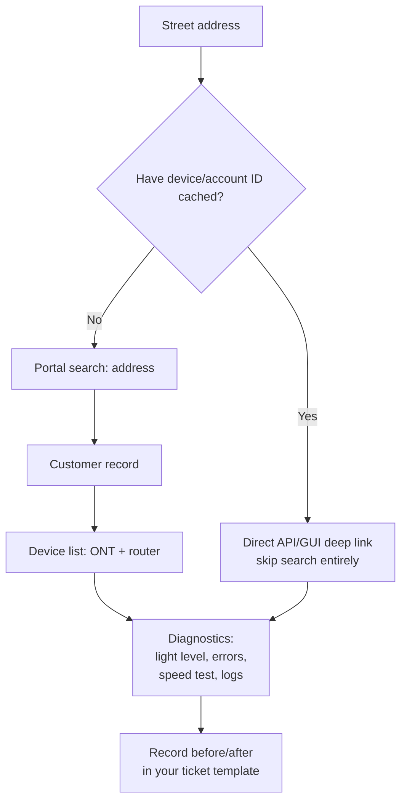

# Address → Customer → Device → Diagnostics

**Overview:** The fastest way to go from a street address to live diagnostics (signal levels, errors, speed) on a customer's gear — skipping as much of the slow portal clicking as possible.

## Overview: what it is, why it matters, when to use it

**What it is.** Your most common BxE job: a dispatcher gives you an address (or you're standing at one), and you need the customer's service record, their ONT/router, and live diagnostics — optical light levels, error counters, speed test results, device logs.

**Why a field tech cares.** Every click in the portal costs seconds and the portal is slow. The difference between "click: search → customer → devices → diagnostics tab → wait → wait" and a scripted lookup is the difference between a 5-minute pre-check and a 30-second one. This guide gives you the fastest GUI path *and* the curl-based shortcut pattern (discover the portal's real API calls once, replay them forever).

**When to reach for it.** Pre-dispatch triage ("is this a fiber problem or a Wi-Fi problem?"), on-site verification ("what was the light level before I touched it?"), and repeat visits (cache the device IDs so lookup is instant).

**Verified vs inferred.** VERIFIED: the portal URL, that it's OpenShift-hosted, that your templates record ONT/SB/splitter light levels in dB/m and Plume speed tests — so diagnostics-by-address is a real portal workflow. INFERRED: the exact API endpoint paths below are *patterns* (every web app has them; yours will differ) — section B teaches you to discover the real ones in 10 minutes with browser devtools.

## Diagram



## CLI workflows

### A. Setup: one-time API discovery (10 minutes, do this on Wi-Fi)

Every portal action is an HTTP request. Watch them once, replay them forever:

```bash
# 1. Open the BxE portal in your desktop browser, open DevTools (F12) -> Network tab.
# 2. Log in, search an address, open diagnostics. Watch the requests.
# 3. For each request you care about: right-click -> Copy -> Copy as cURL.
# 4. Save the patterns below with YOUR portal's real paths filled in.
#
# What to capture (typical shapes — replace with what you actually see):
#   POST <portal>/api/auth/login            -> session cookie / token
#   GET  <portal>/api/customers?address=...  -> customer + account IDs
#   GET  <portal>/api/customers/<id>/devices -> ONT/router inventory
#   GET  <portal>/api/devices/<id>/diagnostics -> signal, errors, logs
#   POST <portal>/api/devices/<id>/speedtest -> trigger remote speed test
```

### B. Daily use: session login that never touches history

```bash
# BXE_USER / BXE_PASS come from the environment or a password manager — NEVER
# typed into a command line (see portal-login-session.md). Leading space keeps
# the command out of history even if HISTCONTROL isn't set (see blockers below).
 BXE_BASE="https://bxe-portal-prime.content.prod.oscp.ent.tds.net"
 BXE_JAR="$HOME/.cache/bxe-cookies.txt"   # 600 perms; session only
 mkdir -p "$HOME/.cache" && chmod 700 "$HOME/.cache"

# Discover the real login endpoint in DevTools (step A), then e.g.:
 curl -sS -c "$BXE_JAR" -X POST "$BXE_BASE/<login-path>" \
   -H 'Content-Type: application/json' \
   --data "$(printf '{"username":"%s","password":"%s"}' "$BXE_USER" "$BXE_PASS")" \
   -o /dev/null -w "login http=%{http_code}\n"
# Replace <login-path> and the JSON field names with what DevTools showed.
```

**Blockers / gotchas:** if login needs SSO/MFA in a browser, curl can't do it alone — use the cookie-export pattern in `portal-login-session.md` instead.

### C. Daily use: address → diagnostics in one script

```bash
#!/usr/bin/env bash
# bxe-diag: address -> customer -> devices -> diagnostics. Fill in the
# <angle-bracket> paths/fields from your DevTools discovery (section A).
set -euo pipefail
BXE_BASE="${BXE_BASE:-https://bxe-portal-prime.content.prod.oscp.ent.tds.net}"
BXE_JAR="${BXE_JAR:-$HOME/.cache/bxe-cookies.txt}"
ADDR="${1:?usage: bxe-diag \"<ADDRESS>\"}"

# 1. Address search -> customer ID (replace path + jq filter with yours)
CID="$(curl -sS -b "$BXE_JAR" --get "$BXE_BASE/<customer-search-path>" \
  --data-urlencode "q=$ADDR" | jq -r '.<customers[0].id>')"
echo "customer=$CID"

# 2. Devices on the account
curl -sS -b "$BXE_JAR" "$BXE_BASE/<devices-path>/$CID" | jq '.'

# 3. Diagnostics per device (replace <device-id>; loop if several)
DID="<device-id>"
curl -sS -b "$BXE_JAR" "$BXE_BASE/<diagnostics-path>/$DID" | jq '.'
```

### D. Troubleshooting: capture a before/after evidence bundle

```bash
# Run BEFORE you touch anything and AFTER the fix. Diff the two files.
# Proves the fix worked and protects you if the customer disputes it.
bxe-diag "<ADDRESS>" > "diag-before-$(date +%Y%m%d-%H%M).json"
# ... do the work ...
bxe-diag "<ADDRESS>" > "diag-after-$(date +%Y%m%d-%H%M).json"
diff -u diag-before-*.json diag-after-*.json | head -50
```

### E. Automation: cache the address → device-ID map

```bash
# The portal search is the slowest step. Cache it per customer.
# ~/.cache/bxe-map: "address<TAB>customer-id<TAB>device-id"
bxe-cache-lookup() {
  grep -i -m1 "$1" "$HOME/.cache/bxe-map" || echo "MISS: run full lookup once"
}
# After a successful lookup, append the mapping (leading space: no history):
 echo -e "<ADDRESS>\t<CID>\t<DID>" >> "$HOME/.cache/bxe-map"
```

## GUI section (secondary)

Fastest known GUI path (adapt to what you see):
1. Bookmark the **deep link** to diagnostics search, not the portal homepage — one fewer page load.
2. Learn the **keyboard flow**: `/` or Ctrl-K usually focuses search → type address → Enter → first result → Tab to Devices. Never touch the mouse.
3. Open customer record and diagnostics in **separate tabs** (Ctrl-click) so the back button never triggers a re-search.
4. If the portal has a "recent customers" list, use it for callbacks — it's the cheapest lookup there is.

## Platform script blocks

### Linux bash

```bash
# Full workflow above runs natively. Keep cookies in $HOME/.cache (700).
# Install jq once: your distro's package manager.
```

### Nix-on-Droid

```bash
nix-env -iA nixpkgs.curl nixpkgs.jq
# Same scripts; store BXE_BASE/BXE_JAR in ~/.profile. Android gotchas:
# no systemd (irrelevant), termux-wake-lock for long speed-test polls,
# storage permission if you save evidence bundles outside $HOME.
```

### PowerShell

> **Status:** syntax-verified with PowerShell 7 on Arch (pwsh) — not executed against live systems.
```powershell
# Equivalent using Invoke-RestMethod with a session variable:
$base = "https://bxe-portal-prime.content.prod.oscp.ent.tds.net"
$session = New-Object Microsoft.PowerShell.Commands.WebRequestSession
# Fill login/diag calls from your DevTools discovery; see portal-login-session.md
# for the secure credential pattern (Get-Credential, never hardcoded).
# NOTE: unverified on Windows — test before field use.
```

### Termux

```bash
pkg install -y curl jq
# Same bash scripts. Export BXE_USER via `read -s` at session start;
# never put credentials in Termux:Widget shortcuts.
```

### Windows cmd

> **Status:** UNVERIFIED — no Windows cmd available for testing.
```cmd
:: Prefer PowerShell for this workflow (Invoke-RestMethod handles sessions
:: far better than curl.exe one-liners). See the PowerShell block.
:: NOTE: unverified on Windows — test before field use.
```

### WSL/Arch

```bash
sudo pacman -S --needed curl jq
# Identical to Linux bash; cookies at $HOME/.cache shared with Windows
# only if you want them to be — prefer keeping the jar Linux-side.
```

> **Platform coverage:** all six covered. The discovery step (A) needs a desktop-class browser with DevTools — do it once on a laptop, then the scripts run anywhere.

## Impact warnings

| Item | Impact |
|---|---|
| Credentials in shell history / scripts | **Security incident** — customer-data system; see `portal-login-session.md` |
| Hitting diagnostics endpoints in a tight loop | Can look like abuse; add `sleep 1` between polls, cache aggressively |
| Acting on a cached device-ID for the wrong address | Verify the address matches before any config change |

## Sources

- VERIFIED: portal URL `https://bxe-portal-prime.content.prod.oscp.ent.tds.net/` (Matt); OpenShift hosting (URL structure); `templates/*/echo.md` etc. in this repo (BXE certification + light-level fields).
- INFERRED: API path shapes and JSON fields — discover yours via section A. Marked `<...>` everywhere they appear.
