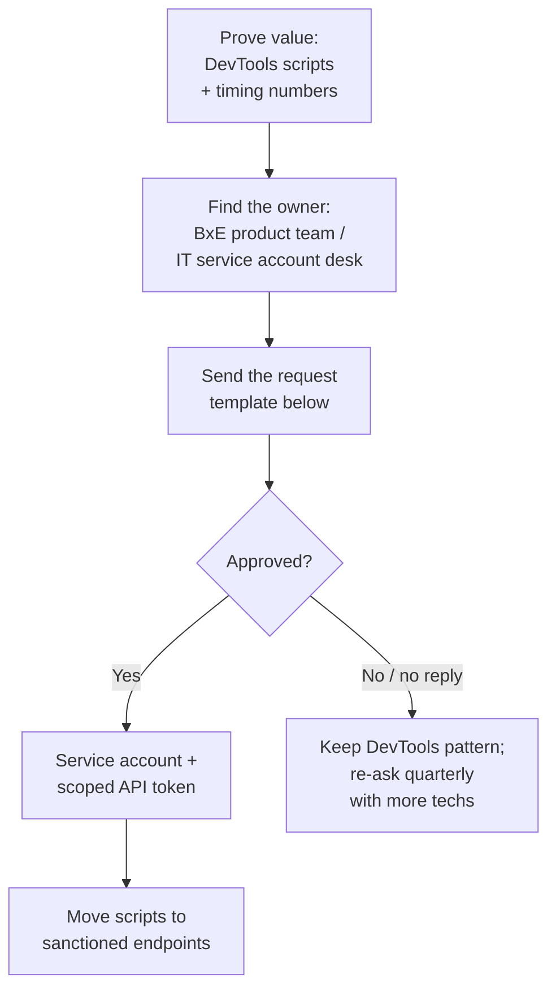

# API Access Request (what to ask for)

**Overview:** BxE has no public API — this is the template for asking TDS internal teams for the access that makes everything else in this directory possible, and what to ask for exactly.

## Overview: what it is, why it matters, when to use it

**What it is.** A fill-in-the-blanks request for supported, sanctioned API/automation access to BxE: who to ask, what endpoints you need, what to promise about security, and what to do if they say no.

**Why a field tech cares.** Everything in `address-to-diagnostics.md` and `slow-portal-workarounds.md` that goes beyond clicking is reverse-engineering the portal's private API. That works, but it's fragile (breaks on portal updates) and unofficial. A sanctioned API key or service account is faster to build on, doesn't break, and doesn't look like misuse. This template maximizes your chance of a "yes."

**When to reach for it.** After you've proven the value with the DevTools pattern (show them the before/after timing), when your scripts break after a portal update, or when you want to share tooling with other techs officially.

**Verified vs inferred.** VERIFIED: there is no public BxE API documentation anywhere (searched 2026-09-30). INFERRED: the team names and process below are educated guesses for a carrier IT org — replace with your actual chain.

## Diagram



## CLI workflows

### A. Setup: gather your evidence before asking

```bash
# Decision-makers say yes to numbers. Collect these first:
# 1. Time the GUI path: address -> diagnostics, stopwatch, 5 samples.
# 2. Time your scripted path (address-to-diagnostics.md section C).
# 3. Count how many lookups you do per week.
# 4. Note every portal outage/slowness incident for a month.
cat <<'EOF'
GUI path mean:        ___ seconds (n=5)
Scripted path mean:   ___ seconds (n=5)
Lookups per week:     ___
Portal incidents/mo:  ___
EOF
```

### B. The request template (copy, fill, send)

```text
Subject: API/service-account access request for BxE field diagnostics automation

To: [BxE product owner / IT service account desk — ask your manager for the address]

Hi team,

I'm a field service technician ([REGION], tech ID <TECH_ID>). I use the BxE
portal daily for two workflows: customer diagnostics by address and
install/service certification. The portal UI is slow enough that I've built
personal tooling around its web requests to do my job (mean lookup time
___s GUI vs ___s scripted, ~___ lookups/week).

I'm requesting sanctioned access so this is supportable instead of fragile:

1. A service account (or API token) for my tech ID with READ-ONLY scope to:
   - customer lookup by address
   - device inventory per customer
   - device diagnostics (signal levels, errors, logs)
   - speed-test trigger + result poll
   (Write/certification endpoints only if you offer them; read-only is the priority.)

2. Rate limits and audit logging on your terms — I will stay inside them and
   cache aggressively (no polling loops).

3. A changelog/notification contact so my tooling doesn't silently break on
   portal updates.

What I commit to:
- Credentials in a password manager / env vars only; never in scripts, chat,
  tickets, or shell history.
- No customer PII stored beyond the job's evidence bundle; bundles kept per
  our data-retention policy.
- Tooling shared with other techs only through [your team's approved channel].

If a full API isn't available, I'd accept, in order of preference:
  a. a documented subset of the portal's existing endpoints,
  b. a bulk-export / reporting feed for diagnostics,
  c. a named contact for breakage after portal updates.

Thanks,
[NAME] | [TECH_ID] | [REGION] | [PHONE]
```

### C. If they say yes: migrate off reverse-engineered endpoints

```bash
# 1. Point BXE_BASE at the sanctioned base URL / token auth.
# 2. Replace each <angle-bracket> path with the documented one.
# 3. Delete the DevTools-derived fallbacks so nobody "fixes" scripts by
#    reverting to the fragile paths.
# 4. Share the migration notes with the techs who copied your scripts.
```

## GUI section (secondary)

None — this is a people process. The GUI-relevant tip: if your org has an IT service catalog / ticketing portal, file the request there *and* email the product owner; the ticket gives you a tracking number to follow up on.

## Platform script blocks

### Linux bash

```bash
# Evidence gathering (section A) is just notes + a stopwatch; no platform specifics.
date +%s  # use for timing samples: start/end epoch, subtract
```

### Nix-on-Droid

```bash
# N/A beyond notes. Keep the sent request in your password manager's secure
# notes so you can re-send it quarterly.
```

### PowerShell

> **Status:** syntax-verified with PowerShell 7 on Arch (pwsh) — not executed against live systems.
```powershell
# Timing helper for evidence:
$start = Get-Date; <# do the GUI lookup #>; (Get-Date) - $start
# NOTE: unverified on Windows — test before field use.
```

### Termux

```bash
# N/A beyond notes; same timing approach as Linux bash.
date +%s
```

### Windows cmd

> **Status:** UNVERIFIED — no Windows cmd available for testing.
```cmd
:: N/A beyond notes.
```

### WSL/Arch

```bash
# Same as Linux bash.
date +%s
```

> **Platform coverage:** all six trivially covered — this guide is a template + process, not software.

## Impact warnings

| Item | Impact |
|---|---|
| Sharing reverse-engineered scripts org-wide before approval | Looks like unsanctioned automation; keep it personal until you have a yes |
| Putting customer data in the request ticket | **Don't** — the template contains zero PII by design |

## Sources

- VERIFIED: no public BxE API docs found (web search 2026-09-30); portal URL from Matt.
- INFERRED: team names, approval process — replace with your org's reality.
