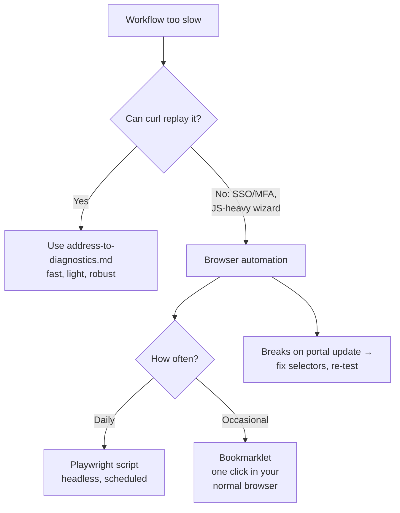

# Browser Automation Alternatives

**Overview:** When the portal has no API and clicking is too slow, drive the browser itself with scripts — what works, what's fragile, and what will get you in trouble.

## Overview: what it is, why it matters, when to use it

**What it is.** Browser automation = a script that opens the BxE portal, logs in, clicks search, and scrapes diagnostics — doing your clicks for you. Tools: Playwright, Selenium, or even a bookmarklet.

**Why a field tech cares.** It's the fallback when the DevTools/curl pattern (see `address-to-diagnostics.md`) can't cover a workflow — e.g. login requires SSO/MFA that curl can't do, or a flow is a 15-click wizard with no clean API underneath. Automation reclaims that time, but it's the most fragile option: it breaks on every portal redesign and runs a full browser (slow, heavy on a phone).

**When to reach for it.** Only after the direct-API pattern fails for a specific workflow. Prefer: API replay > browser automation > manual clicking.

**Verified vs inferred.** VERIFIED: none of these tools are BxE-specific — they're standard web-automation approaches. INFERRED: which BxE flows resist the curl pattern (you'll find out per-flow).

## Diagram



## CLI workflows

### A. Setup: Playwright for the stubborn flows

```bash
# Node.js + Playwright. Install once per machine:
npm i -g playwright 2>/dev/null || npm i playwright
npx playwright install chromium  # downloads a browser; needs disk + bandwidth

# Skeleton: log in with YOUR credentials from env (never hardcoded),
# wait for the search box, type the address, screenshot the result.
# Selectors below are PLACEHOLDERS — find yours with DevTools element picker.
```

```javascript
// bxe-auto.mjs — PLACEHOLDER selectors; adapt to the real portal DOM.
import { chromium } from 'playwright';
const browser = await chromium.launch({ headless: true });
const page = await browser.newPage();
await page.goto(process.env.BXE_BASE + '/<login-page>');
await page.fill('<username-selector>', process.env.BXE_USER);
await page.fill('<password-selector>', process.env.BXE_PASS);
await page.click('<submit-selector>');
await page.waitForSelector('<search-box-selector>');
await page.fill('<search-box-selector>', process.argv[2] /* address */);
await page.keyboard.press('Enter');
await page.waitForSelector('<diagnostics-panel-selector>');
await page.screenshot({ path: 'bxe-result.png' });
console.log(await page.content()); // or scrape specific fields
await browser.close();
```

Run it with a leading space (keeps env assignments out of history):

```bash
 BXE_BASE="https://bxe-portal-prime.content.prod.oscp.ent.tds.net" BXE_USER="$BXE_USER" BXE_PASS="$BXE_PASS" node bxe-auto.mjs "<ADDRESS>"
```

### B. Daily use: the bookmarklet (lightest option)

```javascript
// Save as a browser bookmark. One click on the diagnostics page scrapes the
// visible fields into a copy-pasteable summary. Adapt selectors to the portal.
javascript:(function(){
  const q=s=>document.querySelector(s)?.innerText?.trim()||'n/a';
  const out=[
    'signal: '+q('<signal-selector>'),
    'errors: '+q('<errors-selector>'),
    'speed: '+q('<speed-selector>')
  ].join('\n');
  prompt('BxE summary — Ctrl+C to copy', out);
})();
```

### C. Troubleshooting: it broke after a portal update

```bash
# 1. Run with headless:false and watch where it stops.
# 2. Re-pick selectors in DevTools (right-click element -> Copy -> selector).
# 3. Prefer stable selectors: [data-testid], IDs, aria-labels — never
#    auto-generated class names (they change every deploy).
# 4. Re-run the full flow once manually to confirm the portal itself works.
```

## GUI section (secondary)

The irony: you still need the GUI to *build* the automation (DevTools element picker). Tips:
- `npx playwright codegen <portal-url>` records your clicks and generates the script skeleton — fastest way to bootstrap.
- Run headed (`headless: false`) while developing, headless when stable.
- Screenshots on failure (`page.screenshot`) are your logs.

## Platform script blocks

### Linux bash

```bash
# Node 20+ required. Playwright's browser download is ~150MB — fine on a laptop.
node --version  # need >= 18
```

### Nix-on-Droid

```bash
# NOT RECOMMENDED: Playwright + Chromium is heavy and flaky under
# Nix-on-Droid. Use the bookmarklet (section B) on the phone instead,
# or run the Playwright script on a laptop and read results from the phone.
```

### PowerShell

> **Status:** syntax-verified with PowerShell 7 on Arch (pwsh) — not executed against live systems.
```powershell
# Playwright works on Windows via Node:
node --version
npx playwright install chromium
# Prefer WSL for the scripting (paths, env handling), browser via Windows.
# NOTE: unverified on Windows — test before field use.
```

### Termux

```bash
# NOT RECOMMENDED for Playwright (no official Chromium build for Termux).
# Use the bookmarklet in your mobile browser, or the curl pattern from
# address-to-diagnostics.md which runs fine here.
pkg install -y nodejs  # only if you insist; expect pain
```

### Windows cmd

> **Status:** UNVERIFIED — no Windows cmd available for testing.
```cmd
:: Use PowerShell or WSL instead — quoting env vars with secrets in cmd
:: is error-prone. See the PowerShell block.
```

### WSL/Arch

```bash
sudo pacman -S --needed nodejs npm
npm i playwright && npx playwright install chromium
# Same scripts as Linux bash.
```

> **Platform coverage:** Linux bash / WSL/Arch / PowerShell covered for Playwright; Nix-on-Droid and Termux explicitly N/A for Playwright (too heavy, no Chromium) — bookmarklet + curl pattern are the phone alternatives, with reasons stated.

## Impact warnings

| Item | Impact |
|---|---|
| Automation hammering the portal | Looks like a bot; keep it to human speed (waits between steps), never parallelize browser sessions |
| Selectors breaking silently | Script "succeeds" but scrapes the wrong fields — always sanity-check output against the visible page |
| Storing BXE_PASS in the script or shell profile | **Security incident** — env-only, see `portal-login-session.md` |

## Sources

- VERIFIED: Playwright/bookmarklet are standard techniques, not BxE-specific. No BxE automation docs exist publicly.
- INFERRED: all selectors/paths — discover per section A/C.
