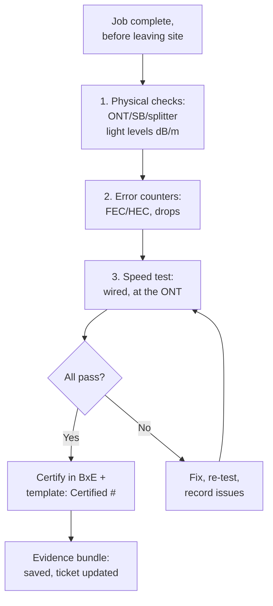

# Certification ("Certificy") Workflow

**Overview:** The install/service certification flow — prove the job passes every test, record it the way BxE wants it, and never leave site without the evidence.

## Overview: what it is, why it matters, when to use it

**What it is.** After an install or repair, you "certify" the service: run the required tests (speed test, signal/light levels, error checks), confirm they all pass, and record the result — in BxE and in your ticket template. Your repo templates have a dedicated section for it:

```
## BXE
    ### Certified w/ all tests passed: #
    ### ... issues
```

**Why a field tech cares.** Certification is your sign-off and your shield: if the customer calls back, the certification record proves the service was good when you left. Doing it in a consistent order means you never forget a test, and scripting the evidence capture means the record is complete even when you're rushing to the next job.

**When to reach for it.** Every install, every repair visit, every "no trouble found" close-out.

**Verified vs inferred.** VERIFIED: the template structure above (from `templates/*/echo.md` etc. in this repo) — certification records pass/fail, issues, and ties to speed tests and light levels. INFERRED: the exact BxE portal certification screens/fields — adapt the checklist to what you see.

## Diagram



## CLI workflows

### A. Setup: the certification checklist file

```bash
# Keep this on every device. Copy per job, fill in, attach to the ticket.
mkdir -p ~/bxe-cert && cat > ~/bxe-cert/checklist.md <<'EOF'
# BxE certification — <ADDRESS> — <DATE>
- [ ] ONT light: ___ dB/m (spec: ___ to ___)
- [ ] SB light: ___ dB/m
- [ ] Splitter light: ___ dB/m
- [ ] Error counters clean (FEC/HEC/drops): Y/N
- [ ] Speed test wired at ONT: ___/___ Mbps (plan: ___/___)
- [ ] Wi-Fi check (if applicable): ___/___ Mbps
- [ ] BxE certified, all tests passed: Y/N
- [ ] Issues: ___
- [ ] Inventory form required: Y/N
- [ ] Team Excel updated: Y/N
EOF
echo "checklist at ~/bxe-cert/checklist.md"
```

### B. Daily use: scripted evidence capture

```bash
#!/usr/bin/env bash
# bxe-certify: pulls diagnostics (see address-to-diagnostics.md), runs a
# local speed check, and writes the evidence bundle. BxE portal certification
# itself is clicked (or automated per browser-automation.md) — this script
# captures everything around it so the record is complete.
set -euo pipefail
ADDR="${1:?usage: bxe-certify \"<ADDRESS>\"}"
STAMP="$(date +%Y%m%d-%H%M%S)"
OUT="$HOME/bxe-cert/$STAMP"
mkdir -p "$OUT"

# 1. Portal diagnostics snapshot (fill paths per address-to-diagnostics.md)
# curl -sS -b "$BXE_JAR" "$BXE_BASE/<diagnostics-path>/<device-id>" > "$OUT/diag.json"

# 2. Local speed test (wired at the ONT; phone hotspot does NOT count)
# speedtest-cli or your org's approved tool:
# speedtest --json > "$OUT/speed.json" || echo "speed test skipped (reason)" > "$OUT/speed.txt"

# 3. Your readings (light levels from your meter)
cat > "$OUT/readings.txt" <<READINGS
address: $ADDR
date: $(date -u +%FT%TZ)
ont_light_dbm: <fill>
sb_light_dbm: <fill>
splitter_light_dbm: <fill>
READINGS
echo "bundle: $OUT (fill readings.txt, then certify in BxE)"
```

### C. Troubleshooting: a test fails at certification

```bash
# Don't certify around a failure — the record must be honest.
# 1. Re-run the failed test alone (flaky Wi-Fi vs real problem?).
# 2. Wired-at-ONT speed test is the source of truth for the access line;
#    Wi-Fi numbers never fail a fiber certification.
# 3. Light level out of spec -> check connectors/splitter before anything else.
# 4. Record the failure + fix in "issues" — a certified-with-notes job beats
#    a fake-clean one when the callback comes.
```

## GUI section (secondary)

The BxE certification screens (adapt to your portal):
1. Do the tests in portal order if it enforces one — some certification flows are wizards that lock steps.
2. Screenshot or export the "all tests passed" confirmation — portals lose data; your evidence bundle shouldn't.
3. If certification requires fields the portal doesn't auto-fill (serials, meter readings), have them in your checklist file ready to paste — don't retype from memory.

## Platform script blocks

### Linux bash

```bash
# Full workflow above. speedtest-cli via your package manager if approved.
```

### Nix-on-Droid

```bash
nix-env -iA nixpkgs.speedtest-cli  # if your org approves it
# Checklist + evidence bundle work fine; the wired speed test needs a real
# laptop — note in the bundle which device ran the test.
```

### PowerShell

> **Status:** syntax-verified with PowerShell 7 on Arch (pwsh) — not executed against live systems.
```powershell
# Checklist is just a file; evidence bundle via normal file ops.
# For a Windows speed test use your org's approved tool.
# NOTE: unverified on Windows — test before field use.
```

### Termux

```bash
pkg install -y speedtest-cli  # if approved; phone Wi-Fi test only,
# never presented as the certification speed test.
mkdir -p ~/bxe-cert
```

### Windows cmd

> **Status:** UNVERIFIED — no Windows cmd available for testing.
```cmd
:: Keep the checklist in a plain text file; fill by hand.
:: NOTE: unverified on Windows — test before field use.
```

### WSL/Arch

```bash
sudo pacman -S --needed speedtest-cli  # if approved
# Same as Linux bash otherwise.
```

> **Platform coverage:** all six covered. The wired speed test is the load-bearing measurement — phones do Wi-Fi only, so the certification speed test belongs on a laptop, stated in the bundle.

## Impact warnings

| Item | Impact |
|---|---|
| Certifying with failing tests unrecorded | Callback liability — the record must match reality |
| Phone Wi-Fi speed test presented as certification | Misleading evidence; label the test device/medium in the bundle |
| Losing the evidence bundle | Keep per data-retention policy; the portal is not your backup |

## Sources

- VERIFIED: `templates/echo.md`, `templates/resi/*.md`, `templates/uts/datadown.md` in this repo (BXE certification fields, light-level readings, speed tests, inventory form).
- INFERRED: portal certification screen order/fields — adapt the checklist.
