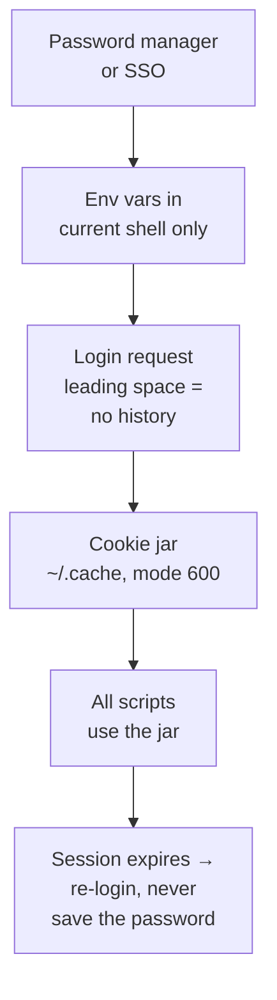

# Portal Login & Session Handling

**Overview:** How to log into the BxE portal from scripts without ever putting your password in a file, in shell history, or in chat — and how to keep the session alive. Passwords in chat are how incident reports get written.

## Overview: what it is, why it matters, when to use it

**What it is.** Every script in this directory needs an authenticated session. This guide is the one security-critical pattern: credentials live in your password manager and environment, never in commands, files, or history — and sessions are cookie jars with locked-down permissions, not tokens pasted into chat.

**Why a field tech cares.** BxE is an internal carrier system with customer data. A password in `~/.bash_history`, a token in a screenshot, or a credential in a shared script is a security incident with your name on it. This pattern takes 5 minutes to set up and removes the entire risk class.

**When to reach for it.** Before running *any* script in this directory. Set it up once per device.

**Verified vs inferred.** VERIFIED: the portal URL; standard cookie/session web-auth patterns. INFERRED: the exact login endpoint shape — discover per `address-to-diagnostics.md` section A.

## Diagram



## CLI workflows

### A. Setup: the secure pattern (do this once per device)

```bash
# 1. History hygiene — commands starting with a space are NOT saved when
#    HISTCONTROL=ignorespace/ignoredups (default on most distros). Verify:
echo "$HISTCONTROL"   # want: ignorespace or ignoreboth (or empty+HISTIGNORE)
# If empty, add to ~/.bashrc:  HISTCONTROL=ignoreboth

# 2. Never export credentials in ~/.bashrc / ~/.profile — they persist.
#    Instead, prompt at session start (leading space!):
 read -s -p "BxE user: " BXE_USER; echo
 read -s -p "BxE password: " BXE_PASS; echo
 export BXE_USER BXE_PASS
# -s = silent (no echo). These live only in this shell's memory.

# 3. Cookie jar with strict perms:
mkdir -p ~/.cache && chmod 700 ~/.cache
touch ~/.cache/bxe-cookies.txt && chmod 600 ~/.cache/bxe-cookies.txt

# 4. When done for the day, kill the creds from the shell:
unset BXE_USER BXE_PASS
```

### B. Daily use: login without a trace

```bash
# Leading space on every line that touches credentials.
 BXE_BASE="https://bxe-portal-prime.content.prod.oscp.ent.tds.net"
 curl -sS -c ~/.cache/bxe-cookies.txt -X POST "$BXE_BASE/<login-path>" \
   -H 'Content-Type: application/json' \
   --data "$(printf '{"username":"%s","password":"%s"}' "$BXE_USER" "$BXE_PASS")" \
   -o /dev/null -w "login http=%{http_code}\n"
# Verify: 200/302 = good. 401 = wrong creds (re-prompt, don't debug the password).
```

### C. SSO/MFA case: export cookies from the browser instead

```bash
# If login goes through SSO/MFA, curl can't do it. Instead:
# 1. Log in normally in your browser.
# 2. Use a cookie-export extension -> save as Netscape/curl format.
# 3. Save to ~/.cache/bxe-cookies.txt (chmod 600), use with curl -b.
# 4. Cookies expire — re-export when scripts start 401ing. Never commit
#    the jar anywhere; add it to .gitignore if it's inside a repo.
echo "~/.cache/bxe-cookies.txt" >> ~/.gitignore  # if relevant
```

### D. Troubleshooting: session expired mid-job

```bash
# Symptom: scripts suddenly return 401/redirect-to-login.
# Fix: re-run section B (or C). Don't "fix" it by saving the password.
# Proactive: check expiry once, then re-login on a schedule:
 curl -sS -b ~/.cache/bxe-cookies.txt -o /dev/null -w "%{http_code}\n" \
   "$BXE_BASE/<a-cheap-authenticated-path>"
# 200 = alive; anything else = re-login.
```

## GUI section (secondary)

- Use your browser's password manager or SSO — never let the portal "remember" credentials on a shared machine.
- If you demo a script to another tech, do it with *their* login or a test account — never yours on a shared screen.
- Lock the workstation (Win+L / Super+L) whenever you step away with a session open.

## Platform script blocks

### Linux bash

```bash
# read -s works as shown. Verify HISTCONTROL first (section A).
```

### Nix-on-Droid

```bash
# Same read -s pattern. Note: some Android keyboards echo even with -s in
# certain terminals — verify once by typing a fake password and checking
# nothing appears. Prefer Termux's own terminal.
```

### PowerShell

> **Status:** syntax-verified with PowerShell 7 on Arch (pwsh) — not executed against live systems.
```powershell
# Never use plain-text variables for the password:
$cred = Get-Credential -Message "BxE login"  # secure prompt, nothing echoed
# Use $cred.UserName / $cred.GetNetworkCredential().Password in requests.
# Nothing touches the console history as long as you don't type the secret.
# NOTE: unverified on Windows — test before field use.
```

### Termux

```bash
# Same as Linux bash. Extra: Termux:Widget shortcuts must NEVER contain
# credentials — keep them to script paths only, prompt at runtime.
```

### Windows cmd

> **Status:** UNVERIFIED — no Windows cmd available for testing.
```cmd
:: cmd has no silent prompt. Use PowerShell's Get-Credential (block above)
:: and call your scripts from there. Do not use `set /p` for passwords.
```

### WSL/Arch

```bash
# Same as Linux bash. Note: WSL shares nothing with Windows credential
# manager by default — prompt per WSL session, don't copy secrets across.
```

> **Platform coverage:** all six covered, with the honest platform-specific gotchas (cmd has no silent prompt; Android keyboards may echo).

## Impact warnings

| Item | Impact |
|---|---|
| Password in history, script, screenshot, or chat | **Security incident** — rotate the credential immediately and report per org policy |
| Cookie jar readable by others (perms > 600) | Session hijack — `chmod 600`, verify with `ls -l` |
| Committing the jar or an env file to git | Credential leak — check `git status` before every commit |

## Sources

- VERIFIED: portal URL (Matt); standard web-session patterns.
- INFERRED: login endpoint shape — discover per `address-to-diagnostics.md`.
