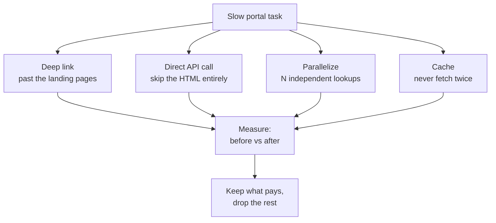

# Slow-Portal Workarounds

**Overview:** The portal is slow — here's the playbook for making it feel fast anyway: skip pages, hit APIs directly, run things in parallel, and cache everything.

## Overview: what it is, why it matters, when to use it

**What it is.** A set of CLI-first patterns that cut the wall-clock time of BxE work: deep links, direct API calls, parallel requests, response caching, and knowing what *not* to wait for.

**Why a field tech cares.** Matt's words: "the web app is SLOW." You can't fix the portal, but you can route around it. Each pattern below is independent — adopt one at a time, keep what pays.

**When to reach for it.** Anytime you're waiting on the portal: morning triage queues, repeat customer lookups, bulk pre-checks before a route.

**Verified vs inferred.** VERIFIED: the portal is slow (Matt, field experience). INFERRED: exact speedups depend on your network and the portal's behavior — measure yours.

## Diagram



## CLI workflows

### A. Pattern 1: deep links (zero setup)

```bash
# Bookmark the deepest URL that works, not the homepage:
#   bad:  https://bxe-portal-prime.content.prod.oscp.ent.tds.net/
#   good: https://bxe-portal-prime.content.prod.oscp.ent.tds.net/<search-page>
#         https://bxe-portal-prime.content.prod.oscp.ent.tds.net/<diagnostics>?<params>
# Find them by using the portal once with DevTools open — the address bar
# usually reflects the real route. If routes need IDs, combine with the
# cache pattern (E) so the IDs are one grep away.
```

### B. Pattern 2: direct API calls (biggest win)

```bash
# The portal page loads HTML+JS+5 API calls. You need 1 API call.
# Discovered per address-to-diagnostics.md section A; replayed like:
time curl -sS -b ~/.cache/bxe-cookies.txt \
  "$BXE_BASE/<diagnostics-path>/<device-id>" -o /dev/null -w "%{time_total}s\n"
# Compare against stopwatch timing of the GUI path. Typical result:
# GUI 45-90s vs API 1-3s. That's the whole game.
```

### C. Pattern 3: parallelize independent lookups

```bash
# Morning triage: 10 addresses, one at a time = 10x latency.
# xargs -P runs them concurrently (respect the portal: -P4, not -P50).
cat addresses.txt | xargs -P4 -I{} bash -c '
  ./bxe-diag "{}" > "diag-$(echo "{}" | tr " " "_").json" 2>diag-errors.log
'
# Watch diag-errors.log for 429s (rate limited) — back off to -P2 if so.
```

### D. Pattern 3b: poll smart, not hard

```bash
# Speed tests / long operations: poll with backoff, not a tight loop.
poll_until_done() {  # $1 = status URL, $2 = max tries
  local tries=0 delay=5
  while [ "$tries" -lt "$2" ]; do
    s="$(curl -sS -b ~/.cache/bxe-cookies.txt "$1" | jq -r '.<status-field>')"
    [ "$s" = "<done-value>" ] && { echo "done"; return 0; }
    sleep "$delay"; tries=$((tries+1)); delay=$((delay*2>60 ? 60 : delay*2))
  done
  echo "TIMEOUT"; return 1
}
```

### E. Pattern 4: cache everything worth caching

```bash
# Two caches, both in ~/.cache (700):
# 1. address -> IDs (rarely changes): bxe-map (see address-to-diagnostics.md E)
# 2. diagnostics snapshots (changes slowly): TTL-based files
bxe-cached-diag() {  # $1 = device-id, reuses snapshot if < 15 min old
  local f="$HOME/.cache/bxe-diag-$1.json"
  if [ -f "$f" ] && [ $(( $(date +%s) - $(stat -c %Y "$f") )) -lt 900 ]; then
    cat "$f"
  else
    curl -sS -b ~/.cache/bxe-cookies.txt "$BXE_BASE/<diagnostics-path>/$1" | tee "$f"
  fi
}
```

### F. Pattern 5: know what not to wait for

```bash
# - Dashboard widgets, "insights", recommendations: never load them; go direct.
# - Full customer history: fetch only when the ticket needs it.
# - Reports/exports: request, do other work, collect later (poll per D).
# Rule of thumb: if a page element doesn't change your next action, don't load it.
```

## GUI section (secondary)

- One tab per customer, opened via Ctrl-click from search results — the back button is where time goes to die.
- Disable any portal "auto-refresh" dashboards while working a queue; they steal both bandwidth and attention.
- If the portal offers a "technician" or "compact" view/theme, use it — fewer widgets per page.

## Platform script blocks

### Linux bash

```bash
# All patterns above run natively. xargs -P is coreutils — no install needed.
```

### Nix-on-Droid

```bash
nix-env -iA nixpkgs.curl nixpkgs.jq
# Parallelism: keep -P2 on the phone (radio + CPU are the bottleneck, and
# Android may kill background work — run in a foreground session with
# termux-wake-lock).
```

### PowerShell

> **Status:** syntax-verified with PowerShell 7 on Arch (pwsh) — not executed against live systems.
```powershell
# Parallel lookups: use Start-Job or foreach -Parallel (PS7+):
#   Get-Content addresses.txt | ForEach-Object -Parallel { <# lookup #> } -ThrottleLimit 4
# Caching: plain files work the same.
# NOTE: unverified on Windows — test before field use.
```

### Termux

```bash
pkg install -y curl jq
# Same as Nix-on-Droid: -P2 max, foreground session, wake lock.
```

### Windows cmd

> **Status:** UNVERIFIED — no Windows cmd available for testing.
```cmd
:: No good parallel story in cmd — use PowerShell (block above) or WSL.
:: NOTE: unverified on Windows — test before field use.
```

### WSL/Arch

```bash
sudo pacman -S --needed curl jq
# Identical to Linux bash.
```

> **Platform coverage:** all six covered; phones get reduced parallelism (-P2) with the reason stated.

## Impact warnings

| Item | Impact |
|---|---|
| -P50 against the portal | Rate-limiting or an abuse flag — stay at -P4 (laptop) / -P2 (phone) |
| Stale cache driving a config change | Caches are for reads; re-fetch live before any write action |
| Tight polling loops | Same as above — backoff (pattern D), never `while true; do curl; done` |

## Sources

- VERIFIED: portal slowness (Matt); all patterns are standard HTTP techniques.
- INFERRED: endpoint paths/fields — discover per `address-to-diagnostics.md`.
