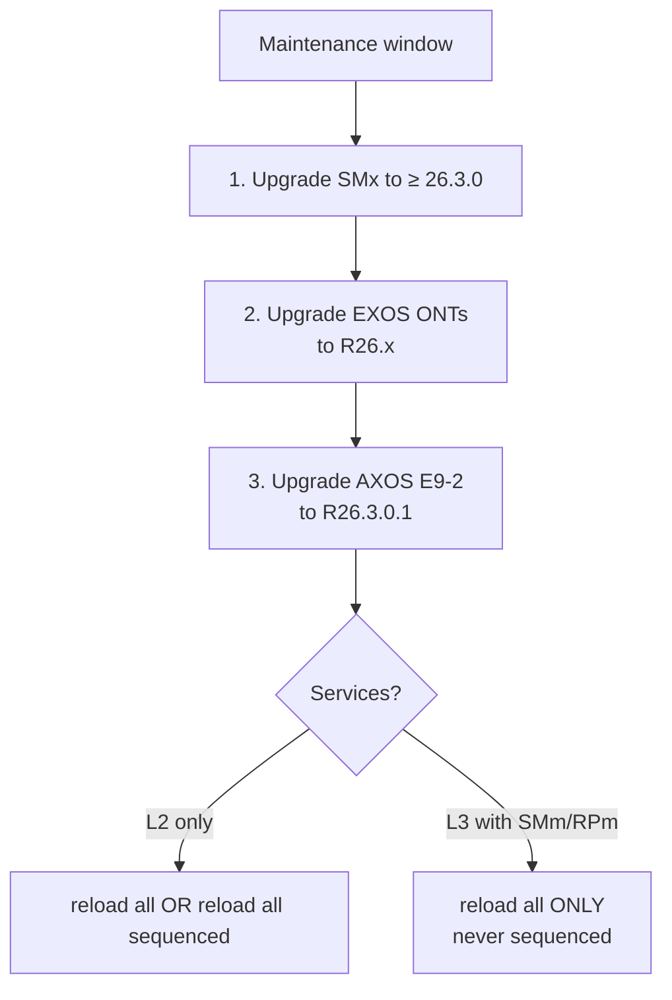

# AXOS R26.3.0 (E9-2 OLT) & EXOS R26.3.0 Release Notes — Field Tech Brief

**Overview:** AXOS R26.3 makes the E9-2 OLT smarter about routing, subscriber security, and monitoring (and fixes a nasty silent alarm-stream bug) — while EXOS R26.3 adds new Wi-Fi 7 boxes, better cloud health reporting, and changes what the LEDs tell you; upgrade SMx *before* the OLT, and the ONT *before* the OLT.

## Overview: what changed, why it matters, when it applies

**AXOS R26.3.0.1 on the E9-2** (CLX3001 aggregation + XG3201/NG1601/GP1611/GP1612 line cards) is a robustness release: new XGS-PON ONT (GPR1011XH), third-party ONT interop work, BGP confederation/route dampening, RADIUS fallback when the server is down, static-IP support for MDU management, configurable BNG security and IPv6 ND RA options, lawful-intercept over IPv6, ICMPv6 passthrough control, per-protocol DoS actions. The headline fix: **R26.3.0 could silently lose the northbound NETCONF event subscription** (AXOS-98750) — SMx/Cloud stopped getting notifications with no alarm, breaking activations that depend on them. Fixed in 26.3.0.1.

**EXOS R26.3.0.x** adds three new Wi-Fi 7 systems (GS3037E gateway, GM2039 satellite, GS2027E-2 international), dynamic SIP ACLs, No-IP DDNS, IPv6 on secondary networks, **RG health monitoring** (rogue-DHCP detection/blocking, NTP-sync failure alerts to Service Cloud), multilingual captive portals, and a **changed LED language**: blinking green = Internet up, solid green = Cloud connected.

**Why a field tech cares.** The upgrade order is load-bearing: SMx ≥ 26.3.0 *before* the AXOS upgrade; EXOS ONT *before* the AXOS OLT (for integrated Gateway+ONT systems). The LED change rewrites your first-glance triage. The monitoring behavior changes (`show arp`/`show ipv6 neighbor` now hide delegated-prefix/framed-route entries; NETCONF `get` no longer returns defaults without `with-defaults`) change what your scripts see.

## Diagram



## CLI workflows

### A. Setup: pre-upgrade verification (AXOS E9-2)

```bash
# On the OLT CLI (ssh to the node), before the window:
show info
# R26.3+: check the new "last-reboot-reason" field — know WHY it last rebooted
# before you touch it.
show version
# Confirm current release is within N-4 (R25.2.x+; R25.2.x needs R25.3 first).
# Direct-upgrade table: R26.3.0 / R26.2.x / R26.1.x / R25.4.x / R25.3.x -> yes.
# R25.2.x -> NO (go R25.3 -> R26.3). MFG/FDI images: always direct OK.
show smx status        # or your site's equivalent: confirm SMx >= 26.3.0 FIRST
show upgrade status    # baseline; note AXOS-80046: single-card upgrade +
                       # switchover can leave a false 'card reload required' —
                       # clear with a redundancy switchover, no service impact.
```

### B. Daily use: monitoring commands that changed in R26.3

```bash
# show arp / show ipv6 neighbor: now show ONLY valid neighbor entries.
# Delegated-prefix and framed-route entries are GONE from these tables
# (AXOS-97656) — if your audit script counted them, fix the script.
show arp
show ipv6 neighbor

# show ont <id> detail: new max-tcont-count field (AXOS-97898).
# show ont detail: new max-gem-count field (AXOS-97427).
show ont <ont-id> detail

# show interface pon bandwidth: now reflects actual DBA config
# (EF->cos4, AF2/AFp3/AFp4->cos3, AF1/AFp1/AFp2->cos2, BE*->cos1) (AXOS-92494).
show interface pon bandwidth

# NETCONF get: no longer returns default values for status nodes unless you
# include the "with-defaults" tag (AXOS-96147). If your northbound client
# suddenly sees missing fields, that's why — add the tag.
```

### C. Daily use: EXOS field checks after R26.3

```bash
# LED triage (changed in R26.3 — factory-reset or factory-shipped R26.3+):
#   blinking green = Internet connectivity established
#   solid green    = connected to Calix Cloud
#   (satellites: solid green while onboarding, solid RED if the RG loses WAN)
# A box stuck blinking green = WAN fine, Cloud/TR-069 broken — check ACS.

# New health alerts visible in Service Cloud:
#   - rogue DHCP server detected on subscriber LAN (blocked automatically)
#   - NTP sync failures (breaks telemetry — check this when cloud data gaps)
# Confirm your test box reports them: EWI status pages, then Cloud.

# Reserved resources — never assign these (from the RN general notes):
#   VLANs: 85 (AE mgmt on GS4227/W/4237), 4094 (ONT-partition comms),
#          501-548 (mesh backhaul, all gateways/satellites)
#   IPs: 172.28-31.0.0/22 (hotspot/reserved), 192.168.1.0/24 (primary bridge),
#        192.168.12-18.0/24 (secondary/operator SSIDs), 192.168.22-28.0/24
#        (MDU operator), 192.168.32-38.0/24 (operator/container/6GHz/MDU),
#        192.168.36.0/24 (container bridge)
```

### D. Troubleshooting scenario: "SMx stopped getting ONT notifications after the OLT upgrade"

```bash
# Suspect AXOS-98750 (R26.3.0): the northbound NETCONF events subscription
# can drop SILENTLY — no alarm, alarm processing/storage unaffected, but
# SMx / Operations Cloud / other NETCONF clients stop receiving
# notifications. Activations that wait on those notifications stall.
# Triage:
#   1. On the OLT: check the NETCONF event subscription session state.
#   2. In SMx: are fresh ONT/alarm events arriving? Compare against the
#      OLT's local alarm log — local has them, northbound doesn't = this bug.
#   3. Workaround (R26.3.0): disconnect + reconnect the northbound client's
#      connection to AXOS to restore delivery.
#   4. Fix: upgrade to R26.3.0.1. See service bulletin AXOS-SB-26-005.
```

### E. Troubleshooting scenario: "secondary TACACS alarm won't clear" / "RBAC broke after switchover"

```bash
# Open issue AXOS-97486: craft interface flap -> tacacs-acct-server-unreachable
# for all servers; on restore only the PRIMARY clears. Force the secondary
# to be contacted (bad-password auth attempt), or remove/re-add the
# secondary server entry.
# Open issue AXOS-97379: after standby reload + switchover, RBAC may deny
# the config datastore even though auth succeeds (services unaffected).
# Fix: remove and reprovision the RBAC config.
# Open issue AXOS-93210: after reload with standby not "In Service", RBAC
# rules don't apply — run "apply rbac-aaa" once the standby is up.
```

### F. Troubleshooting scenario: mesh satellite won't pair to a Wi-Fi 7 RG

```bash
# Fixed in EXOS 26.3.0.2 (EXOS-66866): satellites on MFG images 23.2-24.2
# could NOT pair to Wi-Fi 7 RGs on 26.2/26.3. Upgrade the satellite image.
# Also: keep Wi-Fi 7 radios on default 802.11be — disabling be breaks
# reconnect until reboot (EXOS-63916/62309) and can degrade mesh
# (EXOS-64796; reboot satellites to recover).
```

### G. Automation snippet: post-upgrade health sweep (AXOS)

```bash
#!/usr/bin/env bash
# Run from a jump host with ssh access after the R26.3 upgrade.
set -euo pipefail
OLT="${OLT:?olt hostname}"; SSH="ssh -o BatchMode=yes ${OLT}"
echo "date=$(date -u +%FT%TZ) olt=${OLT}"
$SSH "show info" | grep -iE "version|last-reboot-reason" || true
$SSH "show upgrade status"
# ONT summary sanity: us-sdber-rate now reports actual values (was default;
# fixed AXOS-95746) — spot check a few ONTs:
$SSH "show ont summary" | head -20
# If SMx event flow matters to you: confirm notifications are flowing
# (AXOS-98750 regression check) before closing the window.
echo "manual: SMx alarm/event stream alive? (yes/no)"
```

## GUI path

AXOS upgrades are CLI-driven (`upgrade` / `reload` commands) per the AXOS R26.x user documentation on My Calix — there is no "click to upgrade the OLT" GUI path a tech should rely on. EXOS upgrades go through EWI, USB, or Calix Cloud (TR-069). What the GUIs *are* good for here: Calix Cloud for RG health alerts (rogue DHCP, NTP failures), SMx GUI for ONT status and the subscriber event stream, and the EWI topology map (with the caveat that satellite links may not render for the admin user — EXOS-64437).

## Platform script blocks

### Linux bash

```bash
# ssh to the OLT + run the monitoring commands (block B) natively.
# Firmware images: FullRelease_AXOS_E9-System_R26.3.0.1.zip (E9-2),
# FullRel_<ID>_SIGNED_R26.3.0.0.zip (EXOS per-model) from the Software Center.
# Verify checksums per your org's procedure before staging.
ssh <olt-host> "show info" | grep -i "last-reboot-reason"
```

### Nix-on-Droid

```bash
nix-env -iA nixpkgs.openssh nixpkgs.curl
# N/A for pushing firmware — upgrades run from the OLT CLI / Cloud.
# From the phone: ssh to the OLT for show commands (blocks B/G work fine),
# EWI in the mobile browser for the EXOS box in front of you.
# Android gotchas: no systemd, storage permissions for image files if you
# stage them, termux-wake-lock + foreground for long transfers.
```

### PowerShell

> **Status:** syntax-verified with PowerShell 7 on Arch (pwsh) — not executed against live systems.
```powershell
# Win32 OpenSSH is built in: ssh to the OLT and run show commands.
ssh "<olt-host>" "show info"
# Stage firmware with scp (Win32 OpenSSH) if your process stages via a
# Windows jump host; checksum-verify before staging.
# NOTE: unverified on Windows — test before field use.
```

### Termux

```bash
pkg install -y openssh curl
# Same as Nix-on-Droid: ssh for OLT show commands, mobile browser for EWI.
# Don't attempt firmware pushes from the phone — stage from a proper host.
```

### Windows cmd

> **Status:** UNVERIFIED — no Windows cmd available for testing.
```cmd
:: Win32 OpenSSH ships with Windows 10+:
ssh "<olt-host>" "show info"
:: NOTE: unverified on Windows — test before field use.
```

### WSL/Arch

```bash
sudo pacman -S --needed openssh curl
ssh <olt-host> "show info" | grep -i "last-reboot-reason"
# Same as Linux bash otherwise.
```

**Reality check:** AXOS/EXOS images install on the OLT and the GigaSpire — never on a phone or laptop. Handset/desktop blocks are for ssh show-commands, EWI, staging files, and verification.

## Upgrade/change cautions

- **Order: SMx → EXOS ONT → AXOS OLT.** SMx 26.3.0+ *before* the E9-2 goes to R26.3.0.x. For integrated Gateway+ONT EXOS systems in AE mode (AXOS AE manager), ONT to R26.x *before* the OLT — OLT-first risks subscriber service disruption (EXOS-51276).
- **Reload correctly:** L2-only services → `reload all` or `reload all sequenced`; L3 services (SMm/RPm) → `reload all` ONLY, never `reload all sequenced`.
- **Direct upgrade window is N-4:** R25.3.x+ can go straight to R26.3.0.1; R25.2.x must go via R25.3 first. MFG/FDI images are always direct-upgradeable.
- **BGP peer-group policy entries without a direction are removed on upgrade to R26.3** (AXOS-97958) — audit BGP config before/after.
- **Downgrade = delete startup-config.xml first, then reload** (AXOS). EXOS downgrades are not recommended at all — use EWI Revert (previous image + database).
- **Pre-stage ONT firmware outside the window:** ONT image push time grows with ONT count; load to the OLT early, activate/commit in the window. OLT and ONT upgrades are independent — do them at different times.
- **`reload all sequenced` on R25.2+ upgrades** can raise transient `different-ont-packages` alarms and delay ONT info display until images land on all cards — don't panic, wait for completion.
- **Lawful Intercept:** LIADMIN/LIUSER can no longer run `show file diff` (AXOS-96976); shared-MAC intercepts — only the first is active (AXOS-95949); if both aggregation cards power-cycle together, manually reboot access cards to rebuild LI state (AXOS-99619).
- **BNG persistence + PCRF across major releases is not supported** — plan accordingly.
- **Open monitoring traps:** `show hosts` may byte-swap IPv4 (AXOS-98781); `show arp` REMAINING SECONDS can read zero on sub-interfaces (AXOS-98234); stale `fan-speed-tca` on XG3201/ASM5001 from low min fan speed (AXOS-98689); `low-tx-opt-pwr-ne` false alarms from a calculation bug (AXOS-99699).

## Alphabetical reference of key release-note facts

- **AXOS 26.3.0.1:** robustness/bug-fix release; fixes the silent NETCONF event-subscription loss (AXOS-98750).
- **AXOS 26.3.0 new:** GPR1011XH XGS-PON ONT; third-party ONT interop; BGP confederation + route dampening; RADIUS fallback policy; MDU static-IP management; configurable BNG security; IPv6 ND RA options; LI over IPv6; ICMPv6 passthrough; per-protocol DoS actions.
- **Behavior changes (selection):** `show arp`/`show ipv6 neighbor` valid-entries-only (AXOS-97656); `show ont detail` gains max-tcont-count/max-gem-count; NETCONF get needs `with-defaults` for defaults (AXOS-96147); `show info` gains last-reboot-reason (AXOS-92947); `show interface pon bandwidth` reflects real DBA classes (AXOS-92494); IPFIX PON/ONT data no longer held 30 min after card startup (AXOS-92309); new bng-v6/pcrf-transition events.
- **E9-2 hardware:** CLX3001 control/aggregation, XG3201 (XGS/GPON), NG1601 (NG-PON2/XGS), GP1611/GP1612 (GPON); image `FullRelease_AXOS_E9-System_R26.3.0.1`.
- **EXOS 26.3.0.2 new hardware:** GS3037E (7u6.2 triband Wi-Fi 7 RG), GM2039 (7u6m.2 triband Wi-Fi 7 satellite), GS2027E-2 (intl).
- **EXOS 26.3.0.0 new:** dynamic SIP ACLs; No-IP DDNS (v4+v6); IPv6 on secondary networks; RG health monitoring (rogue DHCP block, NTP-failure alerts); Ethernet WAN on GS4139XG via 10GE LAN; multilingual SmartTown/SmartBiz/SmartMDU portals; FCC DFS cert for GS2027E.
- **EXOS container apps (26.3):** ProtectIQ CIES-R263.0.99, ExperienceIQ CIEP-R263.0.86, SmartBiz SMARTBIZQ-263.0.73, SmartTown SMARTTOWNW-263.0.46, SmartMDU SMARTMDU_R263.0.43, CalixSpeedTest 26.3.0.64.
- **EXOS fixed (selection):** EXOS-66866 (MFG-image mesh pairing), EXOS-65955 (SmartMDU ont-equip=failed false alarm), EXOS-64709 (golden config re-applied post-upgrade), EXOS-65507 (LAN subnets wrongly blocked).
- **EXOS open (selection):** EXOS-66122 (French portal spacing), EXOS-63899 (GS4139XG < 8 Gbps speedtest), EXOS-63664 (3-min radio outage after Wi-Fi 7 SSID rename).
- **LED language (R26.3+):** blinking green = Internet; solid green = Cloud; satellites solid red if RG loses WAN.
- **Reserved:** VLANs 85/4094/501-548; IP blocks listed in block C.
- **Upgrade order:** SMx ≥ 26.3.0 → EXOS ONT R26.x → AXOS R26.3.0.x.
