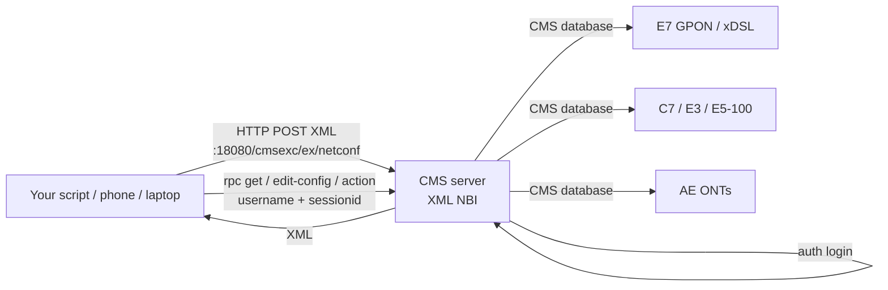

# CMS Northbound Interface (NBI) API

**Overview:** The CMS NBI is the "talk to the server with code instead of clicks" door into Calix Management System — you POST XML requests to it and it activates or queries subscriber services on Calix access gear (C7, E3/E5, E7 GPON/xDSL, AE ONTs) without touching the GUI.

## Overview: what it is, why it matters, when to use it

**What it is.** CMS (Calix Management System) manages legacy Calix access platforms — C7, E3/E5-100, E7-2/E7-20, and Active Ethernet (AE) ONTs. Its Northbound Interface is an XML-over-HTTP API (SOAP envelope wrapping NETCONF-style `get` / `edit-config` / `action` operations). "Northbound" just means "the direction up toward your back-office systems" — i.e., it's the integration API your OSS/BSS or scripts use to drive CMS the way a human drives the CMS desktop/web client.

**Why a field tech / network specialist cares.** When you're on a job site and need to turn up 40 ONTs, fix a broken voice service, replace a failed ONT with the same provisioning, or pull provisioning data for a whole shelf, clicking through CMS Desktop for each one is slow and error-prone. The NBI lets you do the same operations as scripted, repeatable XML transactions — same backend, same database, same results, but from a laptop (or phone) at the cabinet.

**When to reach for it.**
- Bulk service activation (data/video/voice on GPON ONTs or xDSL ports).
- ONT swaps: unlink the dead ONT, link the new one to the existing provisioning record.
- Diagnostics: `show-ont` by subscriber ID, serial, or registration ID; performance/MLT queries.
- Maintenance: suspend/resume services, reset ONT to defaults, quarantine add/remove.
- Integration: feeding CMS data into your own tools, nightly reconciliation jobs.

**What it is NOT.** It doesn't manage AXOS systems — that's SMx's job (see `smx-api.md`). It doesn't activate subscriber service on the B6 platform. It's aimed at back-office integrators, but the individual operations are exactly what a tech does in the CMS client.

### How it works (30-second technical depth)

1. Your client POSTs a SOAP XML document to `http://<cms-host>:18080/<uri>` where the URI depends on the platform family:
   - E7 requests → `/cmsexc/ex/netconf`
   - C7/E3/E5-100 requests → `/cmsweb/nc`
   - AE ONT requests → `/cmsae/ae/netconf`
2. First request is `<auth><login>` with your CMS username/password (needs Full CMS Administration privileges). The reply returns a `<SessionID>` — every later `<rpc>` carries `username` + `sessionid` attributes.
3. Operations come in four flavors: **query/read** (`<get>`), **create** (`<edit-config>` with `operation="create"`), **update/merge** (`<edit-config>` with `operation="merge"`), **delete** (`<edit-config>` with `operation="delete"`), plus **actions** (`<action>` with `<action-type>`, e.g. `show-ont`, `test-pots-svc`, `apply-dsl-port-template`).
4. Large replies are paged: if the reply ends with `<more/>`, re-send the request with an `<after>` clause marking the last item you got.
5. Sessions count against the CMS 200-session client limit and the per-user "Maximum GUI Login sessions" setting; inactive NBI sessions expire on the global CMS session-timeout (30 minutes default, range 30–1800s).

## Diagram



## CLI workflows

Conventions used below: `<cms-host>` = CMS server IP/hostname, `<user>`/`<pass>` = CMS credentials (Full CMS Administration privileges required), `<noden>` = CMS network node name (e.g. `NTWK-WestE7`). All XML is UTF-8 (`<?xml version="1.0" encoding="UTF-8"?>`). **Never put real credentials in scripts that leave your laptop.**

### A. Authenticate (login) and capture the session ID

```bash
# --- setup: one-time per site ---
CMS_HOST="<cms-host>"
CMS_USER="<cms-user>"
CMS_PASS="<cms-password>"
NBI_URI="/cmsexc/ex/netconf"     # E7; use /cmsweb/nc for C7/E3/E5-100, /cmsae/ae/netconf for AE
BASE="http://${CMS_HOST}:18080${NBI_URI}"

cat > /tmp/nbi-login.xml <<'EOF'
<?xml version="1.0" encoding="UTF-8"?>
<soapenv:Envelope xmlns:soapenv="http://schemas.xmlsoap.org/soap/envelope/">
  <soapenv:Body>
    <auth message-id="1">
      <login>
        <UserName>__USER__</UserName>
        <Password>__PASS__</Password>
      </login>
    </auth>
  </soapenv:Body>
</soapenv:Envelope>
EOF
sed -i "s/__USER__/${CMS_USER}/; s/__PASS__/${CMS_PASS}/" /tmp/nbi-login.xml

# --- login; pull SessionID out of the reply ---
RESP=$(curl -s -X POST "${BASE}" \
  -H 'Content-Type: text/xml; charset=UTF-8' \
  --data @/tmp/nbi-login.xml)
echo "$RESP" | grep -o '<ResultCode>[0-9]*</ResultCode>'
SESSIONID=$(echo "$RESP" | grep -o '<SessionID>[0-9]*</SessionID>' | sed 's/<[^>]*>//g')
echo "SessionID=${SESSIONID}"
# A ResultCode of 0 means success; nonzero comes with a <ResultMessage> explaining the error.
```

Troubleshooting the login: ResultCode != 0 → wrong username/password, user lacks Full CMS Administration privileges, or the 200-session client limit is exhausted (see guide section: login sessions count toward it).

### B. Daily use: find an ONT, read its services

```bash
# --- show-ont by subscriber ID (fastest way to find "whose ONT is this") ---
cat > /tmp/nbi-show-ont.xml <<EOF
<?xml version="1.0" encoding="UTF-8"?>
<soapenv:Envelope xmlns:soapenv="http://www.w3.org/2003/05/soap-envelope">
  <soapenv:Body>
    <rpc message-id="175" nodename="<noden>" username="${CMS_USER}" sessionid="${SESSIONID}">
      <action>
        <action-type>show-ont</action-type>
        <action-args>
          <subscr-id><subscriber-id></subscr-id>
        </action-args>
      </action>
    </rpc>
  </soapenv:Body>
</soapenv:Envelope>
EOF
curl -s -X POST "${BASE}" -H 'Content-Type: text/xml; charset=UTF-8' \
  --data @/tmp/nbi-show-ont.xml

# --- same call, but filter by registration ID or serial number instead ---
# swap <subscr-id>...</subscr-id> for:
#   <reg-id><reg-id-here></reg-id>      (Registration ID, e.g. 7775554444)
#   <serno><serial-number-here></serno>  (ONT serial number)
```

### C. Service activation: create a data service on a GPON ONT

This is the canonical `edit-config` create — straight from the guide's E7 GPON chapter, adapted with placeholders. Key fields: `<ont>` is the E7 scope ID of the ONT, `<ontslot>` is the port type (3=GigE, 4=HPNA, 5=FastE), `<ontethany>` the port number, `<svctagaction>` a pre-defined global service tag action ID, `<bwprof>` a bandwidth profile ID (prefix `local:X` for local profile IDs).

```bash
cat > /tmp/nbi-create-data.xml <<EOF
<?xml version="1.0" encoding="UTF-8"?>
<soapenv:Envelope xmlns:soapenv="www.w3.org/2003/05/soap-envelope">
  <soapenv:Body>
    <rpc message-id="217" nodename="<noden>" username="${CMS_USER}" sessionid="${SESSIONID}">
      <edit-config><target><running/></target>
        <config>
          <top>
            <object operation="create" get-config="true">
              <type>EthSvc</type>
              <id>
                <ont><ont-scope-id></ont>
                <ontslot>3</ontslot>
                <ontethany>1</ontethany>
                <ethsvc>1</ethsvc>
              </id>
              <admin>enabled</admin>
              <descr><service-description></descr>
              <tag-action>
                <type>SvcTagAction</type>
                <id><svctagaction><tag-action-id></svctagaction></id>
              </tag-action>
              <bw-prof>
                <type>BwProf</type>
                <id><bwprof><bw-profile-id></bwprof></id>
              </bw-prof>
              <hot-swap>false</hot-swap>
            </object>
          </top>
        </config>
      </edit-config>
    </rpc>
  </soapenv:Body>
</soapenv:Envelope>
EOF
curl -s -X POST "${BASE}" -H 'Content-Type: text/xml; charset=UTF-8' \
  --data @/tmp/nbi-create-data.xml | grep -o '<ok/>'
# <ok/> in the rpc-reply = created. With get-config="true" the reply also echoes
# the provisioned object, including the resolved profile names (e.g. <ethsvc name="Data1">).
# Variants: operation="merge" to update, operation="delete" to remove the service.
```

### D. Troubleshooting scenario: ONT replacement at a subscriber site

A dead ONT gets swapped for a new one, keeping the subscriber's services. The guide's workflow: (1) find the ONT, (2) unlink it from the provisioning record, (3) link the newly discovered ONT to the existing provisioning.

```bash
# 1. Find the dead ONT by reg-id (from the work order)
#    (use the show-ont call from B with <reg-id>)

# 2. Unlink the ONT from its provisioning record, then link the replacement.
#    Exact unlink/link XML element structure is per the guide's
#    "Replacing a GPON ONT" topic (unlink then link newly discovered ONT).
#    After linking, verify with show-ont again and confirm services show enabled.

# 3. If the ONT misbehaves after swap, reset it to factory defaults:
cat > /tmp/nbi-reset-ont.xml <<EOF
<?xml version="1.0" encoding="UTF-8"?>
<soapenv:Envelope xmlns:soapenv="http://www.w3.org/2003/05/soap-envelope">
  <soapenv:Body>
    <rpc message-id="301" nodename="<noden>" username="${CMS_USER}" sessionid="${SESSIONID}">
      <action>
        <action-type>set-to-default</action-type>
        <action-args>
          <type>Ont</type>
          <id><ont><ont-scope-id></ont></id>
        </action-args>
      </action>
    </rpc>
  </soapenv:Body>
</soapenv:Envelope>
EOF
curl -s -X POST "${BASE}" -H 'Content-Type: text/xml; charset=UTF-8' \
  --data @/tmp/nbi-reset-ont.xml
```

### E. Large queries: paging with `<after>`

When a reply ends with `<more/>`, the server truncated the output. Re-send with an `<after>` clause inside the `<children>` object (for `<get>`) or as an `<action-arg>` (for `<action>`), marking the last item you received:

```xml
<!-- inside <children>, after the last <type>Ont</type> entry -->
<after>
  <type>Ont</type>
  <id><ont>1000</ont></id>
</after>
```

```bash
# Loop a paged query until no <more/> appears:
MORE=1
LAST=""
while [ "$MORE" = "1" ]; do
  # (rebuild request XML inserting the <after> block with $LAST)
  RESP=$(curl -s -X POST "${BASE}" -H 'Content-Type: text/xml; charset=UTF-8' --data @/tmp/nbi-page.xml)
  echo "$RESP" | grep -q '<more/>' && MORE=1 || MORE=0
  LAST=$(echo "$RESP" | grep -o '<ont[^>]*>[0-9]*</ont>' | tail -1 | sed 's/<[^>]*>//g')
done
echo "last seen ont: ${LAST}"
```

### F. Automation snippet: nightly subscriber-ID → ONT inventory reconciliation

```bash
#!/usr/bin/env bash
# Reconcile a work-order CSV (subscr-id,ont-scope-id) against CMS via the NBI.
set -euo pipefail
CMS_HOST="${CMS_HOST:?set CMS_HOST}"; CMS_USER="${CMS_USER:?set CMS_USER}"
CMS_PASS="${CMS_PASS:?set CMS_PASS}"; NODEN="${NODEN:?set NODEN}"
BASE="http://${CMS_HOST}:18080/cmsexc/ex/netconf"
login() {
  local r s
  r=$(curl -s -X POST "$BASE" -H 'Content-Type: text/xml; charset=UTF-8' --data @/tmp/nbi-login.xml)
  s=$(echo "$r" | grep -o '<SessionID>[0-9]*</SessionID>' | sed 's/<[^>]*>//g')
  [ -n "$s" ] || { echo "LOGIN FAILED"; echo "$r"; exit 1; }
  echo "$s"
}
SID=$(login)
while IFS=, read -r subscr ont; do
  xml=$(sed -e "s/<subscriber-id>/${subscr}/" -e "s/<noden>/${NODEN}/" \
            -e "s/username=\"[^\"]*\"/username=\"${CMS_USER}\"/" \
            -e "s/sessionid=\"[^\"]*\"/sessionid=\"${SID}\"/" /tmp/nbi-show-ont.xml)
  out=$(echo "$xml" | curl -s -X POST "$BASE" -H 'Content-Type: text/xml; charset=UTF-8' --data @-)
  echo "${subscr},${ont},$(echo "$out" | grep -c '<ont ')"
done < workorders.csv
```

### G. Always log out

```bash
cat > /tmp/nbi-logout.xml <<EOF
<?xml version="1.0" encoding="UTF-8"?>
<soapenv:Envelope xmlns:soapenv="http://schemas.xmlsoap.org/soap/envelope/">
  <soapenv:Body>
    <auth message-id="2">
      <logout>
        <UserName>${CMS_USER}</UserName>
        <SessionId>${SESSIONID}</SessionId>
      </logout>
    </auth>
  </soapenv:Body>
</soapenv:Envelope>
EOF
curl -s -X POST "${BASE}" -H 'Content-Type: text/xml; charset=UTF-8' --data @/tmp/nbi-logout.xml
# Sessions linger until the 30-min timeout otherwise, eating your 200-session budget.
```

## GUI path

CMS ships an XML NBI test page inside CMS WEB at `http://<CMS_IP>:8080/exclude/testXmlNB.html` — paste XML, see the reply. That's the fastest way to prototype a request before scripting it. Otherwise the normal CMS Desktop / CMS WEB client does everything the NBI does, one click at a time. Use the GUI when you're doing a one-off (one ONT, one service change) or when you need the visual confirmation; use the NBI when it's repetitive, bulk, or needs to run unattended.

## Platform script blocks

### Linux bash

```bash
# Install nothing extra: curl/grep/sed are already there on any distro.
# Full login + show-ont in one block (copy/paste, fill the placeholders):
CMS_HOST="<cms-host>"; CMS_USER="<cms-user>"; CMS_PASS="<cms-password>"
NODEN="<noden>"; SUBSCR="<subscriber-id>"
BASE="http://${CMS_HOST}:18080/cmsexc/ex/netconf"

LOGIN_XML=$(cat <<EOF
<?xml version="1.0" encoding="UTF-8"?>
<soapenv:Envelope xmlns:soapenv="http://schemas.xmlsoap.org/soap/envelope/">
<soapenv:Body><auth message-id="1"><login>
<UserName>${CMS_USER}</UserName><Password>${CMS_PASS}</Password>
</login></auth></soapenv:Body></soapenv:Envelope>
EOF
)
SID=$(echo "$LOGIN_XML" | curl -s -X POST "$BASE" \
  -H 'Content-Type: text/xml; charset=UTF-8' --data @- \
  | grep -o '<SessionID>[0-9]*</SessionID>' | sed 's/<[^>]*>//g')
[ -n "$SID" ] || { echo "login failed"; exit 1; }
QUERY_XML=$(cat <<EOF
<?xml version="1.0" encoding="UTF-8"?>
<soapenv:Envelope xmlns:soapenv="http://www.w3.org/2003/05/soap-envelope">
<soapenv:Body><rpc message-id="175" nodename="${NODEN}" username="${CMS_USER}" sessionid="${SID}">
<action><action-type>show-ont</action-type>
<action-args><subscr-id>${SUBSCR}</subscr-id></action-args></action>
</rpc></soapenv:Body></soapenv:Envelope>
EOF
)
echo "$QUERY_XML" | curl -s -X POST "$BASE" \
  -H 'Content-Type: text/xml; charset=UTF-8' --data @-
```

### Nix-on-Droid

```bash
# One-time setup on the phone:
nix-env -iA nixpkgs.curl nixpkgs.jq nixpkgs.openssh
# Then run the exact Linux bash block above — no changes.
# Android gotchas: no systemd (fine — curl is one-shot); keep XML under ~/
# (storage permissions); for long paged <after> loops run `termux-wake-lock`
# in Termux, and keep the session in the foreground (background execution
# limits can kill a long reconciliation script).
```

### PowerShell

> **Status:** syntax-verified with PowerShell 7 on Arch (pwsh) — not executed against live systems.
```powershell
# Win32 OpenSSH ships with Windows; nothing to install for the API path.
$CMS_HOST="<cms-host>"; $CMS_USER="<cms-user>"; $CMS_PASS="<cms-password>"
$NODEN="<noden>"; $SUBSCR="<subscriber-id>"
$BASE="http://${CMS_HOST}:18080/cmsexc/ex/netconf"
$loginXml=@"
<?xml version="1.0" encoding="UTF-8"?>
<soapenv:Envelope xmlns:soapenv="http://schemas.xmlsoap.org/soap/envelope/">
<soapenv:Body><auth message-id="1"><login>
<UserName>$CMS_USER</UserName><Password>$CMS_PASS</Password>
</login></auth></soapenv:Body></soapenv:Envelope>
"@
$resp=Invoke-WebRequest -Uri $BASE -Method Post -Body $loginXml `
  -ContentType "text/xml; charset=UTF-8" -UseBasicParsing
$sid=([xml]$resp.Content).Envelope.Body.'auth-reply'.SessionID
$queryXml=@"
<?xml version="1.0" encoding="UTF-8"?>
<soapenv:Envelope xmlns:soapenv="http://www.w3.org/2003/05/soap-envelope">
<soapenv:Body><rpc message-id="175" nodename="$NODEN" username="$CMS_USER" sessionid="$sid">
<action><action-type>show-ont</action-type>
<action-args><subscr-id>$SUBSCR</subscr-id></action-args></action>
</rpc></soapenv:Body></soapenv:Envelope>
"@
Invoke-WebRequest -Uri $BASE -Method Post -Body $queryXml `
  -ContentType "text/xml; charset=UTF-8" -UseBasicParsing
# NOTE: unverified on Windows — test before field use.
```

### Termux

```bash
pkg install -y curl jq openssh
# Then run the Linux bash block verbatim. A phone is a genuinely good NBI
# client: query show-ont by reg-id from the cabinet. Android gotchas: no
# systemd, storage permissions (keep XML in ~/), termux-wake-lock for long
# loops, foreground-only for scripts that page through <more/> results.
```

### Windows cmd

> **Status:** UNVERIFIED — no Windows cmd available for testing.
```cmd
:: curl.exe ships with Windows 10+. Save the XML to files first, then:
set CMS_HOST=<cms-host>
set NBI_URI=/cmsexc/ex/netconf
curl.exe -s -X POST "http://%CMS_HOST%:18080%NBI_URI%" ^
  -H "Content-Type: text/xml; charset=UTF-8" --data @login.xml
curl.exe -s -X POST "http://%CMS_HOST%:18080%NBI_URI%" ^
  -H "Content-Type: text/xml; charset=UTF-8" --data @show-ont.xml
:: NOTE: unverified on Windows — test before field use.
```

### WSL/Arch

```bash
sudo pacman -S --needed curl jq openssh
# Then run the Linux bash block verbatim.
```

**Reality check:** the CMS server software itself runs on a server (RHEL/Rocky in recent releases) — you don't install it on a phone. Everything in this guide that runs on the handset is the *client* side: XML templates + curl. All six platforms above are fully capable NBI clients; nothing here is N/A.

## Upgrade/change cautions

- The NBI guide is versioned R15.x — behavior described here tracks CMS R15.x. CMS 16.0 is E7-GPON-only (no B6, no AXOS cut-through beyond what's listed), so if your fleet moves to CMS 16.0, the C7/E3/E5-100 and B6 URI paths no longer apply — check the 16.0 support matrix first (see `cms-release-notes.md`).
- Session hygiene matters after upgrades: a known 15.2 issue (CMS-37180) had Operations Cloud consuming *all* CMS login sessions after a server restart, locking out every other user — always log out NBI sessions and keep an eye on the 200-session budget.
- `<more/>` paging exists because a single reply is size-limited; scripts written against small test networks will break on large ones if they ignore it.

## Alphabetical reference of key NBI facts

- **AE ONT URI:** `/cmsae/ae/netconf`
- **Auth:** `<auth><login>` with CMS user/pass (Full CMS Administration privileges); reply gives `<SessionID>` used on every `<rpc>`.
- **C7/E3/E5-100 URI:** `/cmsweb/nc`
- **E7 URI:** `/cmsexc/ex/netconf`
- **Logout:** `<auth><logout>` with UserName + SessionId; otherwise sessions time out (30 min default).
- **Operations:** `<get>` (read), `<edit-config>` create/merge/delete (write), `<action>` (show-ont, set-to-default, test-pots-svc, apply-dsl-port-template, MLT test).
- **Paging:** `<more/>` in reply → re-send with `<after>` clause.
- **Port:** 18080 for HTTP; the guide says HTTP or HTTPS is supported but documents only the HTTP port — confirm the HTTPS port on your CMS install before scripting against it.
- **Session limits:** XML sessions count toward the 200-session client limit and the per-user Max GUI Login sessions setting.
- **Test page:** `http://<CMS_IP>:8080/exclude/testXmlNB.html`
- **Timeouts:** global CMS session timeout governs NBI (30 min default; 30–1800 s range), not per-user timeout values.
