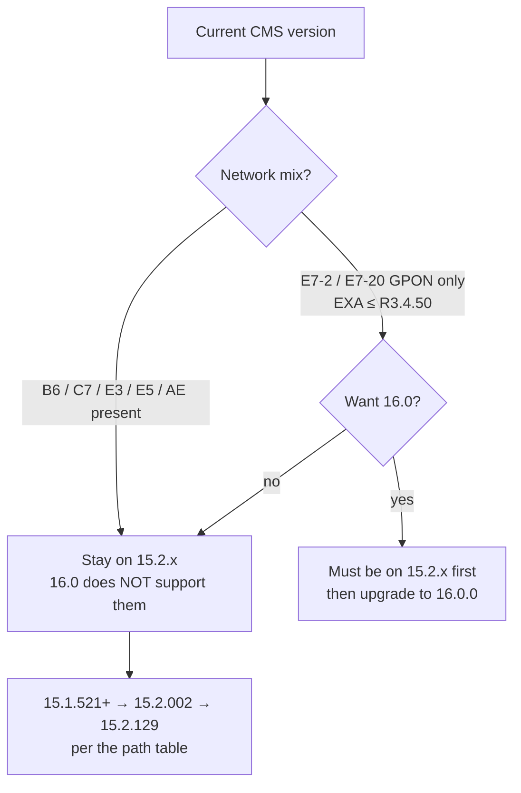

# CMS Release Notes: 15.2 and 16.0 — Field Tech Brief

**Overview:** CMS 15.2 is the full-featured release for mixed legacy networks (C7/E7/E3/E5/B6/AE); CMS 16.0 is a security-hardened release that *only* manages E7 GPON — upgrading to 16.0 on the wrong network strands your other platforms.

## Overview: what changed, why it matters, when it applies

**CMS R15.2.129** (Nov 2024) is the "works with everything" release: it manages B6, C7, E7, E3/E5, and AE ONTs, adds EXOS AE ONT alarm handling (suppress LAN-port alarms, see previously-missed alarm types, redefine severity), pre-enables the GP4200A AE ONT, improves inventory/Calix Cloud integration (upgrade-completion events, card arrival/departure triggers, new NBI calls for inventory-task status), and adds GUI toggles for HTTPS and certificate upload. Fixed issues are mostly AE-ONT and Cloud-sync correctness.

**CMS R16.0.0** (Apr 2024) is the "hardened but narrowed" release: security improvements and infrastructure updates (RHEL 9 / Rocky 9, Docker, TLS 1.3), but it supports **only E7-2/E7-20 GPON** elements — no B6, no C7, no AE cut-through. You can only upgrade to it from 15.2.x, and only if your network is E7-2/E7-20 GPON with EXA R3.4.50 or lower.

**Why a field tech cares.** The 15.2→16.0 decision is a one-way door for mixed networks: put 16.0 on a server managing C7 or B6 gear and those elements are unmanageable. The 15.2 upgrade path table is strict (which 15.1 builds go to 15.2.002 first, which go straight to 15.2.129). And several fixed/known issues directly affect field symptoms (false "Ethernet Port Link Down" at AE turn-up, replaced ONTs showing online in Cloud, all login sessions eaten after a server restart).

**When it matters:** before any CMS server upgrade, before promising a customer that a new ONT model is manageable, when alarms don't match between CMS and Operations Cloud, and when planning the 16.0 migration for a GPON-only network.

## Diagram



## CLI workflows

### A. Setup: pre-upgrade server checks

```bash
# Run on the CMS server BEFORE any upgrade. Requirements per the notes:
# 16.0: RHEL 9 / Rocky 9 (active RHEL subscription), Docker >= 18.0.0,
#       Docker Compose >= v2.12.0, Bash >= 4.0.0, 64-bit.
echo "--- OS ---"; cat /etc/os-release | head -3
echo "--- docker ---"; docker --version; docker compose version
echo "--- bash ---"; bash --version | head -1
echo "--- CPU/RAM ---"; nproc; free -g | awk '/Mem:/{print $2" GB"}'
# Sizing (16.0): small (1-1000 NEs / up to 100k subs): 4 cores, 32GB RAM,
#   2x100GB SAS/SSD; medium (1-2000 NEs / 500k subs): 2x8 cores, 32GB,
#   4x300GB; large (1-5000 NEs / 2M subs, up to 20k AE ONTs): 4x8 cores,
#   64GB, 4x300GB SSD.
echo "--- disk ---"; df -h / | tail -1
# Also: confirm which network elements this CMS manages (drives 15.2 vs 16.0):
# CMS Desktop/WEB > inventory, or NBI query — if anything isn't E7-2/E7-20
# GPON, 16.0 is off the table.
```

### B. Daily use: determine your upgrade path (15.2)

```bash
# From the 15.2.129 notes — find your current build, read your path:
#   15.2.002            -> full upgrade to 15.2.129
#   15.1.891/827/772   -> (via 15.2.002 path; check installer matrix)
#   15.1.700/645/621/592/550/542/521/429, 15.0.174, 14.1.576
#                       -> full upgrade to 15.2.002, then to 15.2.129
# Get your exact build from the CMS server:
grep -i version /opt/calix/cms/*/release.properties 2>/dev/null \
  || rpm -qa 2>/dev/null | grep -i calix | head
# Pull the matching installer files from the Calix Software Center BEFORE
# the maintenance window; older builds may need access requested.
```

### C. Troubleshooting scenario: "alarms in CMS don't match Operations Cloud"

```bash
# Fixed in 15.2.129: CMS-37777 (service-disruption alarm counts differed),
# CMS-37390 (alarm clearing times mismatched for AE ONTs — a FAULTCLEAR
# "Inserted by CMS Audit task" entry is added by design).
# If you're on < 15.2.129 and see these symptoms: upgrade, don't chase the
# discrepancy box-by-box. Verify post-upgrade:
#   1. Generate/clear a test alarm on an AE ONT.
#   2. Compare counts in CMS WEB vs Operations Cloud.
#   3. Check the 'additional attributes' field now carries ONT tracking info
#      (added in 15.2.129 for more reliable Cloud correlation).
```

### D. Troubleshooting scenario: "nobody can log into CMS after the server restarted"

```bash
# Known fixed issue CMS-37180 (fixed in 15.2.129): after a CMS server restart,
# Operations Cloud tries to sync all OLTs and consumes ALL client login
# sessions — no other users can log in.
# Immediate relief: stop/pause the Cloud sync or restart the CMS service,
# then log in and check session usage (CMS Desktop > Security).
# Permanent fix: upgrade to 15.2.129.
# Related hygiene: always log out NBI sessions (they count toward the
# 200-session client limit), and note 16.0 allows only 5 concurrent logins
# and 40 parallel API sessions — budget automation accordingly.
```

### E. Troubleshooting scenario: false "Ethernet Port Link Down" at AE ONT turn-up

```bash
# CMS-37668 (fixed in 15.2.129): GPR8802x AE ONTs raised false
# "Ethernet Port Link Down" alarms at turn-up.
# Also fixed: 10G AE GS4227 ONT not associating to the EXA E7 in the CMS
# database after registration (CMS-37845).
# If you see these on < 15.2.129: don't replace the ONT — upgrade CMS.
# 15.2.129 also ADDS the ability to suppress alarms for LAN ports on EXOS
# AE ONTs — use it for ports that are intentionally down.
```

### F. Automation snippet: post-upgrade verification checklist

```bash
#!/usr/bin/env bash
# Run after any CMS upgrade; fails loud on the things the notes warn about.
set -euo pipefail
echo "date=$(date -u +%FT%TZ)"
echo "docker=$(docker --version)"; echo "compose=$(docker compose version)"
# 1. CMS services responding? (adjust port/path to your install)
curl -s -o /dev/null -w "cmsweb=%{http_code}\n" http://localhost:8080/ || true
# 2. NBI login still works (port 18080)?
#    (reuse the login XML from cms-nbi-api.md; expect <ResultCode>0</ResultCode>)
# 3. Inventory task events flowing to Cloud? (15.2.129+ emits upgrade-complete
#    and inventory-task events — confirm one appears in Operations Cloud.)
# 4. Alarm counts CMS vs Cloud agree? (CMS-37777 regression check)
# 5. Session budget sane? (CMS-37180 regression check — confirm free sessions)
echo "manual: verify B6/C7/E3/E5 elements still managed (15.2) or confirm"
echo "manual: GPON-only inventory before calling 16.0 done"
```

## GUI path

Upgrades are driven by the CMS installer (not the GUI) per the CMS Installation and Upgrade Guide for your host OS; if you run CMS with Calix Operations Cloud, follow the Cloud online help's upgrade procedure instead. Day-to-day, the new GUI-visible bits are: HTTPS enable/disable toggle, device certificate upload, EXOS AE ONT alarm suppression/severity controls, and the inventory-task status views. The CMS Desktop client still needs its bundled Java 1.6 runtime; supported browsers are IE/Firefox/Chrome and clients run on Windows 10/11.

## Platform script blocks

### Linux bash

```bash
# Pre-upgrade checks (block A) run natively on the CMS server (RHEL/Rocky).
# Installer is run on the server per the Installation and Upgrade Guide.
cat /etc/os-release | head -2; docker --version; docker compose version
```

### Nix-on-Droid

```bash
# N/A for running the upgrade — the CMS server is RHEL/Rocky, installed via
# Calix's installer, not nix. Useful from the phone: pre-upgrade checklist
# tracking, and post-upgrade NBI/API smoke tests (curl) against the server.
nix-env -iA nixpkgs.curl nixpkgs.jq
# Then run NBI login + show-ont checks from cms-nbi-api.md as the smoke test.
```

### PowerShell

> **Status:** syntax-verified with PowerShell 7 on Arch (pwsh) — not executed against live systems.
```powershell
# Pre-upgrade checklist tracking + remote smoke tests from a Windows admin box:
# 1. Record current CMS build + element mix (drives 15.2 vs 16.0 decision).
# 2. Post-upgrade: NBI login check via Invoke-WebRequest (see cms-nbi-api.md).
# The installer itself runs on the Linux CMS server, not here.
# NOTE: unverified on Windows — test before field use.
```

### Termux

```bash
pkg install -y curl jq openssh
# N/A for running the installer (server-side, RHEL/Rocky). From the phone:
# post-upgrade smoke tests — NBI login on :18080, a show-ont query, and
# confirming the CMS WEB page answers on :8080.
curl -sk -o /dev/null -w "cmsweb=%{http_code}\n" http://<cms-host>:8080/
```

### Windows cmd

> **Status:** UNVERIFIED — no Windows cmd available for testing.
```cmd
:: N/A for the installer (Linux server). Smoke tests from an admin PC:
curl.exe -s -o nul -w "cmsweb=%%{http_code}\n" http://<cms-host>:8080/
:: NOTE: unverified on Windows — test before field use.
```

### WSL/Arch

```bash
sudo pacman -S --needed curl jq openssh
# Same as Linux bash for checklist + smoke tests; the installer runs on the
# RHEL/Rocky CMS server itself.
```

**Reality check:** CMS server upgrades happen on the server (RHEL 9/Rocky 9 per 16.0). Handset/desktop blocks are for checks, tracking, and post-upgrade verification only.

## Upgrade/change cautions

- **16.0 is GPON-only.** E7-2/E7-20 GPON, EXA R3.4.50 or lower. B6/C7/E3/E5/AE networks must stay on 15.2.x. This is the single most service-affecting fact in these notes — get the element mix wrong and you lose management of live platforms.
- **Upgrade path discipline (15.2):** 15.2.002 → full upgrade to 15.2.129; older 15.1/15.0/14.1 builds → 15.2.002 first. Pull installers from the Calix Software Center ahead of time.
- **Don't overlap EXA tasks (CMS-37436, known issue):** two or more tasks hitting an EXA device simultaneously can time out or stick "In Progress" — schedule EXA-touching tasks at different times.
- **Alarm-list slowness for non-admin users (CMS-37597):** users without CMS Administration privileges can wait minutes for alarms to render — grant the privilege rather than troubleshooting the browser.
- **Import reports on 16.0 (CMS-37568):** B6/F5 objects show as failed imports — expected (unsupported), not a real failure.
- **Security posture (both releases):** server on a private network behind a firewall with ACLs, latest OS patches, TLS 1.3 for CMS communication; never expose the CMS server to the public internet.
- **Heatmap software** has its own install considerations — check that section of the 15.2 notes if you use it.

## Alphabetical reference of key release-note facts

- **15.2.129 new:** EXOS AE ONT LAN-port alarm suppression; GP4200A AE ONT support (pre-hardware); inventory↔Cloud integration (upgrade-complete events, card arrival/departure triggers, NBI inventory-task status calls); previously-missed EXOS alarm types visible + severity redefinable; GUI HTTPS toggle; GUI device cert upload; E7 EXA R3.4.60; GP1100G/GP1000G GPON ONTs.
- **15.2 fixed (selection):** CMS-37845 (GS4227 AE ONT association), CMS-37777 (alarm count mismatch vs Cloud), CMS-37668 (false link-down at AE turn-up), CMS-37180 (Cloud eats all sessions after restart), CMS-37538 (replaced ONTs shown online), CMS-37461 (IPv6 mapping upload to Cloud).
- **15.2 known (selection):** CMS-37436 (overlapping EXA tasks stall), CMS-37597 (slow alarm list for non-admins).
- **16.0 new:** security improvements + infrastructure updates only.
- **16.0 fixed:** CMS-37002 (don't delete running scheduled tasks).
- **16.0 known (selection):** CMS-37568 (B6/F5 import "failures" expected), CMS-36885 (blank CMS pages after long runs — clear the webrendererswing6 cache), CMS-37435 (browser Back button resubmit error), CMS-37599 (10-minute login hangs, rare).
- **16.0 requirements:** RHEL 9 / Rocky 9, Docker ≥ 18, Compose ≥ v2.12, Bash ≥ 4; 4 cores/32 GB small → 4×8 cores/64 GB large.
- **16.0 scale limits:** 600 OLTs, 288,000 ONTs, 27,000 alarms (burst 1/s for 10 min), 100 parallel WebGUI sessions, 5 concurrent logins, 40 parallel API sessions.
- **16.0 upgrade gate:** from 15.2.x only; network must be E7-2/E7-20 GPON only; EXA ≤ R3.4.50; no B6.
- **Support matrix (15.2):** AXOS R20.4–R24.4 (topology/alarms/cut-through only; alarms added after AXOS R21.1 not displayed), E7 R3.4.60 and lower / 2.6, E5-400 2.1/2.0, E3-48C and E5-48/48C R3.4.60 and lower / 2.6, B6 R7.1+ (migration from OccamView).
