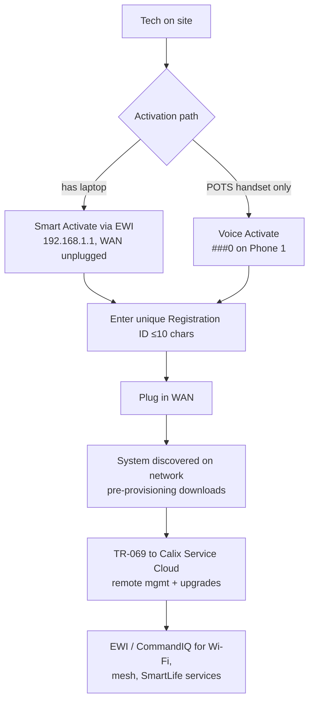

# EXOS Provisioning (GigaSpire / GigaPro)

**Overview:** EXOS is the software inside Calix's GigaSpire and GigaPro boxes — provisioning one means getting it a Registration ID, letting it phone home to Calix Cloud over TR-069, and having it pull its config automatically.

## Overview: what it is, why it matters, when to use it

**What it is.** EXOS runs on Calix's subscriber-premises systems: GigaSpire gateways (GS series, Ethernet/PON/AE WAN), GigaSpire+ONT combos, GigaPro APs (GPR series), and mesh satellites (GM series). These are Layer-3 (IP-routed) Wi-Fi access points — the box in the customer's home. "Provisioning" an EXOS system is mostly *activation*, not hand-config: you give it a unique Registration ID, connect the WAN, and it discovers itself on the network, downloads pre-provisioned services, and registers with Calix Service Cloud via TR-069.

**Why a field tech cares.** This is the box you physically install. The two activation paths — **Smart Activate** (laptop → EWI at 192.168.1.1) and **Voice Activate** (butt set on the POTS port, `###0`) — are the core field skills. Everything else (Wi-Fi, mesh, SmartLife apps like CommandIQ/ProtectIQ/SmartBiz) layers on top of a successful activation.

**When to reach for it.**
- New install: Smart Activate or Voice Activate.
- Subscriber move / box reuse: factory reset first (Calix best practice, especially AE↔GPON transitions).
- Dead box swap: replace, re-activate with the same reg ID approach.
- Wi-Fi trouble: EWI status pages, mesh satellite pairing, radio/SSID config.
- Firmware: PON multicast upgrades (AXOS OLTs), USB, or Calix Cloud/TR-069.

## Diagram



## CLI workflows

EXOS field work is EWI (browser) + handset driven — there is no documented tech-facing shell in the provisioning guide, so the "CLI" here is the honest field sequence plus the machine-checkable steps around it. Do not go looking for an ssh CLI on the box; manage it through EWI, Calix Service Cloud (TR-069), or the CommandIQ/Field Service apps.

### A. Setup: Smart Activate a GigaSpire (first-time connection)

```bash
# Pre-flight from your laptop/phone BEFORE touching the box:
# 1. Confirm the WAN is DISCONNECTED from the GigaSpire.
# 2. Plug Ethernet from your machine into any LAN port on the box.
# 3. Confirm you can reach the EWI:
curl -s -o /dev/null -w "EWI HTTP %{http_code}\n" http://192.168.1.1/
# Expect 200/301/302. If it times out: check your NIC got a 192.168.1.x
# address (DHCP from the box), try a different LAN port, check the cable.

# Then in the browser at http://192.168.1.1:
#   1. Log in with the support login/password.
#   2. Enter a valid, UNIQUE Registration ID (<=10 chars, alphanumeric only).
#   3. Click Apply, confirm with OK. The unit resets and activates the reg ID.
#   4. Attach the WAN connection.
#   5. The unit is discovered on the network; any pre-provisioning of services
#      downloads automatically.
# Post-check: power LED behavior (R26.3+): blinking green = Internet up;
# solid green = connected to Calix Cloud. No solid green = cloud/TR-069 issue.
```

Caution from the guide: if the Smart Activate instance sits on VLAN 85 and you later create another WAN interface (data/TR-069), the Smart Activate VLAN must also have an IP — the ONT can't bind to the other WAN's TR-069 process until it receives one.

### B. Setup (no laptop): Voice Activate via handset

```
1. Power OFF the unit.
2. Connect an RJ-11 handset to PHONE 1 (first POTS port).
   (Alligator-clip butt set: black lead to Tip, red lead to Ring.)
3. Power ON. Wait ~3 minutes for boot; Voice Activate is ready when you
   hear a distinct CLICK in the handset. (Digits entered before the click
   are ignored; on-hook, you won't hear the click.)
4. Press: * * * 0   (star star star zero)
   - PHONE1 LED blinks at 50% duty cycle = sequence accepted.
   - Prompt: "Please enter [PON or AE] Registration ID followed by pound."
     (If no prompt: flash-hook / go off-hook again and re-enter the code.)
5. Enter your Registration ID (up to 10 chars), then #.
   NOTE: Voice Activate does NOT support alphanumeric reg IDs — plan the
   reg ID as digits if this is your activation path.
6. Prompt reads it back: "You entered 'xxxx'. If correct, enter 1, otherwise 0."
7. "Registration ID saved." Done.
```

What the reg ID buys you: it's stored in flash, survives reboots (erased only by factory reset via handset or EWI Support > Tools > Smart Activate > Factory Reset), is included in DHCP Option-81, and lets the office pre-provision services *without knowing the box's serial number*.

Changing the reg ID later: power off, disconnect WAN, power on, wait for the click, `###0` again — the prompt reads back the current reg ID and lets you change it.

### C. Daily use: EWI health check and utilities

The Embedded Web Interface is the on-box GUI: Network Topology, System Status (network/connection/device/internet/Ethernet/Wi-Fi), Utilities (backup & restore, ping, traceroute), Advanced (IP addressing, parental controls, security), Wi-Fi (radio, primary/secondary SSID, WPS), SmartBiz, Support (TR-069, WAN config, voice).

```bash
# From the LAN, quick triage before opening the browser:
BOX=192.168.1.1   # default EWI address
ping -c 4 $BOX                    # L3 to the box?
curl -s -o /dev/null -w "EWI: %{http_code}\n" http://$BOX/
# In EWI, the tech-relevant pages:
#   Status > Connection Status  - WAN IP, gateway, DNS: is the WAN actually up?
#   Utilities > Ping / Traceroute - run FROM the box (tests the WAN path, not your laptop)
#   Utilities > Backup and Restore - take a backup BEFORE changing anything
#   Support > TR-069 - ACS URL / connection state to Calix Service Cloud
#   Wi-Fi > Radio / Primary Network - SSID, channel, client steering state
```

### D. Troubleshooting scenario: "new install, no solid green LED"

```bash
# R26.3+ LED semantics: blinking green = Internet OK; solid green = Cloud OK.
# Stuck blinking = WAN works, TR-069/Cloud does not.
# 1. EWI Status > Connection Status: does the WAN have an IP?
#    - No IP: WAN/VLAN problem upstream (check OLT provisioning, VLAN 85 note in A).
# 2. EWI Support > TR-069: is the ACS reachable? Wrong ACS URL or blocked
#    port = box never checks in; cloud pushes (config, firmware) never arrive.
# 3. EWI Utilities > Ping: ping the ACS hostname FROM the box.
#    - Fails but WAN IP is fine: routing/firewall/DNS issue on the WAN path.
# 4. Utilities > Traceroute to the ACS: find the dying hop, hand it to the NOC.
# 5. If the box was previously on another subscriber: factory reset and
#    re-activate (guide's best practice for subscriber moves, esp. AE<->GPON).
```

### E. Troubleshooting scenario: mesh satellite won't pair

```bash
# - Satellites pair to the gateway RG; check EWI Network Topology Overview.
# - Known firmware trap (fixed in EXOS 26.3.0.2, EXOS-66866): boxes on MFG
#   images 23.2-24.2 could NOT pair as mesh satellites to Wi-Fi 7 RGs on
#   26.2/26.3. Fix = upgrade the satellite past the bad MFG image.
# - Keep Wi-Fi 7 radios in default 802.11be mode; disabling be on a Wi-Fi 7
#   RG/satellite pair breaks reconnect until reboot (EXOS-63916/62309).
# - EWI topology map may not show satellite links for the admin user
#   (EXOS-64437) — verify pairing from the satellite's own EWI or Cloud.
```

### F. Firmware: PON multicast upgrades and USB

```bash
# On AXOS OLTs, PON firmware upgrades to GigaSpire ONTs use MULTICAST by
# default when more than 3 ONTs are present: minutes instead of hours
# (e.g. ~2 min for 10+ GS4227W vs 5+ min unicast).
# Field workflow:
# 1. OLT-side: load the new ONT image to the OLT OUTSIDE the maintenance
#    window (pre-upgrade steps don't affect service).
# 2. Inside the window: activate/commit the ONT firmware only.
#    (OLT and ONT upgrades are independent activities — do them at
#    different times.)
# 3. Standalone box with no OLT path: USB upgrade, or EWI firmware page.
# 4. Cloud-managed: Calix Cloud pushes via TR-069.
# Pick the right image package for the model from the release notes table
# (e.g. FullRel_EG_SIGNED for GS3137E). "AE" packages (FullRel_AE_*) are for
# AE-mode u6x/u6xw/u10xe systems — don't flash a PON image on an AE box.
```

### G. Automation snippet: site turn-up checklist log

```bash
#!/usr/bin/env bash
# Log the machine-verifiable parts of a GigaSpire turn-up.
set -euo pipefail
BOX="${BOX:-192.168.1.1}"; SITE="${SITE:?set SITE}"; REGID="${REGID:?set REGID}"
{
  echo "site=${SITE} regid=${REGID} date=$(date -u +%FT%TZ)"
  ping -c 3 -W 2 "$BOX" >/dev/null && echo "ping=ok" || echo "ping=FAIL"
  code=$(curl -s -o /dev/null -w '%{http_code}' "http://${BOX}/")
  echo "ewi_http=${code}"
  # LED state is eyes-on: blinking green = internet, solid green = cloud (R26.3+)
  echo "led=<blinking-green|solid-green|other>   # fill in by eye"
  echo "wan_ip=<from EWI Status > Connection Status>"
  echo "tr069=<acs-ok|acs-fail>                  # EWI Support > TR-069"
} | tee "turnup-${SITE}-$(date +%F).log"
```

## GUI path

The EWI *is* the GUI path here and it's the primary interface — everything above goes through `http://192.168.1.1` in a browser. For ongoing management the GUIs are Calix Service Cloud (TR-069 to the box: config pushes, firmware, telemetry) and the CommandIQ subscriber app (Smart Activate setup, backup-WAN config). Use EWI when you're physically at the box; use Cloud/CommandIQ once it's checking in.

## Platform script blocks

### Linux bash

```bash
# Reachability + EWI check from the install laptop:
BOX=192.168.1.1
ping -c 4 "$BOX"
curl -s -o /dev/null -w "EWI HTTP %{http_code}\n" "http://${BOX}/"
# Firmware images (.zip > .img) download from Calix Software Center to USB
# or to the OLT; verify checksums per your org's procedure before flashing.
```

### Nix-on-Droid

```bash
nix-env -iA nixpkgs.curl nixpkgs.iputils nixpkgs.openssh
# Phone as the install companion: ping + curl the EWI from the same blocks
# above; mobile browser to http://192.168.1.1 works fine for Smart Activate.
# Android gotchas: no systemd (irrelevant), storage permissions for firmware
# files, termux-wake-lock if a long download runs, foreground execution.
# NOTE: you cannot flash firmware or run the box's OS from the phone — the
# phone is a client (EWI browser, ping/curl checks, CommandIQ app).
```

### PowerShell

> **Status:** syntax-verified with PowerShell 7 on Arch (pwsh) — not executed against live systems.
```powershell
$BOX="192.168.1.1"
Test-Connection -ComputerName $BOX -Count 4
Invoke-WebRequest -Uri "http://${BOX}/" -UseBasicParsing |
  Select-Object StatusCode
# Then do Smart Activate in the browser at http://192.168.1.1.
# NOTE: unverified on Windows — test before field use.
```

### Termux

```bash
pkg install -y curl iputils openssh
BOX=192.168.1.1
ping -c 4 "$BOX"
curl -s -o /dev/null -w "EWI HTTP %{http_code}\n" "http://${BOX}/"
# Same Android gotchas as Nix-on-Droid. The CommandIQ app (subscriber
# Smart Activate / backup-WAN) also runs on the phone natively.
```

### Windows cmd

> **Status:** UNVERIFIED — no Windows cmd available for testing.
```cmd
set BOX=192.168.1.1
ping -n 4 %BOX%
curl.exe -s -o nul -w "EWI HTTP %%{http_code}\n" http://%BOX%/
:: Then Smart Activate in the browser at http://192.168.1.1
:: NOTE: unverified on Windows — test before field use.
```

### WSL/Arch

```bash
sudo pacman -S --needed curl iputils openssh
BOX=192.168.1.1
ping -c 4 "$BOX"
curl -s -o /dev/null -w "EWI HTTP %{http_code}\n" "http://${BOX}/"
```

**Reality check:** EXOS runs on the GigaSpire/GigaPro hardware — you don't install it on a phone or laptop. All handset blocks above are *client-side* (reach the EWI, run ping/curl checks, drive the browser/CommandIQ app). Firmware flashing happens via OLT multicast, USB, EWI, or Calix Cloud — never from a phone shell.

## Upgrade/change cautions

- **LED semantics changed in R26.3:** blinking green = Internet only, solid green = Cloud connected (previously no distinction). Don't "fix" a blinking-green box that's actually working — check Cloud connectivity instead.
- **Upgrade order for integrated Gateway+ONT systems on AXOS:** upgrade the ONT to EXOS R26.x *before* the AXOS OLT goes to R26.x (AE-mode systems managed via the AXOS AE manager). OLT-first risks subscriber service disruption.
- **Downgrades are not recommended:** the active database schema changes on upgrade; a downgrade can leave database objects un-activatable. Use the EWI "Revert" option (reboots to previous image *and* database) rather than flashing an old image.
- **Wi-Fi 7 radio modes:** keep 802.11be default; disabling it breaks satellite reconnect (needs reboot) and can degrade mesh.
- **Golden config re-applied after upgrade** (EXOS-64709): a box using golden config gets it re-applied on upgrade to R26.1+ — verify post-upgrade that local field changes you made are still there.
- **Use the right image package** (PON vs AE manifests for u6x/u6xw/u10xe) — the zip filename tells you (`FullRel_AE_*` = Active Ethernet).

## Alphabetical reference of key EXOS provisioning facts

- **CommandIQ:** subscriber app for Smart Activate setup and backup-WAN config.
- **EWI:** Embedded Web Interface at `http://192.168.1.1` (LAN side); status, utilities (ping/traceroute/backup-restore), Wi-Fi, TR-069, voice.
- **Factory reset:** best practice when moving a box between subscribers (esp. AE↔GPON); via handset or EWI Support > Tools > Smart Activate > Factory Reset.
- **Firmware:** PON multicast upgrades on AXOS OLTs (>3 ONTs = multicast default); USB; Calix Cloud via TR-069.
- **Mesh:** GM-series satellites pair to a GS gateway; watch MFG-image pairing trap (23.2–24.2 vs Wi-Fi 7 RGs).
- **Registration ID:** ≤10 chars, alphanumeric (digits only for Voice Activate), unique per box, in DHCP Option-81, erased only by factory reset.
- **Revert:** EWI option to reboot to the previous image + database (the safe "downgrade").
- **Smart Activate:** EWI path — WAN disconnected, laptop on LAN port, enter reg ID, Apply/OK, attach WAN.
- **TR-069:** management path to Calix Service Cloud (config, firmware, telemetry); check ACS state in EWI Support > TR-069.
- **Voice Activate:** `###0` on a handset at PHONE 1 after boot click; prompts walk you through the reg ID.
