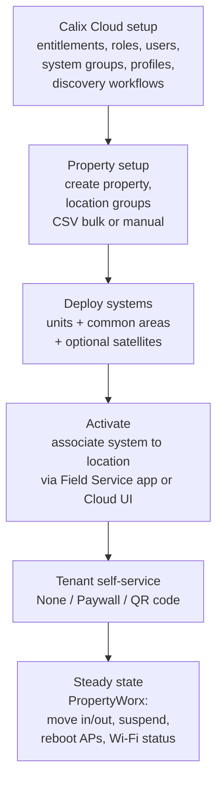

# SmartMDU Application Guide

**Overview:** SmartMDU is Calix's managed-Wi-Fi-in-apartment-buildings system — one GigaSpire per unit plus property-wide networks, all run from Calix Cloud, with a portal (PropertyWorx) that lets the building manager move tenants in and out without calling you.

## Overview: what it is, why it matters, when to use it

**What it is.** SmartMDU serves multi-dwelling units (apartment/condo complexes). Each living unit gets an EXOS GigaSpire (the same boxes you already deploy), common areas get APs, and Calix Cloud orchestrates the whole property: per-tenant private Wi-Fi, plus property-wide networks — **roaming** (Passpoint-secured, auto-join across the property), **public** (open guest), **IoT** (password-protected, for building devices like cameras), and a future connected-vehicle network. Property managers get **PropertyWorx**, a web portal for tenant moves, network tweaks, and rebooting APs.

**Why a field tech cares.** The MDU install is *your* job: mount/install systems in units and common areas, optionally add mesh satellites, then **associate each system to its location** — either in the Calix Cloud UI or with the **Field Service mobile app** ("Service task – MDU customer"). After that, day-to-day tenant churn is the property manager's job in PropertyWorx, not a truck roll.

**When to reach for it.**
- New MDU property turn-up: follow the solution turn-up workflow (Cloud setup → groups → deploy → activate).
- Installing a unit's GigaSpire or a common-area AP/satellite.
- Associating a system to a unit location (Field Service app or Cloud UI).
- Tenant move-in/out when the property manager can't (you can do PropertyWorx tasks in their place).
- Troubleshooting: which network is the tenant supposed to be on, is the AP checking in.

**Deployment models it handles:** fiber to the unit (PON), Ethernet Cat6 to the unit, or coax/Cat3 copper to the unit — same EXOS boxes, different backhaul.

## Diagram



## CLI workflows

SmartMDU is Cloud/UI-driven — there is no tech-facing CLI in the guide. The "CLI" here is the field procedure plus the machine-checkable steps you can actually run. The closest thing to automation the guide documents is **CSV bulk upload** for location groups.

### A. Setup: deployment readiness checklist (answer before you roll)

Per the guide, nail these down per property *before* turn-up:

```bash
# Save as property-<name>-readiness.md and fill in on the walkthrough:
# Users in Calix Cloud:
# - Who needs PropertyWorx access? (assign Property Manager portal RBAC roles)
# - IdP or enterprise SSO for Cloud auth?
# - Any EXTERNAL users (property managers) needing portal access?
# Network infrastructure:
# - In-building distribution: [ PON fiber | Ethernet | coax/cat3 ] to unit?
# - Tenant count + IP hosts needed? (sizes the DHCP/IP subnet scope)
# - Traffic/forwarding mode per property-wide network? [ roaming | public | IoT ]
# - VLAN IDs for: tenant HSI, roaming, public, IoT networks?
# - SSIDs for: tenant primary, roaming, public, IoT?
# AP systems:
# - GigaSpire model(s) for living units? (drives system groups)
# - GigaSpire/GigaPro model(s) for common areas, indoor + outdoor?
# Misc:
# - Bulk location-group build via CSV upload? (prepare the CSV)
# - Field Service mobile app for activations? (prep the techs)
# - Existing subscribers to migrate from SmartHome to SmartMDU?
```

### B. Daily use 1: install systems in tenant units and common areas

```
Field procedure (guide Chapter 4):
1. Install the GigaSpire in the tenant unit per the property's distribution
   model (PON / Ethernet / coax-cat3 backhaul to the unit).
2. (Optional) Add Wi-Fi satellite systems where a unit needs coverage help —
   pair them to the unit's gateway per the EXOS mesh procedure.
3. Install common-area systems (lobby, hallways, outdoor spaces) per the
   coverage plan; note indoor vs outdoor models.
4. Power up; each system should reach Calix Cloud (see exos-provisioning.md
   for the LED states: solid green = cloud-connected on R26.3+).
```

### C. Daily use 2: activate — associate a system to a location

Two paths; same result (the AP system is bound to the unit/common-area location and pulls its SmartMDU config):

```bash
# Path 1 — Field Service mobile app (the field-tech path):
#   New service task -> "MDU customer" -> associate the AP system to the
#   MDU location. The app walks you through it; it also captures the
#   service-call record (install/repair/upgrade/troubleshooting notes).
#
# Path 2 — Calix Cloud UI (back-office path):
#   SmartMDU > property > location > associate system.
#
# IMPORTANT LIMIT (from the guide): the Field Service app does NOT support
# properties using "Pre-Provisioned Subscriber Records" as the tenant
# self-service option. For those properties, associate systems via the
# Calix Cloud UI instead.
```

Machine-checkable post-activation (from your laptop/phone on site):

```bash
# The AP should be cloud-connected; verify the property shows the system
# under the right location in Calix Cloud / PropertyWorx (Systems view).
# Tenant self-service options per property: None | Paywall | QR code.
# - QR code: tenant scans to self-provision — confirm the QR assets/branding
#   were generated for the property.
# - Paywall: tenant pays through the portal — confirm the paywall service
#   connection was configured for your org.
```

### D. Troubleshooting scenario: tenant has no Wi-Fi on move-in day

```
1. PropertyWorx > Tenants: is the tenant moved IN and associated to the
   correct living-unit location? (No association = no service.)
   - Property manager CAN do this themselves; you can do it in their place.
2. PropertyWorx > Systems: is the unit's system online? If offline, treat as
   a normal EXOS box fault (power, WAN/backhaul, LED states).
3. Is the tenant joining the right SSID? Tenant primary = their private
   network (CommandIQ app); roaming/public are property-wide, not in-unit.
4. Suspended account? PropertyWorx > Tenants shows suspend state — a
   suspended tenant looks exactly like "Wi-Fi is broken."
5. Still stuck: reboot the system remotely from PropertyWorx, then re-check.
```

### E. Bulk work: CSV upload for location groups

```bash
# When a property has tens/hundreds of units, build location groups in bulk:
# 1. Prepare the CSV of locations per the guide's "Creating Location Groups
#    for a Property in Bulk (CSV File Upload)" format.
# 2. Upload in Calix Cloud (SmartMDU property > location groups > CSV upload).
# 3. There's also a CSV path for pre-provisioned subscriber records
#    ("Uploading Pre-Provisioned Subscriber Records to Create Location
#    Groups") — remember: that self-service option disables Field Service
#    app association, so choose deliberately.
# Validate the CSV before upload: check header names, no blank rows,
# consistent unit naming — a bad row fails the whole batch's usefulness.
awk -F, 'NR==1{print "columns:", NF} NF!=c && NR==1{c=NF} NF!=c{print "BAD ROW "NR": "NF" fields"}' locations.csv
```

### F. Automation snippet: property turn-up tracker

```bash
#!/usr/bin/env bash
# Track a SmartMDU property turn-up: checklist state per location group.
set -euo pipefail
PROP="${PROP:?property name}"; CSV="${CSV:?locations.csv}"
total=$(( $(wc -l < "$CSV") - 1 ))
echo "property=${PROP} locations_planned=${total} date=$(date -u +%FT%TZ)"
echo "gates: cloud_setup, groups_built, systems_installed, systems_associated, tenant_selfservice_configured"
# Fill in by hand after each phase; the file is the record:
#   echo "cloud_setup=done $(date -u +%FT%TZ)" >> "turnup-${PROP}.log"
# PropertyWorx gives you occupancy metrics (Tenants view) to cross-check
# associated counts against planned counts.
```

## GUI path

SmartMDU is GUI-first by design: **Calix Cloud** for SP-side setup (entitlements, roles, system groups, profiles, discovery workflows, upgrade scheduler, properties, location groups, CSV uploads, branding), **PropertyWorx** for property management (tenant move in/out/edit/suspend, roaming/public/IoT networks, system status + remote reboot, occupancy metrics), and the **Field Service mobile app** for on-site activation. PropertyWorx is desktop/laptop/large-tablet only — not supported on phones or small tablets. Use the GUIs; the "CLI" above is just the verifiable scaffolding around them.

## Platform script blocks

### Linux bash

```bash
# CSV validation + turn-up tracking (blocks E/F above) run natively.
# Everything else is browser: Calix Cloud, PropertyWorx.
# awk/grep/curl are all present; no extra installs.
```

### Nix-on-Droid

```bash
nix-env -iA nixpkgs.gawk nixpkgs.curl
# CSV validation and checklist tracking work fine on the phone.
# Field Service mobile app (native Android) is the actual activation tool —
# install it from your org's app distribution, not nix.
# Android gotchas: no systemd (irrelevant), storage permissions for CSVs,
# PropertyWorx is NOT phone-supported (needs desktop/large tablet browser).
```

### PowerShell

> **Status:** syntax-verified with PowerShell 7 on Arch (pwsh) — not executed against live systems.
```powershell
# CSV sanity check, PowerShell-style:
$rows = Import-Csv locations.csv
"locations_planned: $($rows.Count)"
$rows | Group-Object { ($_.PSObject.Properties | ForEach-Object { $_.Value } | Measure-Object).Count } |
  Select-Object Count, Name
# Then do the real work in Calix Cloud / PropertyWorx in the browser.
# NOTE: unverified on Windows — test before field use.
```

### Termux

```bash
pkg install -y gawk curl
# Same as Nix-on-Droid: CSV validation + tracking on the phone, Field Service
# app for activation, browser for Cloud/PropertyWorx (PropertyWorx needs a
# large screen — don't fight it on a phone).
```

### Windows cmd

> **Status:** UNVERIFIED — no Windows cmd available for testing.
```cmd
:: CSV row-count sanity check with built-ins:
find /c /v "" locations.csv
:: Real work happens in Calix Cloud / PropertyWorx in the browser.
:: NOTE: unverified on Windows — test before field use.
```

### WSL/Arch

```bash
sudo pacman -S --needed gawk curl
# Same as Linux bash: CSV validation + turn-up tracking; browsers for the GUIs.
```

**Reality check:** SmartMDU's brains live in Calix Cloud — nothing installs on a phone or laptop. The handset runs the Field Service app (activation) and can do CSV/checklist chores; the heavy lifting is all browser-based. Nothing here is N/A, but don't expect a CLI for SmartMDU itself — the guide documents none.

## Upgrade/change cautions

- **SmartMDU container app version tracks EXOS:** R26.3 ships `SMARTMDU_R263.0.43` on the boxes — keep EXOS and the SmartMDU container app on matched releases; a stale container app is a classic "features missing" cause.
- **Known EXOS issue with SmartMDU mode (EXOS-65955, fixed in 26.3.0.0):** GigaSpire ONT/RG systems reported a bogus `ont-equip=failed` alarm in SMx when SmartMDU mode was enabled with no tenant associated. If you see that alarm on older EXOS, it's the bug, not the box — upgrade rather than replacing hardware.
- **Multilingual captive portals** (26.3.0.0) now cover SmartMDU visitor networks — verify portal language/branding after upgrades on properties that customized theirs.
- **Discovery workflows and the upgrade scheduler** are configured per property in Calix Cloud — after any Cloud-side upgrade, confirm discovery workflows still match newly installed systems before a big install day.
- **Migrating SmartHome → SmartMDU:** the guide calls this out as a readiness question — plan it as a migration (tenant records, SSIDs, CommandIQ), not a fresh install.

## Alphabetical reference of key SmartMDU facts

- **Activation:** associate system → location via Field Service app ("Service task – MDU customer") or Calix Cloud UI.
- **Branding:** configurable per property for tenant portal + QR assets, with a defined precedence order.
- **CSV bulk:** location groups and pre-provisioned subscriber records both support CSV upload (pre-provisioned records disable Field Service app association — choose deliberately).
- **Deployment models:** PON fiber, Ethernet Cat6, or coax/Cat3 to the unit.
- **Discovery workflows:** Cloud-configured automation for finding/managing AP systems in bulk.
- **Field Service app:** the mobile tool for on-site activation and service-call records; no pre-provisioned-records properties.
- **Location groups:** the unit/common-area containers systems get associated to.
- **Networks:** roaming (Passpoint, auto-join), public (open guest), IoT (password-protected, building devices), connected-vehicle (future).
- **PropertyWorx:** property-manager portal — tenants, networks, system status/reboot, occupancy metrics; desktop/large-tablet only.
- **SmartMDU container:** `SMARTMDU_R263.0.43` on EXOS 26.3.
- **System groups / profiles:** Cloud objects for bulk-managing AP systems (common attributes, upgrade scheduler).
- **Tenant self-service:** None, Paywall, or QR code — set per property.
- **Turn-up order:** Cloud setup → property/groups → deploy systems → activate → self-service → PropertyWorx steady state.
