# SMx API Interface

**Overview:** SMx is Calix's modern, REST/JSON API for managing AXOS gear (like the E9-2 OLT) — the successor to the older CMS XML northbound interface, and the API to use for anything AXOS.

## Overview: what it is, why it matters, when to use it

**What it is.** SMx (Services Management Connector / AXOS SMx) is Calix's API-first management layer for AXOS systems. Where legacy CMS speaks XML/SOAP to manage C7/E7 boxes, SMx speaks REST + JSON over HTTPS to manage AXOS OLTs — subscribers, ONTs, VLANs, services (BNG/L2 data, video, voice), class-maps/policy-maps/service templates, ONT port status, users/roles, and a WebSocket stream of northbound alarms.

**Why a field tech / network specialist cares.** On an AXOS network, SMx is the single pane: provision a subscriber's data service, swap an ONT, flip an ONT port admin state, check optical/port status, pull the alarm log — all as plain HTTPS calls you can run from a laptop *or a phone*. The guide is written for `curl`, and the SMx GUI itself is just a client of the same API (you can literally tail the SMx log to see the JSON the GUI sends).

**When to reach for it.**
- Subscriber lifecycle: create subscriber → create ONT → create service; query, update, delete.
- ONT port status checks and admin up/down during troubleshooting.
- Alarm investigations: alarm-log REST endpoint or the WebSocket alarm stream.
- Scripting turn-ups, audits, bulk moves.

**SMx vs legacy CMS (the 30-second version).**
- Legacy CMS NBI: XML/SOAP over HTTP, port 18080, per-platform URIs, session IDs, manages C7/E7/E3/E5/AE gear.
- SMx: REST/JSON over HTTPS, port 18443, HTTP Basic auth on every request, base URI `https://<ip>:18443/rest/v1/`, manages AXOS systems (E9-2, E7-2, E3-2, etc.).
- Rule of thumb: AXOS OLT in the cabinet → SMx. Legacy C7/E7 → CMS NBI. If your network runs both, you'll use both.

## Diagram

```mermaid
flowchart LR
    A[Tech: curl / Postman / phone] -->|HTTPS Basic auth<br/>:18443/rest/v1/...| B[SMx server]
    B -->|NETCONF southbound| C[AXOS OLTs<br/>E9-2, E7-2, E3-2]
    B -->|wss :18443/rest/v1/alarm/ws| D[Alarm stream<br/>to NOC tools]
    B <-->|pmaa.log: tail -F pmaa.log &#124; grep json| E[SMx GUI<br/>same API you use]
```



## CLI workflows

Conventions: `SMX="<smx-host>"`, `U="<user>"`, `P="<password>"`, base `https://${SMX}:18443/rest/v1`. SMx uses self-signed certs in many installs — `-k` skips verification (fine on your own private network; don't skip it across the internet). Auth is the same username/password as the SMx WebGUI.

### A. Setup: one-time sanity check

```bash
SMX="<smx-host>"; U="<user>"; P="<password>"
BASE="https://${SMX}:18443/rest/v1"
# List devices (note: default page size is 20; check x-total-count)
curl -sk -u "${U}:${P}" -D - -o /tmp/devices.json \
  "${BASE}/config/device?limit=50" | grep -i x-total-count
# 200 = OK. 401 = bad creds. 429 = you're over the API rate limit (slow down).
```

### B. Daily use 1: subscriber lifecycle (create → query → delete)

```bash
# --- create a subscriber (POST /ems/subscriber) ---
cat > /tmp/subscriber.json <<'EOF'
{
  "name": "<first-last>",
  "customId": "<account-number>",
  "orgId": "Calix",
  "locations": [{
    "primary": true,
    "address": [{
      "streetLine1": "<street>", "city": "<city>", "state": "<st>",
      "zip": "<zip>", "country": "United States"
    }],
    "contacts": [{
      "phone": "<phone>", "email": "<email>", "primary": true
    }]
  }]
}
EOF
curl -sk -u "${U}:${P}" -X POST "${BASE}/ems/subscriber" \
  -H 'Content-Type: application/json' --data @/tmp/subscriber.json
# 201 = created. name and customId are required; orgId "Calix" is recommended.

# --- find a subscriber's services with a filter ---
curl -sk -u "${U}:${P}" \
  "${BASE}/ems/eth-service?filter=customerID=<subscriber-id>" | jq .
# omit port/deviceName to search across all nodes; add e.g.
# " and port=g1 and deviceName=<device>" to narrow to one ONT port.

# --- delete a subscriber ---
curl -sk -u "${U}:${P}" -X DELETE \
  "${BASE}/ems/subscriber/org/<org-id>/account/<account-name>"
```

### C. Daily use 2: ONT lifecycle (create → status → delete)

```bash
# --- create (pre-provision) an ONT on a device ---
# Minimum useful fields: serial-number, ont-profile-id, provisioned-pon,
# subscriber-id. device-name may be the OLT name/IP, or "virtualOLT" for a
# global (virtualOLT) ONT used in automated network service provisioning.
cat > /tmp/ont.json <<'EOF'
{
  "serial-number": "<ont-serial>",
  "ont-profile-id": "<profile-id>",
  "provisioned-pon": "<pon-id>",
  "subscriber-id": "<subscriber-id>",
  "subscriber-name": "<name>",
  "ont-reg-id": "<reg-id>",
  "location": "<location>"
}
EOF
curl -sk -u "${U}:${P}" -X POST "${BASE}/config/device/<device-name>/ont" \
  -H 'Content-Type: application/json' --data @/tmp/ont.json

# --- read ONT details/status ---
curl -sk -u "${U}:${P}" \
  "${BASE}/performance/device/<device-name>/ont/<ont-id>/status" | jq .

# --- read an ONT port's admin/oper status (g1 = Ethernet, p1 = POTS) ---
curl -sk -u "${U}:${P}" \
  "${BASE}/performance/device/<device-name>/ont/<ont-id>/port/g1/status" | jq .
# Response includes oper-status, admin-status, power-status, mac-address, mtu, speed.

# --- set ONT port admin state (update = PUT) ---
# Best practice from the guide: GET the current object first, then PUT the full
# object back, because PUT replaces the ENTIRE resource — omitted fields reset
# to defaults/NULL.
curl -sk -u "${U}:${P}" \
  "${BASE}/config/device/<device-name>/ontport?ont-id=<ont-id>&ont-port-id=g1" \
  | jq '.admin-status = "<up|down>"' > /tmp/port.json
curl -sk -u "${U}:${P}" -X PUT \
  "${BASE}/config/device/<device-name>/ontport/ont-id/<ont-id>/ont-port-id/g1" \
  -H 'Content-Type: application/json' --data @/tmp/port.json

# --- delete the ONT ---
curl -sk -u "${U}:${P}" -X DELETE "${BASE}/config/device/<device-name>/ont"
```

### D. Daily use 3: VLAN and service provisioning prep

```bash
# --- create a VLAN on a device (POST /config/device/{device-name}/vlan) ---
curl -sk -u "${U}:${P}" -X POST "${BASE}/config/device/<device-name>/vlan" \
  -H 'Content-Type: application/json' \
  -d '{"device-name":"<device-name>","vlan-id":"<vlan-id>"}'

# --- provisioning order the guide recommends for a new service ---
# 1. class-map:        POST /ems/profile/class-map
# 2. service-template: POST /config/service-template
# 3. policy-map:       POST /ems/profile/policy-map
# 4. service:          POST /ems/service   (data, L2 data, video, voice, BNG variants)
# --- update a service: GET it first, then PUT the complete object ---
# --- delete a service: DELETE /ems/service (with the service's identifiers) ---
# Exact JSON bodies vary by service type; the reliable way to get them is the
# guide's trick: do it once in the SMx GUI, then
#     tail -F pmaa.log | grep json
# on the SMx server and copy the JSON the GUI actually sent.
```

### E. Troubleshooting scenario: "subscriber says internet is down"

```bash
# 1. Is the ONT itself OK?
curl -sk -u "${U}:${P}" \
  "${BASE}/performance/device/<device-name>/ont/<ont-id>/status" | jq '{ont-id, "oper-status", "admin-status"}'

# 2. Is the subscriber's Ethernet port up?
curl -sk -u "${U}:${P}" \
  "${BASE}/performance/device/<device-name>/ont/<ont-id>/port/g1/status" \
  | jq '{oper-status, admin-status, speed, "mac-address"}'
# oper DOWN + admin UP = physical/optical problem, not provisioning.

# 3. Are the subscriber's services provisioned?
curl -sk -u "${U}:${P}" \
  "${BASE}/ems/eth-service?filter=customerID=<subscriber-id>" | jq .

# 4. Anything alarming right now? (paginated; default 20 per page)
curl -sk -u "${U}:${P}" -D - -o /tmp/alarms.json \
  "${BASE}/fault/alarm-log?limit=50" | grep -i x-total-count
jq '.[] | select(.severity=="critical" or .severity=="major")' /tmp/alarms.json

# 5. If the port was admin-down by mistake, flip it back up (see the PUT in C).
```

### F. Alarm stream over WebSocket (NOC-style monitoring)

```bash
# WebSocket URL for northbound alarms (from the guide):
#   wss://<host>:18443/rest/v1/alarm/ws?username=<user>&password=<password>
# Quick check with websocat if installed, else any WS client:
websocat -k \
  "wss://<smx-host>:18443/rest/v1/alarm/ws?username=<user>&password=<password>"
# NOTE: embedding the password in the URL is what the guide documents;
# prefer a dedicated read-only SMx user for this so the credential is low-value.
```

### G. Automation snippet: bulk ONT status audit

```bash
#!/usr/bin/env bash
# Audit every ONT on a device: oper/admin status, one line each.
set -euo pipefail
SMX="${SMX:?}"; U="${U:?}"; P="${P:?}"; DEV="${DEV:?device name}"
BASE="https://${SMX}:18443/rest/v1"
auth=(-sk -u "${U}:${P}")
# Page through ONTs (default page = 20; read x-total-count to size the loop)
total=$(curl "${auth[@]}" -D - -o /dev/null "${BASE}/config/device/${DEV}/ont?limit=1" \
  | grep -i x-total-count | tr -d '\r' | awk '{print $2}')
echo "ONTs on ${DEV}: ${total}"
offset=0
while [ "$offset" -lt "$total" ]; do
  curl "${auth[@]}" "${BASE}/config/device/${DEV}/ont?limit=100&offset=${offset}" \
    | jq -r '.[] | "\(.["ont-id"]) \(.["oper-status"]) \(.["admin-status"])"'
  offset=$((offset + 100))
done
# NOTE: exact JSON key names vary by endpoint; validate against your server's
# first page before running unattended (see the pmaa.log trick in D).
```

## GUI path

The SMx WebGUI has a **Northbound APIDoc** link in its footer — a Swagger UI listing every endpoint with "try it out" execution. For one-off work that's the fastest path, and it's also how you *discover* the exact JSON: fill the body, Execute, and copy the call into your script. Prefer the GUI when you're learning an endpoint or doing a single change; prefer curl/scripts when it's repetitive. The guide's Postman workflow (environment variable `baseURL=https://<smx-ip>:18443/rest/v1`, Basic Auth) is the middle ground.

## Platform script blocks

### Linux bash

```bash
# Nothing to install: curl + jq are in every distro's repos.
SMX="<smx-host>"; U="<user>"; P="<password>"
BASE="https://${SMX}:18443/rest/v1"
# Trust your org CA instead of -k in production:
curl -s -u "${U}:${P}" "${BASE}/config/device?limit=5" | jq .
```

### Nix-on-Droid

```bash
nix-env -iA nixpkgs.curl nixpkgs.jq nixpkgs.openssh
# Then run the Linux bash blocks verbatim.
# Android gotchas: no systemd (not needed — REST is stateless); keep JSON
# files under ~/ (storage permissions); if you leave an alarm stream or audit
# running, use termux-wake-lock and keep it foregrounded — Android will kill
# backgrounded network tasks. A phone is a genuinely good SMx client.
```

### PowerShell

> **Status:** syntax-verified with PowerShell 7 on Arch (pwsh) — not executed against live systems.
```powershell
# Skip cert check only on your own private network / self-signed SMx:
add-type @"
using System.Net; using System.Security.Cryptography.X509Certificates;
public class TrustAll { public static void Go() {
  ServicePointManager.ServerCertificateValidationCallback =
    delegate { return true; }; } }
"@
[TrustAll]::Go()
$SMX="<smx-host>"; $U="<user>"; $P="<password>"
$BASE="https://${SMX}:18443/rest/v1"
$cred=[Convert]::ToBase64String([Text.Encoding]::ASCII.GetBytes("${U}:${P}"))
$H=@{ Authorization="Basic $cred"; "Content-Type"="application/json" }
Invoke-RestMethod -Uri "$BASE/config/device?limit=5" -Headers $H
# POST example (create VLAN):
$body=@{ "device-name"="<device-name>"; "vlan-id"="<vlan-id>" } | ConvertTo-Json
Invoke-RestMethod -Uri "$BASE/config/device/<device-name>/vlan" -Method Post -Headers $H -Body $body
# NOTE: unverified on Windows — test before field use.
```

### Termux

```bash
pkg install -y curl jq openssh
# Then run the Linux bash blocks verbatim — same Android gotchas as Nix-on-Droid:
# no systemd, storage permissions, termux-wake-lock for long audits, foreground
# execution. SMx's API-first design makes the phone a first-class field client.
```

### Windows cmd

> **Status:** UNVERIFIED — no Windows cmd available for testing.
```cmd
:: curl.exe ships with Windows 10+. -k only for self-signed SMx on your LAN.
set SMX=<smx-host>
curl.exe -sk -u <user>:<password> "https://%SMX%:18443/rest/v1/config/device?limit=5"
:: POST a JSON file:
curl.exe -sk -u <user>:<password> -X POST "https://%SMX%:18443/rest/v1/ems/subscriber" ^
  -H "Content-Type: application/json" --data @subscriber.json
:: NOTE: unverified on Windows — test before field use.
```

### WSL/Arch

```bash
sudo pacman -S --needed curl jq openssh
# Then run the Linux bash blocks verbatim.
```

**Reality check:** the SMx server runs on a server — you don't install it on a phone. Every handset block above is the *client* side (HTTPS calls). All six platforms are fully capable SMx clients; nothing here is N/A.

## Upgrade/change cautions

- **SMx before AXOS.** The AXOS R26.3.0.1 release notes state plainly: SMx 26.3.0 or higher is required to manage AXOS R26.3.0.x systems — **upgrade SMx before upgrading the E9-2**. An old SMx talking to a new OLT is an unsupported combination.
- **PUT replaces the whole object.** This is the #1 footgun in the guide: a partial PUT body wipes the fields you omitted back to defaults/NULL. Always GET → edit → PUT.
- **Rate limiting is real.** SMx can return HTTP 429 when you exceed the calls-per-minute limit, plus a 500 ms–1 s delay during bursts. Scripts doing bulk provisioning must back off on 429 (sleep and retry), not hammer.
- **Pagination defaults to 20** — and per the guide, if you don't pass `limit` it may default to 0 (nothing returns) on some endpoints. Always pass `limit`/`offset` explicitly and read `x-total-count`.
- **NETCONF event subscription fragility (fixed in AXOS 26.3.0.1, issue AXOS-98750):** on R26.3.0 the northbound NETCONF events subscription could silently die, so SMx/Operations Cloud stopped getting notifications (new activations relying on them would stall). Fixed in 26.3.0.1 — another reason to keep SMx and AXOS paired at current releases.

## Alphabetical reference of key SMx facts

- **APIDoc:** Swagger UI via the Northbound APIDoc link in the SMx GUI footer.
- **Auth:** HTTPS + HTTP Basic on every request; same credentials as the WebGUI. Self-signed certs are common → Postman/curl need verification disabled (LAN only).
- **Alarms:** REST `GET /rest/v1/fault/alarm-log` (paginated); WebSocket `wss://<host>:18443/rest/v1/alarm/ws?username=<u>&password=<p>`.
- **Base URI:** `https://<ip>:18443/rest/v1/` (guide examples show both `/rest/v1/...` and the `/profile` prefix; the worked examples use `/rest/v1`).
- **Class-map / policy-map / service-template:** provision in that order before creating a service (`POST /ems/profile/class-map`, `POST /config/service-template`, `POST /ems/profile/policy-map`).
- **JSON discovery:** do it once in the GUI, then `tail -F pmaa.log | grep json` on the SMx server.
- **Methods:** POST=create, PUT=full replace, GET=read, DELETE=delete.
- **ONT endpoints:** `POST /config/device/{device-name}/ont`, `DELETE /config/device/{device-name}/ont`, status `GET /performance/device/{device-name}/ont/{ont-id}/status`, port status `GET /performance/device/{device-name}/ont/{ont-id}/port/{ont-port-id}/status` (g1 = Ethernet, p1 = POTS).
- **Pagination:** `?limit=N&offset=M`, total in the `x-total-count` response header; default page is 20.
- **Port:** 18443 (HTTPS).
- **Rate limit:** HTTP 429 + event in the SMx event log when the per-minute cap is exceeded.
- **Services:** `POST /ems/service` (BNG/L2 data, video, voice variants); query with `GET /ems/eth-service?filter=...`.
- **Status codes:** 200 OK, 201 created, 429 rate-limited (plus standard 4xx/5xx).
- **Subscriber:** `POST /ems/subscriber` (201 on create); `DELETE /ems/subscriber/org/{org-id}/account/{account-name}`; filtered read via `/ems/eth-service?filter=customerID=...`.
- **Users:** `POST /security/user` (userName/password required).
- **VLAN:** `POST /config/device/{device-name}/vlan`.
- **virtualOLT:** use `device-name = "virtualOLT"` when creating global ONTs for automated network service provisioning.
